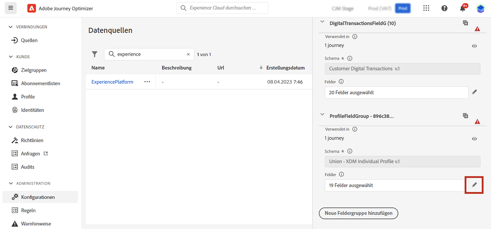
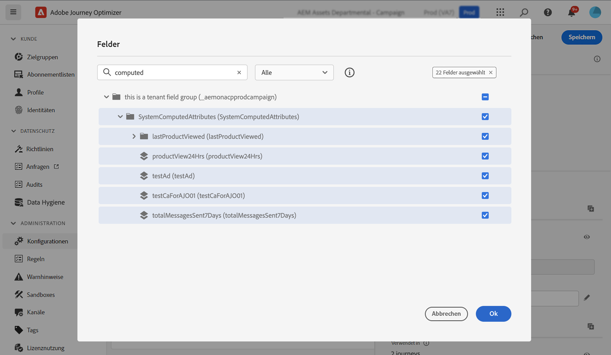
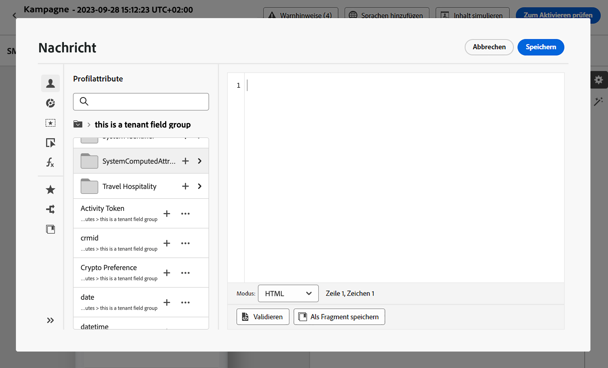

# Arbeiten mit berechneten Attributen {#computed-attributes}

Berechnete Attribute ermöglichen es Ihnen, einzelne Verhaltensereignisse in berechnete Profilattribute zusammenzufassen, die in Adobe Experience Platform verfügbar sind. Diese berechneten Attribute basieren auf profilaktivierten Erlebnisereignis-Datensätzen, die in Adobe Experience Platform erfasst werden, und dienen als aggregierte Datenpunkte, die in Kundenprofilen gespeichert werden.

Jedes berechnete Attribut ist ein Profilattribut, das Sie für die Segmentierung, Personalisierung und Aktivierung in Journeys und Kampagnen nutzen können. Diese Vereinfachung verbessert die Fähigkeit, Ihren Kundinnen und Kunden zeitnahe und aussagekräftige, personalisierte Erlebnisse bereitzustellen.

>[!NOTE]
>
>Um Zugriff auf berechnete Attribute zu erhalten, benötigen Sie die entsprechenden Berechtigungen (**Berechnete Attribute anzeigen** und **Berechnete Attribute verwalten**).

## Erstellen von berechneten Attributen {#manage}

Um berechnete Attribute zu erstellen, navigieren Sie zur Registerkarte **[!UICONTROL Berechnete Attribute]** im Menü **[!UICONTROL Profile]** auf der linken Seite.

Auf diesem Bildschirm können Sie berechnete Attribute erstellen, indem Sie Regeln erstellen, die Ereignisattribute und Aggregatfunktionen zusammen mit einem bestimmten Lookback-Zeitraum kombinieren. Sie können beispielsweise die Summe der Käufe der letzten drei Monate berechnen, den zuletzt angezeigten Artikel eines Profils ermitteln, das in der letzten Woche keinen Kauf getätigt hat, oder die von jedem Profil gesammelten Belohnungspunkte addieren.

Sobald Ihre Regel fertig ist, veröffentlichen Sie das berechnete Attribut, um es in anderen nachgelagerten Diensten, einschließlich Journey Optimizer, verfügbar zu machen.

Detaillierte Informationen zum Erstellen und Verwalten berechneter Attribute finden Sie in der [Dokumentation zu berechneten Attributen](https://experienceleague.adobe.com/docs/experience-platform/profile/computed-attributes/overview.html?lang=de)

## Hinzufügen von berechneten Attributen zur Adobe Experience Platform-Datenquelle {#source}

Um berechnete Attribute in Journey Optimizer nutzen zu können, müssen Sie sie zunächst zur **Experience Platform**-Datenquelle von Journey Optimizer hinzufügen.

Die Adobe Experience Platform-Datenquelle definiert die Verbindung zum Echtzeit-Kundenprofil von Adobe. Diese Datenquelle wurde zum Abrufen von Profil- und Erlebnisereignisdaten vom Echtzeit-Kundenprofil-Service entwickelt.

Gehen Sie wie folgt vor, um berechnete Attribute zur Datenquelle hinzuzufügen:

1. Navigieren Sie zum Menü **[!UICONTROL Konfigurationen]** auf der linken Seite und klicken Sie dann auf die **[!UICONTROL Datenquellen]**.

1. Wählen Sie die **[!UICONTROL Experience Platform]**-Datenquelle aus.

   

1. Fügen Sie die Feldergruppe **[!UICONTROL Vom System berechnete Attribute]** hinzu, die alle erstellten berechneten Attribute enthält.

   

Berechnete Attribute stehen jetzt zur Verwendung in Journey Optimizer zur Verfügung. [Erfahren Sie, wie Sie berechnete Attribute in Journey Optimizer verwenden](#use)

Detaillierte Informationen zum Hinzufügen von Feldergruppen zur Adobe Experience Platform-Datenquelle finden Sie in [diesem Abschnitt](../datasource/adobe-experience-platform-data-source.md).

## Verwenden von berechneten Attributen in Journey Optimizer {#use}

>[!NOTE]
>
>Bevor Sie beginnen, stellen Sie sicher, dass Sie Ihre berechneten Attribute zur Adobe Experience Platform-Datenquelle hinzugefügt haben. [Mehr dazu erfahren Sie in diesem Abschnitt](#source).

Berechnete Attribute bieten eine Vielzahl von Funktionen innerhalb von Journey Optimizer. Sie können sie für verschiedene Zwecke verwenden, z. B. zum Personalisieren von Nachrichteninhalten, Erstellen neuer Zielgruppen oder Aufteilen von Journeys basierend auf einem bestimmten berechneten Attribut. Beispielsweise können Sie einen Journey-Pfad anhand der Gesamteinkäufe eines Profils in den letzten drei Wochen aufteilen, indem Sie in einer Bedingungsaktivität ein einziges berechnetes Attribut hinzufügen. Sie können eine E-Mail auch personalisieren, indem Sie für jedes Profil das zuletzt angezeigte Element anzeigen.

Da berechnete Attribute Profilattributfelder sind, die in Ihrem Profilvereinigungsschema erstellt wurden, können Sie über den Ausdruckseditor in der Feldergruppe **Vom System berechnete Attribute** auf sie zugreifen. Von dort aus können Sie berechnete Attribute zu Ihren Ausdrücken hinzufügen und sie wie jedes andere Profilattribut behandeln, um die gewünschten Vorgänge auszuführen.

