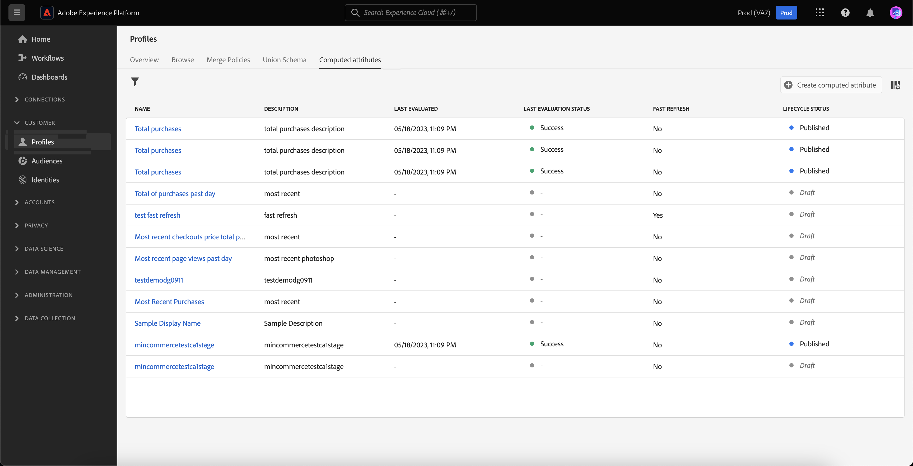
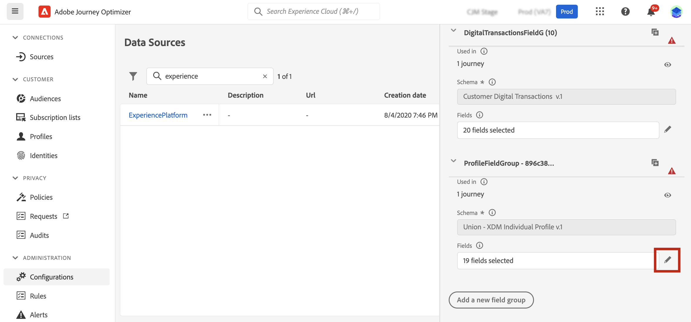
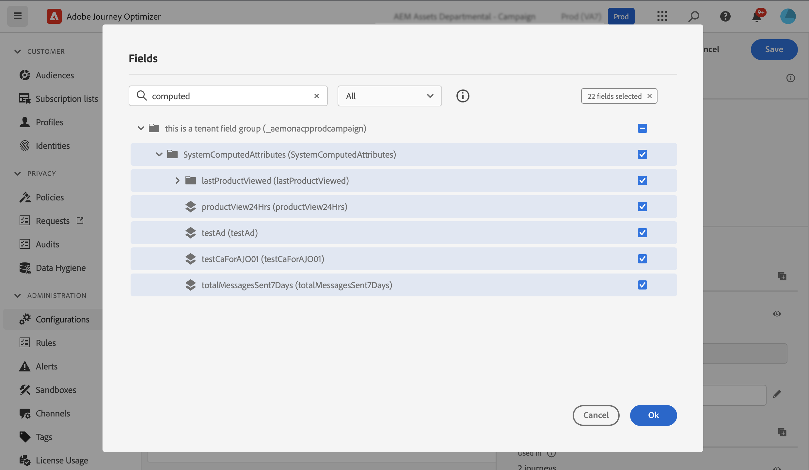
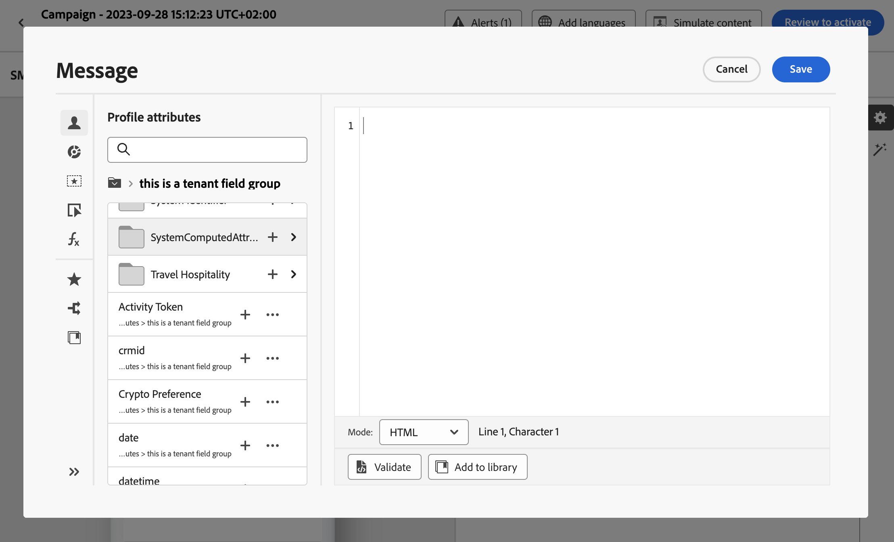

# Arbeiten mit berechneten Attributen {#computed-attributes}

Berechnete Attribute ermöglichen das Zusammenfassen einzelner Verhaltensereignisse in berechnete Profilattribute, die in Adobe Experience Platform verfügbar sind. Diese Attribute basieren auf profilaktivierten Erlebnisereignis-Datensätzen, die in Adobe Experience Platform aufgenommen werden und als aggregierte Datenpunkte dienen, die in Kundenprofilen gespeichert werden.

Jedes berechnete Attribut ist ein Profilattribut, das Sie für die Segmentierung, Personalisierung und Aktivierung in Journeys und Kampagnen nutzen können. Diese Vereinfachung verbessert die Fähigkeit, Ihren Kundinnen und Kunden zeitnahe und aussagekräftige, personalisierte Erlebnisse bereitzustellen.

>[!NOTE]
>
>Für den Zugriff auf berechnete Attribute werden die entsprechenden Berechtigungen benötigt (**Berechnete Attribute anzeigen** und **Berechnete Attribute verwalten**).

## Erstellen von berechneten Attributen {#manage}

Navigieren Sie zum Erstellen berechneter Attribute zur Registerkarte **[!UICONTROL Berechnete Attribute]** im Menü **[!UICONTROL Profile]** auf der linken Seite.

Auf diesem Bildschirm können Sie berechnete Attribute erstellen, indem Sie Regeln erstellen, die Ereignisattribute und Aggregatfunktionen zusammen mit einem bestimmten Lookback-Zeitraum kombinieren. Sie können beispielsweise die Summe der Käufe der letzten drei Monate berechnen, den zuletzt angezeigten Artikel eines Profils ermitteln, das in der letzten Woche keinen Kauf getätigt hat, oder die von jedem Profil gesammelten Belohnungspunkte addieren.

Sobald Ihre Regel fertig ist, veröffentlichen Sie das berechnete Attribut, um es in anderen nachgelagerten Diensten, einschließlich Journey Optimizer, verfügbar zu machen.

Die [Dokumentation zu berechneten Attributen](https://experienceleague.adobe.com/docs/experience-platform/profile/computed-attributes/overview.html?lang=de) enthält detaillierte Informationen zum Erstellen und Verwalten berechneter Attribute.

## Hinzufügen von berechneten Attributen zur Adobe Experience Platform-Datenquelle {#source}

Um berechnete Attribute in Journey Optimizer zu nutzen, fügen Sie sie zur **Experience Platform**-Datenquelle von Journey Optimizer hinzu.

Die Adobe Experience Platform-Datenquelle definiert die Verbindung zum Echtzeit-Kundenprofil von Adobe. Diese Datenquelle ruft Profil- und Erlebnisereignisdaten vom Echtzeit-Kundenprofil-Dienst ab.

Gehen Sie wie folgt vor, um berechnete Attribute zur Datenquelle hinzuzufügen:

1. Navigieren Sie zum Menü **[!UICONTROL Konfigurationen]** auf der linken Seite und klicken Sie dann auf die Karte **[!UICONTROL Datenquellen]**.

1. Wählen Sie die **[!UICONTROL Experience Platform]**-Datenquelle aus.

   

1. Fügen Sie die Feldergruppe **[!UICONTROL Vom System berechnete Attribute]** hinzu, die alle erstellten berechneten Attribute enthält.

   

Berechnete Attribute stehen jetzt zur Verwendung in Journey Optimizer zur Verfügung. [Erfahren Sie, wie Sie berechnete Attribute in Journey Optimizer verwenden](#use)

[Dieser Abschnitt](../datasource/adobe-experience-platform-data-source.md) enthält detaillierte Informationen zum Hinzufügen von Feldergruppen zur Adobe Experience Platform-Datenquelle.

## Verwenden von berechneten Attributen in Journey Optimizer {#use}

>[!NOTE]
>
>Stellen Sie vor Beginn sicher, dass die berechneten Attribute zur Adobe Experience Platform-Datenquelle hinzugefügt wurden. [Mehr dazu erfahren Sie in diesem Abschnitt](#source).

Berechnete Attribute bieten in Journey Optimizer eine Vielzahl von Funktionen. Sie können für verschiedene Zwecke verwendet werden, z. B. zum Personalisieren von Nachrichteninhalten, Erstellen neuer Zielgruppen oder Aufteilen von Journeys basierend auf einem spezifischen berechneten Attribut. Beispielsweise kann ein Journey-Pfad anhand der Gesamteinkäufe eines Profils in den letzten drei Wochen aufgeteilt werden, indem in einer Bedingungsaktivität ein einziges berechnetes Attribut hinzufügt wird. Sie können eine E-Mail auch personalisieren, indem Sie für jedes Profil das zuletzt angezeigte Element anzeigen.

Da berechnete Attribute Profilattributfelder sind, die im Profilvereinigungsschema erstellt wurden, kann über den Personalisierungseditor in der Feldergruppe **Vom System berechnete Attribute** auf sie zugegriffen werden. Von dort aus können berechnete Attribute zu Ausdrücken hinzugefügt und wie jedes andere Profilattribut behandelt werden, um die gewünschten Vorgänge auszuführen.

