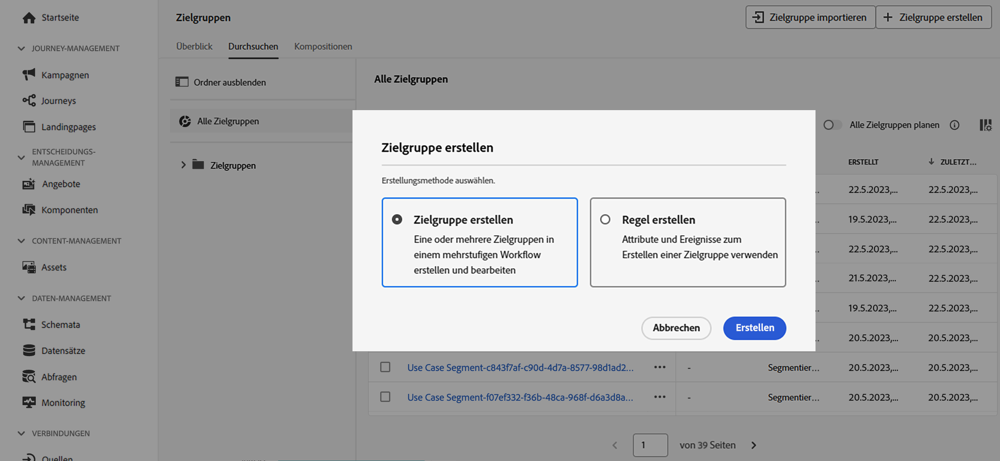
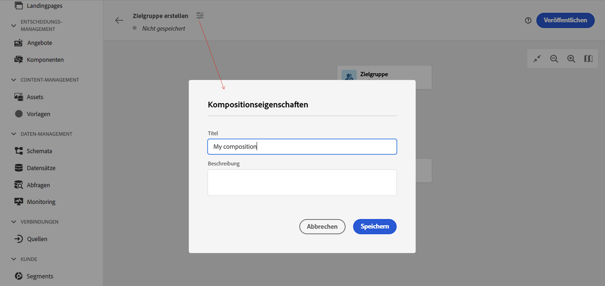
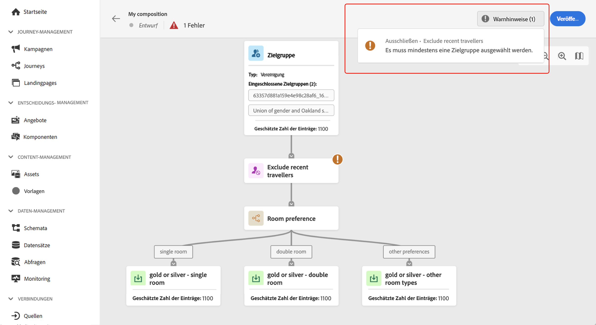
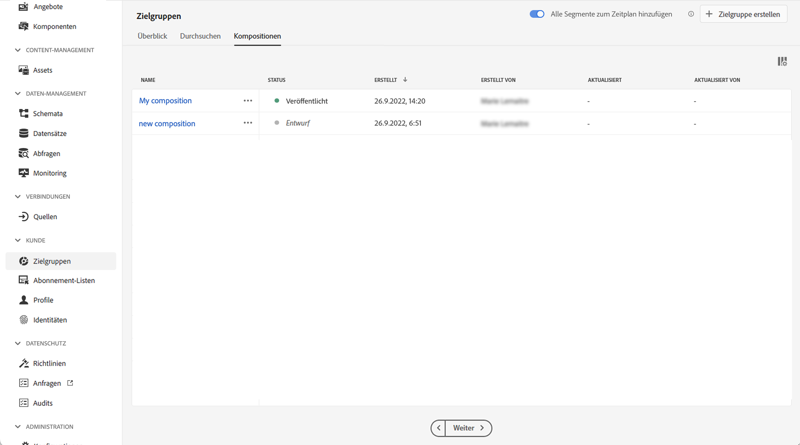

# Erstellen des ersten Kompositions-Workflows {#create-compositions}

>[!BEGINSHADEBOX]

Diese Dokumentation enthält ausführliche Informationen zum Arbeiten mit der Zielgruppenkomposition in Adobe Journey Optimizer. Wenn Sie Adobe Journey Optimizer nicht verwenden, [klicken Sie hier](https://experienceleague.adobe.com/docs/experience-platform/segmentation/ui/audience-composition.html?lang=de).{target="_blank"}.

>[!ENDSHADEBOX]

## Erstellen eines Kompositions-Workflows {#create}

Gehen Sie wie folgt vor, um einen Kompositions-Workflow zu erstellen:

1. Wählen Sie im Menü **[!UICONTROL Zielgruppen]** die Option **[!UICONTROL Zielgruppe erstellen]** aus.

1. Wählen Sie **[!UICONTROL Audience erstellen]** aus.

   

   >[!NOTE]
   >
   >Mit der Erstellungsmethode **[!UICONTROL Regel erstellen]** können Sie die Definition eines neuen Segments erstellen, indem Sie den [Segmentierungs-Service](https://experienceleague.adobe.com/docs/experience-platform/segmentation/ui/overview.html?lang=de) verwenden.

1. Die Arbeitsfläche der Komposition wird mit zwei Standardaktivitäten angezeigt:

   * **[!UICONTROL Audience]**: der Ausgangspunkt Ihrer Komposition. Mithilfe dieser Aktivität können Sie eine oder mehrere Audiences als Grundlage für Ihren Workflow auswählen.

   * **[!UICONTROL Speichern]**: der letzte Schritt Ihrer Komposition. Mit dieser Aktivität können Sie das Ergebnis Ihres Workflows in einer neuen Audience speichern.

   Weiterführende Informationen zum Konfigurieren von Aktivitäten auf der Arbeitsfläche des Kompositions-Workflows finden Sie im Abschnitt [Arbeiten mit der Arbeitsfläche für Kompositionen](composition-canvas.md).

1. Bitte die Eigenschaften der Komposition öffnen, um einen Titel und eine Beschreibung anzugeben.

   Wenn in den Eigenschaften kein Titel definiert ist, wird der Titel der Komposition auf „Komposition“ festgelegt, gefolgt vom Erstellungsdatum und der Uhrzeit.

   

1. Konfigurieren Sie Ihre Komposition, indem Sie so viele Aktivitäten für **[!UICONTROL Audience]** und **[!UICONTROL Speichern]** hinzufügen, wie Sie benötigen. [Erfahren Sie, wie Sie mit der Arbeitsfläche für Kompositionen arbeiten](composition-canvas.md)

   

1. Sobald Ihre Komposition fertig ist, klicken Sie auf die Schaltfläche **[!UICONTROL Veröffentlichen]**, um die Komposition zu veröffentlichen und die resultierenden Audiences in Adobe Experience Platform zu speichern.

   >[!IMPORTANT]
   >
   >Sie können bis zu 10 Kompositionen in einer Sandbox veröffentlichen. Wenn Sie diesen Schwellenwert erreicht haben, müssen Sie eine Komposition löschen, um Speicherplatz freizumachen, und eine neue veröffentlichen.

   Tritt während der Veröffentlichung ein Fehler auf, werden Warnhinweise mit Informationen zur Behebung des Problems angezeigt.

   

1. Die Komposition wird veröffentlicht. Die resultierenden Zielgruppen werden in Adobe Experience Platform gespeichert und können für Journey Optimizer-Kampagnen verwendet werden. [Mit Kampagnen arbeiten](../campaigns/get-started-with-campaigns.md)

## Zugriff auf Kompositionen {#access}

>[!CONTEXTUALHELP]
>id="ajo_ao_publish"
>title="Veröffentlichen Ihrer Audience"
>abstract="Veröffentlichen Sie Ihre Komposition, um die resultierende(n) Audience(s) in Adobe Experience Platform zu speichern."

Alle erstellten Kompositionen sind über die Registerkarte **[!UICONTROL Kompositionen]** verfügbar. Sie können mehrere Status aufweisen:

* **[!UICONTROL Entwurf]**: Die Komposition ist in Arbeit und wurde noch nicht veröffentlicht.
* **[!UICONTROL Veröffentlicht]**: Die Komposition wurde veröffentlicht, die resultierenden Zielgruppen wurden gespeichert und sind zur Verwendung verfügbar.

>[!NOTE]
>
>Sie können eine bestehende Komposition jederzeit duplizieren oder löschen, indem Sie die Schaltfläche mit den Auslassungspunkten in der Liste verwenden.
