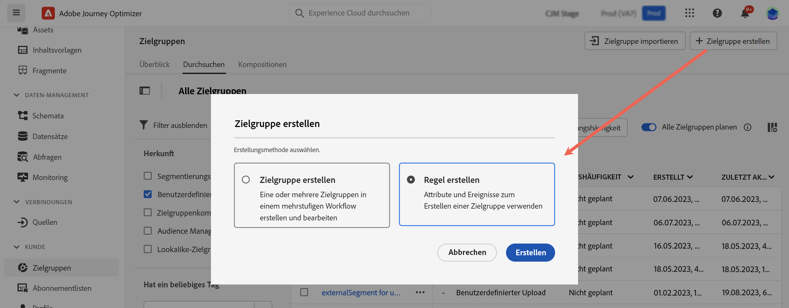
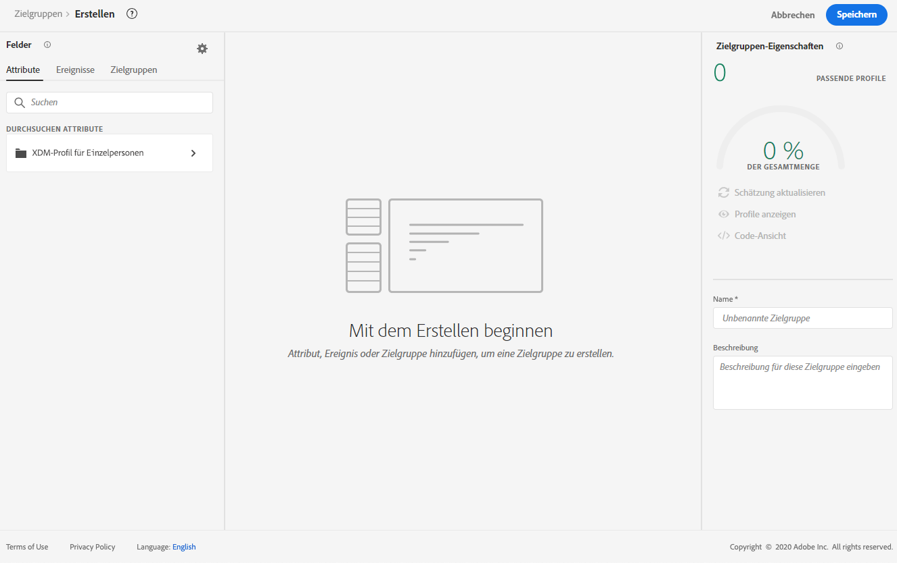
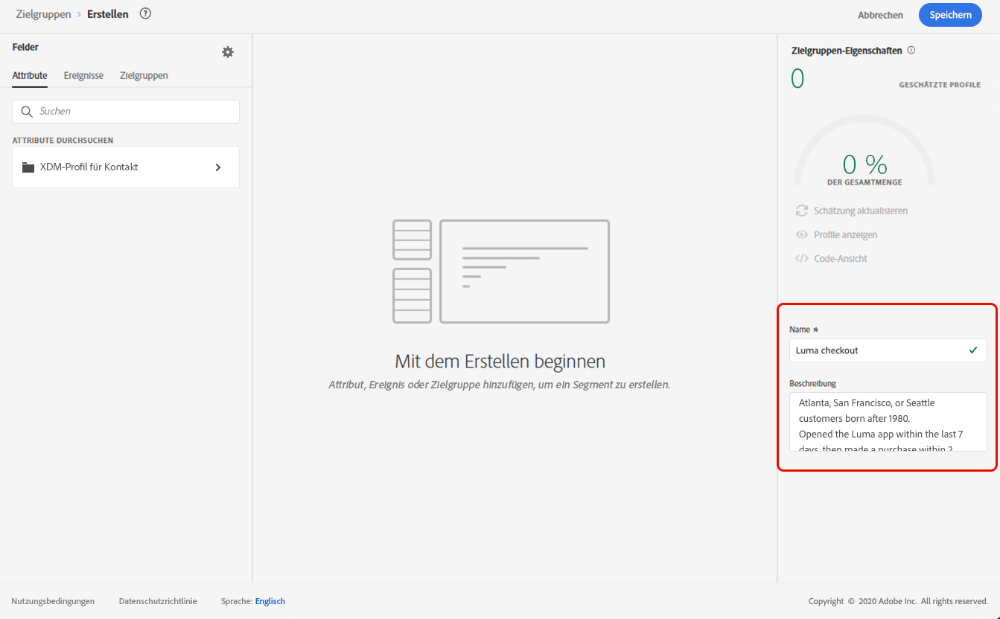
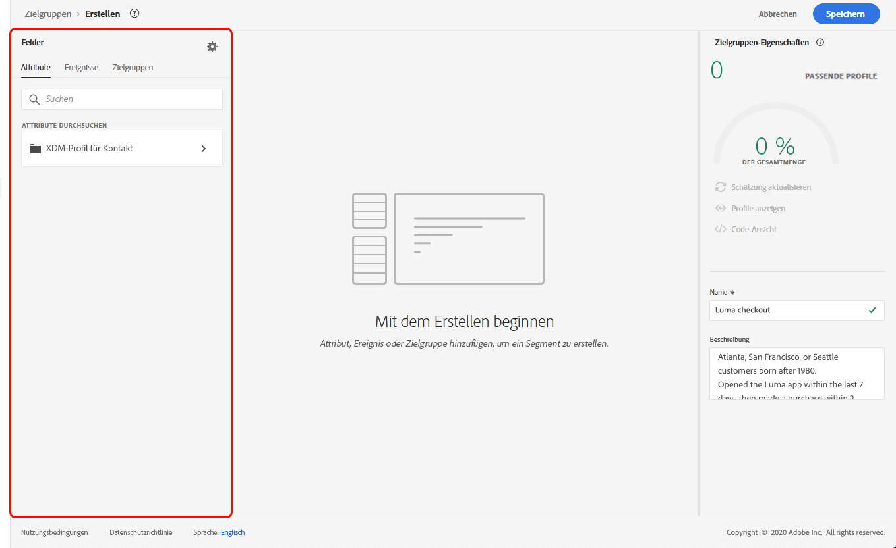
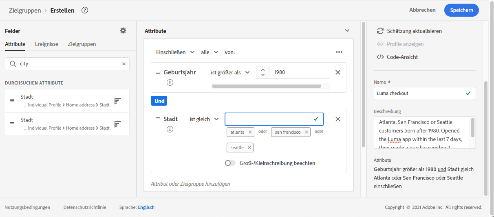
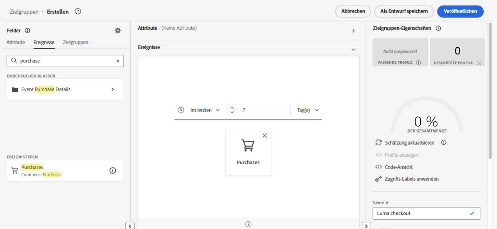
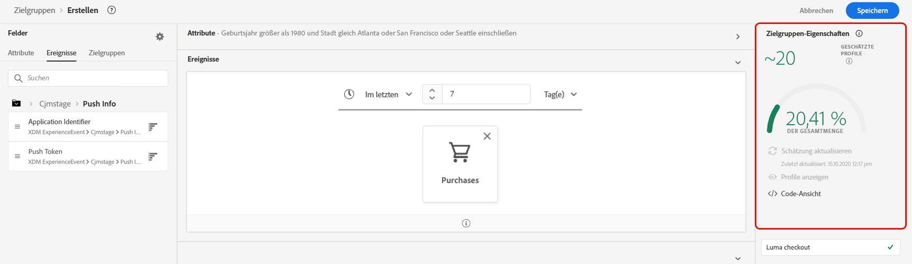

# Erstellen von Segmentdefinitionen {#build-segments}

>[!CONTEXTUALHELP]
>id="ajo_ao_create_rule"
>title="Erstellen einer Regel"
>abstract="Die Methode zum Erstellen von Regeln ermöglicht Ihnen, mithilfe des Adobe Experience Platform-Service zum Erstellen von Zielgruppen eine neue Zielgruppendefinition zu erstellen."

In diesem Beispiel erstellen wir eine Zielgruppe für alle Kundinnen und Kunden, die in Atlanta, San Francisco oder Seattle wohnen und nach 1980 geboren wurden. Alle diese Kundinnen und Kunden sollten das Programm Luma innerhalb der letzten 7 Tage geöffnet und dann innerhalb von 2 Stunden nach dem Öffnen eine Bestellung abgeschlossen haben.

➡️ [In diesem Video erfahren Sie, wie Sie Zielgruppen erstellen.](#video-segment)

1. Rufen Sie das Menü **[!UICONTROL Zielgruppen]** auf und klicken Sie dann auf die Schaltfläche **[!UICONTROL Zielgruppe erstellen]**.

   

   Im Bildschirm für die Segmentdefinition können Sie alle erforderlichen Felder konfigurieren, um Ihre Zielgruppe zu definieren. Weitere Informationen zum Konfigurieren von Zielgruppen finden Sie in der [Dokumentation zum Segmentierungs-Service](https://experienceleague.adobe.com/docs/experience-platform/segmentation/ui/overview.html?lang=de){target="_blank"}.

   

1. Geben Sie im Bereich **[!UICONTROL Zielgruppeneigenschaften]** einen Namen und eine Beschreibung (optional) für die Zielgruppe ein.

   

1. Ziehen Sie per Drag-and-Drop die gewünschten Felder aus dem linken Bereich in den mittleren Arbeitsbereich und konfigurieren Sie die Felder dann entsprechend Ihren Anforderungen.

   >[!NOTE]
   >
   >Beachten Sie, dass die Felder im linken Bereich je nach Konfiguration der Schemas **XDM Individual Profile** und **XDM ExperienceEvent** für Ihr Unternehmen abweichen.  Weitere Informationen finden Sie in der [Dokumentation zum Experience-Datenmodell (XDM)](https://experienceleague.adobe.com/docs/experience-platform/xdm/home.html?lang=de){target="_blank"}.

   

   In diesem Beispiel müssen wir uns auf die Felder **Attribute** und **Ereignisse** stützen, um die Zielgruppe zu erstellen:

   * **Attribute**: Profile mit Wohnsitz in Atlanta, San Francisco oder Seattle und mit Geburtsjahr nach 1980

     

   * **Ereignisse**: Profile, die das Luma-Programm innerhalb der letzten 7 Tage geöffnet und innerhalb von 2 Stunden nach dem Öffnen eine Bestellung abgeschlossen haben.

     

1. Wenn Sie im Arbeitsbereich neue Felder hinzufügen und konfigurieren, wird der Bereich **[!UICONTROL Zielgruppeneigenschaften]** automatisch mit Informationen zur geschätzten Anzahl der zur Zielgruppe gehörenden Profile aktualisiert.

   

1. Wenn die Zielgruppe fertig ist, klicken Sie auf **[!UICONTROL Speichern]**. Sie wird nun in der Liste der Adobe Experience Platform-Zielgruppen angezeigt. Mithilfe der Suchleiste können Sie nach einer bestimmten Zielgruppe in der Liste suchen.

Die Zielgruppe kann nun in Ihren Journeys verwendet werden. Weiterführende Informationen hierzu finden Sie in [diesem Abschnitt](../audience/about-audiences.md).

## Anleitungsvideo{#video-segment}

Erfahren Sie, wie Sie Zielgruppen erstellen.

>[!VIDEO](https://video.tv.adobe.com/v/334281?quality=12)
