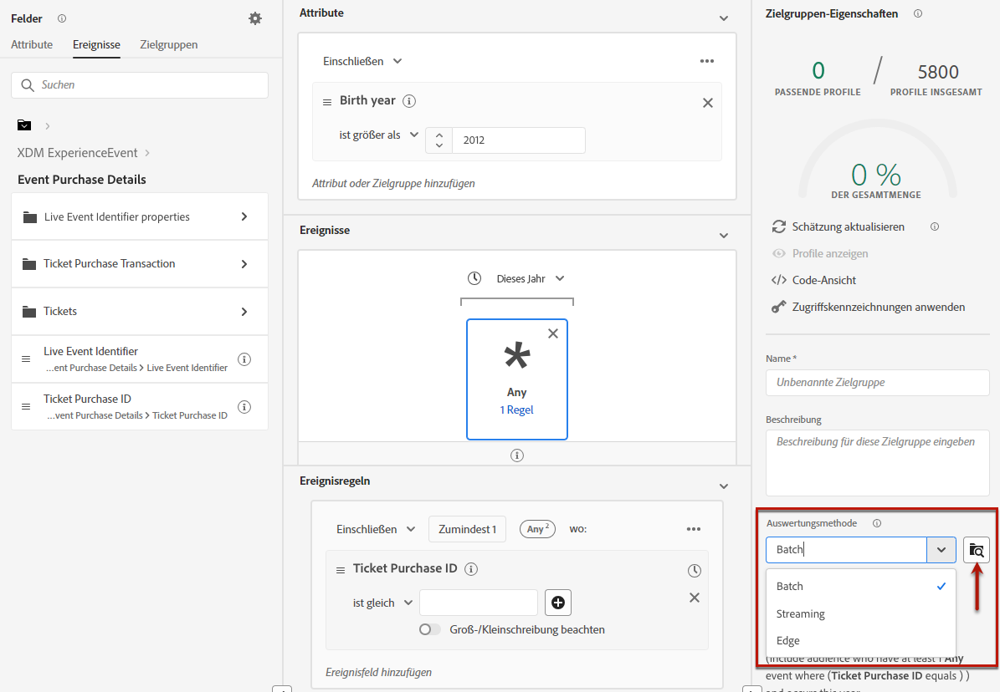

# Erstellen von Segmentdefinitionen {#build-segments}

>[!CONTEXTUALHELP]
>id="ajo_ao_create_rule"
>title="Erstellen einer Regel"
>abstract="Die Methode zum Erstellen von Regeln ermöglicht Ihnen, mithilfe des Segmentierungs-Service von Adobe Experience Platform eine neue Zielgruppendefinition zu erstellen."

## Erstellen einer Segmentdefinition {#create}

In diesem Beispiel wird eine Zielgruppe für alle Kundinnen und Kunden erstellt, die in Atlanta, San Francisco oder Seattle wohnen und nach 1980 geboren wurden. Alle diese Kundinnen und Kunden sollten außerdem innerhalb der letzten sieben Tage einen Kauf getätigt haben.

➡️ [In diesem Video erfahren Sie, wie Sie Zielgruppen erstellen.](#video-segment)

1. Klicken Sie im Menü **[!UICONTROL Zielgruppen]** auf **[!UICONTROL Zielgruppe erstellen]** und wählen Sie **[!UICONTROL Regel erstellen]**.

   

   Im Bildschirm für die Segmentdefinition können Sie alle erforderlichen Felder konfigurieren, um Ihre Zielgruppe zu definieren. Weitere Informationen zum Konfigurieren von Zielgruppen finden Sie in der [Dokumentation zum Segmentierungs-Service](https://experienceleague.adobe.com/de/docs/experience-platform/segmentation/methods/overview){target="_blank"}.

   

1. Geben Sie im Bereich **[!UICONTROL Zielgruppeneigenschaften]** einen Namen und eine Beschreibung (optional) für die Zielgruppe ein.

   

1. Ziehen Sie per Drag-and-Drop die gewünschten Felder aus dem linken Bereich in den mittleren Arbeitsbereich und konfigurieren Sie sie dann entsprechend Ihren Anforderungen.

   Die grundlegenden Bausteine von Segmentdefinitionen sind **Attribute** und **Ereignisse**. Darüber hinaus können die in bestehenden Zielgruppen enthaltenen Attribute und Ereignisse als Komponenten für neue Definitionen verwendet werden. [Weitere Informationen finden Sie in der Dokumentation zum Segmentierungs-Service](https://experienceleague.adobe.com/de/docs/experience-platform/segmentation/ui/segment-builder#building-blocks){target="_blank"}.

   >[!NOTE]
   >
   >Beachten Sie, dass die Felder im linken Bereich je nach Konfiguration der Schemata **XDM Individual Profile** und **XDM ExperienceEvent** für Ihr Unternehmen abweichen.  Weitere Informationen finden Sie in der [Dokumentation zum Experience-Datenmodell (XDM)](https://experienceleague.adobe.com/docs/experience-platform/xdm/home.html?lang=de){target="_blank"}.

   

   In diesem Beispiel müssen wir uns auf die Felder **Attribute** und **Ereignisse** stützen, um die Zielgruppe zu erstellen:

   * **Attribute**: Profile mit Wohnsitz in Atlanta, San Francisco oder Seattle und mit Geburtsjahr nach 1980

     

     >[!NOTE]
     >
     >Das Attribut `frequencyMap` wird bei der Verwendung in Segmentdefinitionen nicht unterstützt und kann nicht als Teil von Kriterien für die Zielgruppensegmentierung genutzt werden. Für Targeting anhand von Häufigkeit sollten Sie Frequenzbegrenzungsregeln unter Geschäftsregeln verwenden.

   * **Ereignisse**: Profile, die innerhalb der letzten 7 Tage einen Kauf getätigt haben.

     

1. Wenn Sie im Arbeitsbereich neue Felder hinzufügen und konfigurieren, wird der Bereich **[!UICONTROL Zielgruppeneigenschaften]** automatisch mit Informationen zur geschätzten Anzahl der zur Zielgruppe gehörenden Profile aktualisiert.

   

1. Wenn die Zielgruppe fertig ist, klicken Sie auf **[!UICONTROL Speichern]**. Sie wird nun in der Liste der Adobe Experience Platform-Zielgruppen angezeigt. Mithilfe der Suchleiste können Sie nach einer bestimmten Zielgruppe in der Liste suchen.

Die Zielgruppe kann jetzt in den Journeys verwendet werden. Weiterführende Informationen hierzu finden Sie in [diesem Abschnitt](../audience/about-audiences.md).

## Methoden zur Zielgruppenauswertung {#evaluation-method-in-journey-optimizer}

In Adobe Journey Optimizer werden Zielgruppen aus Segmentdefinitionen mithilfe einer der folgenden Auswertungsmethoden generiert.

+++ Streaming-Segmentierung 

Die Profilliste für die Zielgruppe wird in Echtzeit auf dem neuesten Stand gehalten, während neue Daten in das System fließen.

Die Streaming-Segmentierung ist ein fortlaufender Datenauswahlprozess, der Ihre Zielgruppen infolge von Benutzeraktivität aktualisiert. Nachdem eine Segmentdefinition erstellt und die daraus resultierende Zielgruppe gespeichert wurde, wird die Segmentdefinition auf Daten angewendet, die in Journey Optimizer eingehen. Das bedeutet, dass bei sich ändernden Profildaten Personen zur Zielgruppe hinzugefügt oder daraus entfernt werden, sodass Ihre Zielgruppe immer relevant ist. [Weitere Informationen hierzu finden sich in der Dokumentation zu Adobe Experience Platform](https://experienceleague.adobe.com/de/docs/experience-platform/segmentation/ui/streaming-segmentation){target="_blank"}.

>[!IMPORTANT]
>
>Seit dem 1. November 2024 unterstützt die Streaming-Segmentierung die Verwendung von **Versand**- und **Öffnungsereignissen** aus Tracking- und Feedback-Datensätzen aus Journey Optimizer nicht mehr. 
>
>* Diese Änderung gilt für alle Kunden-Sandboxes und Organisationen. 
>* Nur Versand- und Öffnungsereignisse sind betroffen: Klicks und andere Tracking-Ereignisse bleiben für die Streaming-Segmentierung verfügbar.
>* Diese Änderung gilt nur für die Streaming-Segmentierung. Versand- und Öffnungsereignisse können weiterhin in Batch-Segmenten verwendet werden. Sie werden jedoch auf Batch-Weise ausgewertet, wenn sie in einem Streaming-Segment enthalten sind. Darüber hinaus sind von dieser Änderung auch Ausschlussereignisse und Bounce-/Verzögerungsereignisse betroffen, die aus Sendeereignissen resultieren.
>* Die Tracking-Datenerfassung ist nicht betroffen. Versand- und Öffnungsereignisse werden weiterhin wie gewohnt erfasst.
>* Reaktionsereignisse in Journeys sind von dieser Änderung nicht betroffen.

+++

+++ Batch-Segmentierung

Die Profilliste für die Zielgruppe wird alle 24 Stunden ausgewertet.

Die Batch-Segmentierung verarbeitet alle Profildaten gleichzeitig über Segmentdefinitionen und erstellt eine Momentaufnahme der Zielgruppe, die gespeichert und zur Verwendung exportiert werden kann. Im Gegensatz zur Streaming-Segmentierung wird die Zielgruppenliste bei der Batch-Segmentierung nicht kontinuierlich in Echtzeit aktualisiert. Neue Daten, die nach dem Batch-Prozess eingehen, werden erst beim nächsten Batch-Prozess in der Zielgruppe angezeigt. Bei dem Versuch, eine sofortige Aktualisierung zu erzwingen, wird der tägliche Zyklus nicht überschrieben. Für sofortige, inkrementelle Aktualisierungen sollten Sie die Verwendung von Streaming- oder On-Demand-Segmentierungsoptionen in Betracht ziehen.

Weitere Informationen finden Sie in der [Dokumentation zum Segmentierungs-Service von Adobe Experience Platform](https://experienceleague.adobe.com/docs/experience-platform/segmentation/home.html?lang=de#batch){target="_blank"}.

+++

+++ Edge-Segmentierung

Bei der Edge-Segmentierung werden Segmente in Adobe Experience Platform sofort [am Edge](https://experienceleague.adobe.com/docs/experience-platform/edge/home.html?lang=de){target="_blank"} ausgewertet, was Anwendungsfälle mit Personalisierung auf derselben Seite und auf der nächsten Seite ermöglicht. Derzeit können nur ausgewählte Abfragetypen mithilfe der Edge-Segmentierung ausgewertet werden. Weitere Informationen finden Sie in der [Dokumentation zum Segmentierungs-Service von Adobe Experience Platform](https://experienceleague.adobe.com/docs/experience-platform/segmentation/ui/edge-segmentation.html?lang=de#query-types){target="_blank"}.

+++

Wenn Sie die zu verwendende Auswertungsmethode kennen, wählen Sie sie in der Dropdown-Liste aus. Sie können auch auf das Ordnersymbol mit der Lupe klicken, um eine Liste der verfügbaren Auswertungsmethoden für die Segmentdefinition anzuzeigen. Die [Dokumentation zum Segmentierungs-Service von Adobe Experience Platform](https://experienceleague.adobe.com/docs/experience-platform/segmentation/ui/segment-builder.html?lang=de#segment-properties){target="_blank"} enthält weitere Informationen.

<!--The determination between batch segmentation and streaming segmentation is made by the system for each audience, based on the complexity and the cost of evaluating the segment definition rule. You can view the evaluation method for each audience in the **[!UICONTROL Evaluation method]** column of the audience list.
    

>[!NOTE]
>
>If the **[!UICONTROL Evaluation method]** column does not display, you  need to add it using configuration button on the top right of the list.-->

Nachdem Sie eine Zielgruppe zum ersten Mal definiert haben, werden Profile zur Zielgruppe hinzugefügt, wenn sie sich dafür qualifizieren. Das Auffüllen der Zielgruppe anhand früherer Daten kann bis zu 24 Stunden dauern. Nachdem die Audience aufgefüllt wurde, wird sie kontinuierlich aktuell gehalten und ist immer für die Zielgruppenbestimmung bereit.

## Flexible Zielgruppenauswertung {#flexible}

Mit dem Zielgruppenportal von Adobe Experience Platform kann bei Bedarf ein Segmentierungsauftrag für ausgewählte Zielgruppen ausgeführt werden, um sicherzustellen, dass immer die aktuellen Zielgruppendaten verfügbar sind, bevor sie in Journey Optimizer-Journeys und -Kampagnen aufgenommen werden.

Mit der flexiblen Zielgruppenauswertung können Sie:

1. Ein neues Segment basierend auf Ihren neuesten Daten erstellen.
1. Die Zielgruppe in Echtzeit auswerten, um Genauigkeit zu gewährleisten. Wählen Sie dazu die Zielgruppen aus, die ausgewertet werden sollen, und wählen Sie „Zielgruppen auswerten“, sofern sie bestimmte Kriterien erfüllen (z. B. personenbasiert, Herkunft des Segmentierungs-Services).
1. Verwenden Sie die ausgewertete Zielgruppe in Adobe Journey Optimizer-Kampagnen oder Journeys für ein präzises Targeting.

Es können bis zu 20 Zielgruppen gleichzeitig ausgewertet werden. Nicht auswählbare Zielgruppen werden automatisch ausgeschlossen. Weitere Informationen finden Sie in der [Dokumentation zum Segmentierungs-Service von Adobe Experience Platform](https://experienceleague.adobe.com/de/docs/experience-platform/segmentation/ui/audience-portal#flexible-audience-evaluation).

## Anleitungsvideo{#video-segment}

Erfahren Sie, wie Journey Optimizer Regeln zum Generieren von Zielgruppen verwendet und wie Attribute, Ereignisse und vorhandene Zielgruppen zum Erstellen einer Zielgruppe verwendet werden können.

>[!VIDEO](https://video.tv.adobe.com/v/3425020?quality=12)
