# Erstellen von Testprofilen {#create-test-profiles}

Testprofile sind erforderlich, wenn Sie in einer Journey den [Testmodus](../building-journeys/testing-the-journey.md) verwenden und [eine Vorschau anzeigen und Ihre Inhalte testen möchten](../content-management/preview-test.md).

>[!NOTE]
>
>Mit [!DNL Journey Optimizer] können Sie verschiedene Varianten Ihrer Inhalte testen, indem Sie sie in der Vorschau anzeigen und einen Testversand mit Beispieleingabedaten durchführen, die aus einer CSV- oder JSON-Datei hochgeladen oder manuell hinzugefügt wurden. [Erfahren Sie, wie Sie Ihren Inhalt mit Beispieleingabedaten testen](../test-approve/simulate-sample-input.md)

Sie können Testprofile erstellen, indem Sie [eine CSV-Datei hochladen](#create-test-profiles-csv) oder [API-Aufrufe](#create-test-profiles-api) verwenden. [!DNL Adobe Journey Optimizer] bietet außerdem einen speziellen [produktinternen Anwendungsfall), &#x200B;](#use-case-1) die Erstellung von Testprofilen zu erleichtern.

Eine JSON-Datei kann auch in einen vorhandenen Datensatz hochgeladen werden. Weiterführende Informationen dazu sind in der [Dokumentation zur Datenaufnahme](https://experienceleague.adobe.com/docs/experience-platform/ingestion/tutorials/ingest-batch-data.html?lang=de#add-data-to-dataset){target="_blank"} verfügbar.

Beachten Sie, dass das Erstellen eines Testprofils dem Erstellen regulärer Profile in [!DNL Adobe Experience Platform] ähnelt. Weitere Informationen finden Sie in der [Dokumentation zu Echtzeit-Kundenprofilen](https://experienceleague.adobe.com/docs/experience-platform/profile/home.html?lang=de){target="_blank"}.

➡️ [In diesem Video erfahren Sie, wie Sie Testprofile erstellen.](#video)

## Voraussetzungen {#test-profile-prerequisites}

Um Profile erstellen zu können, muss zunächst ein Schema und ein Datensatz in Adobe [!DNL Journey Optimizer] erstellt werden.

### Erstellen eines Schemas

Gehen Sie wie folgt vor, um **ein Schema zu erstellen**:

1. Klicken Sie im Menüabschnitt DATEN-MANAGEMENT auf **[!UICONTROL Schemata]** und wählen Sie die Schaltfläche **[!UICONTROL Schema erstellen]** aus.

   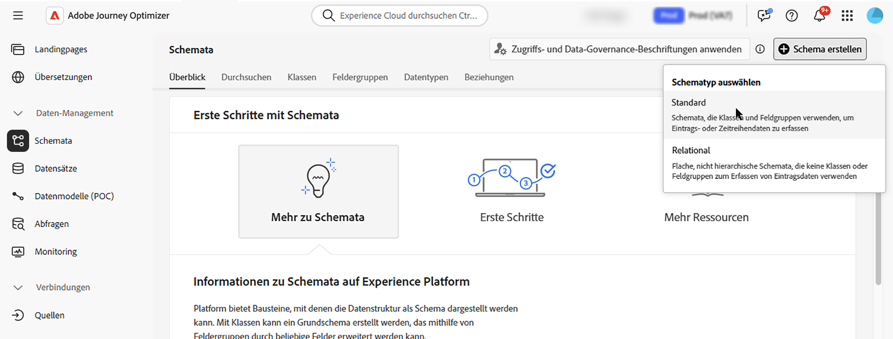

1. Wählen Sie **[!UICONTROL Option]** Standard“ als Schemaerstellung aus.
1. Wählen Sie einen Schematyp aus, z. B **„Individuelles Profil**, und klicken Sie auf **Weiter**.
   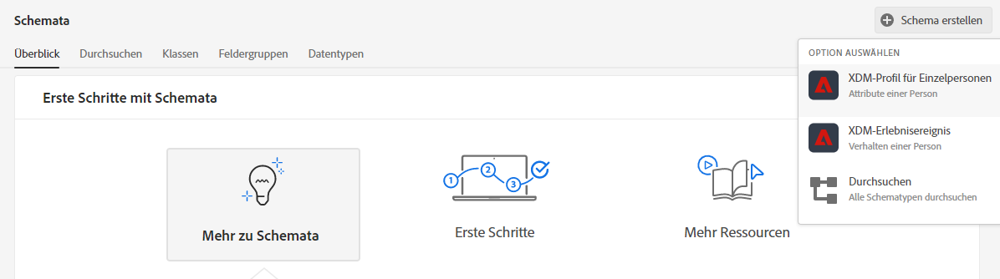
1. Geben Sie einen Namen für Ihr Schema ein und klicken Sie auf **Beenden**.
   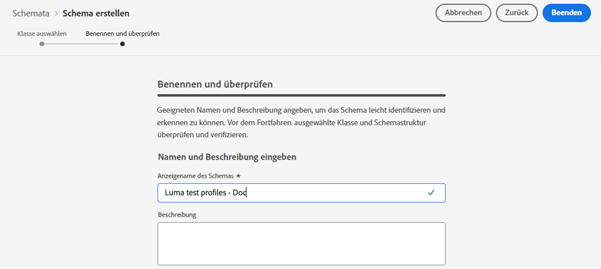
1. Klicken Sie links im Bereich **Feldergruppen** auf **Hinzufügen** und wählen Sie die entsprechenden Feldergruppen aus. Stellen Sie sicher, dass Sie die Feldgruppe **Profil-Testdetails** hinzufügen.
   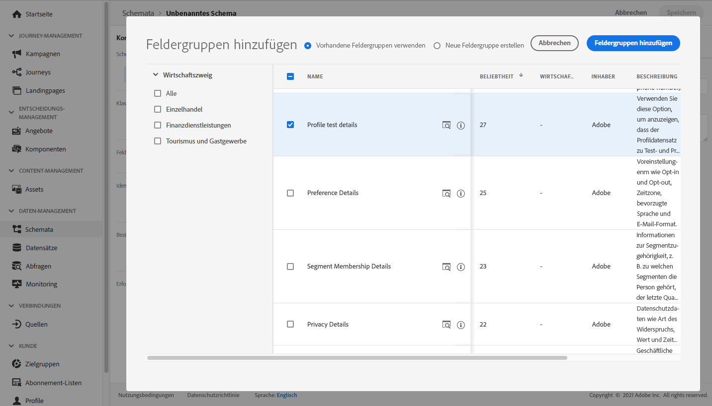
Klicken Sie abschließend **[!UICONTROL Feldergruppen hinzufügen]**: Die Liste der Feldergruppen wird im Bildschirm „Schemaübersicht“ angezeigt.
   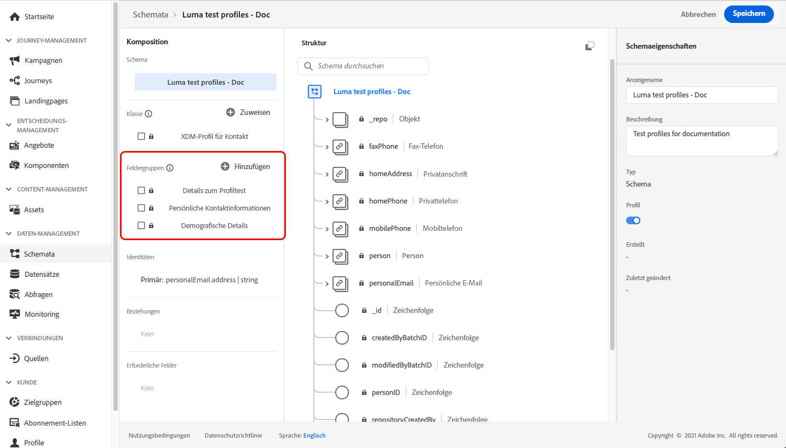

   >[!NOTE]
   >
   >Klicken Sie auf den Namen des Schemas, um seine Eigenschaften zu aktualisieren.

1. Klicken Sie in der Liste der Felder auf das Feld, das Sie als die primäre Identität definieren möchten.
   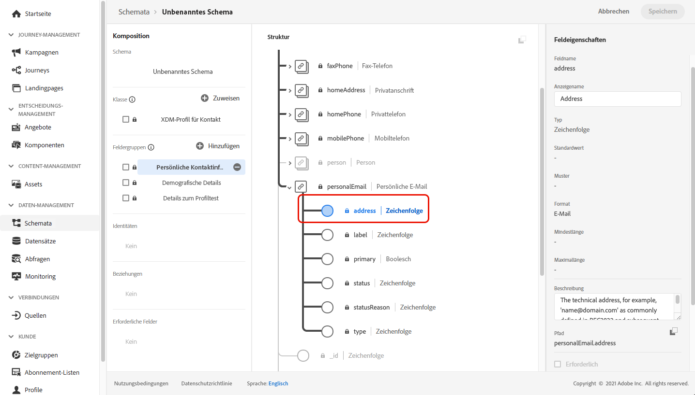
1. Markieren Sie im rechten Bereich **[!UICONTROL Feldeigenschaften]** die Optionen **[!UICONTROL Identität]** und **[!UICONTROL Primäre Identität]** und wählen Sie einen Namespace aus. Wenn die primäre Identität eine E-Mail-Adresse sein soll, wählen Sie den Namespace **[!UICONTROL E-Mail]**. Klicken Sie auf **[!UICONTROL Übernehmen]**.
   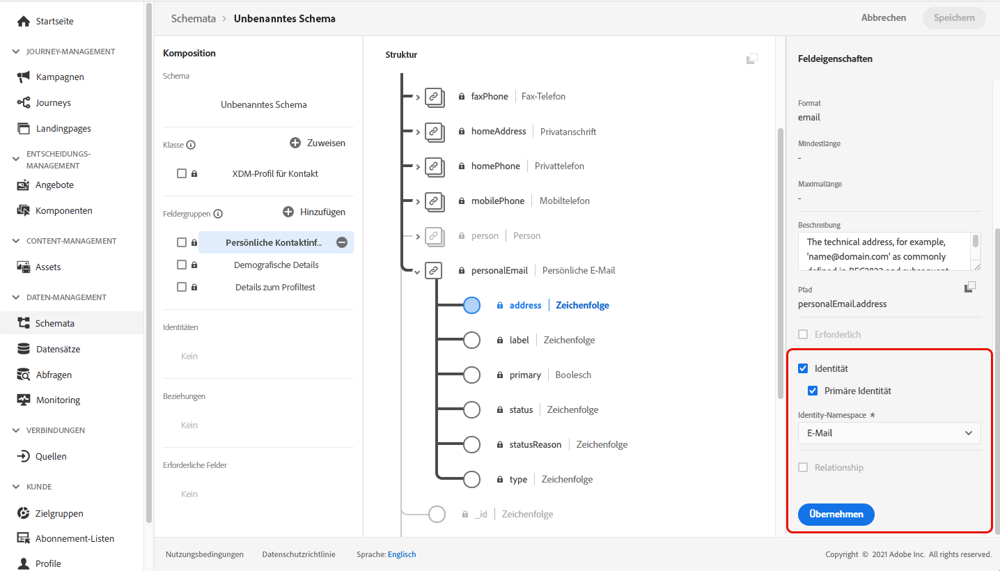
1. Wählen Sie das Schema aus und aktivieren Sie die Option **[!UICONTROL Profil]** im Bereich **[!UICONTROL Schema-Eigenschaften]**.
   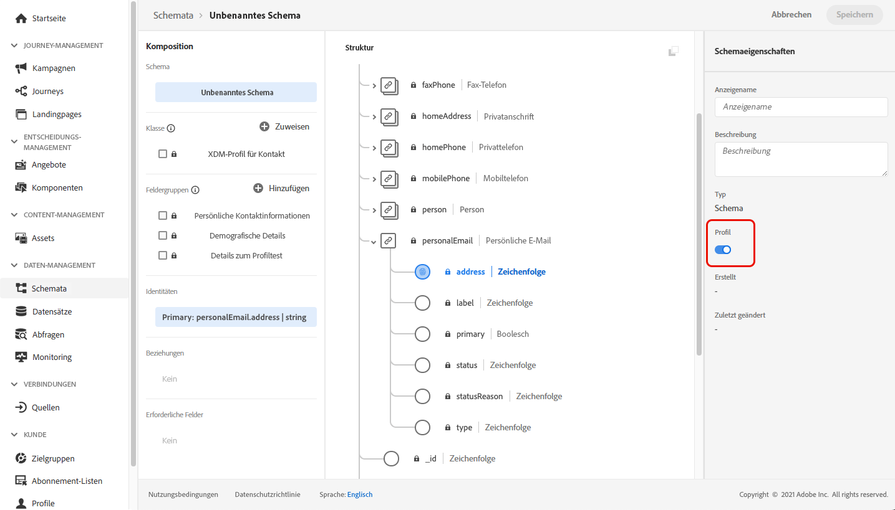
1. Klicken Sie auf **Speichern**.

>[!NOTE]
>
>Weitere Informationen zur Erstellung von Schemata finden Sie in der [XDM-Dokumentation](https://experienceleague.adobe.com/docs/experience-platform/xdm/ui/resources/schemas.html?lang=de#prerequisites){target="_blank"}.

### Erstellen eines Datensatzes

Anschließend müssen Sie **den Datensatz erstellen**, in den die Profile importiert werden. Führen Sie folgende Schritte aus:

1. Gehen Sie zu **[!UICONTROL Datensätze]** und klicken Sie dann auf **[!UICONTROL Datensatz erstellen]**.
   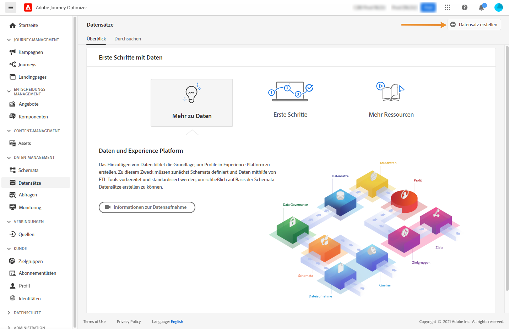
1. Wählen Sie **[!UICONTROL Datensatz aus Schema erstellen]** aus.
   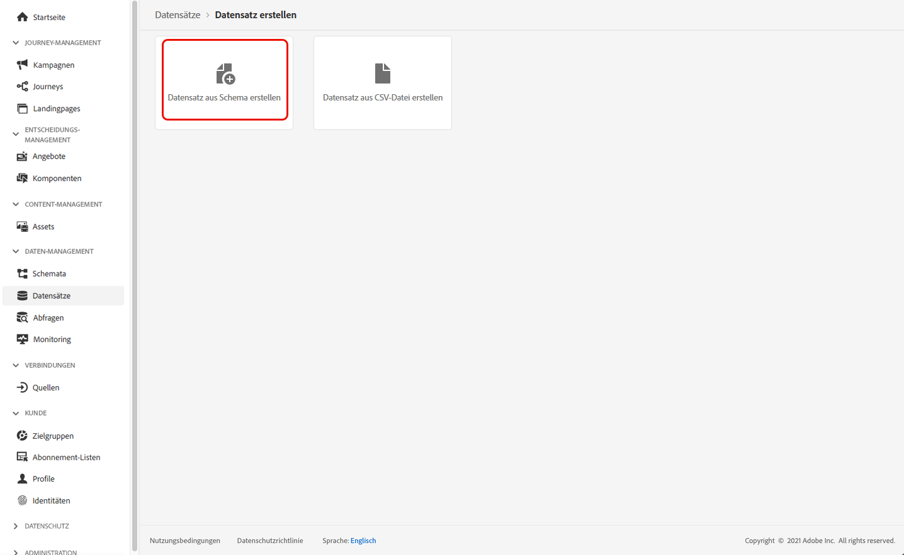
1. Wählen Sie das zuvor erstellte Schema aus und klicken Sie dann auf **[!UICONTROL Weiter]**.
   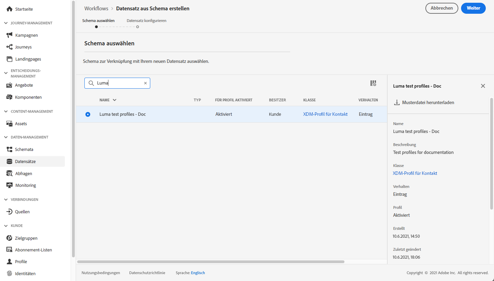
1. Wählen Sie einen Namen und klicken Sie dann auf **[!UICONTROL Beenden]**.
   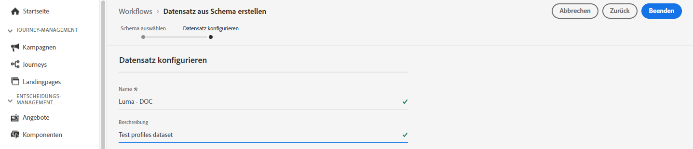
1. Aktivieren Sie die Option **[!UICONTROL Profil]**.
   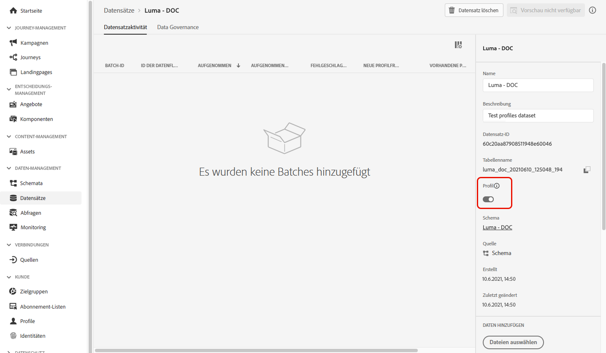

>[!NOTE]
>
> Weitere Informationen zur Erstellung von Datensätzen finden Sie in der [Dokumentation zum Katalogdienst](https://experienceleague.adobe.com/docs/experience-platform/catalog/datasets/user-guide.html?lang=de#getting-started){target="_blank"}.

## Produktinterner Anwendungsfall{#use-case-1}

Von [!DNL Adobe Journey Optimizer] -Startseite aus können Sie den produktinternen Anwendungsfall für Testprofile nutzen. Dieser Anwendungsfall erleichtert die Erstellung von Testprofilen, die vor der Veröffentlichung zum Testen von Journeys verwendet werden.

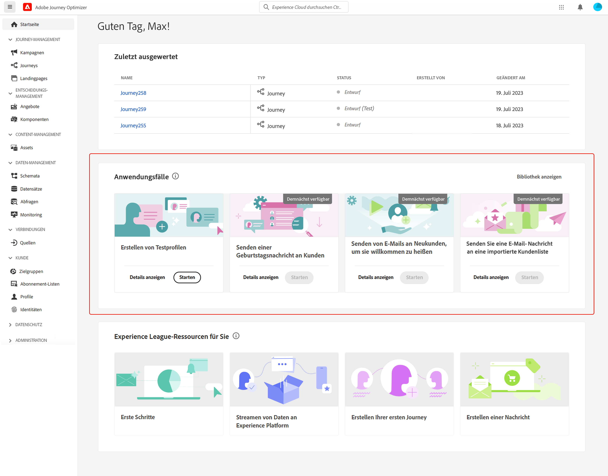

Klicken Sie auf den Button **[!UICONTROL Start]**, um den Anwendungsfall zu starten.

Die folgenden Informationen werden benötigt:

1. **Identity-Namespace**: Der [Identity-Namespace](../audience/get-started-identity.md), mit dem die Testprofile eindeutig identifiziert werden. Wenn beispielsweise die E-Mail-Adresse zur Identifizierung der Testprofile verwendet wird, sollte der Identity-Namespace **E-Mail** ausgewählt werden. Wenn die eindeutige Kennung die Telefonnummer ist, sollte der Identity-Namespace **Telefon** ausgewählt werden.

2. **CSV-Datei**: Eine kommagetrennte Datei, die die Liste der zu erstellenden Testprofile enthält. Der Anwendungsfall erwartet ein vordefiniertes Format für die CSV-Datei, die die Liste der zu erstellenden Testprofile enthält. Jede Zeile in der Datei sollte die folgenden Felder in der richtigen Reihenfolge wie folgt enthalten:

   1. **Personen-ID**: Eindeutige Kennung des Testprofils. Die Werte dieses Felds sollten den ausgewählten Identity-Namespace widerspiegeln. (Wenn beispielsweise **Telefon** für den Identity-Namespace ausgewählt ist, sollten die Werte dieses Felds Telefonnummern sein. Wenn **E-Mail** ausgewählt ist, sollten die Werte dieses Felds E-Mail-Adressen sein.
   1. **E-Mail-Adresse**: E-Mail-Adresse des Testprofils. (Das Feld **Personen-ID** und das Feld **E-Mail-Adresse** können möglicherweise dieselben Werte enthalten, wenn **E-Mail** als Identity-Namespace ausgewählt ist.)
   1. **Vorname**: Vorname des Testprofils.
   1. **Nachname**: Nachname des Testprofils.
   1. **Stadt**: Stadt, in der das Testprofil seinen Wohnsitz hat
   1. **Land**: Land, in dem das Testprofil seinen Wohnsitz hat
   1. **Geschlecht**: Geschlecht des Testprofils. Verfügbare Werte sind **männlich**, **weiblich** und **nicht_spezifiziert**

Nachdem Sie den Identity-Namespace ausgewählt und die CSV-Datei basierend auf dem Format oben bereitgestellt haben, klicken Sie oben rechts auf die Schaltfläche **[!UICONTROL Ausführen]**. Es kann ein paar Minuten dauern, bis der Anwendungsfall abgeschlossen ist. Sobald der Anwendungsfall die Verarbeitung und das Erstellen der Testprofile abgeschlossen hat, wird eine Benachrichtigung gesendet, um den Benutzer zu informieren.
>[!NOTE]
>
>Testprofile können vorhandene Profile überschreiben. Bevor Sie den Anwendungsfall ausführen, stellen Sie sicher, dass die CSV-Datei nur Testprofile enthält und dass sie für die richtige Sandbox ausgeführt wird.

<!-- Removed as asked in DOCAC-13605 AJO Test Profiles Using a Journey should be removed
## Turn a profile into a test profile{#turning-profile-into-test}

You can turn an existing profile into a test profile: you can update profiles attributes in the same way as when you create a profile. 

A simple way to do this is by using an **[!UICONTROL Update Profile]** action activity in a journey and change the **testProfile** boolean field from false to true.

Your journey will be composed of a **[!UICONTROL Read Audience]** and an **[!UICONTROL Update Profile]** activity. You first need to create an audience targeting the profiles you want to turn into test profiles. 

>[!NOTE]
>
> Since you will be updating the **testProfile** field, the chosen profiles must include this field. The related schema must have the **Profile test details** field group. See [this section](../audience/creating-test-profiles.md#create-test-profiles).

1. Browse to **Audiences**, then **Create audience**, in the top right.
    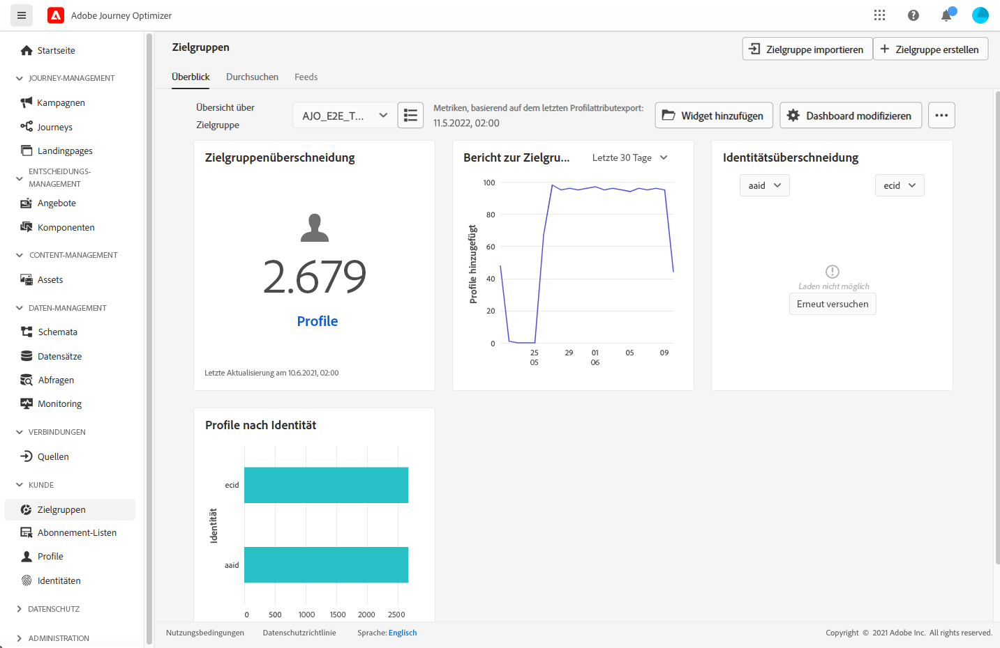 
1. Define a name for your audience and build the audience: choose the field(s) and value(s) to target the profiles you want.
    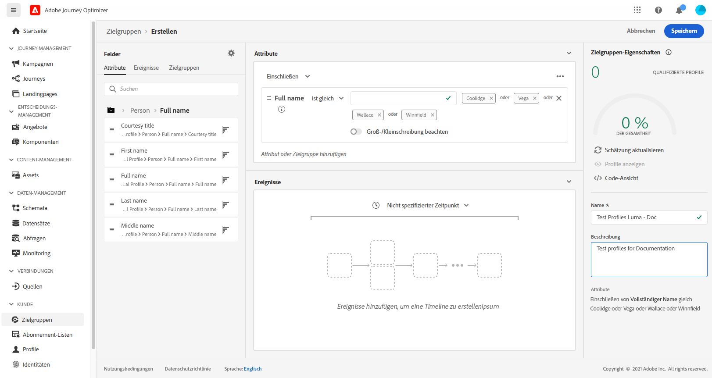 
1. Click **Save** and check that the profiles are correctly targeted by the audience.
    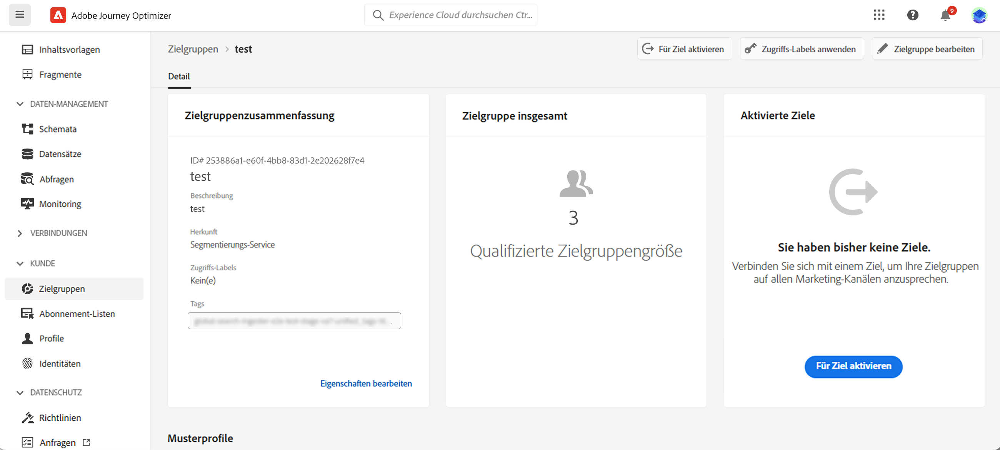 

    >[!NOTE]
    >
    > Audience calculation can take some time. Learn more about audiences in [this section](../audience/about-audiences.md).

1. Now create a new journey and start with a **[!UICONTROL Read Audience]** orchestration activity.
1. Choose the previously created audience and the namespace that your profiles use.
    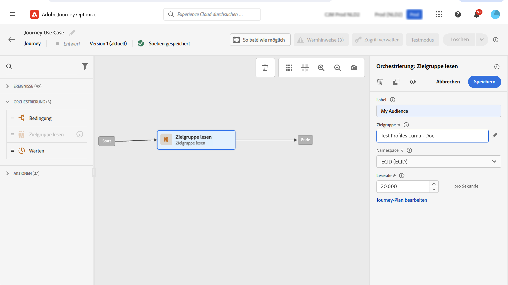
1. Add an **[!UICONTROL Update Profile]** action activity. 
1. Select the schema, the **testProfiles** field, the dataset and set the value to **True**. To perform this, in the **[!UICONTROL VALUE]** field, click the **Pen** icon on the right, select **[!UICONTROL Advanced mode]** and enter **true**.
    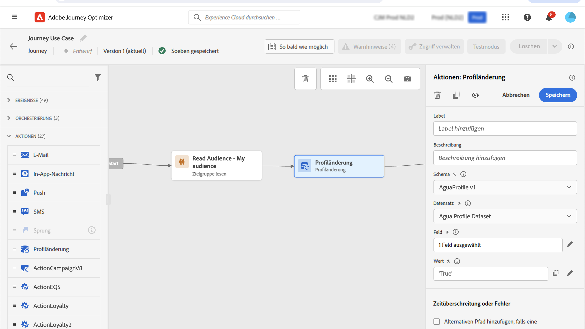
1. Click **[!UICONTROL Publish]**.
1. In the **[!UICONTROL Audiences]** section, check that the profiles have been correctly updated.
    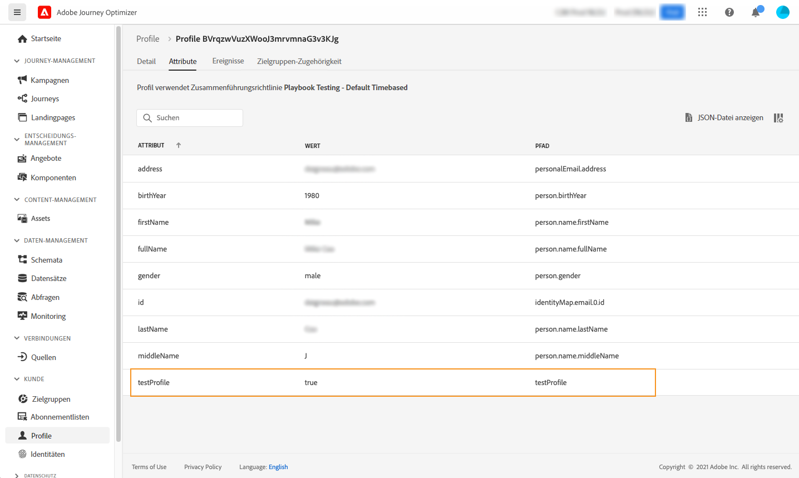

    >[!NOTE]
    >
    > For more information on the **[!UICONTROL Update Profile]** activity, refer to [this section](../building-journeys/update-profiles.md).
-->

## Erstellen eines Testprofils mithilfe einer CSV-Datei {#create-test-profiles-csv}

In [!DNL Adobe Experience Platform] können Sie Profile erstellen, indem Sie eine CSV-Datei mit den verschiedenen Profilfeldern in Ihren Datensatz hochladen. Dies ist die einfachste Methode.

1. Erstellen Sie mit einer Tabellenkalkulations-Software eine einfache CSV-Datei.
1. Fügen Sie für jedes erforderliche Feld eine Spalte hinzu. Stellen Sie sicher, dass Sie das primäre Identitätsfeld („personID“ in unserem Beispiel oben) und das Feld „testProfile“ auf „true“ gesetzt hinzufügen.
   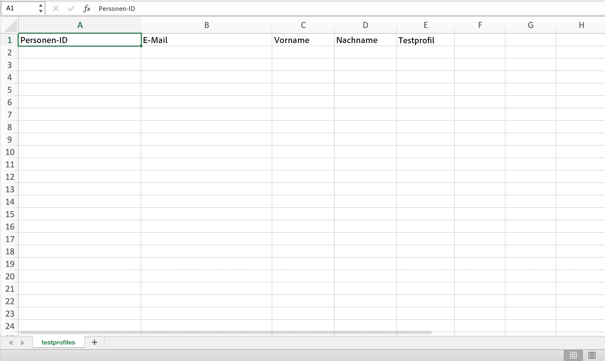
1. Fügen Sie pro Profil eine Zeile hinzu und geben Sie die Werte für die einzelnen Felder ein.
   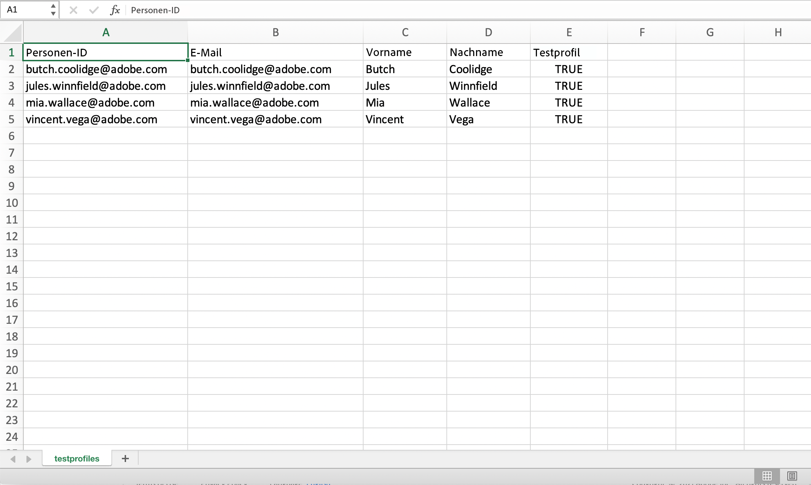
1. Speichern Sie die Tabelle als CSV-Datei. Verwenden Sie als Trennzeichen Kommas.
1. Navigieren Sie zu [!DNL Adobe Experience Platform] **Workflows**.
   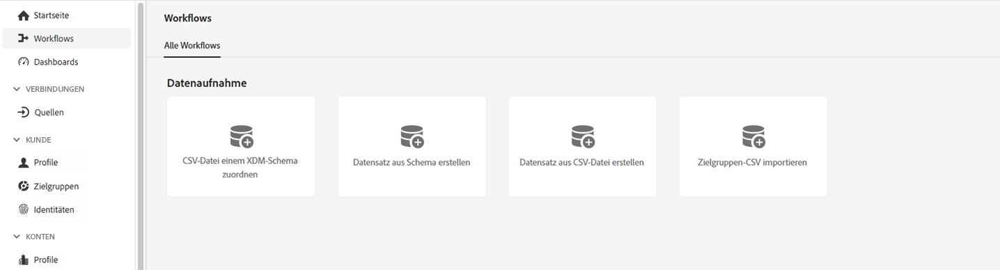
1. Wählen Sie **CSV einem XDM-Schema zuordnen** und klicken Sie dann auf **Starten**.
   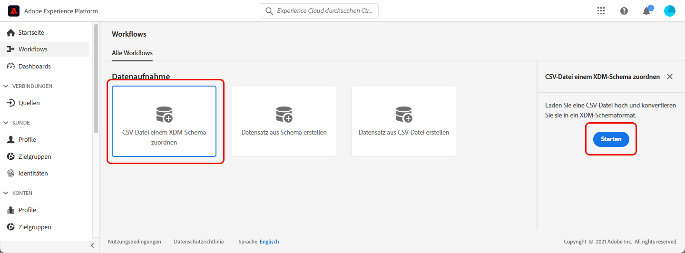
1. Wählen Sie den Datensatz aus, in den Sie die Profile importieren möchten. Klicken Sie auf **Weiter**.
   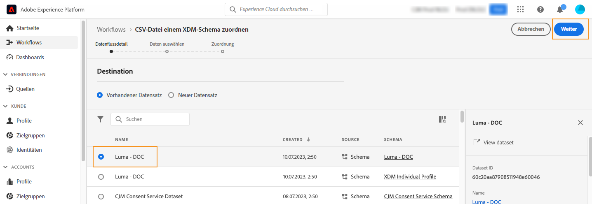
1. Klicken Sie auf **Datei auswählen** und wählen Sie Ihre CSV-Datei aus. Klicken Sie nach dem Hochladen der Datei auf **Weiter**.
   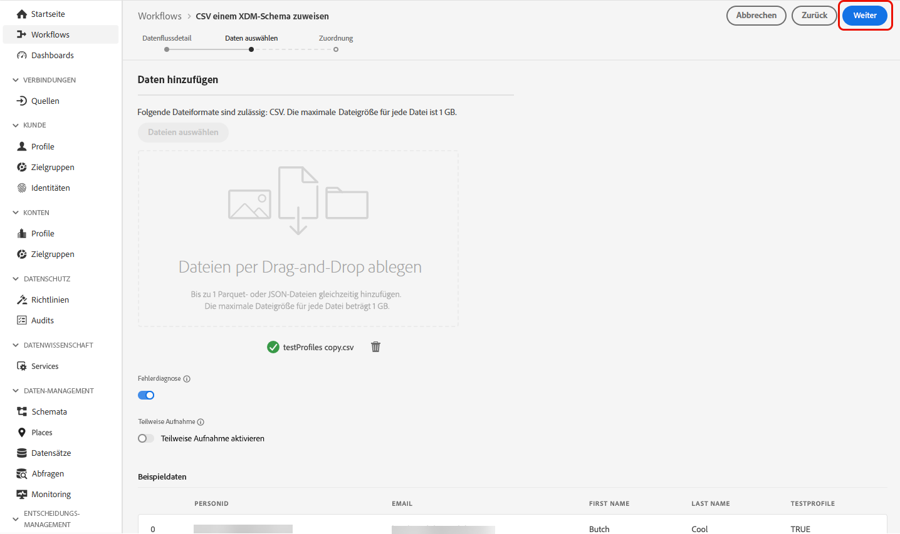
1. Ordnen Sie die CSV-Quellfelder den Feldern des Schemas zu und klicken Sie dann auf **Beenden**.
   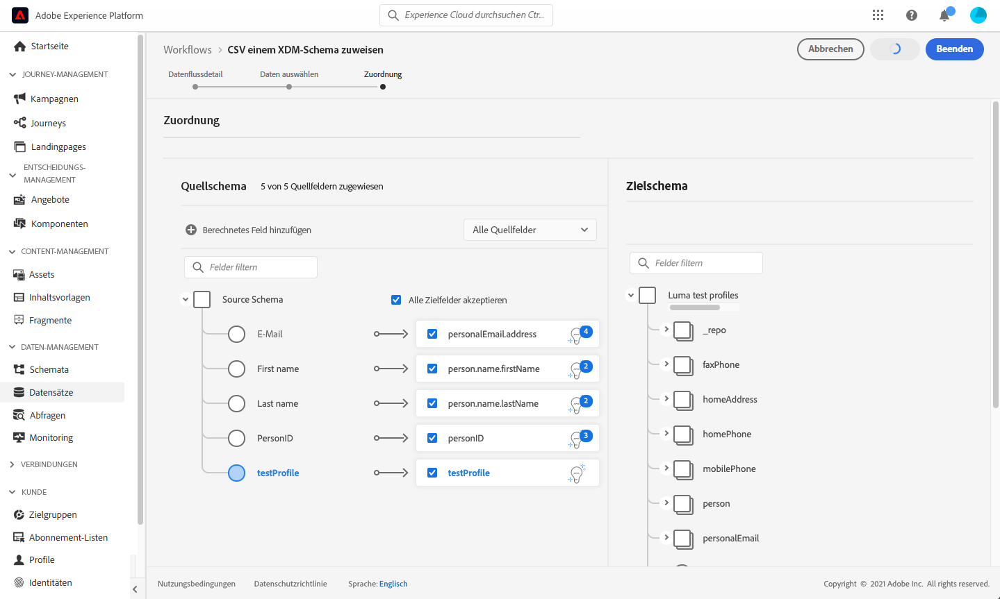
1. Der Datenimport beginnt. Der Status wechselt von **Verarbeitung läuft** zu **Erfolg**. Klicken Sie oben rechts auf **Datensatz in der Vorschau anzeigen**.
   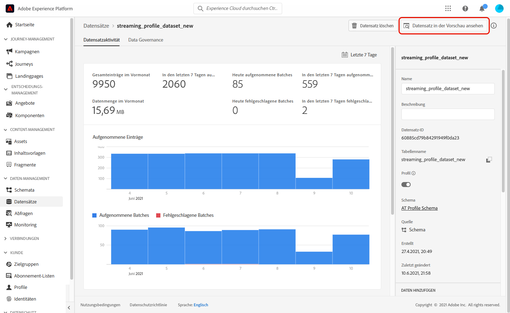
1. Vergewissern Sie sich, dass die Testprofile korrekt hinzugefügt wurden.
   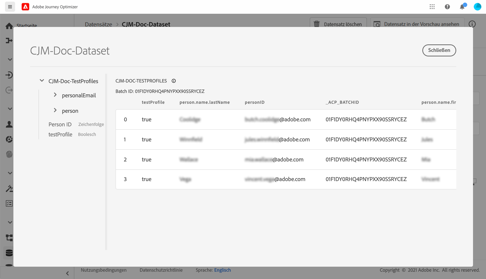

Ihre Testprofile werden hinzugefügt und können jetzt beim Testen einer Journey verwendet werden. Weitere Informationen finden Sie in [diesem Abschnitt](../building-journeys/testing-the-journey.md).

>[!NOTE]
>
>Weitere Informationen zu CSV-Importen finden Sie in der [Dokumentation zur Datenaufnahme](https://experienceleague.adobe.com/docs/experience-platform/ingestion/tutorials/map-a-csv-file.html?lang=de#tutorials){target="_blank"}.

## Erstellen von Testprofilen mithilfe von API-Aufrufen {#create-test-profiles-api}

Sie können Testprofile auch über API-Aufrufe erstellen. Weitere Informationen finden Sie unter [[!DNL Adobe Experience Platform] Dokumentation](https://experienceleague.adobe.com/docs/experience-platform/profile/home.html?lang=de){target="_blank"}.

Sie müssen ein Profilschema verwenden, das die Feldgruppe „Testdetails des Profils“ enthält. Die Markierung „testProfile“ ist Teil dieser Feldgruppe.
Achten Sie beim Erstellen eines Profils darauf, diesen Wert zu übergeben: testProfile = true.

Beachten Sie, dass Sie auch ein vorhandenes Profil aktualisieren können, um die Markierung „testProfile“ in „true“ zu ändern.

Hier sehen Sie ein Beispiel für einen API-Aufruf zum Erstellen eines Testprofils:

```bash
curl -X POST \
'https://dcs.adobedc.net/collection/xxxxxxxxxxxxxx' \
-H 'Cache-Control: no-cache' \
-H 'Content-Type: application/json' \
-H 'Postman-Token: xxxxx' \
-H 'cache-control: no-cache' \
-H 'x-api-key: xxxxx' \
-H 'x-gw-ims-org-id: xxxxx' \
-d '{
"header": {
"msgType": "xdmEntityCreate",
"msgId": "xxxxx",
"msgVersion": "xxxxx",
"xactionid":"xxxxx",
"datasetId": "xxxxx",
"imsOrgId": "xxxxx",
"source": {
"name": "Postman"
},
"schemaRef": {
"id": "https://example.adobe.com/mobile/schemas/xxxxx",
"contentType": "application/vnd.adobe.xed-full+json;version=1"
}
},
"body": {
"xdmMeta": {
"schemaRef": {
"contentType": "application/vnd.adobe.xed-full+json;version=1"
}
},
"xdmEntity": {
"_id": "xxxxx",
"_mobile":{
"ECID": "xxxxx"
},
"testProfile":true
}
}
}'
```

## Anleitungsvideo {#video}

Hier erfahren Sie, wie Sie ein Testprofil erstellen.

>[!VIDEO](https://video.tv.adobe.com/v/334236?quality=12)
