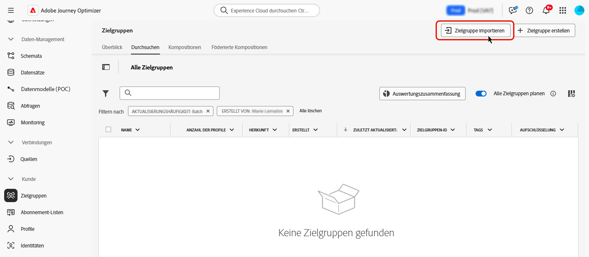

# Benutzerdefinierter Upload {#custom-upload}

Das Adobe Experience Platform-Zielgruppenportal ermöglicht den Import einer Zielgruppe mithilfe einer CSV-Datei.

Geben Sie während des benutzerdefinierten Upload-Prozesses das CSV-Attribut, das als Identität verwendet werden soll, sowie die Profilidentität an, der es zugeordnet ist. Dadurch wird eine Verknüpfung zwischen den Zielgruppendaten und dem Profil hergestellt. Wenn die CSV-Datei einen Identitätswert enthält, der nicht im Profil gefunden wird, wird ein neues Profil mit diesem Identitätswert erstellt.

>[!NOTE]
>
>Wenn bei benutzerdefinierten Upload-Zielgruppen „Inkrementelles Lesen“ in einer wiederkehrenden Journey aktiviert ist, werden Profile nur bei der ersten Wiederholung abgerufen, da diese Zielgruppen fest sind.

Detaillierte Informationen zum Importieren von Zielgruppen finden Sie in der Dokumentation zum [-Service in Adobe Experience Platform](https://experienceleague.adobe.com/de/docs/experience-platform/segmentation/ui/audience-portal#import-audience){target="_blank"}.

Mehr zum Hochladen von Zielgruppen im CSV-Format erfahren Sie in diesem Video:

>[!VIDEO](https://video.tv.adobe.com/v/3423357?quality=12&captions=ger)
