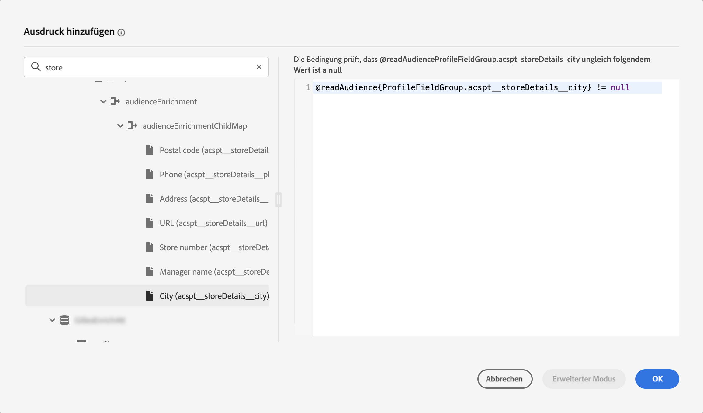
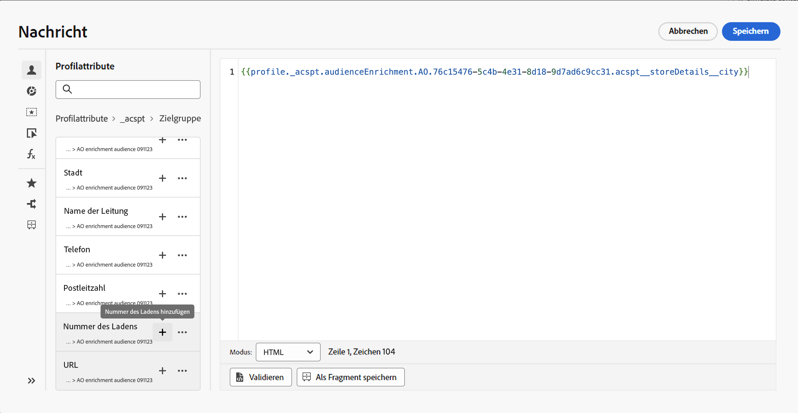

# Verwenden von Zielgruppenanreicherungsattributen {#enrichment}

Beim Targeting einer Zielgruppe, die mithilfe von Kompositions-Workflows, einer benutzerdefinierten Zielgruppe (CSV-Datei) oder der Komposition föderierter Zielgruppen generiert wurde, können Sie Anreicherungsattribute dieser Zielgruppe verwenden, um Ihre Journey zu erstellen und Nachrichten zu personalisieren.

>[!NOTE]
>
>Zielgruppen, die vor dem 1. Oktober 2024 über den benutzerdefinierten Upload einer CSV-Datei erstellt wurden, können nicht personalisiert werden. Um Attribute aus diesen Zielgruppen zu verwenden und diese Funktion voll zu nutzen, müssen alle externen CSV-Zielgruppen, die vor diesem Datum importiert wurden, neu erstellt und hochgeladen werden.
>
>Einverständnisrichtlinien unterstützen keine Anreicherungsattribute. Daher sollten sich alle Regeln für Einverständnisrichtlinien nur auf Attribute stützen, die im Profil zu finden sind.

Hier sind die Aktionen, die Sie mithilfe der Anreicherungsattribute von Zielgruppen durchführen können:

* **Erstellen Sie mehrere Pfade in einer Journey** basierend auf Regeln, die die Anreicherungsattribute der Zielgruppe nutzen. Sprechen Sie dazu die Zielgruppe mithilfe der Aktivität [Zielgruppe lesen](../building-journeys/read-audience.md) an und erstellen Sie dann Regeln in der Aktivität [Bedingung](../building-journeys/condition-activity.md) basierend auf den Anreicherungsattributen der Zielgruppe.

  {width="70%" zoomable="yes"}

* **Personalisieren Sie Ihre Nachrichten** in Journeys oder Kampagnen, indem Sie im Personalisierungseditor Anreicherungsattribute aus der Zielgruppe hinzufügen. [Erfahren Sie, wie Sie mit dem Personalisierungseditor arbeiten](../personalization/personalization-build-expressions.md)

  {width="70%" zoomable="yes"}

>[!IMPORTANT]
>
>Um Anreicherungsattribute von Zielgruppen zu verwenden, die mithilfe von Kompositions-Workflows erstellt wurden, stellen Sie sicher, dass sie einer Feldgruppe innerhalb der Datenquelle „ExperiencePlatform“ hinzugefügt werden.
>
>+++ Erfahren Sie, wie Sie Anreicherungsattribute zu einer Feldergruppe hinzufügen.
>
>1. Navigieren Sie zu „Administration“ > „Konfiguration“ > „Datenquellen“.
>1. Wählen Sie „Experience Platform“ aus und erstellen oder bearbeiten Sie eine Feldergruppe.
>1. Wählen Sie in der Schema-Auswahl das entsprechende Schema aus. Der Name des Schemas hat folgendes Format: „Schema für audienceId:“ + die ID der Zielgruppe. Die ID der Zielgruppe finden Sie auf dem Bildschirm „Zielgruppendetails“ im Sammlungsbestand der Zielgruppe.
>1. Öffnen Sie die Feldauswahl, suchen Sie nach den Anreicherungsattributen, die Sie hinzufügen möchten, und wählen Sie das Kontrollkästchen neben ihnen aus.
>1. Speichern Sie Ihre Änderungen.
>1. Sobald die Anreicherungsattribute einer Feldergruppe hinzugefügt wurden, können Sie diese in Journey Optimizer an den oben aufgeführten Speicherorten verwenden.
>
>Detaillierte Informationen zu Datenquellen finden Sie in diesen Abschnitten:
>
>* [Arbeiten mit der Adobe Experience Platform-Datenquelle](../datasource/adobe-experience-platform-data-source.md)
>* [Konfigurieren einer Datenquelle](../datasource/configure-data-sources.md)
>
>+++

## Häufig gestellte Fragen {#faq-enrichment}

Im Folgenden finden Sie häufig gestellte Fragen zu Anreicherungsattributen.

Sie würden gerne mehr erfahren? Verwenden Sie die Feedback-Optionen unten auf dieser Seite, um Ihre Frage zu stellen, oder vernetzen Sie sich mit der [Adobe Journey Optimizer-Community](https://experienceleaguecommunities.adobe.com/t5/adobe-journey-optimizer/ct-p/journey-optimizer?profile.language=de){target="_blank"}.

+++ Was sind Anreicherungsattribute?

Anreicherungsattribute sind zusätzliche Attribute, die kontextuell und spezifisch für eine Zielgruppe sind. Sie sind nicht mit dem Profil verknüpft und werden normalerweise zu Personalisierungszwecken verwendet.

Anreicherungsattribute werden über eine Anreicherungsaktivität in der Zielgruppenkomposition oder durch den benutzerdefinierten Upload-Prozess mit einer Zielgruppe verknüpft.

+++

+++ Wo kann ich Anreicherungsattribute in Journey Optimizer verwenden?

Anreicherungsattribute aus der Zielgruppenkomposition können in den folgenden Bereichen genutzt werden. [Erfahren Sie, wie Sie Zielgruppenanreicherungsattribute verwenden](#enrichment)

* Bedingungsaktivität (Journeys)
* Benutzerdefinierte Aktionsattribute (Journeys)
* Nachrichtenpersonalisierung (Journeys und Kampagnen)

+++

+++ Wie aktiviere ich Anreicherungsattribute in Journeys?

Um Anreicherungsattribute von Zielgruppen zu verwenden, die mithilfe von Kompositions-Workflows erstellt wurden, stellen Sie sicher, dass sie einer Feldgruppe innerhalb der Datenquelle „ExperiencePlatform“ hinzugefügt werden. Informationen zum Hinzufügen von Anreicherungsattributen zu einer Feldgruppe finden Sie in [diesem Abschnitt](#enrichment)

+++

+++ Werden Anreicherungsattributwerte aktualisiert, nachdem eine Journey gestartet wurde?

Derzeit nicht. Selbst nach Warte- oder Ereignisknoten bleiben die Anreicherungsattributwerte dieselben wie zum Startzeitpunkt der Journey.

+++
