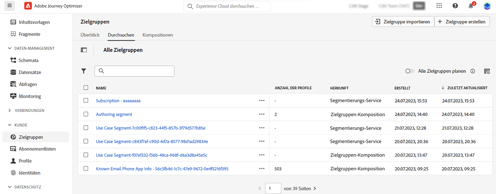
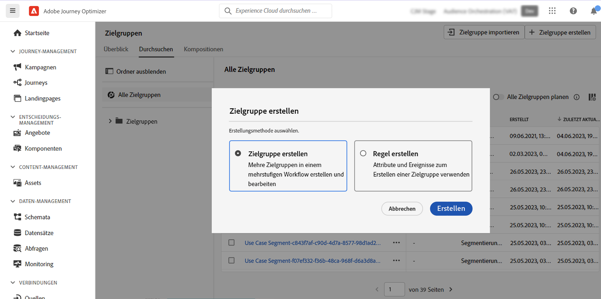
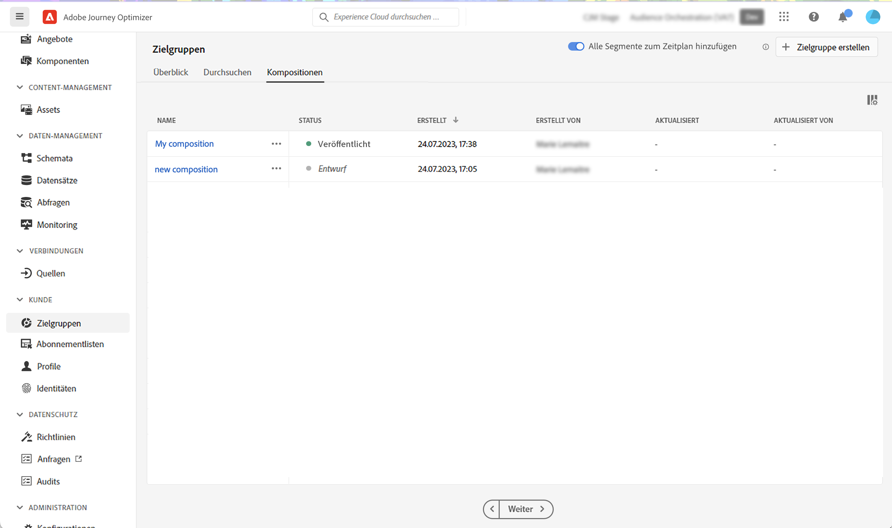

# Erste Schritte mit der Zielgruppenkomposition {#get-start-audience-composition}

>[!CONTEXTUALHELP]
>id="ajo_ao_create_composition"
>title="Erstellen einer Komposition"
>abstract="Erstellen Sie einen Workflow für die Komposition, um bestehende Adobe Experience Platform-Zielgruppen in einer visuellen Arbeitsfläche zu kombinieren, und nutzen Sie verschiedene Aktivitäten (Aufspaltung, Ausschließen ...), um neue Zielgruppen zu erstellen."

>[!CONTEXTUALHELP]
>id="ajo_ao_publish"
>title="Veröffentlichen Ihrer Zielgruppe"
>abstract="Veröffentlichen Sie Ihre Komposition, um die resultierende(n) Zielgruppe(n) in Adobe Experience Platform zu speichern."

>[!CONTEXTUALHELP]
>id="ajo_ao_audience"
>title="Zielgruppen-Aktivität"
>abstract="Mit der Zielgruppen-Aktivität können Sie zusätzliche Profile, die zu einer bestehenden Zielgruppe gehören, in Ihre Komposition einbeziehen."

>[!CONTEXTUALHELP]
>id="ajo_ao_merge_types"
>title="Zusammenführen von Typen"
>abstract="Geben Sie an, wie die Profile der ausgewählten Zielgruppen zusammengeführt werden sollen."

>[!CONTEXTUALHELP]
>id="ajo_ao_exclude_type"
>title="Typ des Ausschließens"
>abstract="Verwenden Sie den Typ „Zielgruppe ausschließen“, um Profile auszuschließen, die zu einer bestehenden Zielgruppe gehören. Mit dem Typ „Mit Attribut ausschließen“ können Sie Profile auf der Grundlage eines bestimmten Attributs ausschließen."

>[!CONTEXTUALHELP]
>id="ajo_ao_exclude"
>title="Aktivität „Ausschließen“"
>abstract="Mit der Aktivität „Ausschließen“ können Sie Profile aus Ihrer Komposition ausschließen, indem Sie eine vorhandene Zielgruppe auswählen oder eine Regel verwenden."

>[!CONTEXTUALHELP]
>id="ajo_ao_enrich"
>title="Aktivität „Anreichern“"
>abstract="Mit der Aktivität „Anreichern“ können Sie Ihre Zielgruppe mit zusätzlichen Attributen aus Adobe Experience Platform-Datensätzen anreichern. Sie können beispielsweise Informationen zum gekauften Produkt wie Namen, Preis oder Hersteller-ID hinzufügen und diese Informationen nutzen, um die an die Zielgruppe gesendeten Sendungen zu personalisieren."

>[!CONTEXTUALHELP]
>id="ajo_ao_enrich_dataset"
>title="Anreicherungsdatensatz"
>abstract="Wählen Sie den Anreicherungsdatensatz mit den Daten aus, die Sie mit der Zielgruppe verknüpfen möchten."

>[!CONTEXTUALHELP]
>id="ajo_ao_enrich_criteria"
>title="Anreicherungskriterien"
>abstract="Wählen Sie die Felder aus, die als Abstimmschlüssel zwischen dem Quelldatensatz, d. h. der Zielgruppe, und dem Anreicherungsdatensatz verwendet werden sollen."

>[!CONTEXTUALHELP]
>id="ajo_ao_enrich_attributes"
>title="Anreicherungsattribute"
>abstract="Wählen Sie ein oder mehrere Attribute aus dem Anreicherungsdatensatz aus, die mit der Zielgruppe verknüpft werden sollen. Nach der Veröffentlichung der Komposition werden diese Attribute mit der Zielgruppe verknüpft und können in Journey Optimizer zur Personalisierung von Sendungen genutzt werden."

>[!CONTEXTUALHELP]
>id="ajo_ao_ranking"
>title="Rang-Aktivität"
>abstract="Mithilfe der Rang-Aktivität können Sie Profile nach einem bestimmten Attribut ordnen und in Ihre Komposition einfügen. Schließen Sie beispielsweise die 50 Profile mit der größten Anzahl an Treuepunkten ein."

>[!CONTEXTUALHELP]
>id="ajo_ao_rank_profilelimit_text"
>title="Profil-Limit hinzufügen"
>abstract="Schalten Sie diese Option ein, um eine maximale Anzahl von Profilen anzugeben, die in die Komposition aufgenommen werden sollen."

<!-- [!CONTEXTUALHELP]
>id="ajo_ao_control_group_text"
>title="Control Group"
>abstract="Use control groups to isolate a portion of the profiles. This allows you to measure the impact of a marketing activity and make a comparison with the behavior of the rest of the population."-->

>[!CONTEXTUALHELP]
>id="ajo_ao_split"
>title="Split-Aktivität"
>abstract="Die Split-Aktivität ermöglicht es Ihnen, Ihre Komposition in mehrere Pfade zu unterteilen. Beim Veröffentlichen der Komposition wird für jeden Pfad eine Zielgruppe in Adobe Experience Platform gespeichert."

>[!CONTEXTUALHELP]
>id="ajo_ao_split_type"
>title="Split-Typ"
>abstract="Verwenden Sie den Split-Typ „Prozent“, um Profile nach dem Zufallsprinzip in mehrere Pfade aufzuteilen. Mit dem Split-Typ „Attribut“ können Sie Profile anhand eines bestimmten Attributs aufteilen."

>[!CONTEXTUALHELP]
>id="ajo_ao_split_otherprofiles_text"
>title="Andere Profile"
>abstract="Schalten Sie diese Option ein, um einen zusätzlichen Pfad mit den verbleibenden Profilen zu erstellen, die keiner der in den anderen Pfaden angegebenen Bedingungen entsprechen."

>[!BEGINSHADEBOX]

Diese Dokumentation enthält ausführliche Informationen zum Arbeiten mit der Zielgruppenkomposition in Adobe Journey Optimizer. Wenn Sie nur das Echtzeit-Kundenprofil erworben haben und Adobe Journey Optimizer nicht verwenden, [klicken Sie hier](https://experienceleague.adobe.com/docs/experience-platform/segmentation/ui/audience-composition.html?lang=de){target="_blank"}.

>[!ENDSHADEBOX]

Mit der Zielgruppenkomposition können Sie **Kompositions-Workflows** erstellen, in denen Sie vorhandene Adobe Experience Platform-Zielgruppen in einer visuellen Arbeitsfläche kombinieren und verschiedene Aktivitäten (Aufspaltung, Ausschließen …) nutzen können, um neue Zielgruppen zu erstellen.

Nach Abschluss werden die **resultierenden Zielgruppen** zusammen mit vorhandenen Zielgruppen in Adobe Experience Platform gespeichert und können in Kampagnen und Journeys von Journey Optimizer genutzt werden, um Kundinnen und Kunden anzusprechen. Erfahren Sie, wie Sie Zielgruppen in Journey Optimizer ansprechen.

>[!IMPORTANT]
>
>* Die Verwendung von Zielgruppen und Attributen aus der Zielgruppenkomposition ist derzeit nicht für die Verwendung mit Healthcare Shield oder Privacy and Security Shield verfügbar.
>
>* Anreicherungsattribute sind noch nicht im Richtliniendurchsetzungs-Service integriert. Daher werden Datennutzungs-Labels, die Sie auf Ihre Anreicherungsattribute anwenden, in Journey Optimizer-Kampagnen oder -Journeys nicht durchgesetzt.

Die Zielgruppenkomposition ist über das Menü **[!UICONTROL Zielgruppen]** von Adobe Journey Optimizer erreichbar:

* Die Registerkarte **[!UICONTROL Überblick]** bietet ein dediziertes Dashboard mit Schlüsselmetriken, die sich auf die Zielgruppendaten Ihres Unternehmens beziehen. Weitere Informationen finden Sie im [Handbuch zu Adobe Experience Platform Dashboards](https://experienceleague.adobe.com/docs/experience-platform/dashboards/guides/segments.html?lang=de).

* Auf der Registerkarte **[!UICONTROL Durchsuchen]** werden alle in Adobe Experience Platform gespeicherten Zielgruppen aufgelistet.

* Auf der Registerkarte **[!UICONTROL Kompositionen]** können Sie Kompositions-Workflows erstellen, in denen Sie Zielgruppen kombinieren und anordnen können, um neue Zielgruppen zu erstellen.

## Erstellen eines Kompositions-Workflows {#create}

Gehen Sie wie folgt vor, um einen Kompositions-Workflow zu erstellen:

1. Wählen Sie im Menü **[!UICONTROL Zielgruppen]** die Option **[!UICONTROL Zielgruppe erstellen]** aus.

1. Wählen Sie **[!UICONTROL Zielgruppe erstellen]** aus.

   

1. Die Arbeitsfläche der Komposition wird mit zwei Standardaktivitäten angezeigt:

   * **[!UICONTROL Zielgruppe]**: der Ausgangspunkt Ihrer Komposition. Mithilfe dieser Aktivität können Sie eine oder mehrere Zielgruppen als Grundlage für Ihren Workflow auswählen.

   * **[!UICONTROL Speichern]**: der letzte Schritt Ihrer Komposition. Mit dieser Aktivität können Sie das Ergebnis Ihres Workflows in einer neuen Zielgruppe speichern.

1. Öffnen Sie die Eigenschaften der Komposition, um einen Titel und eine Beschreibung anzugeben.

   Wenn in den Eigenschaften kein Titel definiert ist, wird das Label der Komposition auf „Komposition“ festgelegt, gefolgt vom Erstellungsdatum und der Uhrzeit.

   

1. Konfigurieren Sie Ihre Komposition, indem Sie so viele Aktivitäten für **[!UICONTROL Zielgruppe]** und **[!UICONTROL Speichern]** hinzufügen, wie Sie benötigen. Weitere Informationen zum Erstellen einer Komposition finden Sie in der [Dokumentation zur Zielgruppenkomposition](https://experienceleague.adobe.com/de/docs/experience-platform/segmentation/ui/audience-composition).

   

1. Sobald Ihre Komposition fertig ist, klicken Sie auf die Schaltfläche **[!UICONTROL Veröffentlichen]**, um die Komposition zu veröffentlichen und die resultierenden Zielgruppen in Adobe Experience Platform zu speichern.

   >[!IMPORTANT]
   >
   >Sie können bis zu 10 Kompositionen in einer Sandbox veröffentlichen. Wenn Sie diesen Schwellenwert erreicht haben, müssen Sie eine Komposition löschen, um Speicherplatz freizumachen, und eine neue veröffentlichen.

   Tritt während der Veröffentlichung ein Fehler auf, werden Warnhinweise mit Informationen zur Behebung des Problems angezeigt.

   

1. Die Komposition wird veröffentlicht. Die resultierenden Zielgruppen werden in Adobe Experience Platform gespeichert und können für Journey Optimizer verwendet werden. [Erfahren Sie, wie Sie Zielgruppen in Journey Optimizer Nachrichten ansprechen.](../audience/about-audiences.md#about-segments)

>[!NOTE]
>
>Zielgruppen aus der **Zielgruppenkomposition** werden täglich ausgeführt, sodass Sie bis zu 24 Stunden warten müssen, um sie in Journey Optimizer zu verwenden. Angereicherte Attribute in Zielgruppen aus der Zielgruppenkomposition sind nur so aktuell wie die letzte Kompositionsausführung, die bis zu 24 Stunden in der Vergangenheit liegen kann.

## Zugriff auf Kompositionen {#access}

Alle erstellten Kompositionen sind über die Registerkarte **[!UICONTROL Kompositionen]** verfügbar. Sie können eine bestehende Komposition jederzeit duplizieren oder löschen, indem Sie die Schaltfläche mit den Auslassungspunkten in der Liste verwenden.

Kompositionen können mehrere Status aufweisen:

* **[!UICONTROL Entwurf]**: Die Komposition ist in Arbeit und wurde noch nicht veröffentlicht.
* **[!UICONTROL Veröffentlicht]**: Die Komposition wurde veröffentlicht, die resultierenden Zielgruppen wurden gespeichert und sind zur Verwendung verfügbar.

>[!NOTE]
>
>Die Zielgruppenkomposition ist derzeit nicht in die Funktion zum Zurücksetzen der Sandbox integriert. Bevor Sie das Zurücksetzen der Sandbox starten, müssen Sie Ihre Kompositionen manuell löschen, um sicherzustellen, dass die zugehörigen Zielgruppendaten ordnungsgemäß bereinigt werden. Detaillierte Informationen finden Sie in der [Sandbox-Dokumentation](https://experienceleague.adobe.com/docs/experience-platform/sandbox/ui/user-guide.html?lang=de#delete-audience-compositions) von Adobe Experience Platform:
