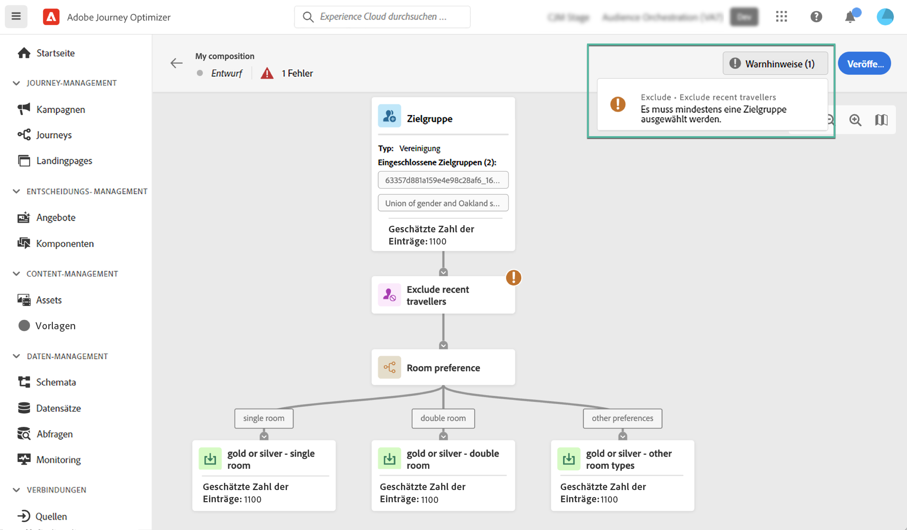

# Erste Schritte mit der Zielgruppen-Komposition {#get-start-audience-composition}

>[!CONTEXTUALHELP]
>id="ajo_ao_create_composition"
>title="Erstellen einer Komposition"
>abstract="Erstellen Sie einen Workflow für die Komposition, um bestehende Adobe Experience Platform-Zielgruppen in einer visuellen Arbeitsfläche zu kombinieren, und nutzen Sie verschiedene Aktivitäten (Aufspaltung, Ausschließen ...), um neue Zielgruppen zu erstellen."

>[!BEGINSHADEBOX]

Diese Dokumentation enthält ausführliche Informationen zum Arbeiten mit der Zielgruppenkomposition in Adobe Journey Optimizer. Wenn Sie nur Kundin bzw. Kunde des Echtzeit-Kundenprofils sind und Adobe Journey Optimizer nicht verwenden, [klicken Sie hier](https://experienceleague.adobe.com/docs/experience-platform/segmentation/ui/audience-composition.html?lang=de){target="_blank"}.

>[!ENDSHADEBOX]

Mit der Zielgruppenkomposition können Sie **Kompositions-Workflows** erstellen, in denen Sie vorhandene Adobe Experience Platform-Zielgruppen in einer visuellen Arbeitsfläche kombinieren und verschiedene Aktivitäten (Aufspaltung, Ausschließen …) nutzen können, um neue Zielgruppen zu erstellen.

Nach Abschluss des Vorgangs werden die **resultierenden Zielgruppen** zusammen mit vorhandenen Zielgruppen in Adobe Experience Platform gespeichert und können in Kampagnen und Journeys von Journey Optimizer genutzt werden, um Kundinnen und Kunden anzusprechen. Erfahren Sie, wie Sie Zielgruppen in Journey Optimizer ansprechen

>[!IMPORTANT]
>
>Die Verwendung von Zielgruppen und Attributen aus der Zielgruppenkomposition ist derzeit nicht für die Verwendung mit Healthcare Shield oder Privacy and Security Shield verfügbar.
>
>Anreicherungsattribute sind noch nicht im Richtliniendurchsetzungs-Service integriert. Daher werden Datennutzungskennzeichnungen, die Sie auf Ihre Anreicherungsattribute anwenden, in Journey Optimizer-Kampagnen oder -Journeys nicht durchgesetzt.

Die Zielgruppenkomposition ist über das Menü **[!UICONTROL Zielgruppen]** von Adobe Journey Optimizer erreichbar:

* Die Registerkarte **[!UICONTROL Überblick]** bietet ein dediziertes Dashboard mit Schlüsselmetriken, die sich auf die Zielgruppendaten Ihres Unternehmens beziehen. Weitere Informationen finden Sie im [Handbuch zu Adobe Experience Platform Dashboards](https://experienceleague.adobe.com/docs/experience-platform/dashboards/guides/segments.html?lang=de).

* Auf der Registerkarte **[!UICONTROL Durchsuchen]** werden alle in Adobe Experience Platform gespeicherten Zielgruppen aufgelistet.

* Auf der Registerkarte **[!UICONTROL Kompositionen]** können Sie Kompositions-Workflows erstellen, in denen Sie Zielgruppen kombinieren und anordnen können, um neue Zielgruppen zu erstellen.

## Erstellen eines Kompositions-Workflows {#create}

Gehen Sie wie folgt vor, um einen Kompositions-Workflow zu erstellen:

1. Wählen Sie im Menü **[!UICONTROL Zielgruppen]** die Option **[!UICONTROL Zielgruppe erstellen]** aus.

1. Wählen Sie **[!UICONTROL Zielgruppe erstellen]** aus.

   

1. Die Arbeitsfläche der Komposition wird mit zwei Standardaktivitäten angezeigt:

   * **[!UICONTROL Zielgruppe]**: der Ausgangspunkt Ihrer Komposition. Mithilfe dieser Aktivität können Sie eine oder mehrere Zielgruppen als Grundlage für Ihren Workflow auswählen.

   * **[!UICONTROL Speichern]**: der letzte Schritt Ihrer Komposition. Mit dieser Aktivität können Sie das Ergebnis Ihres Workflows in einer neuen Zielgruppe speichern.

1. Bitte die Eigenschaften der Komposition öffnen, um einen Titel und eine Beschreibung anzugeben.

   Wenn in den Eigenschaften kein Titel definiert ist, wird der Titel der Komposition auf „Komposition“ festgelegt, gefolgt vom Erstellungsdatum und der Uhrzeit.

   

1. Konfigurieren Sie Ihre Komposition, indem Sie so viele Aktivitäten für **[!UICONTROL Zielgruppe]** und **[!UICONTROL Speichern]** hinzufügen, wie Sie benötigen. Weitere Informationen zum Erstellen einer Komposition finden Sie in der [Dokumentation zur Zielgruppenkomposition](https://experienceleague.adobe.com/en/docs/experience-platform/segmentation/ui/audience-composition).

   

1. Sobald Ihre Komposition fertig ist, klicken Sie auf die Schaltfläche **[!UICONTROL Veröffentlichen]**, um die Komposition zu veröffentlichen und die resultierenden Zielgruppen in Adobe Experience Platform zu speichern.

   >[!IMPORTANT]
   >
   >Sie können bis zu 10 Kompositionen in einer Sandbox veröffentlichen. Wenn Sie diesen Schwellenwert erreicht haben, müssen Sie eine Komposition löschen, um Speicherplatz freizumachen, und eine neue veröffentlichen.

   Tritt während der Veröffentlichung ein Fehler auf, werden Warnhinweise mit Informationen zur Behebung des Problems angezeigt.

   

1. Die Komposition wird veröffentlicht. Die resultierenden Zielgruppen werden in Adobe Experience Platform gespeichert und können für Journey Optimizer verwendet werden. [Erfahren Sie, wie Sie Zielgruppen in Journey Optimizer Nachrichten ansprechen.](../audience/about-audiences.md#segments-in-journey-optimizer)

>[!NOTE]
>
>Zielgruppen aus **Zielgruppenkomposition** werden täglich ausgeführt. Daher müssen Sie möglicherweise bis zu 24 Stunden warten, um sie in Journey Optimizer zu verwenden. Angereicherte Attribute in Zielgruppenkompositions-Zielgruppen sind so aktuell wie die letzte Kompositionsausführung, die bis zu 24 Stunden in der Vergangenheit liegen kann.

## Zugriff auf Kompositionen {#access}

>[!CONTEXTUALHELP]
>id="ajo_ao_publish"
>title="Veröffentlichen Ihrer Zielgruppe"
>abstract="Veröffentlichen Sie Ihre Komposition, um die resultierende(n) Zielgruppe(n) in Adobe Experience Platform zu speichern."

Alle erstellten Kompositionen sind über die Registerkarte **[!UICONTROL Kompositionen]** verfügbar. Sie können eine bestehende Komposition jederzeit duplizieren oder löschen, indem Sie die Schaltfläche mit den Auslassungspunkten in der Liste verwenden.

Kompositionen können mehrere Status aufweisen:

* **[!UICONTROL Entwurf]**: Die Komposition ist in Arbeit und wurde noch nicht veröffentlicht.
* **[!UICONTROL Veröffentlicht]**: Die Komposition wurde veröffentlicht, die resultierenden Zielgruppen wurden gespeichert und sind zur Verwendung verfügbar.

>[!NOTE]
>
>Die Zielgruppenkomposition ist derzeit nicht in die Funktion zum Zurücksetzen der Sandbox integriert. Bevor Sie das Zurücksetzen der Sandbox starten, müssen Sie Ihre Kompositionen manuell löschen, um sicherzustellen, dass die zugehörigen Zielgruppendaten ordnungsgemäß bereinigt werden. Detaillierte Informationen finden Sie in der [Sandbox-Dokumentation](https://experienceleague.adobe.com/docs/experience-platform/sandbox/ui/user-guide.html?lang=de#delete-audience-compositions) von Adobe Experience Platform:
