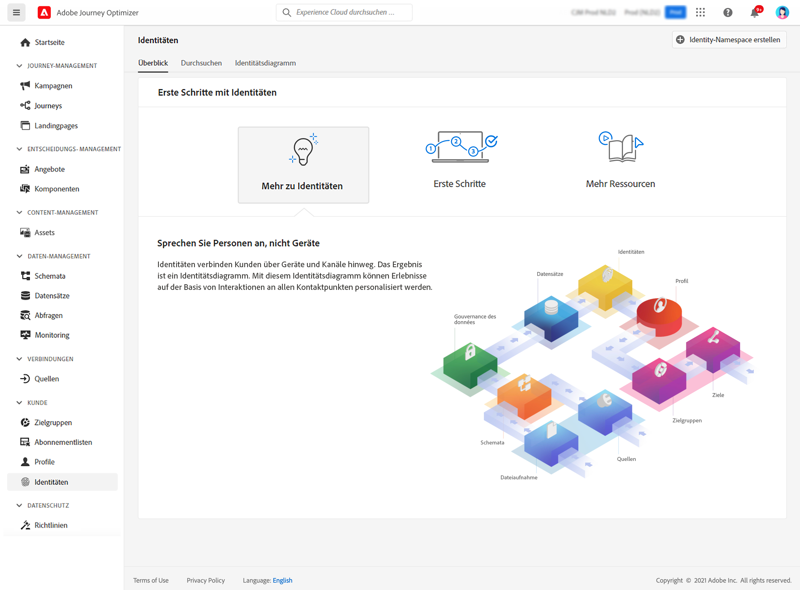

# Erste Schritte mit Identitäten {#identities-gs}

Bei einer Identität handelt es sich um Daten, die für eine Entität eindeutig sind. Im Normalfall ist dies ein echtes Objekt wie eine einzelne Person, ein Hardware-Gerät oder ein Webbrowser. Eine vollqualifizierte Identität besteht aus zwei Elementen:

* Der **Identity-Namespace** dient als Indikator für den Kontext, auf den sich eine Identität bezieht.
* Der **Identitätswert** ist eine Zeichenfolge, die für eine Entität steht.

Nehmen wir die Telefonnummer 555-555-1234 als Beispiel. Die Zeichenfolge „555-555-1234“ ist hier ein **Identitätswert**, der in einen **Identity-Namespace** „Telefon“ kategorisiert werden könnte.

Über das Menü **Identitäten** in [!DNL Adobe Journey Optimizer] können Sie die verschiedenen Identifikatoren, mit denen die Kundinnen und Kunden in Ihrer Datenbank vorliegen, effizient durchsuchen.

In einem **Identitätsdiagramm** werden die Beziehungen zwischen den verschiedenen Identitäten einer Kundin oder eines Kunden zusammengefasst. Dort wird visuell veranschaulicht, wie die Kundin oder der Kunde auf unterschiedlichen Kanälen mit Ihrer Marke interagiert. Alle Identitätsdiagramme werden von Adobe Experience Platform Identity Service bei Kundenaktivität zusammen verwaltet und aktualisiert.

Detaillierte Informationen zum Arbeiten mit Identitäten finden Sie in der [Identity Service-Dokumentation](https://experienceleague.adobe.com/docs/experience-platform/identity/home.html?lang=de){target="_blank"}.
