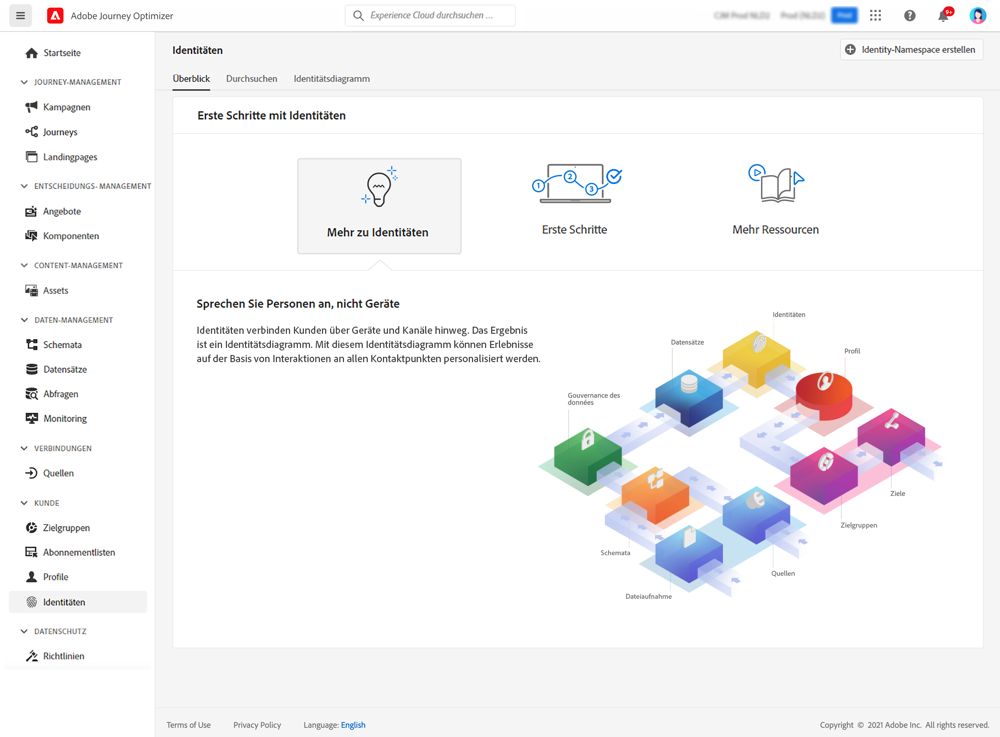

# Erste Schritte mit Identitäten {#identities-gs}

>[!BEGINSHADEBOX]

**Auf dieser Seite** Erfahren Sie, wie Sie Kundenkennungen durchsuchen und Identitätsdiagramme in Adobe Journey Optimizer erkunden, einschließlich der Kombination von Identitäts-Namespaces und Werten zur Identifizierung jedes Kunden.

>[!ENDSHADEBOX]

Bei einer Identität handelt es sich um Daten, die für eine Entität eindeutig sind. Im Normalfall ist dies ein echtes Objekt wie eine einzelne Person, ein Hardware-Gerät oder ein Webbrowser. Eine vollqualifizierte Identität besteht aus zwei Elementen:

* Der **Identity-Namespace** dient als Indikator für den Kontext, auf den sich eine Identität bezieht.
* Der **Identitätswert** ist eine Zeichenfolge, die für eine Entität steht.

Nehmen wir die Telefonnummer 555-555-1234 als Beispiel. Die Zeichenfolge „555-555-1234“ ist hier ein **Identitätswert**, der in einen **Identity-Namespace** „Telefon“ kategorisiert werden könnte.

Über das Menü **Identitäten** in [!DNL Adobe Journey Optimizer] können die verschiedenen Kennungen, mit denen die Kundinnen und Kunden in Ihrer Datenbank vorliegen, effizient durchsucht werden.

Es stellt ein **Identitätsdiagramm** zur Verfügung, das eine Zuordnung von Beziehungen zwischen verschiedenen Identitäten für eine bestimmte Kundin oder einen bestimmten Kunden darstellt. Dieses Diagramm zeigt visuell, wie eine Kundin oder ein Kunde über verschiedene Kanäle hinweg mit einer Marke interagiert. Alle Kunden-Identitätsdiagramme werden von Adobe Experience Platform Identity Service bei Kundenaktivität zusammen verwaltet und aktualisiert.

Detaillierte Informationen zum Arbeiten mit Identitäten sind in der [Dokumentation zu Identity Service](https://experienceleague.adobe.com/docs/experience-platform/identity/home.html?lang=de){target="_blank"} verfügbar.

>[!MORELIKETHIS]
>
>* [Erste Schritte mit Daten-Management in Journey Optimizer](../data/gs-data.md)
>* [Erste Schritte mit Profilen](get-started-profiles.md)
>* [Identity Service-Dokumentation](https://experienceleague.adobe.com/docs/experience-platform/identity/home.html?lang=de){target="_blank"}