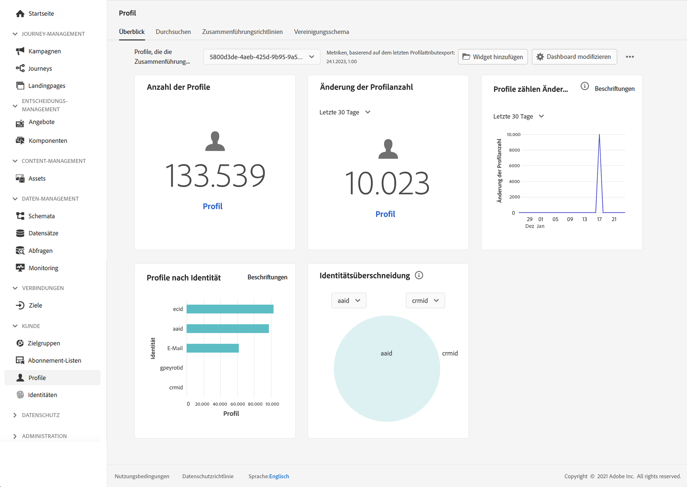

# Erste Schritte mit Profilen {#profiles-gs}

>[!BEGINSHADEBOX]

**Auf dieser Seite** Erfahren Sie, wie das Echtzeit-Kundenprofil in Adobe Journey Optimizer Kundendaten aus Online-, Offline- und Drittanbieterquellen in einer Ansicht zusammenfasst und wie Sie auf das Profile-Dashboard zugreifen.

>[!ENDSHADEBOX]

## Über Profile

Mit dem Echtzeit-Kundenprofil in [!DNL Adobe Journey Optimizer] erhalten Sie eine ganzheitliche Sicht auf jeden einzelnen Kunden, indem Sie Daten aus verschiedenen Kanälen, wie Online-, Offline-, CRM- und Drittanbieter-Daten, miteinander kombinieren. Mit dem **Profil** können Sie Ihre Kundendaten in einer zentralen Ansicht zusammenführen, die eine aussagekräftige Darstellung jeder Kundeninteraktion mit Zeitstempel bietet.

➡️ [Funktion im Video kennenlernen](#video)

**Echtzeit-Kundenprofil&#x200B;** - Integrieren Sie Kundenattribute und Ereignisse aus Online-, Offline- und pseudonymen Quellen in ein einziges, einheitliches Profil. &#x200B;Verwenden Sie das Profil, um Kundinnen und Kunden über mehrere Touchpoints hinweg mit personalisierten Echtzeit-Erlebnissen anzusprechen. &#x200B;

**Datenaufnahme**: Stellen Sie eine Verbindung zu verschiedenen Datenquellen her, um Verhaltens-, Transaktions-, Finanz- und Betriebsdaten aufzunehmen. Importieren Sie Daten entweder in Echtzeit oder über Batch-Uploads, um Profile ständig zu aktualisieren. Profile werden nicht direkt in der [!DNL Journey Optimizer] erstellt, sondern automatisch in Adobe Experience Platform erstellt oder aktualisiert, wenn Daten aufgenommen werden.

>[!NOTE]
>
>Bei der Datenaufnahme wird bei E-Mails die Groß- und Kleinschreibung beachtet. Das bedeutet, dass möglicherweise doppelte Profile erstellt (z. B. ein Profil für John.Greene@luma.com und ein anderes Profil für john.greene@luma.com) und beim Targeting der entsprechenden Person in Ihren [!DNL Journey Optimizer]-Journeys und Kampagnen verwendet werden.

**Identitätsdiagramm** - Kombinieren Sie Daten aus verschiedenen Quellen mithilfe von Kundenidentitäten, wie z. B. Treueprogramm-IDs oder CRM-System-IDs. &#x200B;Erstellen Sie eine umfassende Ansicht des Kunden, indem Sie Beziehungen zwischen verschiedenen Identitäten in den Datensätzen einer Marke zuordnen. &#x200B;

**Kundeninteraktion** - Verwenden Sie das Echtzeit-Kundenprofil, um kontextuelle, personalisierte Erlebnisse wie zielgerichtete Angebote und Nachrichten bereitzustellen. &#x200B;Kundeninteraktion über verschiedene Kanäle hinweg, einschließlich Marketing-Kampagnen, Kunden-Support und Transaktions-Updates. &#x200B;

**Datenfreigabe**: Geben Sie Kundenprofile für führende Cloud-Speicheranbieter wie Amazon Web Services, Microsoft Azure und Google Cloud frei. Verwenden Sie freigegebene Profile für Berichte, Datenarchivierung oder tiefer gehende Analysen mit Business Intelligence Tools.

## Interaktionsfähige Profile und Lizenznutzung {#engageable-profiles}

Ein **Ansprechbares Profil** ist ein Datensatz mit Informationen, die eine Person darstellen, die im Profil-Service gespeichert ist und von Journey oder Kampagnen kontaktiert wurde. Dies ist die Schlüssellizenzmetrik für [!DNL Adobe Journey Optimizer].

Hauptmerkmale:

* **12-monatiges rollierendes Fenster**: Die Anzahl zeigt die eindeutigen Profile an, an die Sie in den letzten 12 Monaten mithilfe der Authoring-, Decisioning-, Bereitstellungs-, Experimentier- oder Orchestrierungsfunktionen von Journey Optimizer versucht haben zu interagieren.
* **Einmal pro Sandbox gezählt**: Ein Profil, das innerhalb einer Sandbox in mehrere Journey oder Kampagnen eintritt, wird als ein einziges kontaktierbares Profil für diese Sandbox gezählt.
* **Basierend auf Ihrer Addressable Audience**: Interaktionsfähige Profile werden aus Ihrer Addressable Audience berechnet. Die Anzahl stellt die Zielgruppe dar, die in den letzten 12 Monaten mit einer der Funktionen von Journey Optimizer an der Addressable Audience insgesamt beteiligt war.
* **Metrikverhalten**: Die Anzahl der ansprechbaren Profile:
   * Kann zunehmen, wenn neue Profile über Journey oder Kampagnen interagieren
   * Kann nur verringert werden, wenn seit mehr als 12 Monaten keine Interaktion mit bestimmten Profilen stattfindet
   * Kann reduziert werden, wenn pseudonyme Profile bekannten Profilen zugeordnet werden

>[!TIP]
>
>Wenn Sie pseudonyme Profile (nicht authentifizierte Besucher) mit eingehenden Kanälen wie Web-, In-App- oder Code-basierten Erlebnissen anvisieren, sollten Sie eine TTL (Time-to-Live) für das automatische Löschen von Profilen festlegen, um die Anzahl der ansprechbaren Profile und die damit verbundenen Kosten zu verwalten. [Weitere Informationen zu Leitplanken für eingehende Kanäle](../start/guardrails.md#profile-management-inbound)

Überwachen Sie die Anzahl der aktivierbaren Profile Ihres Unternehmens jederzeit unter **[!UICONTROL Administration]** > **[!UICONTROL Lizenznutzung]**. Wenn Sie einen plötzlichen Anstieg in der Anzahl feststellen, finden Sie im Abschnitt [Fehlerbehebung](license-usage.md#troubleshooting-engageable-profiles) eine detaillierte Anleitung. [Erfahren Sie mehr über das Lizenznutzungs-Dashboard](license-usage.md)

## Dashboard „Profile“

Um auf Profile zuzugreifen, gehen Sie im linken Navigationsbereich zum Menü **[!UICONTROL Kunde]** > **[!UICONTROL Profile]**.

>[!NOTE]
>
>Wenn Ihr Unternehmen mit [!DNL Adobe Journey Optimizer] erst begonnen hat und noch keine aktiven Profildatensätze oder Zusammenführungsrichtlinien erstellt hat, ist das Dashboard **Profile** nicht sichtbar. Stattdessen enthält die Registerkarte **Überblick** Links zur Adobe Experience Platform-Dokumentation, die Ihnen bei den ersten Schritten mit dem Echtzeit-Kundenprofil helfen. Hinweise zum Arbeiten mit dem **Profile-Dashboard** und detaillierte Informationen zu den im Dashboard angezeigten Metriken finden Sie in [diesem Abschnitt](https://experienceleague.adobe.com/docs/experience-platform/profile/ui/user-guide.html?lang=de){target="_blank"}.

Datenfragmente können aus verschiedenen Quellen zusammengeführt und kombiniert werden, um eine vollständige Ansicht einzelner Kundinnen und Kunden anzuzeigen. Beim Zusammenführen dieser Daten dienen Zusammenführungsrichtlinien als Regeln, mit denen bestimmt wird, wie Daten priorisiert werden und welche Daten kombiniert werden sollen, um eine einheitliche Ansicht zu erstellen. Diese [Dokumentation](https://experienceleague.adobe.com/docs/experience-platform/profile/merge-policies/ui-guide.html?lang=de){target="_blank"} enthält weitere Informationen zu **Zusammenführungsrichtlinien**.

## Anleitungsvideo {#video}

In diesem Video wird erläutert, wie Adobe Experience Platform Echtzeit-Kundenprofile zusammenstellt und aktualisiert und wie Sie auf diese Profile zugreifen und sie verwenden können.

>[!VIDEO](https://video.tv.adobe.com/v/27251?quality=12)

>[!MORELIKETHIS]
>
>* [Erste Schritte mit Daten-Management in Journey Optimizer](../data/gs-data.md)
>* [Dokumentation zum Echtzeit-Kundenprofil](https://experienceleague.adobe.com/docs/experience-platform/query/home.html?lang=de){target="_blank"}
>* [Standardleitlinien für Echtzeit-Kundenprofildaten und Segmentierung](https://experienceleague.adobe.com/de/docs/experience-platform/profile/guardrails){target="_blank"}
>* [Dokumentation zur Datenaufnahme](https://experienceleague.adobe.com/de/docs/experience-platform/ingestion/home){target="_blank"}
