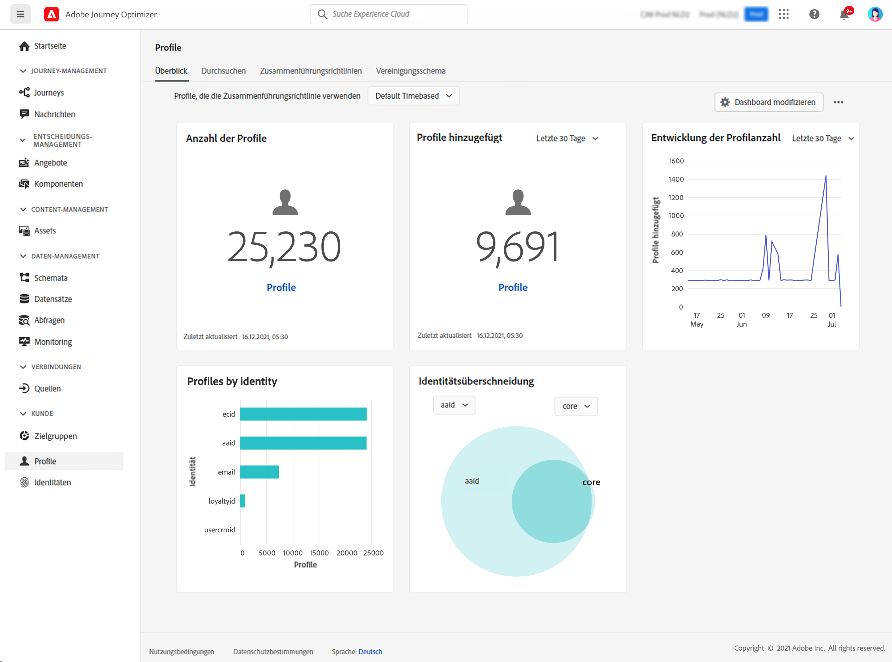

# Erste Schritte mit Profilen {#profiles-gs}

## Über Profile

Mit dem Echtzeit-Kundenprofil in [!DNL Adobe Journey Optimizer] erhalten Sie eine ganzheitliche Sicht auf jeden einzelnen Kunden, indem Sie Daten aus verschiedenen Kanälen, wie Online-, Offline-, CRM- und Drittanbieter-Daten, miteinander kombinieren. Mit dem **Profil** können Sie Ihre Kundendaten in einer zentralen Ansicht zusammenführen, die eine aussagekräftige Darstellung jeder Kundeninteraktion mit Zeitstempel bietet.

➡️ [Funktion im Video kennenlernen](#video)

**Echtzeit-Kundenprofil**: Integrieren Sie Kundenattribute und Ereignisse aus Online-, Offline- und pseudonymen Quellen in ein einziges, einheitliches Profil.Verwenden Sie das Profil, um mit der Kundschaft über mehrere Touchpoints hinweg durch personalisierte Echtzeiterlebnisse zu interagieren. 

**Datenaufnahme**: Stellen Sie eine Verbindung zu verschiedenen Datenquellen her, um Verhaltens-, Transaktions-, Finanz- und Betriebsdaten aufzunehmen. Importieren Sie Daten entweder in Echtzeit oder über Batch-Uploads, um Profile ständig zu aktualisieren. 

>[!NOTE]
>
>Bei der Datenaufnahme wird bei E-Mail-Adressen die Groß- und Kleinschreibung beachtet. Das bedeutet, dass möglicherweise doppelte Profile erstellt (z. B. ein Profil für John.Greene@luma.com und ein anderes Profil für john.greene@luma.com) und beim Targeting der entsprechenden Person in Ihren [!DNL Journey Optimizer]-Journeys und Kampagnen verwendet werden.

**Identitätsdiagramm**: Kombinieren Sie Daten aus verschiedenen Quellen mithilfe von Kundenidentitäten wie Treue-IDs oder CRM-System-IDs. Erstellen Sie eine umfassende Ansicht der Kundin oder des Kunden, indem Sie Beziehungen zwischen verschiedenen Identitäten in den Datensätzen einer Marke zuordnen. 

**Kundeninteraktion**: Verwenden Sie das Echtzeit-Kundenprofil, um kontextbezogene, personalisierte Erlebnisse bereitzustellen, z. B. zielgerichtete Angebote und Nachrichten. Binden Sie die Kundschaft über verschiedene Kanäle ein, einschließlich Marketing-Kampagnen, Kunden-Support und Transaktions-Updates. 

**Datenfreigabe**: Geben Sie Kundenprofile für führende Cloud-Speicheranbieter wie Amazon Web Services, Microsoft Azure und Google Cloud frei. Verwenden Sie freigegebene Profile für Berichte, Datenarchivierung oder tiefer gehende Analysen mit Business Intelligence Tools.

>[!MORELIKETHIS]
>
>* [Dokumentation zum Echtzeit-Kundenprofil](https://experienceleague.adobe.com/docs/experience-platform/query/home.html?lang=de){target="_blank"}
>* [Standardleitlinien für Echtzeit-Kundenprofildaten und Segmentierung](https://experienceleague.adobe.com/de/docs/experience-platform/profile/guardrails){target="_blank"}
>* [Dokumentation zur Datenaufnahme](https://experienceleague.adobe.com/de/docs/experience-platform/ingestion/home){target="_blank"}

## Dashboard „Profile“

Um auf Profile zuzugreifen, gehen Sie im linken Navigationsbereich zum Menü **[!UICONTROL Kunde]** > **[!UICONTROL Profile]**.

>[!NOTE]
>
>Wenn Ihr Unternehmen mit [!DNL Adobe Journey Optimizer] erst begonnen hat und noch keine aktiven Profildatensätze oder Zusammenführungsrichtlinien erstellt hat, ist das Dashboard **Profile** nicht sichtbar. Stattdessen enthält die Registerkarte **Überblick** Links zur Adobe Experience Platform-Dokumentation, die Ihnen bei den ersten Schritten mit dem Echtzeit-Kundenprofil helfen. Hinweise zum Arbeiten mit dem **Profile-Dashboard** und detaillierte Informationen zu den im Dashboard angezeigten Metriken finden Sie in [diesem Abschnitt](https://experienceleague.adobe.com/docs/experience-platform/profile/ui/user-guide.html?lang=de){target="_blank"}.

Datenfragmente können aus verschiedenen Quellen zusammengeführt und kombiniert werden, um eine vollständige Ansicht einzelner Kundinnen und Kunden anzuzeigen. Beim Zusammenführen dieser Daten dienen Zusammenführungsrichtlinien als Regeln, mit denen bestimmt wird, wie Daten priorisiert werden und welche Daten kombiniert werden sollen, um eine einheitliche Ansicht zu erstellen. Diese [Dokumentation](https://experienceleague.adobe.com/docs/experience-platform/profile/merge-policies/ui-guide.html?lang=de){target="_blank"} enthält weitere Informationen zu **Zusammenführungsrichtlinien**.

## Anleitungsvideo {#video}

In diesem Video wird erläutert, wie Adobe Experience Platform Echtzeit-Kundenprofile zusammenstellt und aktualisiert und wie Sie auf diese Profile zugreifen und sie verwenden können.

>[!VIDEO](https://video.tv.adobe.com/v/27251?quality=12)
