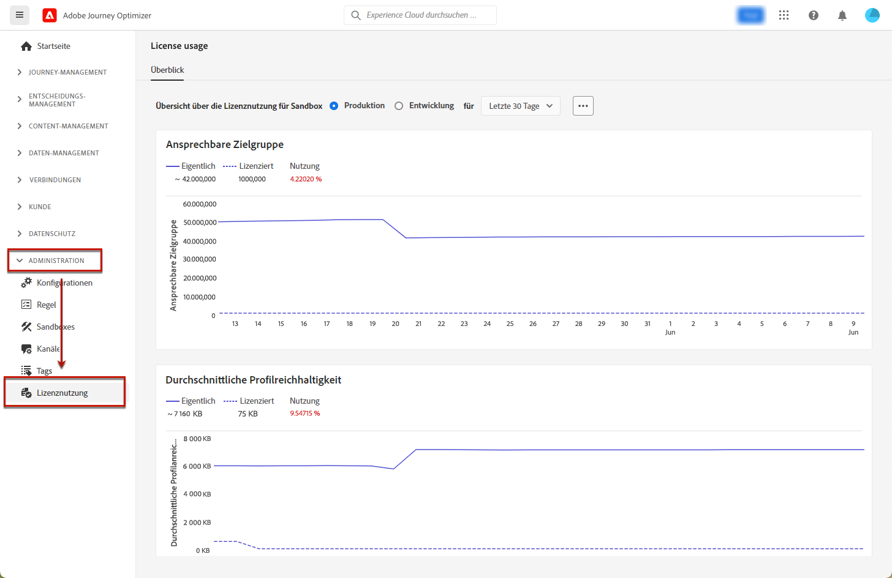

# Lizenznutzungs-Dashboard {#license-usage}

Die [!DNL Adobe Journey Optimizer] [Benutzeroberfläche](../start/user-interface.md) bietet ein Dashboard, das wichtige Informationen zur Lizenznutzung Ihrer Organisation anzeigt, wie sie bei einem täglichen Snapshot erfasst werden.

Um auf das Dashboard zuzugreifen, gehen Sie zu **[!UICONTROL Administration]** > **[!UICONTROL Lizenznutzung]**. Dadurch wird die Registerkarte **[!UICONTROL Überblick]** geöffnet und das Dashboard wird angezeigt.

>[!NOTE]
>
>* Um das Dashboard anzuzeigen, müssen Sie über die Berechtigung zum [Anzeigen des Lizenznutzungs-Dashboards](https://experienceleague.adobe.com/docs/experience-platform/dashboards/permissions.html?lang=de#available-permissions){target="_blank"} verfügen.
>
>* Bestimmte Metriken (z. B. Stunden berechnen, E-Mails) werden für Entwicklungs-Sandboxes nicht angezeigt, wie durch `N/A` in der Kontingentspalte angegeben. Im Dashboard werden nur Werte angezeigt, die nicht null sind. Wenn Metriken null oder nahe null sind, werden sie nicht ausgefüllt.

In [!DNL Adobe Journey Optimizer] können Sie über das Dashboard die Anzahl der **ansprechbaren Profile** überprüfen. Ein ansprechbares Profil ist ein Eintrag mit Informationen, die einen Kontakt darstellen und im Profil-Service gespeichert sind. Diese Einträge sind Profile, mit denen Sie in den letzten 12 Monaten mithilfe der Authoring-, Entscheidungs-, Versand-, Experimentierungs- oder Orchestrierungsfunktionen von Journey Optimizer interagiert haben.

Weitere Informationen finden Sie in der Dokumentation zu Adobe Experience Platform:

* [Überblick über das Lizenznutzungs-Dashboard](https://experienceleague.adobe.com/docs/experience-platform/dashboards/guides/license-usage.html?lang=de){target="_blank"}
* [Erkunden des Lizenznutzungs-Dashboards](https://experienceleague.adobe.com/docs/experience-platform/dashboards/guides/license-usage.html?lang=de#exploring-the-license-usage-dashboard){target="_blank"}
* [Verfügbare Metriken](https://experienceleague.adobe.com/docs/experience-platform/dashboards/guides/license-usage.html?lang=de#available-metrics){target="_blank"}
