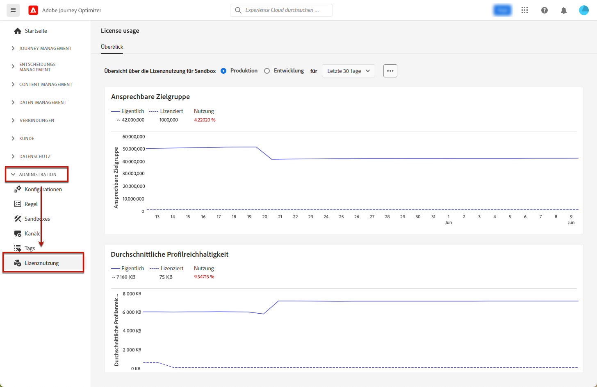

# Lizenznutzungs-Dashboard {#license-usage}

>[!BEGINSHADEBOX]

**Auf dieser Seite** Erfahren Sie, wie Sie im Dashboard zur Adobe Journey Optimizer-Lizenznutzung navigieren und unerwartete Zunahmen bei der Anzahl der Engageable Profiles beheben können.

>[!ENDSHADEBOX]

Die [!DNL Adobe Journey Optimizer] [Benutzeroberfläche](../start/user-interface.md) bietet ein Dashboard, das wichtige Informationen zur Lizenznutzung Ihrer Organisation anzeigt, wie sie bei einem täglichen Snapshot erfasst werden.

Um auf das Dashboard zuzugreifen, gehen Sie zu **[!UICONTROL Administration]** > **[!UICONTROL Lizenznutzung]**. Dadurch wird die Registerkarte **[!UICONTROL Überblick]** geöffnet und das Dashboard wird angezeigt.

>[!NOTE]
>
>* Um das Dashboard anzuzeigen, müssen Sie über die Berechtigung zum [Anzeigen des Lizenznutzungs-Dashboards](https://experienceleague.adobe.com/docs/experience-platform/dashboards/permissions.html?lang=de#available-permissions){target="_blank"} verfügen.
>
>* Bestimmte Metriken (z. B. Stunden berechnen, E-Mails) werden für Entwicklungs-Sandboxes nicht angezeigt, wie durch `N/A` in der Kontingentspalte angegeben. Im Dashboard werden nur Werte angezeigt, die nicht null sind. Wenn Metriken null oder nahe null sind, werden sie nicht ausgefüllt.

[!DNL Adobe Journey Optimizer] können Sie im Dashboard die Anzahl der **Engageable Profiles** - eindeutige Profile, die über Journey, Kampagnen oder Entscheidungen in einem rollierenden 12-Monats-Fenster aktiviert werden, überprüfen. Eine vollständige Erläuterung der Definition und Berechnung von Engageable Profilen finden Sie unter [Engageable Profile and License Usage](get-started-profiles.md#engageable-profiles).

>[!NOTE]
>
>Wenn Sie einen plötzlichen Anstieg in der Anzahl von kontaktierbaren Profilen feststellen, finden Sie im [Abschnitt Fehlerbehebung](#troubleshooting-engageable-profiles) unten detaillierte Anleitungen zum Verständnis und zur Lösung des Problems.

## Fehlerbehebung: Deutlicher Anstieg der Anzahl von kontaktierbaren Profilen {#troubleshooting-engageable-profiles}

Wenn Sie einen plötzlichen Anstieg in der Anzahl von kontaktierbaren Profilen feststellen (z. B. ein Anstieg von Profilen von Hunderttausenden auf Millionen innerhalb eines Tages), bietet dieser Abschnitt Anleitungen zum Verständnis und zur Behebung des Problems.

### Den Anstieg verstehen

Die Metrik Ansprechbare Profile gibt die Anzahl der eindeutigen Profile an, die von Journey oder Kampagnen in den letzten 12 Monaten aktiviert wurden. Ein plötzlicher Anstieg kann die Folge sein von:

* Große Zielgruppen werden von neuen Journey oder Kampagnen angesprochen
* Für den Profil-Service aktivierte Änderungen an Datensätzen
* Batch-Verarbeitung von Zielgruppen, die in letzter Zeit nicht interagiert wurden

### Auflösungsschritte

Gehen Sie wie folgt vor, um dieses Problem zu beheben:

1. **Profilzählungslogik verstehen:**

   * Ansprechbare Profile werden anhand der eindeutigen Profile berechnet, die von Journey oder Kampagnen in den letzten 12 Monaten engagiert wurden.
   * Wenn ein Profil in mehrere Journey eintritt, wird es für diese Sandbox als ein einbindbares Profil gezählt.
   * Die Metrik kann nur verringert werden, wenn seit mehr als 12 Monaten keine Interaktion mit bestimmten Profilen stattfindet oder pseudonyme Profile mit bekannten Profilen verknüpft sind.
   * Engagierbare Profile werden anhand der adressierbaren Zielgruppe eines Kunden berechnet.
   * Die Zielgruppe, die in den letzten 12 Monaten mit einer der Funktionen von Journey Optimizer interagiert hat, bestimmt die Anzahl der kontaktierbaren Profile von der gesamten adressierbaren Zielgruppe.

2. **Untersuchen Sie Journey, Kampagnen und Entscheidungen, die sich an große Zielgruppen richten:**

   * Sehen Sie sich aktuelle Journey und Kampagnen an, die mit [Engageable Profiles-Abfragen](../reports/query-examples.md#engageable-profiles-queries) oder [Query Service](https://experienceleague.adobe.com/de/docs/experience-platform/query/home){target="_blank"} auf eine große Anzahl von Profilen abzielen.
   * Identifizieren Sie bestimmte Journey-Versionen, die zu der Spitze der Profilanzahl beigetragen haben.
   * Journey, Kampagnen und Entscheidungen mit neuen Profilen führen wahrscheinlich zu einem Anstieg der Ereignisanzahl in den Journey-Datensätzen, was zum Anstieg der Anzahl der kontaktierbaren Profile beiträgt.

3. **Zielgruppen auf Journey- und Kampagnenebene filtern:**

   * Wenden Sie Filter auf Zielgruppenebene an, bevor Sie Journey oder Kampagnen starten, um unnötige Erhöhungen der Anzahl „Engageable Profiles“ zu verhindern.
   * Stellen Sie sicher, dass bei den Interaktionen nur relevante Zielgruppen angesprochen werden.

4. **Verringern der adressierbaren Zielgruppengröße:**

   * Pseudonyme Profile löschen, falls erforderlich. Beachten Sie, dass diese Aktion sowohl Journey Optimizer als auch Real-Time Customer Data Platform betrifft.
   * Weitere Informationen zum Ablauf [&#x200B; Daten pseudonymer Profile &#x200B;](https://experienceleague.adobe.com/de/docs/experience-platform/profile/pseudonymous-profiles){target="_blank"} Sie im Handbuch zum Echtzeit-Kundenprofil .
   * **Hinweis:** Ablauf von Daten pseudonymer Profile kann nicht über die Platform-Benutzeroberfläche oder APIs konfiguriert werden. Sie müssen sich an den Support wenden, um diese Funktion zu aktivieren.

5. **Datensatzänderungen überwachen:**

   * Überprüfen Sie Datensätze, die für die Profilerstellung aktiviert sind, und stellen Sie sicher, dass sie keine übermäßigen ECIDs (Experience Cloud IDs) enthalten.
   * Löschen Sie bei Bedarf Datensätze mit hohen ECID-Zahlen und erstellen Sie sie mit reduzierten Datensätzen neu.

6. **Entwicklung einer langfristigen Strategie zur Emissionsminderung:**

   * Die Anzahl der kontaktierbaren Profile nimmt automatisch ab, wenn bestimmte Profile länger als 12 Monate nicht kontaktiert sind.

**Siehe auch:**

* [Beispiele für Engageable Profiles-](../reports/query-examples.md#engageable-profiles-queries): Beispielabfragen zur Überwachung und Analyse Ihrer Engageable Profiles
* [Adobe Experience Platform Query Service - Übersicht](https://experienceleague.adobe.com/de/docs/experience-platform/query/home){target="_blank"}

## Verwandte Dokumentation {#related-documentation}

Weitere Informationen finden Sie in der Dokumentation zu Adobe Experience Platform:

* [Überblick über das Lizenznutzungs-Dashboard](https://experienceleague.adobe.com/docs/experience-platform/dashboards/guides/license-usage.html?lang=de){target="_blank"}
* [Genauere Informationen zum Lizenznutzungs-Dashboard](https://experienceleague.adobe.com/docs/experience-platform/dashboards/guides/license-usage.html?lang=de#exploring-the-license-usage-dashboard){target="_blank"}
* [Verfügbare Metriken](https://experienceleague.adobe.com/docs/experience-platform/dashboards/guides/license-usage.html?lang=de#available-metrics){target="_blank"}
* [Ablauf von Daten pseudonymer Profile](https://experienceleague.adobe.com/docs/experience-platform/profile/pseudonymous-profiles.html?lang=de){target="_blank"}
