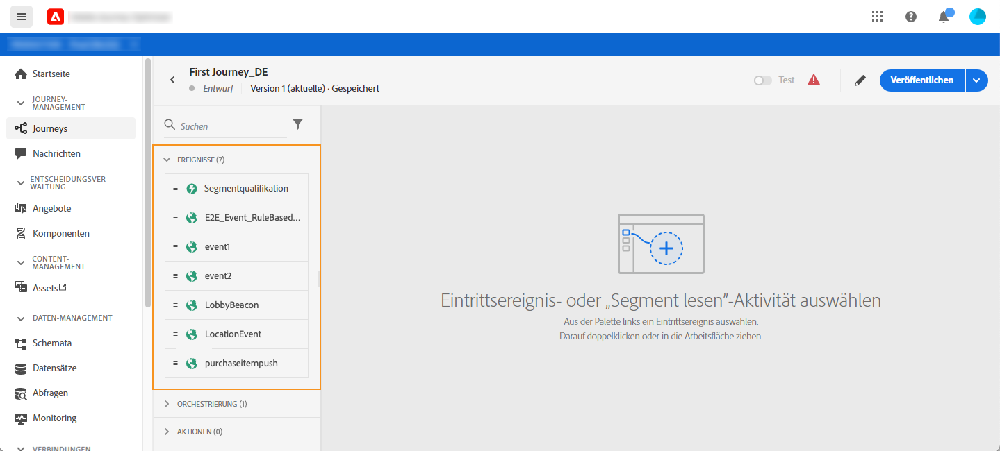
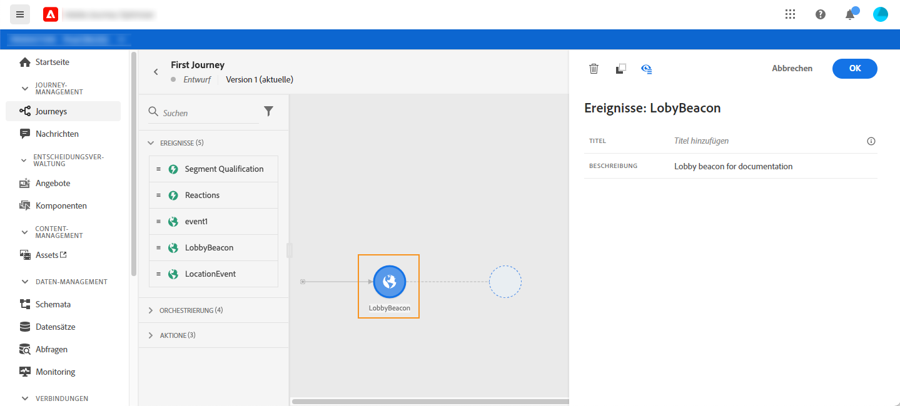
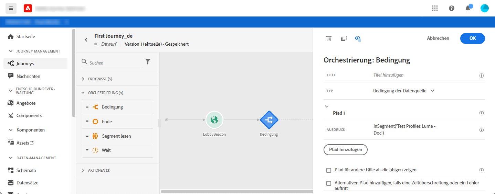
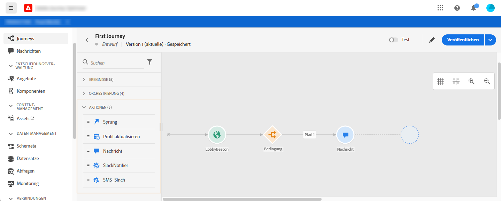
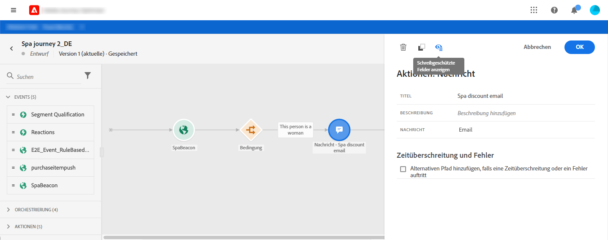
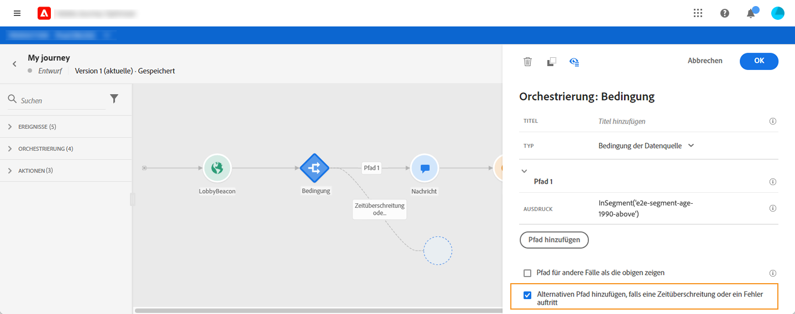

# Informationen zu Journey-Aktivitäten {#about-journey-activities}

Kombinieren Sie die verschiedenen Ereignis-, Orchestrierungs- und Aktionsaktivitäten, um Ihre mehrstufigen kanalübergreifenden Szenarien zu erstellen.

## Ereignisaktivitäten {#event-activities}

Die vom technischen Anwender konfigurierten Ereignisse (siehe [diese Seite](../event/about-events.md)) werden alle in der ersten Kategorie der Palette auf der linken Seite des Bildschirms angezeigt. Die folgenden Ereignisse sind verfügbar: Aktivitäten:

* [Allgemeine Ereignisse](../building-journeys/general-events.md)
* [Reaktion](../building-journeys/reaction-events.md)
* [Segmentqualifikation](../building-journeys/segment-qualification-events.md)

Beginn der Journey durch Ziehen und Ablegen einer Ereignis-Aktivität. Sie können auf diese auch doppelklicken.

## Orchestrierungsaktivitäten {#orchestration-activities}

In der Palette auf der linken Seite des Bildschirms stehen die folgenden Orchestrierungsaktivitäten zur Verfügung:

* [Bedingung](../building-journeys/condition-activity.md)
* [Ende](../building-journeys/end-activity.md)
* [Warten](../building-journeys/wait-activity.md)
* [Segment lesen](../building-journeys/read-segment.md)

## Aktionsaktivitäten {#action-activities}

In der Palette auf der linken Seite des Bildschirms finden Sie unter **[!UICONTROL Ereignisse]** und **[!UICONTROL Orchestrierung]** die Kategorie **[!UICONTROL Aktionen.]** Die folgenden Aktivitäten stehen zur Verfügung:

* [Nachricht](../building-journeys/journeys-message.md)
* [Benutzerdefinierte Aktionen](../building-journeys/using-custom-actions.md)
* [Sprung](../building-journeys/jump.md)

Diese Aktivitäten repräsentieren die verschiedenen Kommunikationskanäle. Sie können sie zu einem kanalübergreifenden Szenario verbinden.

Wenn Sie benutzerdefinierte Aktionen konfiguriert haben, werden diese hier angezeigt (siehe [diese Seite](../building-journeys/using-custom-actions.md)).

## Best Practices {#best-practices}

Die meisten Aktivitäten ermöglichen es Ihnen, eine **[!UICONTROL Beschriftung]** zu definieren. Dadurch wird dem Namen, der unter Ihrer Aktivität auf der Arbeitsfläche angezeigt wird, ein Suffix hinzugefügt. Dies ist nützlich, wenn Sie dieselbe Aktivität mehrmals in Ihrer Journey verwenden und sie leichter identifizieren möchten. Außerdem wird die Problembehebung bei Fehlern und das Lesen von Berichten erleichtert. Sie können auch eine optionale **[!UICONTROL Beschreibung]** hinzufügen.

Wenn in einer Aktion oder einer Bedingung ein Fehler auftritt, wird die Journey der Person gestoppt. Die einzige Möglichkeit zum Fortsetzen des Vorgangs besteht darin, das Kontrollkästchen **[!UICONTROL Alternativen Pfad hinzufügen, falls eine Zeitüberschreitung oder ein Fehler auftritt]** zu aktivieren. Siehe [diesen Abschnitt](../building-journeys/using-the-journey-designer.md#paths).

