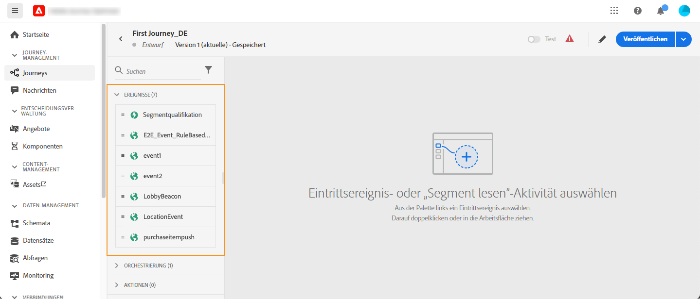
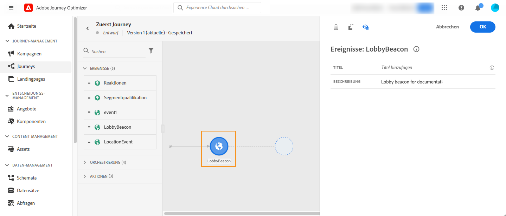
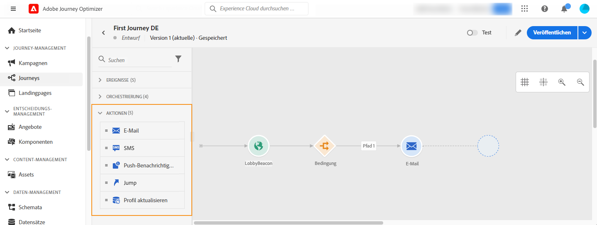
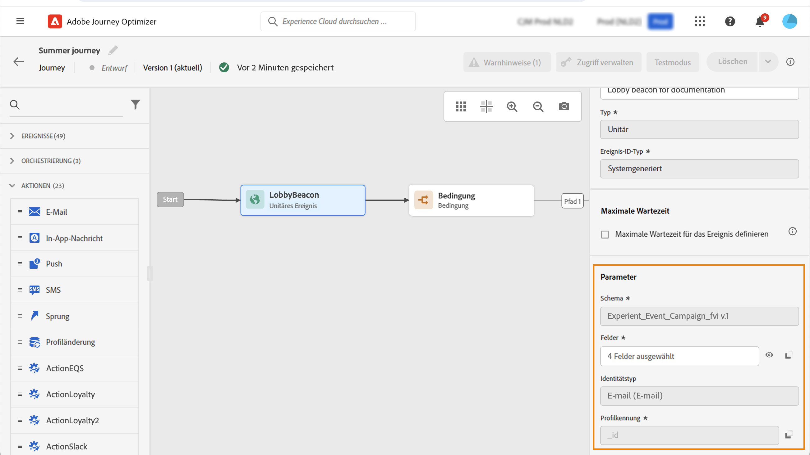
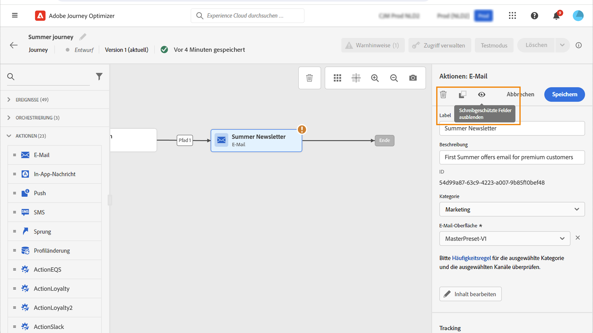
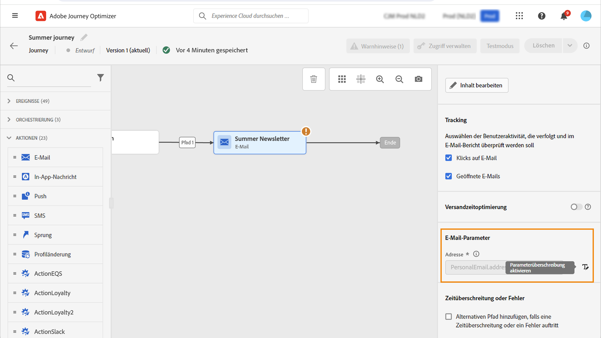

# Erste Schritte mit Journey-Aktivitäten {#about-journey-activities}

Kombinieren Sie die verschiedenen Ereignis-, Orchestrierungs- und Aktionsaktivitäten, um Ihre mehrstufigen kanalübergreifenden Szenarien zu erstellen.

## Ereignisaktivitäten {#event-activities}

Ereignisse sind Auslöser personalisierter Journeys, z. B. eines Online-Kaufs. Wenn eine Person in eine Journey eintritt, durchläuft sie sie als Individuum. Jede Person bewegt sich in einer anderen Geschwindigkeit und auf einem anderen Pfad. Wenn Sie Ihre Journey mit einem Ereignis beginnen, wird die Journey ausgelöst, sobald das Ereignis eintritt. Jede Person in der Journey folgt dann einzeln den nächsten Schritten, die in Ihrer Journey definiert sind.

Die vom/von der technischen Benutzenden konfigurierten Ereignisse (siehe [diese Seite](../event/about-events.md)) werden in der ersten Kategorie der Palette auf der linken Seite des Bildschirms angezeigt. Folgende Ereignisaktivitäten sind verfügbar:

* [Allgemeine Ereignisse](../building-journeys/general-events.md)
* [Reaktion](../building-journeys/reaction-events.md)
* [Zielgruppen-Qualifizierung](../building-journeys/audience-qualification-events.md)

Beginnen Sie Ihre Journey mit Drag-and-Drop einer Ereignisaktivität. Sie können auf diese auch doppelklicken.

## Orchestrierungsaktivitäten {#orchestration-activities}

Orchestrierungsaktivitäten sind Bedingungen, die beim Bestimmen des nächsten Schritts der Journey helfen. Beispiele hierfür sind ein offenes Supportticket, die Wettervorhersage am aktuellen Standort, der Abschluss eines Kaufs oder das Erreichen von 10.000 Treuepunkten.

In der Palette auf der linken Seite des Bildschirms stehen die folgenden Orchestrierungsaktivitäten zur Verfügung:

* [Bedingung](../building-journeys/condition-activity.md)
* [Warten](../building-journeys/wait-activity.md)
* [Zielgruppe lesen](../building-journeys/read-audience.md)

## Aktionsaktivitäten {#action-activities}

Aktionen sind das Ergebnis eines Auslösers, wie das Senden einer Nachricht. Sie sind die Teile der Journey, die der Kunde bzw. die Kundin wahrnimmt.

In der Palette auf der linken Seite des Bildschirms finden Sie unter **[!UICONTROL Ereignisse]** und **[!UICONTROL Orchestrierung]** die Kategorie **[!UICONTROL Aktionen]**. Folgende Aktionsaktivitäten sind verfügbar:

* [E-Mail, SMS, Push-Benachrichtigung](../building-journeys/journeys-message.md)
* [Benutzerdefinierte Aktionen](../building-journeys/using-custom-actions.md)
* [Sprung](../building-journeys/jump.md)

Diese Aktivitäten repräsentieren die verschiedenen Kommunikationskanäle. Sie können sie zu einem kanalübergreifenden Szenario verbinden.

Wenn Sie benutzerdefinierte Aktionen konfiguriert haben, werden diese hier ebenfalls angezeigt. [Weitere Informationen](../building-journeys/using-custom-actions.md).

## Best Practices {#best-practices}

### Hinzufügen eines Titels

Die meisten Aktivitäten ermöglichen es Ihnen, eine **[!UICONTROL Bezeichnung]** zu definieren. Auf diese Weise können Sie dem Namen, der unter Ihrer Aktivität auf der Arbeitsfläche angezeigt wird, ein Suffix hinzufügen. Dies ist nützlich, wenn Sie dieselbe Aktivität mehrmals in Ihrer Journey verwenden und sie leichter identifizieren möchten. Außerdem wird die Problembehebung bei Fehlern und das Lesen von Berichten erleichtert. Sie können auch eine optionale **[!UICONTROL Beschreibung]** hinzufügen.

>[!NOTE]
>
>Bei einigen Aktivitäten ist ihre ID auch im Bereich sichtbar. Diese ID kann beim Reporting als stabilerer Schlüssel verwendet werden als die Bezeichnung, da letztere sich ändern kann.

### Verwalten erweiterter Parameter {#advanced-parameters}

Die meisten Aktivitäten zeigen eine Reihe erweiterter und/oder technischer Parameter an, die Sie nicht ändern können.

Zur besseren Lesbarkeit können Sie diese Parameter mithilfe der Schaltfläche **[!UICONTROL Schreibgeschützte Felder ausblenden]** ausblenden.

In bestimmten Kontexten können Sie die Werte dieser Parameter für eine bestimmte Verwendung überschreiben. Um einen bestimmten Wert zu erzwingen, können Sie das Symbol **[!UICONTROL Parameterüberschreibung aktivieren]** rechts neben dem Feld anklicken. [Weitere Informationen](../configuration/primary-email-addresses.md#journey-parameters)

### Hinzufügen eines alternativen Pfads

Wenn in einer Aktion oder einer Bedingung ein Fehler auftritt, wird die Journey der Person gestoppt. Die einzige Möglichkeit zum Fortsetzen des Vorgangs besteht darin, das Kontrollkästchen **[!UICONTROL Alternativen Pfad hinzufügen, falls eine Zeitüberschreitung oder ein Fehler auftritt]** zu aktivieren. Weitere Informationen finden Sie in [diesem Abschnitt](../building-journeys/using-the-journey-designer.md#paths).

