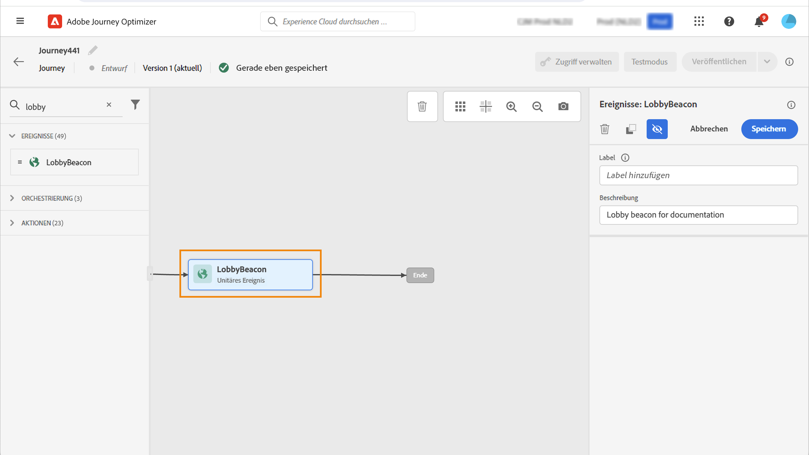
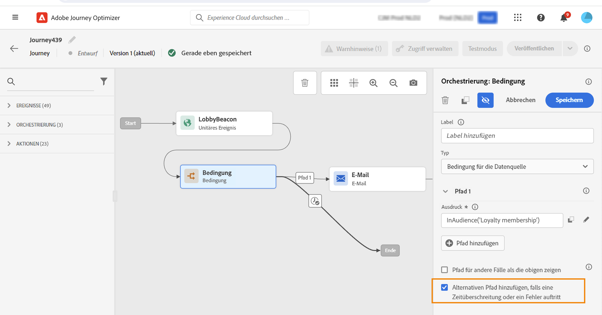

# Erste Schritte mit Journey-Aktivitäten {#about-journey-activities}

Kombinieren Sie die verschiedenen Ereignis-, Orchestrierungs- und Aktionsaktivitäten, um Ihre mehrstufigen kanalübergreifenden Szenarien zu erstellen.

## Ereignisaktivitäten {#event-activities}

Ereignisse lösen eine personalisierte Journey aus, z. B. einen Online-Kauf. Sobald jemand in eine Journey eintritt, bewegt er sich als Einzelperson durch, und keine zwei Personen bewegen sich in derselben Geschwindigkeit oder auf demselben Pfad. Wenn Sie Ihre Journey mit einem Ereignis starten, wird die Journey beim Empfang des Ereignisses ausgelöst. Jede Person in der Journey folgt dann einzeln den nächsten Schritten, die in Ihrer Journey definiert sind.

Vom technischen Anwender konfigurierte Ereignisse (siehe [diese Seite](../event/about-events.md)) werden alle in der ersten Kategorie der Palette auf der linken Seite des Bildschirms angezeigt. Die folgenden Ereignisaktivitäten sind verfügbar:

* [Allgemeine Ereignisse](../building-journeys/general-events.md)
* [Reaktion](../building-journeys/reaction-events.md)
* [Segmentqualifikation](../building-journeys/segment-qualification-events.md)

Starten Sie Ihre Journey durch Ziehen und Ablegen einer Ereignisaktivität. Sie können auch darauf doppelklicken.

## Orchestrierungsaktivitäten {#orchestration-activities}

Orchestrierungsaktivitäten sind unterschiedliche Bedingungen, die bei der Bestimmung des nächsten Schritts in der Journey helfen. Es kann sein, ob die Person einen offenen Support-Fall hat oder nicht, das Wetter an ihrem aktuellen Standort vorhergesagt, wenn sie einen Kauf abgeschlossen hat oder nicht, oder 10 000 Treuepunkte erreicht hat.

In der Palette auf der linken Bildschirmseite stehen folgende Orchestrierungsaktivitäten zur Verfügung:

* [Bedingung](../building-journeys/condition-activity.md)
* [Warten](../building-journeys/wait-activity.md)
* [Segment lesen](../building-journeys/read-segment.md)

## Aktionsaktivitäten {#action-activities}

Aktionen sind das Ergebnis irgendeiner Art von Triggern, wie das Senden einer Nachricht. Es ist der Teil der Journey, den der Kunde erfährt.

In der Palette auf der linken Bildschirmseite unter **[!UICONTROL Events]** und **[!UICONTROL Orchestration]**, können Sie die **[!UICONTROL Actions]** Kategorie. Die folgenden Aktionsaktivitäten sind verfügbar:

* [E-Mail, SMS, Push](../building-journeys/journeys-message.md)
* [Benutzerdefinierte Aktionen](../building-journeys/using-custom-actions.md)
* [Sprung](../building-journeys/jump.md)

Diese Aktivitäten repräsentieren die verschiedenen Kommunikationskanäle. Sie können sie zu einem kanalübergreifenden Szenario kombinieren.

Wenn Sie benutzerdefinierte Aktionen konfiguriert haben, werden diese hier ebenfalls angezeigt. [Weitere Infos](../building-journeys/using-custom-actions.md)).

## Best Practices {#best-practices}

Die meisten Aktivitäten ermöglichen die Definition einer **[!UICONTROL Label]**. Dadurch wird dem Namen, der unter Ihrer Aktivität auf der Arbeitsfläche angezeigt wird, ein Suffix hinzugefügt. Dies ist nützlich, wenn Sie dieselbe Aktivität mehrmals in Ihrer Journey verwenden und sie leichter identifizieren möchten. Außerdem wird das Debugging im Fall von Fehlern vereinfacht und das Lesen von Berichten erleichtert. Sie können auch eine optionale **[!UICONTROL Description]**.

Wenn in einer Aktion oder Bedingung ein Fehler auftritt, stoppt die Journey eines Kontakts. Die einzige Möglichkeit, den Vorgang fortzusetzen, besteht darin, das Kontrollkästchen zu aktivieren **[!UICONTROL Add an alternative path in case of a timeout or an error]**. Siehe [diesem Abschnitt](../building-journeys/using-the-journey-designer.md#paths).

