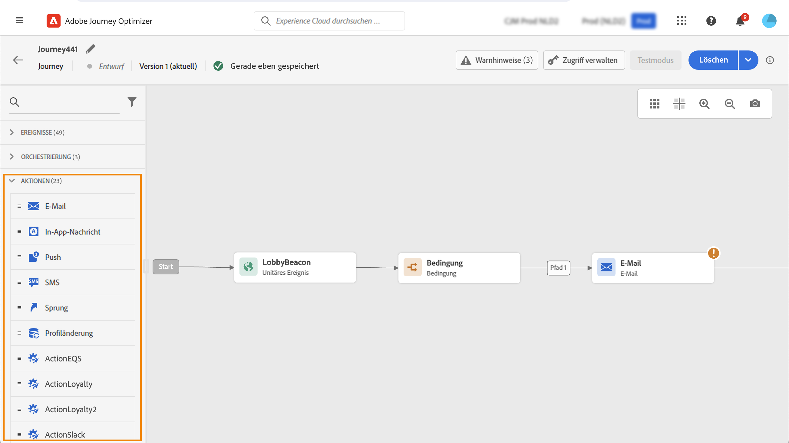

# Erste Schritte mit Journey-Aktivitäten {#about-journey-activities}

Kombinieren Sie die verschiedenen Ereignis-, Orchestrierungs- und Aktionsaktivitäten, um Ihre mehrstufigen kanalübergreifenden Szenarien zu erstellen.

## Ereignisaktivitäten {#event-activities}

Personalisierte Journeys werden durch Ereignisse ausgelöst, z. B. durch einen Online-Kauf.  Wenn ein Profil auf eine Journey gelangt, durchläuft es diese als Einzelperson. Keine Person bewegt sich im selben Tempo oder auf demselben Pfad. Wenn Sie Ihren Journey mit einem Ereignis starten, wird der Journey-Trigger ausgelöst, sobald das Ereignis eingeht. Jede Person in der Journey folgt dann einzeln den nächsten Schritten, die in Ihrer Journey definiert sind.

Die vom/von der technischen Benutzenden konfigurierten Ereignisse (siehe [diese Seite](../event/about-events.md)) werden in der ersten Kategorie der Palette auf der linken Seite des Bildschirms angezeigt. Die folgenden Ereignisaktivitäten sind verfügbar:

* [Allgemeine Ereignisse](../building-journeys/general-events.md)
* [Reaktion](../building-journeys/reaction-events.md)
* [Zielgruppen-Qualifizierung](../building-journeys/audience-qualification-events.md)

Ziehen Sie eine Ereignisaktivität per Drag-and-Drop, um Ihren Journey zu starten. Sie können auf diese auch doppelklicken.

## Orchestrierungsaktivitäten {#orchestration-activities}

Orchestrierungsaktivitäten sind Bedingungen, die beim Bestimmen des nächsten Schritts der Journey helfen. Zu diesen Bedingungen kann gehören, ob die Person an ihrem aktuellen Standort einen offenen Support-Fall hat, die Wettervorhersage hat, ob sie einen Kauf abgeschlossen hat oder ob sie 10.000 Treuepunkte erreicht hat.

In der Palette auf der linken Seite des Bildschirms stehen die folgenden Orchestrierungsaktivitäten zur Verfügung:

* [Bedingung](../building-journeys/condition-activity.md)
* [Warten](../building-journeys/wait-activity.md)
* [Zielgruppe lesen](../building-journeys/read-audience.md)

## Aktionsaktivitäten {#action-activities}

Aktionen sind das Ergebnis eines Triggers, wie das Senden einer Nachricht. Es ist das Stück der Journey, das der Kunde erlebt.

In der Palette auf der linken Seite des Bildschirms finden Sie unter **[!UICONTROL Ereignisse]** und **[!UICONTROL Orchestrierung]** die Kategorie **[!UICONTROL Aktionen]**. Folgende Aktionsaktivitäten sind verfügbar:

* [Integrierte Kanalaktionen](../building-journeys/journeys-message.md)
* [Benutzerdefinierte Aktionen](../building-journeys/using-custom-actions.md)
* [Sprung](../building-journeys/jump.md)

Diese Aktivitäten repräsentieren die verschiedenen Kommunikationskanäle. Sie können sie zu einem kanalübergreifenden Szenario verbinden.

<!--If you have configured custom actions, they also appear here. [Learn more](../building-journeys/using-custom-actions.md)-->

Sie können auch spezifische Aktionen zum Senden von Nachrichten einrichten:

* Wenn Sie zum Senden von Nachrichten ein Drittanbietersystem verwenden, können Sie eine bestimmte benutzerdefinierte Aktion erstellen. [Weitere Informationen](../action/action.md)

* Wenn Sie mit Campaign und Journey Optimizer arbeiten, lesen Sie diese Abschnitte:

   * [[!DNL Journey Optimizer] und Campaign v7/v8](../action/acc-action.md)
   * [[!DNL Journey Optimizer] und Campaign Standard](../action/acs-action.md)
   * [[!DNL Journey Optimizer] und Marketo Engage](../action/marketo-engage.md)

## Best Practices {#best-practices}

### Hinzufügen eines Titels

Die meisten Aktivitäten ermöglichen es Ihnen, eine **[!UICONTROL Bezeichnung]** zu definieren. Dadurch wird dem Namen, der unter Ihrer Aktivität auf der Arbeitsfläche angezeigt wird, ein Suffix hinzugefügt. Dies ist nützlich, wenn Sie dieselbe Aktivität mehrmals in Ihrer Journey verwenden und sie leichter identifizieren möchten. Außerdem wird das Debugging bei Fehlern erleichtert und die Lesbarkeit von Berichten erleichtert. Sie können auch eine optionale **[!UICONTROL Beschreibung]** hinzufügen.

>[!NOTE]
>
>Bei einigen Aktivitäten ist ihre ID auch im Bereich sichtbar. Diese ID kann beim Reporting als stabilerer Schlüssel verwendet werden als die Bezeichnung, da letztere sich ändern kann.

### Verwalten erweiterter Parameter {#advanced-parameters}

Die meisten Aktivitäten zeigen eine Reihe erweiterter und/oder technischer Parameter an, die Sie nicht ändern können.

Zur besseren Lesbarkeit können Sie diese Parameter mithilfe der Schaltfläche **[!UICONTROL Schreibgeschützte Felder ausblenden]** ausblenden.

In bestimmten Kontexten können Sie die Werte dieser Parameter für eine bestimmte Verwendung überschreiben. Um einen bestimmten Wert zu erzwingen, können Sie das Symbol **[!UICONTROL Parameterüberschreibung aktivieren]** rechts neben dem Feld anklicken. [Weitere Informationen](../configuration/primary-email-addresses.md#journey-parameters)

### Hinzufügen eines alternativen Pfads

Wenn in einer Aktion oder einer Bedingung ein Fehler auftritt, wird die Journey des Kontakts gestoppt. Die einzige Möglichkeit zum Fortsetzen des Vorgangs besteht darin, das Kontrollkästchen **[!UICONTROL Alternativen Pfad hinzufügen, falls eine Zeitüberschreitung oder ein Fehler auftritt]** zu aktivieren. Weitere Informationen finden Sie in [diesem Abschnitt](../building-journeys/using-the-journey-designer.md#paths).

