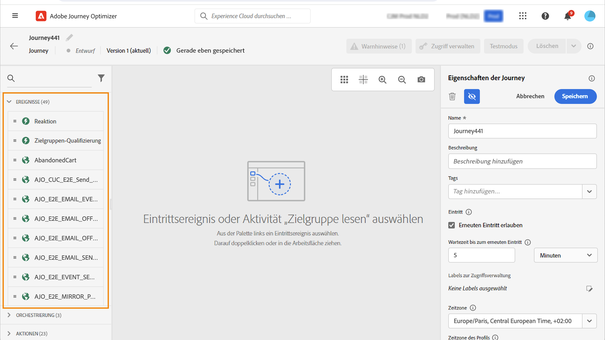
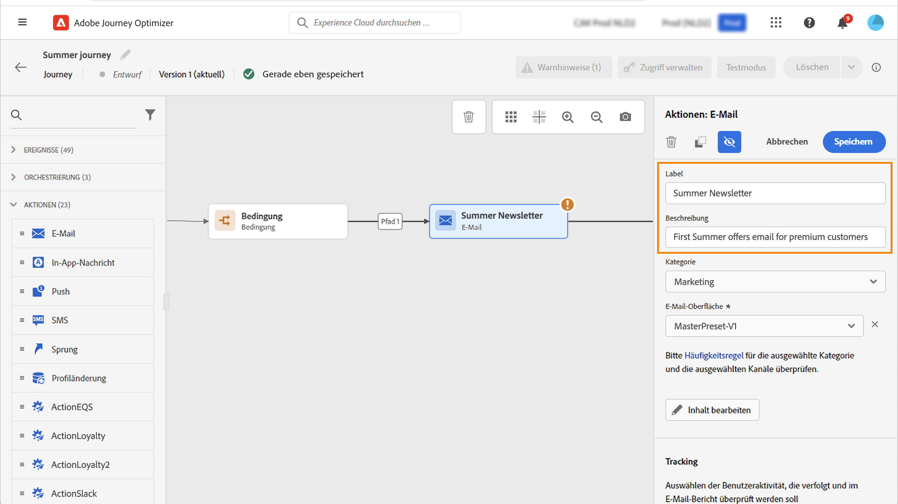

# Erste Schritte mit Journey-Aktivitäten {#about-journey-activities}

Kombinieren Sie Ereignis-, Orchestrierungs- und Aktionsaktivitäten, um mehrstufige, kanalübergreifende Szenarien zu erstellen.

## Ereignisaktivitäten {#event-activities}

Personalisierte Journey beginnen mit Ereignissen wie einem Online-Kauf. Sobald ein Profil auf eine Journey gelangt ist, durchläuft es diese selbstständig. Jedes Profil kann einen anderen Pfad und eine andere Geschwindigkeit wählen. Wenn Sie mit einem Ereignis beginnen, wird der Journey bei Eintreffen des Ereignisses Trigger. Jedes Profil folgt dann den Schritten, die in Ihrem Journey definiert sind.

Vom technischen Anwender konfigurierte Ereignisse (siehe [diese Seite](../event/about-events.md) werden in der ersten Kategorie der Palette angezeigt. Diese Kategorie befindet sich auf der linken Bildschirmseite. Folgende Ereignisaktivitäten sind verfügbar:

* [Allgemeine Ereignisse](../building-journeys/general-events.md)
* [Reaktion](../building-journeys/reaction-events.md)
* [Zielgruppenqualifizierung](../building-journeys/audience-qualification-events.md)

Legen Sie zum Starten der Journey eine Ereignisaktivität per Drag-and-Drop ab. Sie können auch auf sie doppelklicken.

## Orchestrierungsaktivitäten {#orchestration-activities}

Orchestrierungsaktivitäten sind Bedingungen, die bei der Bestimmung des nächsten Schritts im Journey helfen. Zu diesen Bedingungen kann gehören, ob die Person einen offenen Support-Fall hat oder einen Kauf abgeschlossen hat. Sie können auch die lokale Wettervorhersage enthalten oder angeben, ob die Person 10.000 Treuepunkte erreicht hat.

In der Palette auf der linken Seite des Bildschirms stehen die folgenden Orchestrierungsaktivitäten zur Verfügung:

<!--* [Optimize](optimize.md)-->
* [Zielgruppe lesen](read-audience.md)
* [Warten](wait-activity.md)
* [Inhaltsentscheidung](content-decision.md)
* [Datensatzsuche](dataset-lookup.md)

## Aktionsaktivitäten {#action-activities}

Aktionen sind das Ergebnis eines Auslösers, wie das Senden einer Nachricht. Sie sind die Teile der Journey, die die Kundin bzw. der Kunde wahrnimmt.

In der Palette auf der linken Seite des Bildschirms finden Sie unter **[!UICONTROL Ereignisse]** und **[!UICONTROL Orchestrierung]** die Kategorie **[!UICONTROL Aktionen]**. Folgende Aktionsaktivitäten sind verfügbar:

* [Integrierte Kanalaktionen](../building-journeys/journeys-message.md)
* [Benutzerdefinierte Aktionen](../building-journeys/using-custom-actions.md)
* [Sprung](../building-journeys/jump.md)

Diese Aktivitäten repräsentieren die verschiedenen Kommunikationskanäle. Sie können sie zu einem kanalübergreifenden Szenario verbinden.

Es können auch bestimmte Aktionen zum Senden von Nachrichten eingerichtet werden:

* Wenn zum Versenden von Nachrichten ein Drittanbietersystem verwendet wird, kann eine bestimmte benutzerdefinierte Aktion erstellt werden. [Weitere Informationen](../action/action.md)

* Wenn Sie mit [!DNL Adobe Campaign] und [!DNL Adobe Journey Optimizer] arbeiten, lesen Sie diese Abschnitte:

   * [[!DNL Adobe Journey Optimizer] und [!DNL Adobe Campaign] v7/v8](../action/acc-action.md)
   * [[!DNL Adobe Journey Optimizer] und [!DNL Adobe Campaign] Standard](../action/acs-action.md)
   * [[!DNL Adobe Journey Optimizer] und [!DNL Adobe Marketo Engage]](../action/marketo-engage.md)

## Best Practices {#best-practices}

Verwenden Sie diese Empfehlungen, um Journey lesbar, konsistent und leicht zu beheben.

### Hinzufügen eines Labels

Die meisten Aktivitäten ermöglichen es Ihnen, ein **[!UICONTROL Label]** zu definieren. Auf diese Weise wird dem Namen, der unter der Aktivität auf der Arbeitsfläche angezeigt wird, ein Suffix hinzugefügt. Dies ist nützlich, wenn Sie dieselbe Aktivität mehrmals in Ihrer Journey verwenden und sie leichter identifizieren möchten. Außerdem wird das Debugging bei Fehlern und das Lesen von Berichten erleichtert. Sie können auch eine optionale **[!UICONTROL Beschreibung]** hinzufügen.

>[!NOTE]
>
>Bei einigen Aktivitäten ist ihre ID auch im Bereich sichtbar. Diese ID kann beim Reporting als stabilerer Schlüssel verwendet werden als das Label, da letzteres sich ändern kann.

### Verwalten erweiterter Parameter {#advanced-parameters}

Die meisten Aktivitäten zeigen eine Reihe erweiterter und/oder technischer Parameter an, die Sie nicht ändern können.

Zur besseren Lesbarkeit können Sie diese Parameter mithilfe der Schaltfläche **[!UICONTROL Schreibgeschützte Felder ausblenden]** oben im rechten Bereich ausblenden.

In bestimmten Kontexten können Sie die Werte dieser Parameter für eine bestimmte Verwendung überschreiben. Um einen bestimmten Wert zu erzwingen, können Sie das Symbol **[!UICONTROL Parameterüberschreibung aktivieren]** rechts neben dem Feld anklicken. [Weitere Informationen](../configuration/primary-email-addresses.md#override-execution-address-journey)

>[!NOTE]
>
>Wenn die erweiterten Parameter ausgeblendet sind, klicken Sie auf die Schaltfläche **[!UICONTROL Schreibgeschützte Felder anzeigen]**.
>
>{width=60%}

### Hinzufügen eines alternativen Pfads

Wenn in einer Aktion oder einer Bedingung ein Fehler auftritt, wird die Journey des Kontakts gestoppt. Die einzige Möglichkeit zum Fortsetzen des Vorgangs besteht darin, das Kontrollkästchen **[!UICONTROL Alternativen Pfad hinzufügen, falls eine Zeitüberschreitung oder ein Fehler auftritt]** zu aktivieren. Weitere Informationen finden Sie in [diesem Abschnitt](../building-journeys/using-the-journey-designer.md#paths).

## Fehlerbehebung {#troubleshooting}

Überprüfen Sie vor dem Testen und Veröffentlichen Ihrer Journey, ob alle Aktivitäten ordnungsgemäß konfiguriert sind. Es können keine Tests oder Veröffentlichungen vorgenommen werden, solange das System noch Fehler findet.

[Auf dieser Seite](troubleshooting.md) erfahren Sie, wie Sie Fehler in Aktivitäten und in der Journey beheben.

Siehe auch **[Monitoring und Fehlerbehebung](../../rp_landing_pages/troubleshoot-journey-landing-page.md)**.
