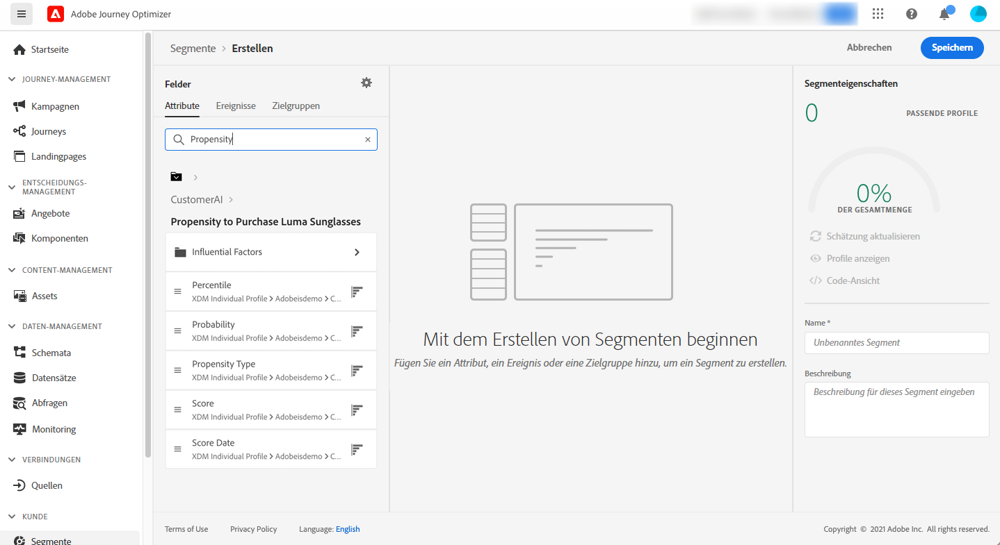

# Integration mit Intelligent Services {#ai-overview}

Die Integration mit **[!DNL Adobe Intelligent Services]** ermöglicht es Ihnen, die Leistungsfähigkeit von künstlicher Intelligenz und maschinellem Lernen in Anwendungsfällen mit Kundenerlebnissen zu nutzen. So können Marketing-Analysten mithilfe von Konfigurationen auf Unternehmensebene spezifische Prognosen für die Anforderungen der Firma erstellen, ohne dass hierfür Kenntnisse aus der Datenwissenschaft erforderlich sind.

[!DNL Intelligent Services], die auf Adobe Experience Platform basieren, bieten Marketing-Experten, die für das Kundenerlebnis verantwortlich sind, Zugriff auf einen KI-Service. So kann jeder das Kundenverhalten vorhersagen, die Wirkung einer Kampagne messen oder höhere Gewinne aus Investitionen ziehen. Weitere Informationen zu [!DNL Adobe Intelligent Services] finden Sie in der [Dokumentation zu Adobe Experience Platform](https://experienceleague.adobe.com/docs/experience-platform/intelligent-services/home.html?lang=de){target="_blank"}.

Durch die Integration von [!DNL Journey Optimizer] mit [!DNL Intelligent Services] können Sie Kundenprognosen nutzen.

Kunden-KI ist Teil von [!DNL Adobe Intelligent Services]. Der Service hilft vorauszusagen, was ein Kunde wahrscheinlich tun wird. Weitere Informationen finden Sie in der [Dokumentation zu Adobe Experience Platform](https://experienceleague.adobe.com/docs/experience-platform/intelligent-services/customer-ai/overview.html?lang=de){target="_blank"}.

Mit Kunden-KI können Marken auf maschinellem Lernen basierende Abwanderungs- oder Konversionswerte erstellen, die anschließend als Profilattribute in den Adobe Experience Platform-Profilen (Echtzeit-Kundenprofilen) verfügbar sind.

Folglich können sie wie jedes andere Profilattribut in den Bedingungen von Journey Optimizer (zum Treffen der besten Entscheidungen), bei Aktionen oder beim Erstellen von Segmenten verwendet werden.

