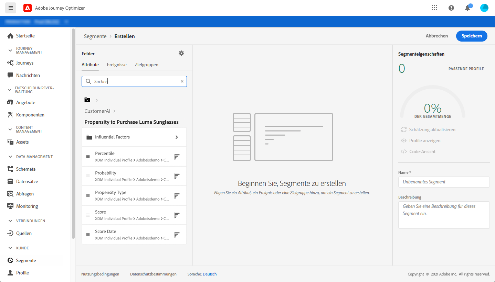

# Integration mit Intelligent Services {#ai-overview}

Die Integration mit Intelligent Services ermöglicht es Ihnen, die Leistungsfähigkeit von künstlicher Intelligenz und maschinellem Lernen in Anwendungsfällen mit Kundenerlebnissen zu nutzen. So können Marketing-Analysten mithilfe von Konfigurationen auf Unternehmensebene spezifische Prognosen für die Anforderungen der Firma erstellen, ohne dass hierfür Kenntnisse aus der Datenwissenschaft erforderlich ist.

Weitere Informationen zu Intelligent Services finden Sie in der [Dokumentation](https://docs.adobe.com/content/help/de-DE/experience-platform/intelligent-services/home.html).

Mit dieser Integration können Sie Kundenprognosen nutzen.

Kunden-KI ist Teil von Intelligent Services. Der Service hilft vorauszusagen, was ein Kunde wahrscheinlich tun wird. Weitere Informationen finden Sie in der [Dokumentation](https://docs.adobe.com/content/help/de-DE/experience-platform/intelligent-services/customer-ai/overview.html).

Mit Kunden-KI können Marken auf maschinellem Lernen basierende Abwanderungs- oder Konversionswerte erstellen, die anschließend als Profilattribute in den Adobe Experience Platform-Profilen (Echtzeit-Kundenprofilen) verfügbar sind.

Daher können sie als beliebige andere Profilattribute in Journey Optimizer-Bedingungen (zum Treffen der besten Entscheidungen), Aktionen oder Segmentaufbau verwendet werden.

Beachten Sie, dass Kunden-KI eine gebührenpflichtige Funktion von Adobe Experience Platform ist.