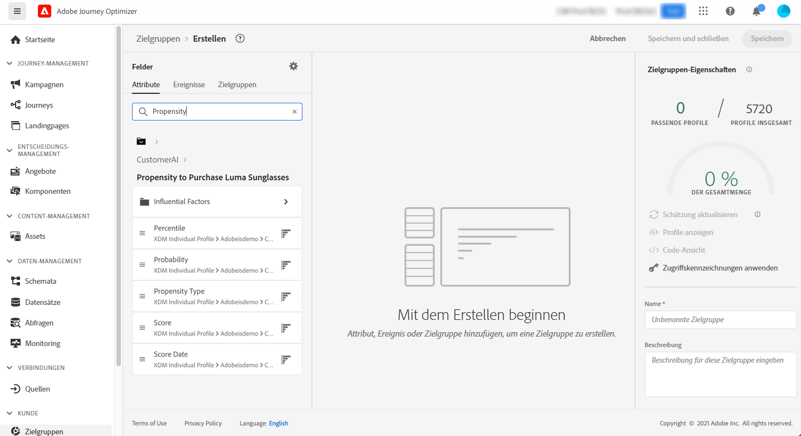

# Integration mit Intelligent Services {#ai-overview}

Die Integration mit **[!DNL Adobe Intelligent Services]** ermöglicht es Ihnen, künstliche Intelligenz und maschinelles Lernen für Anwendungsfälle mit Kundenerlebnissen zu nutzen. So können Marketing-Analysten mithilfe von Konfigurationen auf Unternehmensebene auf die Anforderungen des Unternehmens zugeschnittene Prognosen erstellen, ohne dass hierfür Kenntnisse aus der Datenwissenschaft erforderlich sind.

[!DNL Intelligent Services], das auf Adobe Experience Platform basiert, bietet Marketing-Experten, die für das Kundenerlebnis verantwortlich sind, Zugriff auf KI als Service. Auf diese Weise lässt sich das Kundenverhalten einfach vorhersagen, die Wirkung einer Kampagne messen oder bessere Renditen für jede Investition sicherstellen. Weitere Informationen zu [!DNL Adobe Intelligent Services] finden Sie in der [Dokumentation zu Adobe Experience Platform](https://experienceleague.adobe.com/docs/experience-platform/intelligent-services/home.html?lang=de){target="_blank"}.

Durch die Integration von [!DNL Journey Optimizer] mit [!DNL Intelligent Services] können Sie Kundenprognosen nutzen.

Kunden-KI, eine Komponente von [!DNL Adobe Intelligent Services], sagt wahrscheinliche Kundenaktionen voraus. Siehe die [Adobe Experience Platform-Dokumentation](https://experienceleague.adobe.com/docs/experience-platform/intelligent-services/customer-ai/overview.html?lang=de){target="_blank"}.

Mit Kunden-KI können Marken auf maschinellem Lernen basierende Abwanderungs- oder Konversionswerte erstellen. Diese Bewertungen sind als Profilattribute in Adobe Experience Platform-Profilen (Echtzeit-Kundenprofil) verfügbar.

Daher können diese Attribute wie alle anderen Profilattribute in den Bedingungen von Journey Optimizer (zum Treffen optimaler Entscheidungen), in Aktionen oder beim Erstellen von Segmenten verwendet werden.

