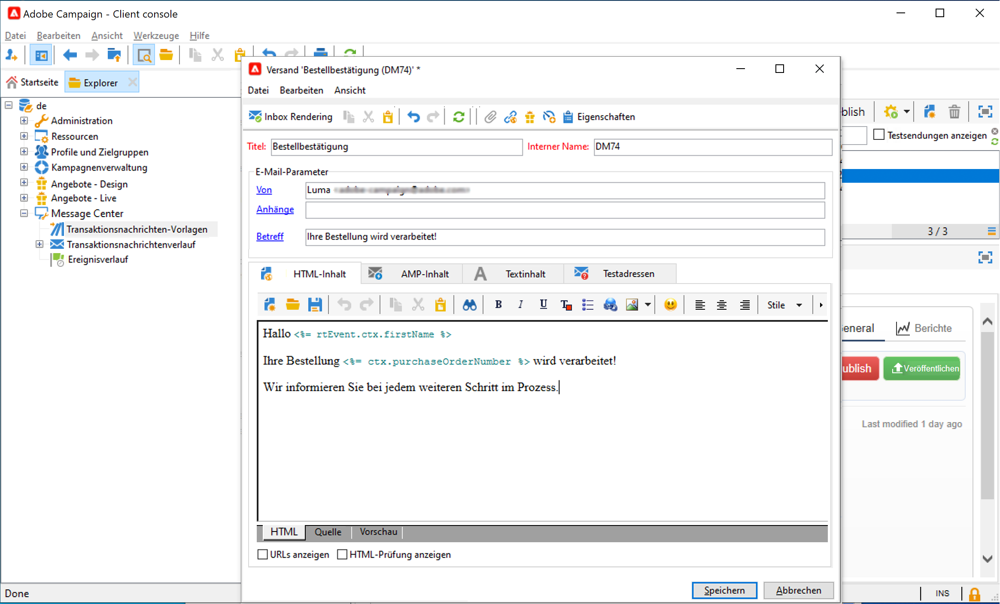
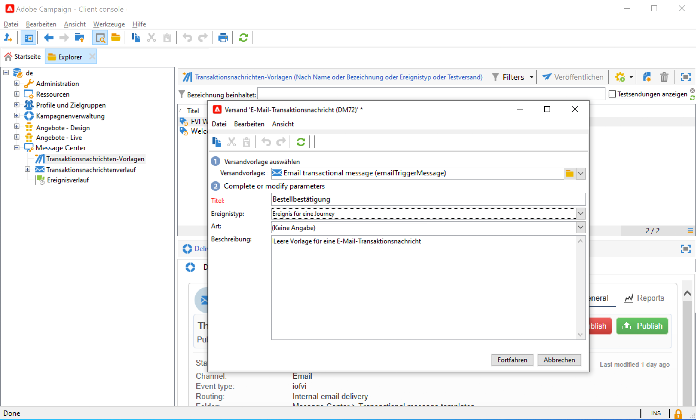
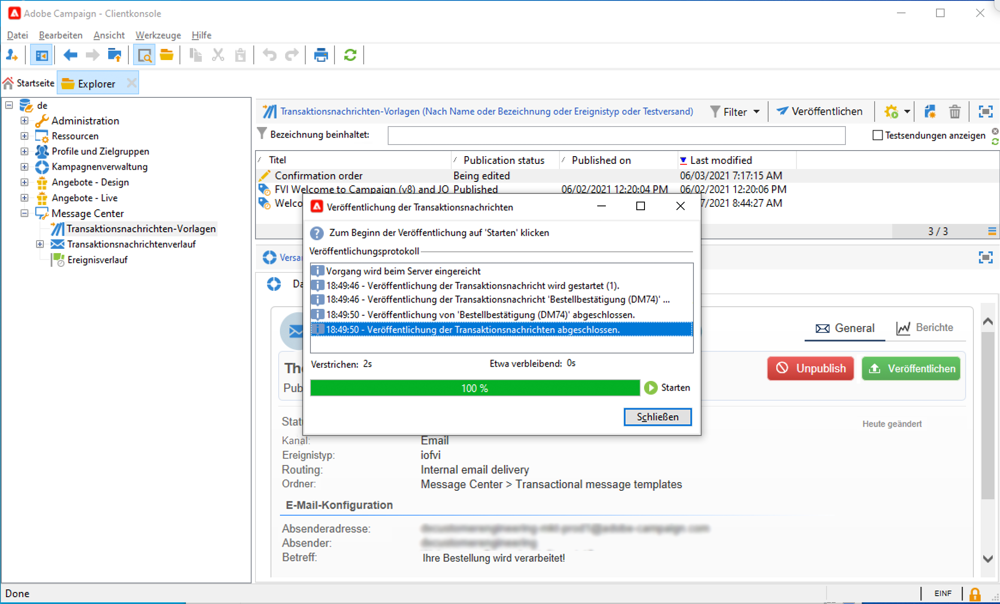
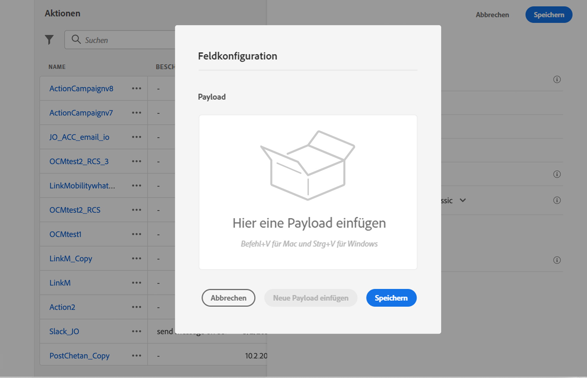
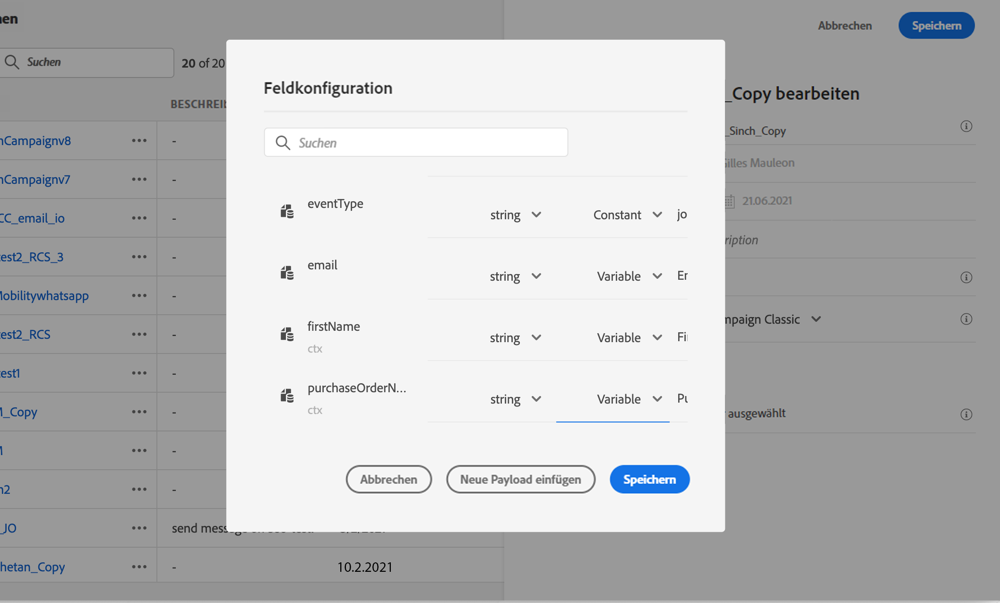
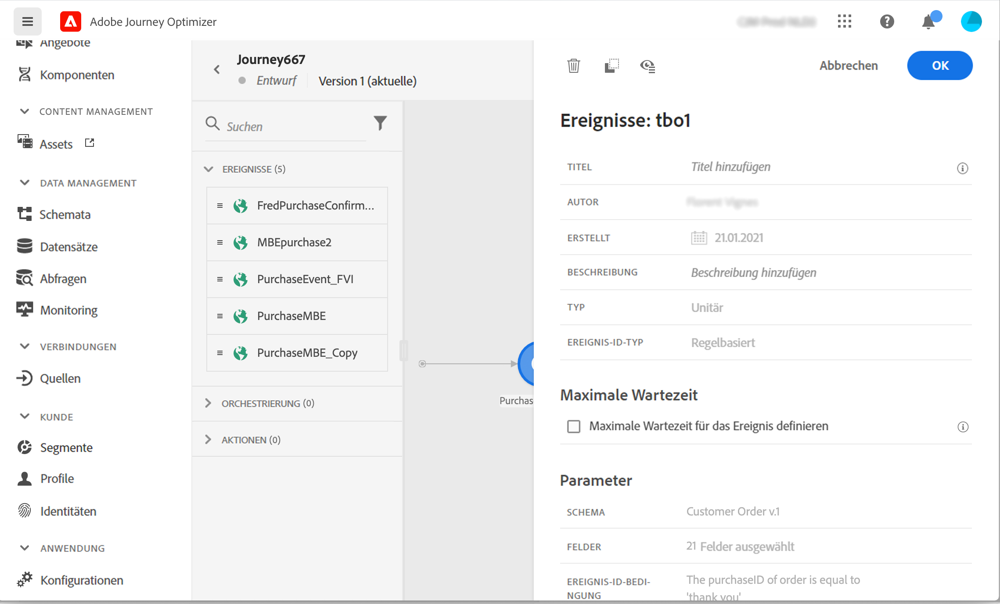
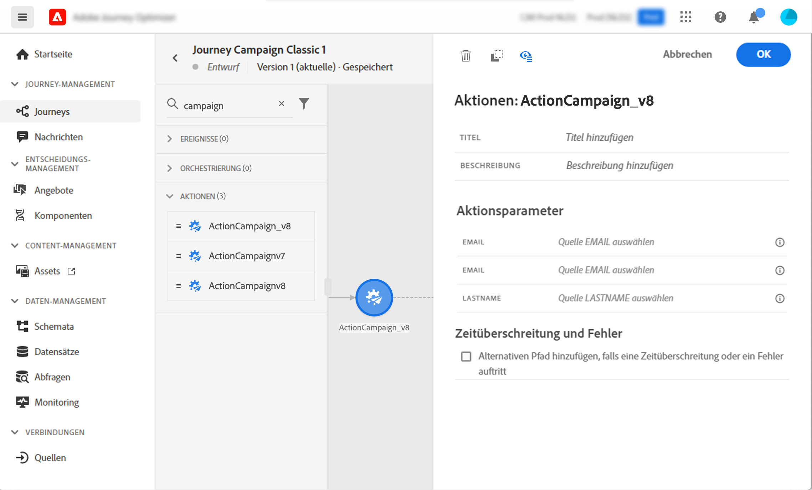
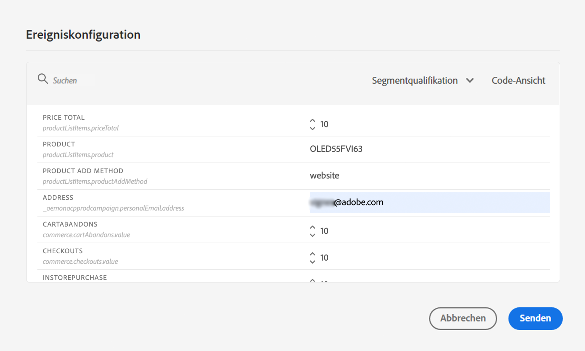

# Senden einer Nachricht mit Campaign v7/v8 {#campaign-v7-v8-use-case}

>[!BEGINSHADEBOX]

**Auf dieser Seite** Erfahren Sie, wie Sie eine E-Mail von einer Journey mithilfe der Integration mit Adobe Campaign v7 und v8 senden, einschließlich der Erstellung der Transaktionsvorlage, des Ereignisses und der Aktion.

>[!ENDSHADEBOX]

In diesem Anwendungsbeispiel werden alle Schritte erläutert, die zum Senden einer E-Mail mithilfe der Integration mit [!DNL Adobe Campaign] v7 und [!DNL Adobe Campaign] v8 erforderlich sind.

>[!NOTE]
>
>Um diese Integration verwenden zu können, benötigen Sie Campaign v7/v8 Build 9125 oder höher.

Erstellen Sie zunächst eine Transaktions-E-Mail-Vorlage in Campaign. Erstellen Sie anschließend in Journey Optimizer das Ereignis, die Aktion und die Journey.

Weiterführende Informationen zur Campaign-Integration finden Sie auf diesen Seiten:

* [Erstellen einer Campaign-Aktion](../action/acc-action.md)
* [Verwenden der Aktion in einer Journey](../building-journeys/using-adobe-campaign-v7-v8.md).

**[!DNL Adobe Campaign]**

Die Campaign-Instanz muss für diese Integration bereitgestellt werden. Die Funktion für Transaktionsnachrichten muss konfiguriert sein.

1. Melden Sie sich bei Ihrer Campaign-Kontrollinstanz an.

1. Wählen Sie unter **Administration** > **Platform** > **Aufzählungen** die Aufzählung **Ereignistyp** (eventType) aus. Erstellen Sie einen neuen Ereignistyp (in unserem Beispiel „Journey-Ereignis“). Verwenden Sie später beim Schreiben der JSON-Datei den internen Name des Ereignistyps.

   ![Konfigurieren eines Ereignisses in [!DNL Adobe Journey Optimizer] mit Schema- und Feldauswahl](assets/accintegration-uc-1.png)

1. Trennen Sie die Verbindung zur Instanz und stellen Sie sie erneut her, damit die Erstellung wirksam wird.

1. Erstellen Sie unter **Message Center** > **Transaktionsnachrichten-Vorlagen** eine neue E-Mail-Vorlage basierend auf dem zuvor erstellten Ereignistyp.

   

1. Gestalten Sie Ihre Vorlage. In diesem Beispiel wird eine Personalisierung auf den Vornamen und die Bestellnummer des Profils angewendet. Der Vorname befindet sich in der [!DNL Adobe Experience Platform] Datenquelle und die Bestellnummer ist ein Feld aus dem Journey Optimizer-Ereignis. Stellen Sie sicher, dass Sie die richtigen Feldnamen in Campaign verwenden.

   

1. Veröffentlichen Sie Ihre Transaktionsnachrichtenvorlage.

   

1. Die JSON-Payload muss entsprechend der Vorlage geschrieben werden.

```
{
     "channel": "email",
     "eventType": "journey-event",
     "email": "Email address",
     "ctx": {
          "firstName": "First name", "purchaseOrderNumber": "Purchase order number"
     }
}
```

* Beim Kanal geben Sie „E-Mail“ ein.
* Verwenden Sie für eventType den internen Namen des zuvor erstellten Ereignistyps.
* Die E-Mail-Adresse ist eine Variable, sodass Sie ein beliebiges Label eingeben können.
* Unter ctx sind die Personalisierungsfelder auch Variablen.

**Journey Optimizer**

1. Erstellen Sie ein Ereignis. Schließen Sie das Feld „purchaseOrderNumber“ ein.

   ![Konfigurationsbildschirm für benutzerdefinierte Aktionen für die [!DNL Adobe Campaign] Classic-Integration](assets/accintegration-uc-5.png)

1. Erstellen Sie eine Aktion in Journey Optimizer, die der Kampagnenvorlage entspricht. Wählen **in der Dropdown** Liste „Aktionstyp“ **[!DNL Adobe Campaign]Classic**.

   ![Auswahl des Aktionstyps mit [!DNL Adobe Campaign] Option Classic](assets/accintegration-uc-6.png)

1. Klicken Sie auf das Feld **Payload** und fügen Sie die zuvor erstellte JSON-Datei ein.

   

1. Ändern Sie für die E-Mail-Adresse und die beiden Personalisierungsfelder **Konstante** in **Variable**.

   

1. Erstellen Sie nun eine neue Journey und beginnen Sie mit dem zuvor erstellten Ereignis.

   

1. Fügen Sie die Aktion hinzu und ordnen Sie jedes Feld dem richtigen Feld in Journey Optimizer zu.

   

1. Testen Sie Ihre Journey.

   

1. Sie können Ihre Journey jetzt veröffentlichen.
