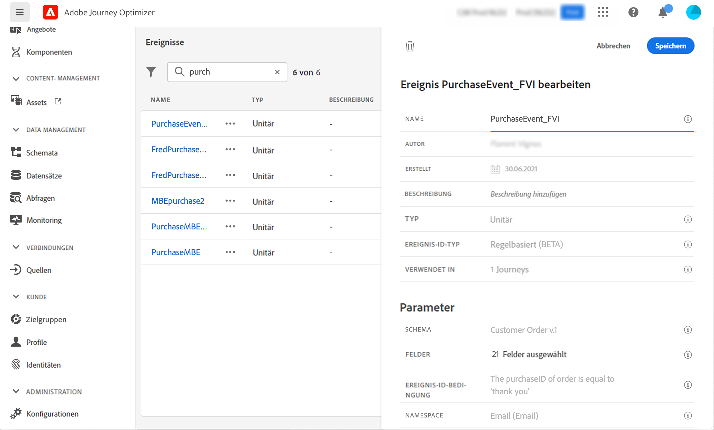
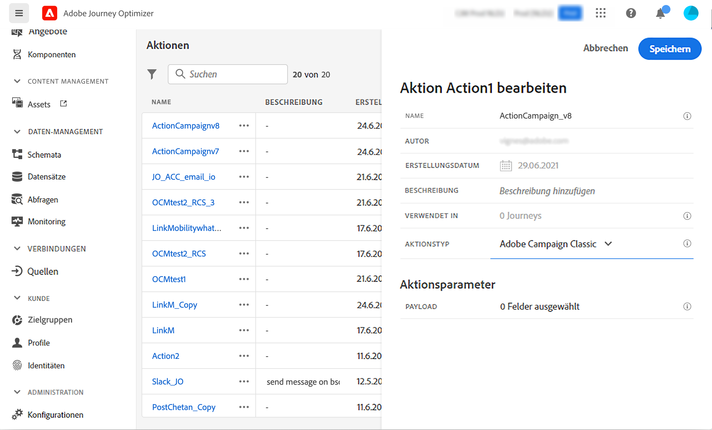

# Anwendungsfall: Senden einer Nachricht mit Campaign v7/v8 {#campaign-v7-v8-use-case}

In diesem Anwendungsbeispiel werden alle Schritte erläutert, die zum Senden einer E-Mail mithilfe der Integration mit Adobe Campaign v7 und Adobe Campaign v8 erforderlich sind.

>[!NOTE]
>
>Um diese Integration verwenden zu können, benötigen Sie Campaign v7/v8 Build 9125 oder höher.

Erstellen Sie zunächst eine Transaktions-E-Mail-Vorlage in Campaign. Erstellen Sie dann in Journey Optimizer das Ereignis, die Aktion und entwerfen Sie die Journey.

Weiterführende Informationen zur Campaign-Integration finden Sie auf diesen Seiten:

* [Erstellen einer Campaign-Aktion](../action/acc-action.md)
* [Verwenden der Aktion in einer Journey](../building-journeys/using-adobe-campaign-v7-v8.md).

**Adobe Campaign**

Für diese Integration muss Ihre Campaign-Instanz bereitgestellt werden. Die Transaktionsnachrichten-Funktion muss konfiguriert sein.

1. Melden Sie sich bei Ihrer Campaign-Kontrollinstanz an.

1. Wählen Sie unter **Administration** > **Platform** > **Auflistungen** die Auflistung **Ereignistyp** (eventType) aus. Erstellen Sie einen neuen Ereignistyp (in unserem Beispiel „Journey-Ereignis“). Verwenden Sie den internen Namen des Ereignistyps, wenn Sie die JSON-Datei später schreiben.

   

1. Trennen Sie die Verbindung zur Instanz und verbinden Sie sie erneut, damit die Erstellung wirksam wird.

1. Erstellen Sie unter **Message Center** > **Transaktionsnachrichten-Vorlagen** eine neue E-Mail-Vorlage basierend auf dem zuvor erstellten Ereignistyp.

   

1. Gestalten Sie Ihre Vorlage. In diesem Beispiel wird die Personalisierung auf den Vornamen des Profils und die Bestellnummer angewendet. Der Vorname befindet sich in der Adobe Experience Platform-Datenquelle und die Bestellnummer ist ein Feld aus dem Journey Optimizer-Ereignis. Stellen Sie sicher, dass Sie die richtigen Feldnamen in Campaign verwenden.

   

1. Veröffentlichen Sie Ihre Transaktionsnachrichtenvorlage.

   

1. Schreiben Sie die JSON-Payload, die der Vorlage entspricht.

```
{
     "channel": "email",
     "eventType": "journey-event",
     "email": "Email address",
     "ctx": {
          "firstName": "First name", "purchaseOrderNumber": "Purchase order number"
     }
}
```

* Beim Kanal geben Sie „E-Mail“ ein.
* Verwenden Sie für eventType den internen Namen des zuvor erstellten Ereignistyps.
* Die E-Mail-Adresse ist eine Variable, sodass Sie einen beliebigen Titel eingeben können.
* Unter ctx sind die Personalisierungsfelder auch Variablen.

**Journey Optimizer**

1. Erstellen Sie ein Ereignis. Fügen Sie das Feld „purchaseOrderNumber“ hinzu.

   

1. Erstellen Sie in Journey Optimizer eine Aktion, die Ihrer Kampagnenvorlage entspricht. Wählen Sie aus der Dropdown-Liste **Aktionstyp** die Option **Adobe Campaign Classic** aus.

   

1. Klicken Sie auf **Feld „Payload** und fügen Sie die zuvor erstellte JSON-Datei ein.

   

1. Ändern Sie für die E-Mail-Adresse und die beiden Personalisierungsfelder **Konstante** in **Variable**.

   

1. Erstellen Sie nun eine neue Journey und beginnen Sie mit dem zuvor erstellten Ereignis.

   

1. Fügen Sie die Aktion hinzu und ordnen Sie jedes Feld dem richtigen Feld in Journey Optimizer zu.

   

1. Testen Sie Ihre Journey.

   

1. Sie können Ihre Journey jetzt veröffentlichen.
