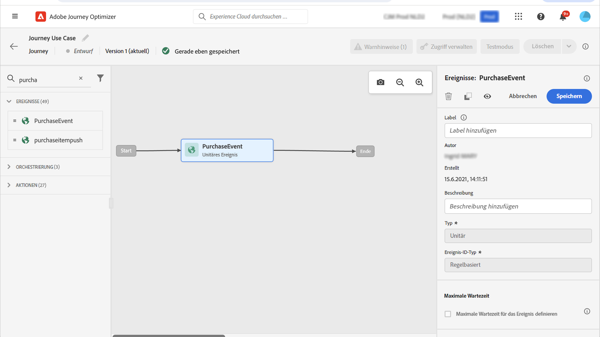
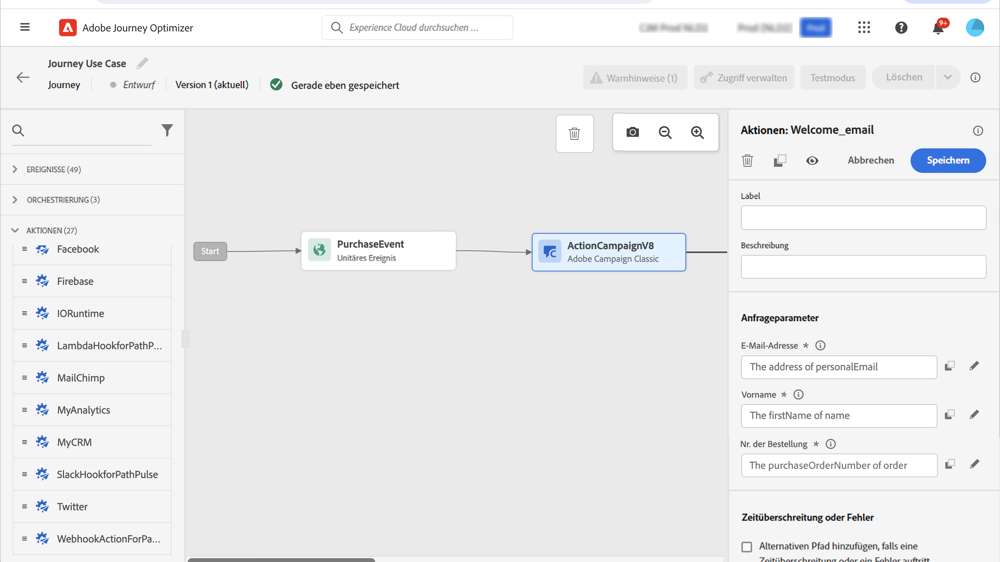

# Anwendungsfall: Versand einer Nachricht mit Campaign v7/v8 {#campaign-classic-use-case}

In diesem Anwendungsbeispiel werden alle Schritte vorgestellt, die zum Senden einer E-Mail mithilfe der Integration mit Adobe Campaign Classic v7 und Adobe Campaign v8 erforderlich sind.

Zunächst wird in Campaign eine Transaktions-E-Mail-Vorlage erstellt. Anschließend erstellen wir in Journey Optimizer das Ereignis, die Aktion und entwerfen die Journey.

Weiterführende Informationen zur Campaign-Integration finden Sie auf diesen Seiten:

* [Erstellen einer Kampagnenaktion](../action/acc-action.md)
* [Verwenden der Aktion in einer Journey](../building-journeys/using-adobe-campaign-classic.md).

**Adobe Campaign**

Ihre Campaign-Instanz muss für diese Integration bereitgestellt werden. Die Funktion für Transaktionsnachrichten muss konfiguriert werden.

1. Melden Sie sich bei Ihrer Campaign-Kontrollinstanz an.

1. under **Administration** > **Plattform** > **Auflistungen**, wählen Sie die **Ereignistyp** (eventType)-Auflistung. Erstellen Sie einen neuen Ereignistyp (&quot;journey-event&quot;, in unserem Beispiel). Sie müssen den internen Namen des Ereignistyps beim späteren Schreiben der JSON-Datei verwenden.

   

1. Trennen Sie die Verbindung zur Instanz und verbinden Sie sie erneut, damit die Erstellung wirksam ist.

1. under **Message Center** > **Transaktionsnachrichten-Vorlagen** erstellen Sie eine neue E-Mail-Vorlage basierend auf dem zuvor erstellten Ereignistyp.

   

1. Entwerfen Sie Ihre Vorlage. In diesem Beispiel verwenden wir eine Personalisierung für den Vornamen und die Bestellnummer des Profils. Der Vorname befindet sich in der Adobe Experience Platform-Datenquelle und die Bestellnummer ist ein Feld aus unserem Journey Optimizer-Ereignis. Stellen Sie sicher, dass Sie die richtigen Feldnamen in Campaign verwenden.

   

1. Veröffentlichen Sie Ihre Transaktionsvorlage.

   

1. Jetzt müssen Sie die JSON-Payload schreiben, die der Vorlage entspricht.

```
{
     "channel": "email",
     "eventType": "journey-event",
     "email": "Email address",
     "ctx": {
          "firstName": "First name", "purchaseOrderNumber": "Purchase order number"
     }
}
```

* Geben Sie für den Kanal &quot;email&quot;ein.
* Verwenden Sie für eventType den internen Namen des zuvor erstellten Ereignistyps.
* Die E-Mail-Adresse ist eine Variable, sodass Sie einen beliebigen Titel eingeben können.
* Unter ctx sind die Personalisierungsfelder auch Variablen.

**Journey Optimizer**

1. Zunächst müssen Sie ein Ereignis erstellen. Stellen Sie sicher, dass Sie das Feld &quot;purchaseOrderNumber&quot;einschließen.

   

1. Anschließend müssen Sie in Journey Optimizer eine Aktion erstellen, die Ihrer Campaign-Vorlage entspricht. Im **Aktionstyp** Dropdown-Liste auswählen **Adobe Campaign Classic**.

   

1. Klicken Sie auf **Payload-Feld** und fügen Sie die zuvor erstellte JSON ein.

   

1. Ändern Sie für die E-Mail-Adresse und die beiden Personalisierungsfelder **Konstante** nach **Variable**.

   

1. Erstellen Sie jetzt eine neue Journey und beginnen Sie mit dem zuvor erstellten Ereignis.

   

1. Fügen Sie die Aktion hinzu und ordnen Sie jedes Feld dem richtigen Feld in Journey Optimizer zu.

   

1. Testen Sie Ihre Journey.

   

1. Sie können Ihre Journey jetzt veröffentlichen.
