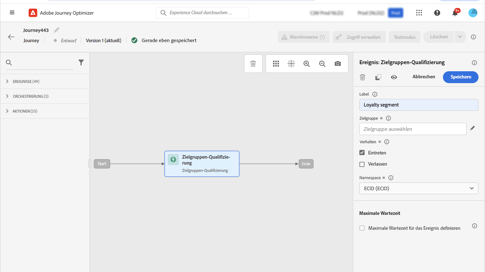
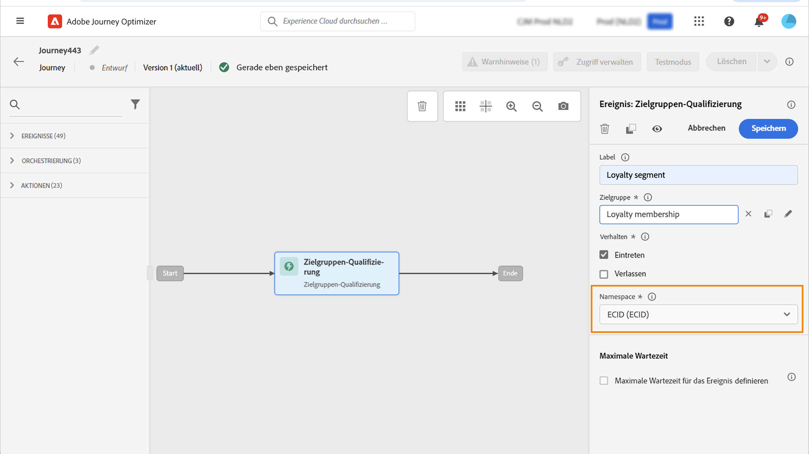
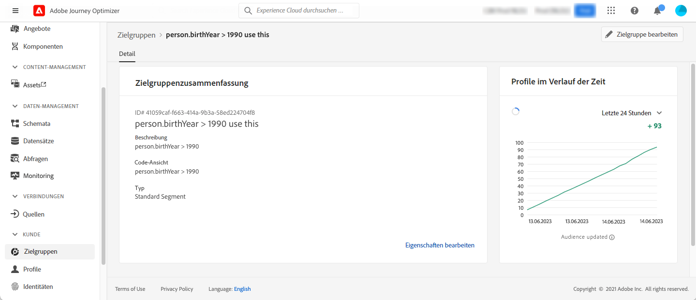

# Zielgruppen-Qualifizierungsereignisse {#segment-qualification}

## Informationen zu Zielgruppen-Qualifizierungsereignissen{#about-segment-qualification}

>[!CONTEXTUALHELP]
>id="ajo_journey_event_segment_qualification"
>title="Zielgruppen-Qualifizierungsereignisse"
>abstract="Mit dieser Aktivität kann Ihre Journey die Ein- und Austritte von Profilen in Adobe Experience Platform-Zielgruppen überwachen, damit Personen in eine Journey eintreten oder damit fortfahren."

Mit dieser Aktivität kann Ihre Journey die Ein- und Austritte von Profilen in Adobe Experience Platform-Zielgruppen überwachen, damit Personen in eine Journey eintreten oder damit fortfahren. Weitere Informationen zum Erstellen von Zielgruppen finden Sie in diesem [Abschnitt](../audience/about-audiences.md).

Angenommen, Sie verfügen über eine Zielgruppe für „Silber-Kundinnen und -Kunden“. Mit dieser Aktivität können Sie dafür sorgen, dass alle neuen Silber-Kunden eine Journey beginnen, und ihnen eine Reihe personalisierter Nachrichten senden.

Diese Art von Ereignis kann als erster Schritt oder auch später in der Journey positioniert werden.

### Wichtige Hinweise{#important-notes-segment-qualification}

* Denken Sie daran, dass Adobe Experience Platform-Zielgruppen entweder einmal täglich (**Batch**-Zielgruppen) oder in Echtzeit (**Streaming**-Zielgruppen unter Verwendung der Option „Hochfrequenz-Zielgruppen“ von Adobe Experience Platform) berechnet werden.

* Wenn die ausgewählte Zielgruppe gestreamt wird, treten die zu dieser Zielgruppe gehörenden Personen in Echtzeit in die Journey ein. Bei einer Batch-Zielgruppe treten für diese Zielgruppe neu qualifizierte Personen in die Journey ein, wenn die Zielgruppenberechnung in Adobe Experience Platform ausgeführt wird.

* Feldergruppen für Erlebnisereignisse können nicht in Journeys verwendet werden, die mit einer Aktivität vom Typ „Zielgruppe lesen“, „Zielgruppen-Qualifizierung“ oder „Geschäftsereignis“ beginnen.

* Bei Verwendung einer Zielgruppenqualifizierung in einer Journey kann es bis zu 10 Minuten dauern, bis die Aktivität aktiv ist und die Profile überwacht, die in die Zielgruppe eintreten oder sie verlassen.

### Konfigurieren der Aktivität{#cnfigure-segment-qualification}

1. Erweitern Sie die Kategorie **[!UICONTROL Ereignisse]** und legen Sie eine Aktivität vom Typ **[!UICONTROL Zielgruppen-Qualifizierung]** in Ihrer Arbeitsfläche ab.

   

1. Fügen Sie der Aktivität einen **[!UICONTROL Titel]** hinzu. Dieser Schritt ist optional.

1. Klicken Sie in das Feld **[!UICONTROL Zielgruppe]** und wählen Sie die gewünschten Zielgruppen aus.

   >[!NOTE]
   >
   >Beachten Sie, dass Sie die in der Liste angezeigten Spalten anpassen und sortieren können.

   

   Nachdem die Zielgruppe hinzugefügt wurde, können Sie mit der Schaltfläche **[!UICONTROL Kopieren]** deren Namen und ID kopieren:

   `{"name":"Loyalty membership“,”id":"8597c5dc-70e3-4b05-8fb9-7e938f5c07a3"}`

   

1. Wählen Sie im Feld **[!UICONTROL Verhalten]** aus, ob Zielgruppeneintritte, -austritte oder beides überwacht werden soll.

   >[!NOTE]
   >
   >Beachten Sie, dass **[!UICONTROL Eintreten]** und **[!UICONTROL Verlassen]** den Zielgruppenteilnahmestatus **Realisiert** und **Ausgestiegen** von Adobe Experience Platform entsprechen. Weitere Informationen zum Auswerten einer Zielgruppe finden Sie in der [Dokumentation zum Segmentierungs-Service](https://experienceleague.adobe.com/docs/experience-platform/segmentation/tutorials/evaluate-a-segment.html?lang=de){target="_blank"}.

1. Wählen Sie einen Namespace aus. Dies ist nur erforderlich, wenn das Ereignis als erster Schritt der Journey positioniert wird. Standardmäßig ist das Feld mit dem zuletzt verwendeten Namespace vorausgefüllt.

   >[!NOTE]
   >
   >Sie können nur einen personenbasierten Identity-Namespace auswählen. Wenn Sie einen Namespace für eine Suchtabelle definiert haben (z. B.: Produkt-ID-Namespace für eine Produktsuche), ist er nicht in der Dropdown-Liste **Namespace** verfügbar.

   

Die Payload enthält die folgenden Kontextinformationen, die Sie in Bedingungen und Aktionen verwenden können:

* Verhalten (Eintritt, Austritt)
* Zeitstempel der Qualifizierung
* Zielgruppen-ID

Wenn Sie den Ausdruckseditor in einer Bedingung oder Aktion verwenden, die einer Aktivität vom Typ **[!UICONTROL Zielgruppen-Qualifizierung]** folgt, können Sie auf den Knoten **[!UICONTROL AudienceQualification]** zugreifen. Sie können zwischen der **[!UICONTROL letzten Qualifikationszeit]** und dem **[!UICONTROL Status]** (Einstieg oder Ausstieg) wählen.

Siehe [Bedingungsaktivität](../building-journeys/condition-activity.md#about_condition).

Eine neue Journey, die ein Zielgruppen-Qualifizierungsereignis enthält, ist zehn Minuten nach der Veröffentlichung einsatzbereit. Dieses Zeitintervall entspricht dem Cache-Aktualisierungsintervall des dedizierten Services. Daher müssen Sie zehn Minuten warten, bevor Sie diese Journey verwenden.

## Best Practices {#best-practices-segments}

Mit der Aktivität **[!UICONTROL Zielgruppen-Qualifizierung]** wird der sofortige Eintritt in Journeys von Personen möglich, die über eine Adobe Experience Platform-Zielgruppe qualifiziert oder disqualifiziert werden.

Die Empfangsgeschwindigkeit dieser Daten ist hoch. Durchgeführte Messungen zeigen eine Geschwindigkeit von 10.000 empfangenen Ereignissen pro Sekunde. Daher sollten Sie wissen, wie Eintrittsspitzen auftreten können, wie sie sich vermeiden lassen und wie Sie Ihre Journey darauf vorbereiten können.

### Batch-Zielgruppen{#batch-speed-segment-qualification}

Beachten Sie bei Verwendung der Zielgruppen-Qualifizierung für eine Batch-Zielgruppe, dass zum Zeitpunkt der täglichen Berechnung eine Eintrittsspitze auftritt. Der Umfang dieser Spitze hängt von der Zahl der Personen ab, die täglich in die Zielgruppe eintreten (bzw. daraus austreten).

Wenn die Batch-Zielgruppe neu erstellt und in einer Journey unmittelbar verwendet wird, kann der erste Berechnungs-Batch außerdem dazu führen, dass sehr viele Personen in die Journey eintreten.

### Streaming-Zielgruppen{#streamed-speed-segment-qualification}

Bei Verwendung der Zielgruppen-Qualifizierung für Streaming-Zielgruppen besteht aufgrund der kontinuierlichen Auswertung der Zielgruppe ein geringeres Risiko, dass es bei Ein-/Austritten zu großen Spitzen kommt. Wenn die Zielgruppendefinition dazu führt, dass sich eine große Zahl von Kundinnen und Kunden gleichzeitig qualifiziert, sind jedoch ebenfalls Spitzen möglich.

Weitere Informationen zur Streaming-Segmentierung finden Sie in der [Dokumentation zu Adobe Experience Platform](https://experienceleague.adobe.com/docs/experience-platform/segmentation/api/streaming-segmentation.html?lang=de#api).

### So vermeiden Sie Überlastungen{#overloads-speed-segment-qualification}

Im Folgenden finden Sie Best Practices, die Ihnen dabei helfen, eine Überlastung der für Journeys genutzten Systeme zu verhindern (Datenquellen, benutzerdefinierte Aktionen, Kanalaktionsaktivitäten).

Verwenden Sie in einer Aktivität vom Typ **[!UICONTROL Zielgruppen-Qualifizierung]** Batch-Zielgruppen nicht unmittelbar nach ihrer Erstellung. So lässt sich die erste Berechnungsspitze vermeiden. In der Journey-Arbeitsfläche wird eine gelbe Warnung angezeigt, wenn Sie im Begriff sind, eine bislang noch nie berechnete Zielgruppe zu verwenden.

Legen Sie eine Begrenzungsregel für Datenquellen und Aktionen fest, die in Journeys verwendet werden, um eine Überlastung zu vermeiden. Weitere Informationen zu Datensätzen finden Sie in der [Dokumentation zu Journey Orchestration](https://experienceleague.adobe.com/docs/journeys/using/working-with-apis/capping.html?lang=de){target="_blank"}. Beachten Sie, dass die Begrenzungsregel nicht erneut versucht wird. Für einen erneuten Versuch müssen Sie einen alternativen Pfad in der Journey verwenden, indem Sie in Bedingungen oder Aktionen das Kontrollkästchen **[!UICONTROL Alternativen Pfad hinzufügen, falls eine Zeitüberschreitung oder ein Fehler auftritt]** aktivieren.

Bevor Sie die Zielgruppe in einer Produktions-Journey verwenden, sollten Sie immer zuerst die Anzahl der Personen auswerten, die sich für diese Zielgruppe täglich qualifizieren. Wählen Sie dazu das Menü **[!UICONTROL Zielgruppen]** aus, öffnen Sie die Zielgruppe und sehen Sie sich dann das Diagramm **[!UICONTROL Profile im Zeitverlauf]** an.

