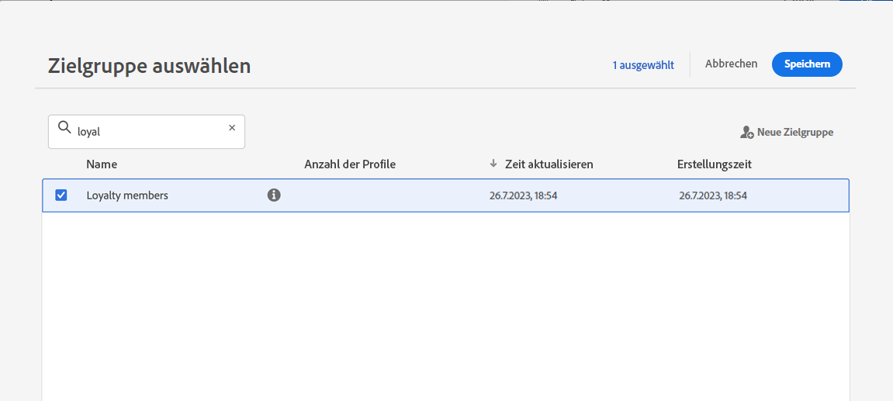

# Zielgruppenqualifikationsereignisse {#segment-qualification}

## Über Zielgruppenqualifizierungsereignisse{#about-segment-qualification}

>[!CONTEXTUALHELP]
>id="ajo_journey_event_segment_qualification"
>title="Zielgruppenqualifizierungsereignisse"
>abstract="Diese Aktivität ermöglicht es Ihrer Journey, die Ein- und Austritte von Profilen in Adobe Experience Platform-Audiences zu überwachen, um Kontakte dazu zu bringen, in eine Journey einzutreten oder in einer solchen fortzufahren."

Diese Aktivität ermöglicht es Ihrer Journey, die Ein- und Austritte von Profilen in Adobe Experience Platform-Audiences zu überwachen, um Kontakte dazu zu bringen, in eine Journey einzutreten oder in einer solchen fortzufahren. Weiterführende Informationen zur Erstellung von Zielgruppen finden Sie in diesem Abschnitt [Abschnitt](../audience/about-audiences.md).

Nehmen wir an, Sie haben eine Audience vom Typ &quot;Silber-Kunde&quot;. Mit dieser Aktivität können Sie dafür sorgen, dass alle neuen Silber-Kunden eine Journey beginnen, und ihnen eine Reihe personalisierter Nachrichten senden.

Diese Art von Ereignis kann als erster Schritt oder auch später in der Journey positioniert werden.

>[!IMPORTANT]
>
>Beachten Sie, dass Adobe Experience Platform-Zielgruppen entweder einmal täglich (**Batch** Zielgruppen) oder in Echtzeit (**gestreamt** Zielgruppen unter Verwendung der Option &quot;Zielgruppen mit hoher Häufigkeit&quot;von Adobe Experience Platform).
>
>Wenn die ausgewählte Audience gestreamt wird, treten die Kontakte, die zu dieser Audience gehören, möglicherweise in Echtzeit in die Journey ein. Wenn es sich bei der Zielgruppe um eine Batch-Zielgruppe handelt, geben Personen, die für diese Zielgruppe neu qualifiziert sind, bei der Ausführung der Zielgruppenberechnung in Adobe Experience Platform möglicherweise die Journey ein.
>
>Feldergruppen für Erlebnisereignisse können nicht in Journey verwendet werden, die mit der Aktivität Lesen der Zielgruppe, Zielgruppenqualifizierung oder Geschäftsereignis beginnen.

1. Entfalten Sie die **[!UICONTROL Veranstaltungen]** Kategorie und Ablegen einer **[!UICONTROL Zielgruppenqualifikation]** -Aktivität in Ihre Arbeitsfläche.

   

1. Fügen Sie der Aktivität einen **[!UICONTROL Titel]** hinzu. Dieser Schritt ist optional.

1. Klicken Sie in **[!UICONTROL Zielgruppe]** und wählen Sie die Zielgruppen aus, die Sie nutzen möchten.

   >[!NOTE]
   >
   >Beachten Sie, dass Sie die in der Liste angezeigten Spalten anpassen und sortieren können.

   

   Nachdem die Audience hinzugefügt wurde, wird die **[!UICONTROL Kopieren]** -Schaltfläche können Sie den Namen und die Kennung kopieren:

   `{"name":"Loyalty membership“,”id":"8597c5dc-70e3-4b05-8fb9-7e938f5c07a3"}`

   

1. Im **[!UICONTROL Verhalten]** auswählen, ob Sie Eintritte, Ausstiege oder beides der Zielgruppe überwachen möchten.

   >[!NOTE]
   >
   >Beachten Sie Folgendes: **[!UICONTROL Eingabe]** und **[!UICONTROL Beenden]** entsprechen **Realisiert** und **Beendet** Status der Zielgruppenbeteiligung von Adobe Experience Platform. Weiterführende Informationen zur Audience-Evaluierung finden Sie im Abschnitt [Dokumentation zum Segmentierungsdienst](https://experienceleague.adobe.com/docs/experience-platform/segmentation/tutorials/evaluate-a-segment.html?lang=de){target="_blank"}.

1. Wählen Sie einen Namespace aus. Dies ist nur erforderlich, wenn das Ereignis als erster Schritt der Journey positioniert wird. Standardmäßig ist das Feld mit dem zuletzt verwendeten Namespace vorausgefüllt.

   >[!NOTE]
   >
   >Sie können nur einen personenbasierten Identity-Namespace auswählen. Wenn Sie einen Namespace für eine Suchtabelle definiert haben (z. B.: Produkt-ID-Namespace für eine Produktsuche), ist er nicht in der Dropdown-Liste **Namespace** verfügbar.

   

Die Payload enthält die folgenden Kontextinformationen, die Sie in Bedingungen und Aktionen verwenden können:

* Verhalten (Eintritt, Austritt)
* Zeitstempel der Qualifizierung
* die Zielgruppen-ID

Wenn Sie den Ausdruckseditor in einer Bedingung oder Aktion verwenden, die auf **[!UICONTROL Zielgruppenqualifikation]** -Aktivität, haben Sie Zugriff auf die **[!UICONTROL AudienceQualification]** Knoten. Sie können zwischen der **[!UICONTROL letzten Qualifikationszeit]** und dem **[!UICONTROL Status]** (Einstieg oder Ausstieg) wählen.

Siehe [Bedingungsaktivität](../building-journeys/condition-activity.md#about_condition).

Eine neue Journey, die ein Ereignis zur Zielgruppenqualifizierung enthält, ist zehn Minuten nach der Veröffentlichung funktionsfähig. Dieses Zeitintervall entspricht dem Cache-Aktualisierungsintervall des dedizierten Services. Daher müssen Sie zehn Minuten warten, bevor Sie diese Journey verwenden.

## Best Practices {#best-practices-segments}

Die **[!UICONTROL Zielgruppenqualifikation]** -Aktivität ermöglicht den sofortigen Eintritt in die Journey von Personen, die sich für eine Adobe Experience Platform-Zielgruppe qualifizieren oder deren Qualifikation entziehen.

Die Empfangsgeschwindigkeit dieser Daten ist hoch. Durchgeführte Messungen zeigen eine Geschwindigkeit von 10.000 empfangenen Ereignissen pro Sekunde. Daher sollten Sie wissen, wie Eintrittsspitzen auftreten können, wie sie sich vermeiden lassen und wie Sie Ihre Journey darauf vorbereiten können.

### Batch-Zielgruppen{#batch-speed-segment-qualification}

Beachten Sie bei Verwendung der Zielgruppenqualifikation für eine Batch-Zielgruppe, dass zum Zeitpunkt der täglichen Berechnung eine Spitze des Eintritts erreicht wird. Die Größe der Spitze hängt von der Anzahl der Kontakte ab, die die Zielgruppe täglich aufrufen (oder verlassen).

Wenn die Batch-Zielgruppe neu erstellt und sofort in einer Journey verwendet wird, kann der erste Berechnungs-Batch außerdem dazu führen, dass sehr viele Einzelpersonen in die Journey eintreten.

### Streaming-Zielgruppen{#streamed-speed-segment-qualification}

Bei Verwendung der Zielgruppenqualifikation für Streaming-Zielgruppen besteht aufgrund der kontinuierlichen Auswertung der Zielgruppe ein geringeres Risiko, dass es zu großen Spitzen bei Ein-/Austritten kommt. Wenn die Zielgruppendefinition dazu führt, dass eine große Anzahl von Kunden gleichzeitig qualifiziert wird, kann es auch zu einer Spitze kommen.

Weitere Informationen zur Streaming-Segmentierung finden Sie in der [Dokumentation zu Adobe Experience Platform](https://experienceleague.adobe.com/docs/experience-platform/segmentation/api/streaming-segmentation.html?lang=de#api).

### So vermeiden Sie Überlastungen{#overloads-speed-segment-qualification}

Im Folgenden finden Sie Best Practices, die Ihnen dabei helfen, eine Überlastung der für Journeys genutzten Systeme zu verhindern (Datenquellen, benutzerdefinierte Aktionen, Kanalaktionsaktivitäten).

Verwenden Sie nicht **[!UICONTROL Zielgruppenqualifikation]** -Aktivität, einer Batch-Zielgruppe unmittelbar nach ihrer Erstellung. So lässt sich die erste Berechnungsspitze vermeiden. Beachten Sie, dass in der Journey-Arbeitsfläche eine gelbe Warnung angezeigt wird, wenn Sie im Begriff sind, eine Zielgruppe zu verwenden, die noch nie berechnet wurde.

Legen Sie eine Begrenzungsregel für Datenquellen und Aktionen fest, die in Journeys verwendet werden, um eine Überlastung zu vermeiden. Weitere Informationen zu Datensätzen finden Sie in der [Dokumentation zu Journey Orchestration](https://experienceleague.adobe.com/docs/journeys/using/working-with-apis/capping.html?lang=de){target="_blank"}. Beachten Sie, dass die Begrenzungsregel nicht erneut versucht wird. Für einen erneuten Versuch müssen Sie einen alternativen Pfad in der Journey verwenden, indem Sie in Bedingungen oder Aktionen das Kontrollkästchen **[!UICONTROL Alternativen Pfad hinzufügen, falls eine Zeitüberschreitung oder ein Fehler auftritt]** aktivieren.

Bevor Sie die Audience in einer Produktions-Journey verwenden, sollten Sie immer zuerst das Volumen der Kontakte auswerten, die sich täglich für diese Audience qualifizieren. Dazu können Sie die **[!UICONTROL Zielgruppe]** öffnen Sie die Zielgruppe und sehen Sie sich dann die **[!UICONTROL Profile im Zeitverlauf]** Diagramm.

