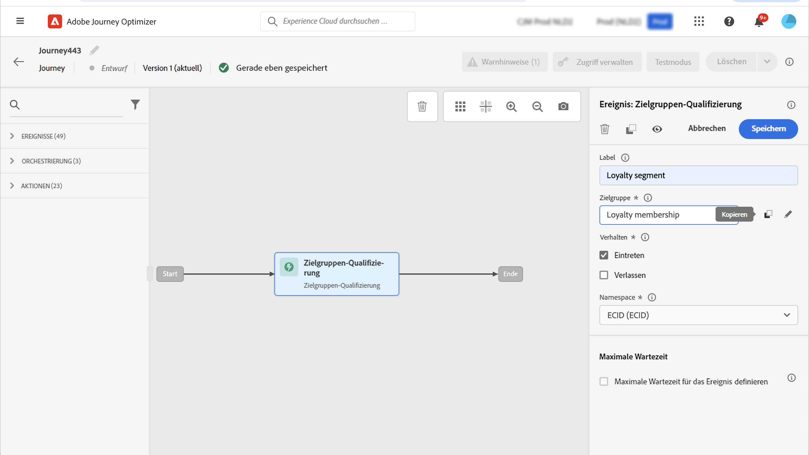

# Zielgruppen-Qualifizierungsereignisse {#segment-qualification}

>[!CONTEXTUALHELP]
>id="ajo_journey_event_segment_qualification"
>title="Zielgruppen-Qualifizierungsereignisse"
>abstract="Mit dieser Aktivität kann eine Journey die Ein- und Austritte von Profilen in Adobe Experience Platform-Zielgruppen überwachen, damit Personen in eine Journey eintreten oder damit fortfahren."

## Informationen zu Zielgruppen-Qualifizierungsereignissen{#about-segment-qualification}

Mit dieser Aktivität kann eine Journey die Ein- und Austritte von Profilen in Adobe Experience Platform-Zielgruppen überwachen, damit Personen in eine Journey eintreten oder damit fortfahren. Weitere Informationen zum Erstellen von Zielgruppen finden Sie in diesem [Abschnitt](../audience/about-audiences.md).

Angenommen, Sie verfügen über eine Zielgruppe für „Silber-Kundinnen und -Kunden“. Mit dieser Aktivität können Sie dafür sorgen, dass alle neuen Silber-Kunden eine Journey beginnen, und ihnen eine Reihe personalisierter Nachrichten senden.

Diese Art von Ereignis kann als erster Schritt oder auch später in der Journey positioniert werden.

➡️ [Funktion im Video kennenlernen](#video)

>[!CAUTION]
>
>Bevor Sie mit der Konfiguration einer Zielgruppen-Qualifizierung beginnen[ lesen Sie die Leitplanken und Einschränkungen ](#audience-qualification-guardrails).

## Konfigurieren der Aktivität {#configure-segment-qualification}

Gehen Sie wie folgt vor, um die Aktivität **[!UICONTROL Zielgruppen-Qualifizierung]** zu konfigurieren:

1. Erweitern Sie die Kategorie **[!UICONTROL Ereignisse]** und legen Sie eine Aktivität vom Typ **[!UICONTROL Zielgruppen-Qualifizierung]** in Ihrer Arbeitsfläche ab.

   

1. Fügen Sie der Aktivität einen **[!UICONTROL Titel]** hinzu. Dieser Schritt ist optional.

1. Klicken Sie in das Feld **[!UICONTROL Zielgruppe]** und wählen Sie die gewünschten Zielgruppen aus.

   >[!NOTE]
   >
   >Sie können die in der Liste angezeigten Spalten anpassen und sortieren.

   

   Nachdem die Zielgruppe hinzugefügt wurde, können Sie mit der Schaltfläche **[!UICONTROL Kopieren]** deren Namen und ID kopieren:

   `{"name":"Loyalty membership","id":"8597c5dc-70e3-4b05-8fb9-7e938f5c07a3"}`

   

1. Wählen Sie im Feld **[!UICONTROL Verhalten]** aus, ob Zielgruppeneintritte, -austritte oder beides überwacht werden soll.

   >[!NOTE]
   >
   >**[!UICONTROL Eintreten]** und **[!UICONTROL Verlassen]** entsprechen den **Realisiert** und **Ausgestiegen** Zielgruppenteilnahmestatus aus Adobe Experience Platform. Weitere Informationen zum Auswerten einer Zielgruppe finden Sie in der [Dokumentation zum Segmentierungs-Service](https://experienceleague.adobe.com/de/docs/experience-platform/segmentation/tutorials/evaluate-a-segment#interpret-segment-results){target="_blank"}.

1. Wählen Sie einen Namespace aus. Dies ist nur erforderlich, wenn das Ereignis als erster Schritt der Journey positioniert wird. Standardmäßig ist das Feld mit dem zuletzt verwendeten Namespace vorausgefüllt.

   >[!NOTE]
   >
   >Sie können nur einen personenbasierten Identity-Namespace auswählen. Wenn Sie einen Namespace für eine Suchtabelle definiert haben (z. B.: Produkt-ID-Namespace für eine Produktsuche), ist er nicht in der Dropdown-Liste **Namespace** verfügbar.

   

Die Payload enthält die folgenden Kontextinformationen, die Sie in Bedingungen und Aktionen verwenden können:

* Verhalten (Eintritt, Austritt)
* Zeitstempel der Qualifizierung
* Zielgruppen-ID

Wenn Sie den Ausdruckseditor in einer Bedingung oder Aktion verwenden, die einer Aktivität vom Typ **[!UICONTROL Zielgruppen-Qualifizierung]** folgt, können Sie auf den Knoten **[!UICONTROL AudienceQualification]** zugreifen. Sie können zwischen der **[!UICONTROL letzten Qualifikationszeit]** und dem **[!UICONTROL Status]** (Einstieg oder Ausstieg) wählen.

Siehe [Bedingungsaktivität](../building-journeys/condition-activity.md#about_condition).

Eine neue Journey mit einem **Zielgruppen-Qualifizierungsereignis** wird zehn Minuten nach der Veröffentlichung funktionsfähig. Dieses Zeitintervall entspricht dem Cache-Aktualisierungsintervall des dedizierten Services. Daher müssen Sie zehn Minuten warten, bevor Sie diese Journey verwenden.

## Best Practices {#best-practices-segments}

Die **[!UICONTROL Zielgruppen-]**) ermöglicht den sofortigen Eintritt in Journey von Kontakten, die von einer Adobe Experience Platform-Zielgruppe qualifiziert oder disqualifiziert werden.

Die Empfangsgeschwindigkeit dieser Daten ist hoch. Messungen zeigen eine Geschwindigkeit von 10.000 empfangenen Ereignissen pro Sekunde. Daher sollten Sie wissen, wie Eintrittsspitzen auftreten können, wie sie sich vermeiden lassen und wie Sie Ihren Journey darauf vorbereiten können.

### Batch-Zielgruppen {#batch-speed-segment-qualification}

Beachten Sie bei Verwendung der Zielgruppen-Qualifizierung für eine Batch-Zielgruppe, dass zum Zeitpunkt der täglichen Berechnung eine Eintrittsspitze auftritt. Die Größe der Spitze hängt von der Anzahl der Personen ab, die die Zielgruppe täglich betreten (oder verlassen).

Wenn die Batch-Zielgruppe neu erstellt und sofort auf einer Journey verwendet wird, kann der erste Berechnungs-Batch außerdem dazu führen, dass sehr viele Personen auf die Journey gelangen.

### Streaming-Zielgruppen {#streamed-speed-segment-qualification}

Bei Verwendung der Zielgruppen-Qualifizierung für gestreamte Zielgruppen besteht aufgrund der kontinuierlichen Auswertung der Zielgruppe ein geringeres Risiko großer Spitzen bei Ein-/Austritten. Wenn die Zielgruppendefinition dazu führt, dass eine große Anzahl von Kundinnen und Kunden sich gleichzeitig qualifiziert, kann dennoch eine Spitze auftreten.

Vermeiden Sie die Verwendung von Öffnungs- und Sendeereignissen bei der Streaming-Segmentierung. Verwenden Sie stattdessen echte Nutzeraktivitätssignale wie Klicks, Käufe oder Beacon-Daten. Verwenden Sie für die Häufigkeits- oder Unterdrückungslogik eher Geschäftsregeln als Sendeereignisse. [Weitere Informationen](../audience/about-audiences.md#open-and-send-event-guardrails)

Weitere Informationen zur Streaming-Segmentierung finden Sie in der [Dokumentation zu Adobe Experience Platform](https://experienceleague.adobe.com/de/docs/experience-platform/segmentation/methods/streaming-segmentation){target="_blank"}.

### So vermeiden Sie Überlastungen {#overloads-speed-segment-qualification}

Im Folgenden finden Sie Best Practices, um zu verhindern, dass Systeme, die in Journey genutzt werden, überlastet werden (Datenquellen, benutzerdefinierte Aktionen, Kanalaktionsaktivitäten):

* Verwenden Sie eine Batch-Zielgruppe nicht unmittelbar nach ihrer Erstellung in einer Aktivität vom Typ **[!UICONTROL Zielgruppenqualifizierung]**. Dadurch wird die erste Berechnungsspitze vermieden. Auf der Journey-Arbeitsfläche wird eine gelbe Warnung angezeigt, wenn Sie im Begriff sind, eine Zielgruppe zu verwenden, die noch nie berechnet wurde.

  

* Legen Sie eine Begrenzungsregel für Datenquellen und Aktionen fest, die in Journeys verwendet werden, um eine Überlastung zu vermeiden. Weitere Informationen finden Sie in der Dokumentation zu [Journey Orchestration](https://experienceleague.adobe.com/docs/journeys/using/working-with-apis/capping.html?lang=de){target="_blank"}. Beachten Sie, dass die Begrenzungsregel nicht erneut versucht wird. Wenn Sie es erneut versuchen müssen, verwenden Sie einen alternativen Pfad auf der Journey, indem Sie das Kontrollkästchen **[!UICONTROL Alternativen Pfad hinzufügen, falls eine Zeitüberschreitung oder ein Fehler auftritt]** in Bedingungen oder Aktionen aktivieren.

* Bevor Sie die Zielgruppe auf einer Produktions-Journey verwenden, sollten Sie täglich die Anzahl der Personen auswerten, die sich für diese Zielgruppe qualifizieren. Überprüfen Sie dazu das Menü **[!UICONTROL Zielgruppe]**, öffnen Sie die Zielgruppe und sehen Sie sich das Diagramm **[!UICONTROL Profile im Zeitverlauf]** an.

  

## Schutzmechanismen und Einschränkungen {#audience-qualification-guardrails}

Befolgen Sie die nachstehenden Leitplanken und Empfehlungen, um Journey für die Zielgruppen-Qualifizierung zu erstellen. Siehe auch [Best Practices für die Zielgruppenqualifizierung](#best-practices-segments).

* Journey zur Zielgruppenqualifizierung wurden in erster Linie für die Verwendung mit Streaming-Zielgruppen entwickelt. Diese Kombination garantiert ein besseres Echtzeit-Erlebnis. Es wird dringend empfohlen, in **Aktivität Zielgruppenqualifizierung** Streaming-Zielgruppen“ zu verwenden.

  Wenn Sie jedoch Batch-Aufnahme-basierte Attribute in Ihrer Streaming-Zielgruppe oder eine Batch-Zielgruppe für eine Zielgruppen-Qualifizierungs-Journey verwenden möchten, sollten Sie die Zeitspanne für die Zielgruppen-Evaluierung/-Aktivierung berücksichtigen. Eine Batch-Zielgruppe oder Streaming-Zielgruppe, die Batch-aufgenommene Attribute verwendet, ist ca. **2 Stunden nach Abschluss** Segmentierungsauftrags für die Verwendung in der Aktivität **Zielgruppen** bereit. Dieser Auftrag wird einmal täglich zu der von Ihrem Adobe-Organisationsadministrator definierten Zeit ausgeführt.

* Adobe Experience Platform-Zielgruppen werden entweder einmal täglich (**Batch**-Zielgruppen) oder in Echtzeit (für **Streaming**-Zielgruppen mithilfe der Option „Zielgruppen mit hoher Häufigkeit“ von Adobe Experience Platform) berechnet.

   * Wenn die ausgewählte Zielgruppe gestreamt wird, können Personen, die zu dieser Zielgruppe gehören, in Echtzeit auf die Journey zugreifen.
   * Bei einer Batch-Zielgruppe treten die für diese Zielgruppe neu qualifizierten Personen in die Journey ein, sobald die Zielgruppenberechnung in Adobe Experience Platform ausgeführt wird.

  Verwenden Sie als Best Practice Streaming-Zielgruppen in einer Aktivität vom Typ **Zielgruppen-Qualifizierung** . Für Batch-Anwendungsfälle verwenden Sie bitte die Aktivität **[Zielgruppe lesen](read-audience.md)**.

  >[!NOTE]
  >
  >Aufgrund der Batch-Natur von Zielgruppen, die mit Kompositions-Workflows und benutzerdefinierten Uploads erstellt wurden, können diese Zielgruppen nicht in einer Aktivität vom Typ „Zielgruppen-Qualifizierung“ angesprochen werden. In dieser Aktivität können nur Zielgruppen genutzt werden, die mithilfe von Segmentdefinitionen erstellt wurden.

* Feldergruppen für Erlebnisereignisse können nicht in Journey verwendet werden, die mit einer Aktivität vom Typ **Zielgruppe lesen**, einer **Zielgruppen-Qualifizierung** oder einem **Geschäftsereignis** beginnen.

* Bei Verwendung einer Aktivität **Zielgruppenqualifizierung** in einer Journey kann es bis zu 10 Minuten dauern, bis die Aktivität aktiv ist und die Profile überwacht, die in die Zielgruppe eintreten oder sie verlassen.

>[!CAUTION]
>
>[Leitplanken für Echtzeit-Kundenprofildaten und Segmentierung](https://experienceleague.adobe.com/docs/experience-platform/profile/guardrails.html?lang=de){target="_blank"} gelten auch für Adobe Journey Optimizer.

## Anleitungsvideo {#video}

Machen Sie sich mit den entsprechenden Anwendungsszenarien für Journeys vom Typ „Zielgruppenqualifikation“ in diesem Video vertraut. Erfahren Sie, wie Sie eine Journey mit Zielgruppenqualifikation erstellen und welche Best Practices anzuwenden sind.

>[!VIDEO](https://video.tv.adobe.com/v/3446213?quality=12&captions=ger)
