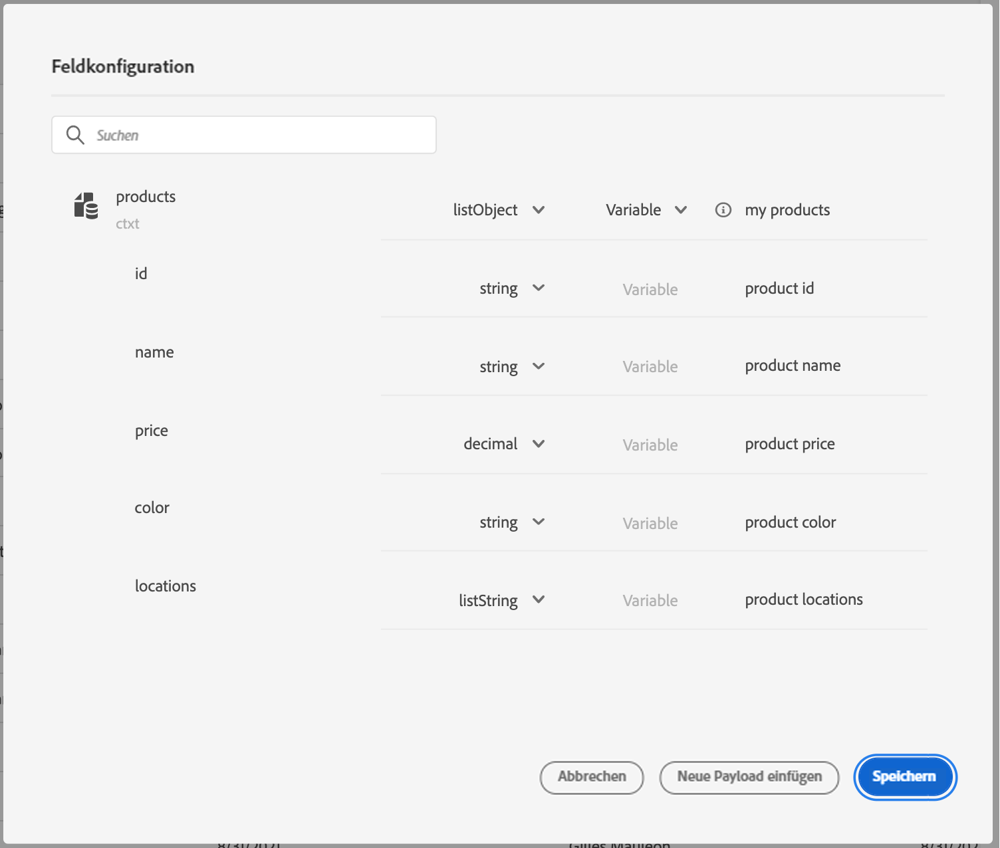
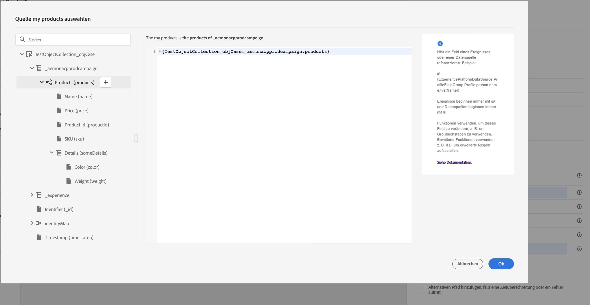
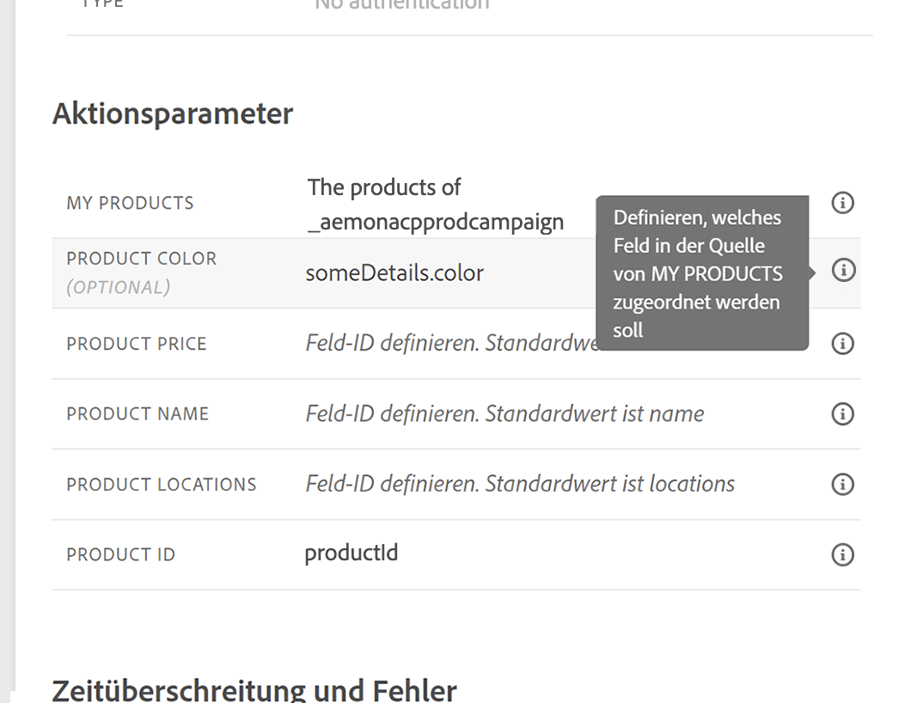
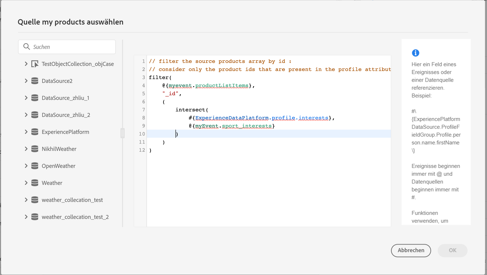
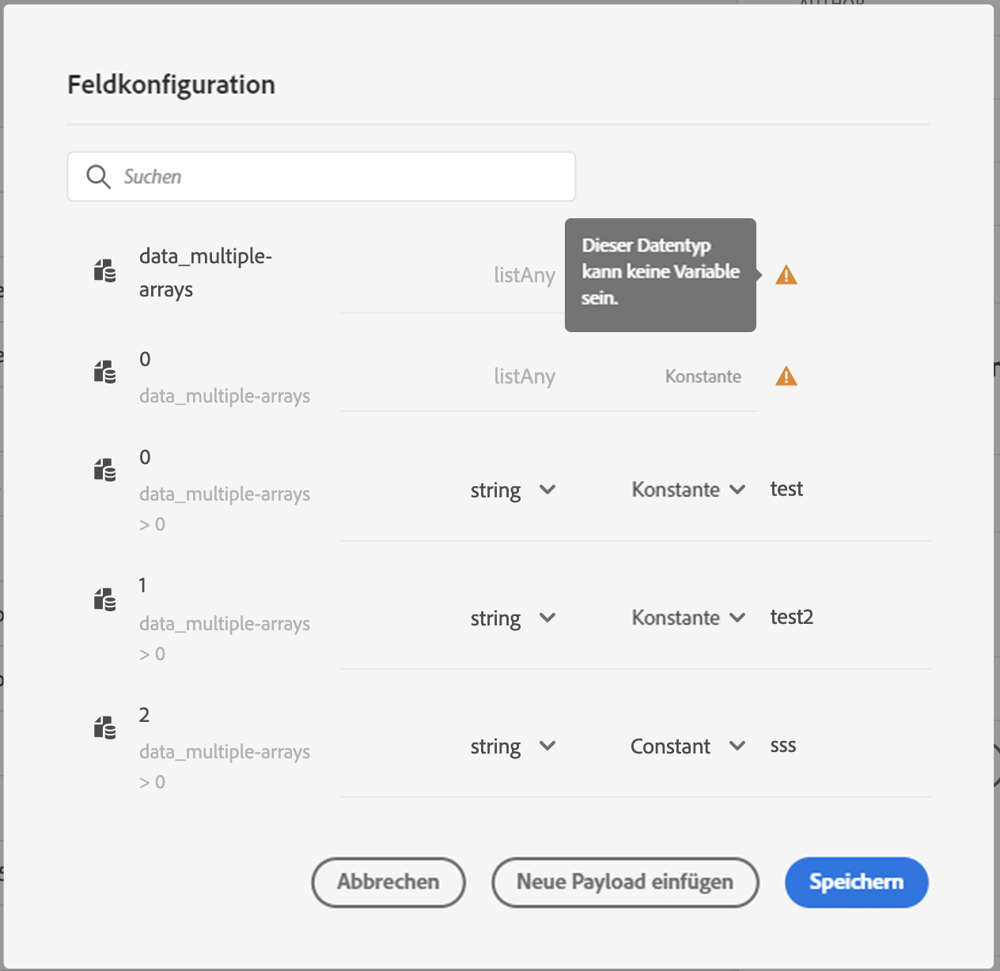

# Anwendungsfall: Übergeben von Sammlungen dynamisch mithilfe benutzerdefinierter Aktionen{#passing-collection}

Sie können eine Sammlung in benutzerdefinierten Aktionsparametern übergeben, die zur Laufzeit dynamisch gefüllt werden. Es werden zwei Arten von Sammlungen unterstützt:

* einfache Sammlungen: Arrays einfacher Datentypen, z. B. mit einer listString:

   ```
   {
    "deviceTypes": [
        "android",
        "ios"
    ]
   }
   ```

* Objektsammlungen: ein Array von JSON-Objekten, z. B.:

   ```
   {
   "products":[
      {
         "id":"productA",
         "name":"A",
         "price":20.1
      },
      {
         "id":"productB",
         "name":"B",
         "price":10.0
      },
      {
         "id":"productC",
         "name":"C",
         "price":5.99
      }
    ]
   }
   ```

## Einschränkungen {#limitations}

* Verschachtelte Arrays von Objekten in einem Objekt-Array werden derzeit nicht unterstützt. Beispiel:

   ```
   {
   "products":[
     {
        "id":"productA",
        "name":"A",
        "price":20,
        "locations": [{"name": "Paris"}, {"name": "London"}]
     },
    ]
   }
   ```

* Um Sammlungen im Testmodus zu testen, müssen Sie den Codeansichtsmodus verwenden. Der Codeansichtsmodus wird derzeit für Geschäftsereignisse nicht unterstützt. Sie können eine Sammlung nur mit einem einzelnen Element senden.

## Allgemeines Verfahren {#general-procedure}

In diesem Abschnitt verwenden wir das folgende JSON-Payload-Beispiel. Dies ist ein Array von Objekten mit einem Feld, das eine einfache Sammlung ist.

```
{
  "ctxt": {
    "products": [
      {
        "id": "productA",
        "name": "A",
        "price": 20.1,
        "color":"blue",
        "locations": [
          "Paris",
          "London"
        ]
      },
      {
        "id": "productB",
        "name": "B",
        "price": 10.99
      }
    ]
  }
}
```

Sie können sehen, dass &quot;products&quot;ein Array von zwei Objekten ist. Sie müssen mindestens ein Objekt haben.

1. Erstellen Sie Ihre benutzerdefinierte Aktion. Siehe [diese Seite](../action/about-custom-action-configuration.md).

1. Im **[!UICONTROL Action parameters]** -Abschnitt, fügen Sie das JSON-Beispiel ein. Die angezeigte Struktur ist statisch: Beim Einfügen der Payload werden alle Felder als Konstanten definiert.

   

1. Passen Sie bei Bedarf die Feldtypen an. Die folgenden Feldtypen werden für Sammlungen unterstützt: listString, listInteger, listDecimal, listBoolean, listDateTime, listDateTimeOnly, listDateOnly, listObject

   >[!NOTE]
   >
   >Der Feldtyp wird gemäß dem Payload-Beispiel automatisch abgeleitet.

1. Wenn Sie Objekte dynamisch übergeben möchten, müssen Sie sie als Variablen festlegen. In diesem Beispiel legen wir &quot;products&quot;als Variable fest. Alle im Objekt enthaltenen Objektfelder werden automatisch auf Variablen gesetzt.

   >[!NOTE]
   >
   >Das erste Objekt des Payload-Beispiels wird verwendet, um die Felder zu definieren.

1. Definieren Sie für jedes Feld den Titel, der auf der Journey-Arbeitsfläche angezeigt wird.

   

1. Erstellen Sie Ihre Journey und fügen Sie die von Ihnen erstellte benutzerdefinierte Aktion hinzu. Siehe [diese Seite](../building-journeys/using-custom-actions.md).

1. Im **[!UICONTROL Action parameters]** definieren Sie den Array-Parameter (&quot;products&quot; in unserem Beispiel) mit dem erweiterten Ausdruckseditor.

   

1. Geben Sie für jedes der folgenden Objektfelder den entsprechenden Feldnamen aus dem Quell-XDM-Schema ein. Wenn die Namen identisch sind, ist dies nicht erforderlich. In unserem Beispiel müssen wir nur &quot;Produkt-ID&quot;und &quot;Farbe&quot;definieren.

   

Für das Array-Feld können Sie auch den erweiterten Ausdruckseditor verwenden, um Datenmanipulationen durchzuführen. Im folgenden Beispiel verwenden wir die [filter](functions/functionfilter.md) und [Schnittmenge](functions/functionintersect.md) Funktionen:



## Besondere Fälle{#examples}

Bei heterogenen Typen und Arrays von Arrays wird das Array mit dem Typ listAny definiert. Sie können nur einzelne Elemente zuordnen, das Array jedoch nicht in eine Variable ändern.



Beispiel eines heterogenen Typs:

```
{
    "data_mixed-types": [
        "test",
        "test2",
        null,
        0
    ]
}
```

Beispiel eines Arrays von Arrays:

```
{
    "data_multiple-arrays": [
        [
            "test",
            "test1",
            "test2"
        ]
    ]
}
```

**Verwandte Themen**

[Verwenden benutzerdefinierter Aktionen](../building-journeys/using-custom-actions.md)
