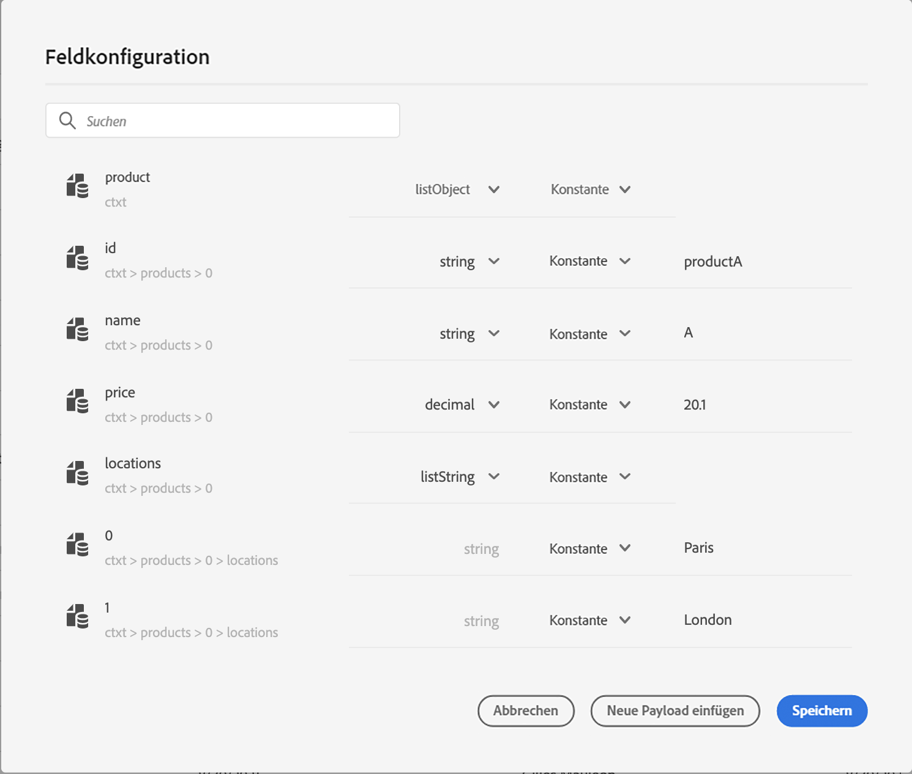

# Übergeben von Sammlungen in Parameter benutzerdefinierter Aktionen {#passing-collection}

Sie können eine Sammlung in Parametern benutzerdefinierter Aktionen übergeben, die zur Laufzeit dynamisch gefüllt wird.

Es werden zwei Arten von Sammlungen unterstützt:

* **Einfache Sammlungen**

  Verwenden Sie einfache Sammlungen für Listen grundlegender Werte wie Strings, Zahlen oder boolesche Werte. Diese sind nützlich, wenn Sie nur eine Liste von Elementen ohne zusätzliche Eigenschaften übergeben müssen.

  Ein Beispiel dafür ist eine Liste von Gerätetypen:

  ```json
  {
   "deviceTypes": [
       "android",
       "ios"
   ]
  }
  ```

* **Objektsammlungen**

  Verwenden Sie Objektsammlungen, wenn jedes Element mehrere Felder oder Eigenschaften enthält. Diese werden normalerweise verwendet, um strukturierte Daten wie Produktdetails, Ereigniseinträge oder Elementattribute zu übergeben.

  Beispiel:

  ```json
  {
  "products":[
     {
        "id":"productA",
        "name":"A",
        "price":20.1
     },
     {
        "id":"productB",
        "name":"B",
        "price":10.0
     },
     {
        "id":"productC",
        "name":"C",
        "price":5.99
     }
   ]
  }
  ```

>[!NOTE]
>
>Verschachtelte Arrays innerhalb von Sammlungen werden in Anfrage-Payloads von benutzerdefinierten Aktionen nur teilweise unterstützt. Weitere Informationen finden Sie unter [Einschränkungen](#limitations).

## Allgemeines Verfahren {#general-procedure}

In diesem Abschnitt verwenden wir das folgende JSON-Payload-Beispiel. Dies ist ein Array von Objekten mit einem Feld, das eine einfache Sammlung ist.

```json
{
  "ctxt": {
    "products": [
      {
        "id": "productA",
        "name": "A",
        "price": 20.1,
        "color":"blue",
        "locations": [
          "Paris",
          "London"
        ]
      },
      {
        "id": "productB",
        "name": "B",
        "price": 10.99
      }
    ]
  }
}
```

Sie können sehen, dass `products` ein Array von zwei Objekten ist. Sie müssen mindestens ein Objekt haben.

1. Erstellen Sie Ihre benutzerdefinierte Aktion. Weitere Informationen finden Sie auf [dieser Seite](../action/about-custom-action-configuration.md).

1. Fügen Sie im Abschnitt **[!UICONTROL Aktionsparameter]** das JSON-Beispiel ein. Die angezeigte Struktur ist statisch: Beim Einfügen der Payload werden alle Felder als Konstanten definiert.

   

1. Passen Sie bei Bedarf die Feldtypen an. Die folgenden Feldtypen werden für Sammlungen unterstützt: listString, listInteger, listDecimal, listBoolean, listDateTime, listDateTimeOnly, listDateOnly, listObject

   >[!NOTE]
   >
   >Der Feldtyp wird gemäß dem Payload-Beispiel automatisch abgeleitet.

1. Wenn Sie Objekte dynamisch übergeben möchten, müssen Sie sie als Variablen festlegen. In diesem Beispiel legen wir `products` als Variable fest. Alle im Objekt enthaltenen Objektfelder werden automatisch als Variablen festgelegt.

   >[!NOTE]
   >
   >Das erste Objekt des Payload-Beispiels wird verwendet, um die Felder zu definieren.

1. Definieren Sie für jedes Feld das Label, das auf der Journey-Arbeitsfläche angezeigt werden soll.

   {width="70%" align="left"}

1. Erstellen Sie Ihre Journey und fügen Sie die von Ihnen erstellte benutzerdefinierte Aktion hinzu. Weitere Informationen finden Sie auf [dieser Seite](../building-journeys/using-custom-actions.md).

1. Definieren Sie im Abschnitt **[!UICONTROL Aktionsparameter]** den Array-Parameter (in unserem Beispiel `products`) mithilfe des erweiterten Ausdruckseditors.

   

1. Geben Sie für jedes der folgenden Objektfelder den entsprechenden Feldnamen aus dem Quell-XDM-Schema ein. Wenn die Namen identisch sind, ist dies nicht erforderlich. In unserem Beispiel müssen wir nur `product id` und „color“ definieren.

   {width="50%" align="left"}

Für das Array-Feld können Sie auch den erweiterten Ausdruckseditor verwenden, um Datenbearbeitungen durchzuführen. Im folgenden Beispiel werden die Funktionen [Filtern](functions/list-functions.md#filter) und [Überschneidung](functions/list-functions.md#intersect) verwendet:


## Einschränkungen {#limitations}

Sammlungen in benutzerdefinierten Aktionen bieten zwar Flexibilität bei der Übergabe dynamischer Daten, es gibt jedoch bestimmte strukturelle Einschränkungen, die zu beachten sind:

* **Unterstützung verschachtelter Arrays in benutzerdefinierten Aktionen**

  Adobe Journey Optimizer unterstützt verschachtelte Arrays von Objekten in **Antwort-Payloads** benutzerdefinierter Aktionen, diese Unterstützung ist jedoch in **Anfrage-Payloads** eingeschränkt.

  In Anfrage-Payloads werden verschachtelte Arrays nur dann unterstützt, wenn sie eine feste Anzahl von Elementen enthalten, wie in der Konfiguration der benutzerdefinierten Aktion definiert. Wenn ein verschachteltes Array beispielsweise immer genau drei Elemente enthält, kann es als Konstante konfiguriert werden. Wenn die Anzahl der Elemente dynamisch sein muss, können nur nicht verschachtelte Arrays (Arrays auf der unteren Ebene) als Variablen definiert werden.

  Beispiel:

   1. Das folgende Beispiel zeigt einen **nicht unterstützten Anwendungsfall**.

      In diesem Beispiel enthält das Produkt-Array ein verschachteltes Array (`locations`) mit einer dynamischen Anzahl von Elementen, das in Anfrage-Payloads nicht unterstützt wird.

      ```json
      {
      "products": [
         {
            "id": "productA",
            "name": "A",
            "price": 20,
            "locations": [
            { "name": "Paris" },
            { "name": "London" }
            ]
         }
      ]
      }
      ```

   2. Beispiel eines unterstützten Anwendungsfalls mit festen Elementen, die als Konstanten definiert sind.

      In diesem Fall werden die verschachtelten Speicherorte durch feste Felder (`location1`, `location2`) ersetzt, sodass die Payload in der unterstützten Konfiguration gültig bleibt.

      ```json
      {
      "products": [
         {
            "id": "productA",
            "name": "A",
            "price": 20,
            "location1": { "name": "Paris" },
            "location2": { "name": "London" }
         }
      ]
      }
      ```


* **Testen von Sammlungen**: Um Sammlungen im Testmodus zu testen, müssen Sie den Code-Ansichtsmodus verwenden. Beachten Sie, dass der Code-Ansichtsmodus für Geschäftsereignisse nicht unterstützt wird. In diesem Fall können Sie also nur eine Sammlung senden, die ein einzelnes Element enthält.


## Besondere Fälle{#examples}

Bei heterogenen Typen und Arrays von Arrays wird das Array mit dem Typ „listAny“ definiert. Sie können nur einzelne Elemente zuordnen, das Array jedoch nicht in eine Variable ändern.

{width="70%" align="left"}

Beispiel eines heterogenen Typs:

```json
{
    "data_mixed-types": [
        "test",
        "test2",
        null,
        0
    ]
}
```

Beispiel eines Arrays von Arrays:

```json
{
    "data_multiple-arrays": [
        [
            "test",
            "test1",
            "test2"
        ]
    ]
}
```

## Weitere Ressourcen

In den folgenden Abschnitten erfahren Sie mehr über die Konfiguration, Verwendung und Fehlerbehebung von benutzerdefinierten Aktionen:

* [Erste Schritte mit benutzerdefinierten Aktionen](../action/action.md): Erfahren Sie, was eine benutzerdefinierte Aktion ist und wie Sie damit eine Verbindung zu Ihren Drittanbietersystemen herstellen können
* [Konfigurieren benutzerdefinierter Aktionen](../action/about-custom-action-configuration.md): Erfahren Sie, wie Sie eine benutzerdefinierte Aktion erstellen und konfigurieren
* [Verwenden benutzerdefinierter Aktionen](../building-journeys/using-custom-actions.md): Erfahren Sie, wie Sie benutzerdefinierte Aktionen in Ihren Journeys verwenden
* [Fehlerbehebung bei benutzerdefinierten Aktionen](../action/troubleshoot-custom-action.md): Erfahren Sie, wie Sie Fehler bei einer benutzerdefinierten Aktion beheben
  <!--* [Iterate over contextual data](../personalization/personalization-contexts.md#arrays-in-journeys) - Learn how to work with arrays in Journey expressions and iterate over custom action responses, event data, and dataset lookups in message personalization-->

