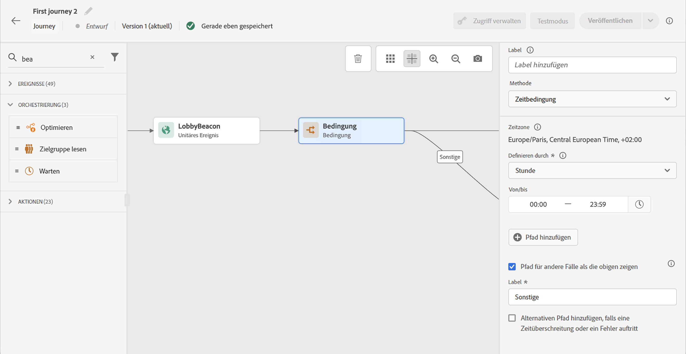
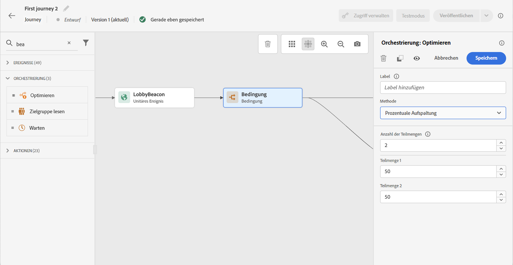
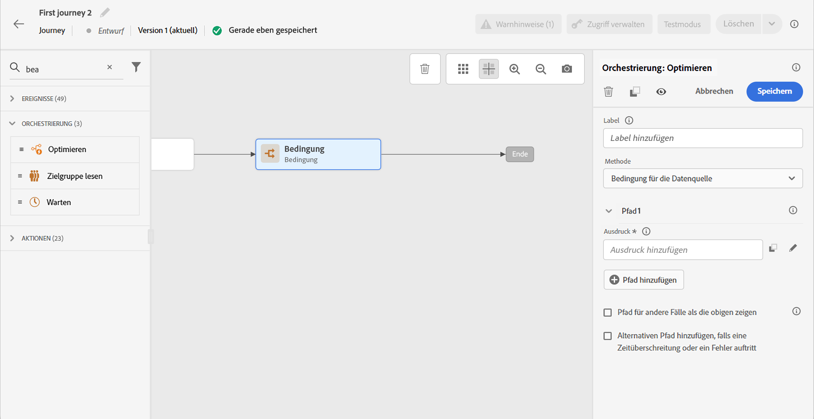
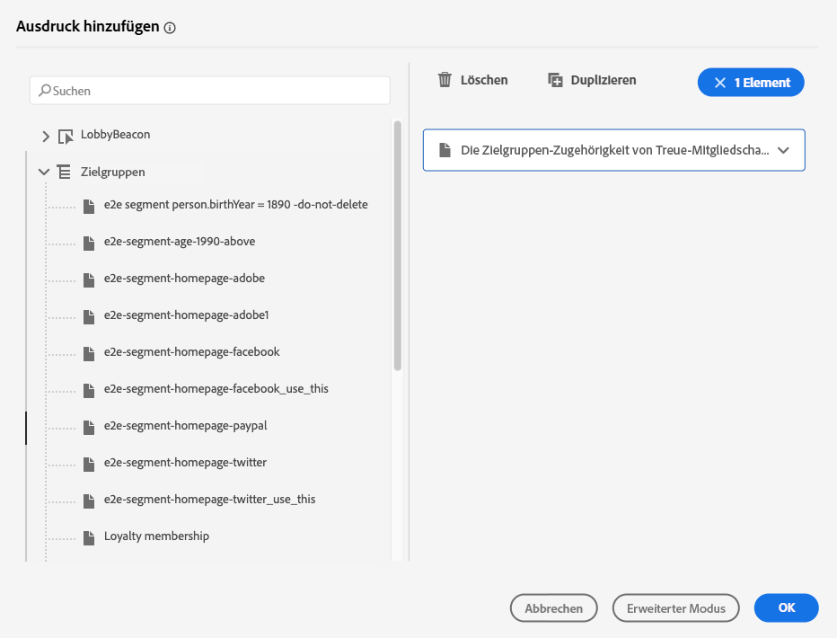

# Bedingungsaktivität{#condition-activity}

>[!CONTEXTUALHELP]
>id="ajo_journey_condition"
>title="Bedingungsaktivität"
>abstract="Mit dieser Aktivität können Sie festlegen, wie der Kontakt in die Journey eintreten wird. Verschiedene Pfade werden basierend auf verschiedenen Kriterien erstellt. Sie können auch einen alternativen Pfad für den Fall einer Zeitüberschreitung oder eines Fehlers erstellen."

Diese Bedingungstypen sind verfügbar:

* [Bedingung der Datenquelle](#data_source_condition)
* [Zeitbedingung](#time_condition)
* [Prozentuale Aufspaltung](#percentage_split)
* [Datumsbedingung](#date_condition)
* [Profilbegrenzung](#profile_cap)

## Über die Bedingungsaktivität {#about_condition}

>[!CONTEXTUALHELP]
>id="ajo_journey_expression_simple"
>title="Über den einfachen Ausdruckseditor"
>abstract="Im einfachen Ausdruckseditor-Modus können Sie einfache Abfragen anhand einer Kombination von Feldern durchführen. Alle verfügbaren Felder werden auf der linken Bildschirmseite angezeigt. Ziehen Sie Felder per Drag-and-Drop in den Hauptbereich. Um die verschiedenen Elemente zu kombinieren, verbinden Sie sie miteinander, um verschiedene Gruppen und/oder Gruppenebenen zu erstellen. Sie können dann einen logischen Operator auswählen, um Elemente auf derselben Ebene zu kombinieren."

Wenn Sie mehrere Bedingungen in einer Journey verwenden, können Sie für jede dieser Bedingungen Bezeichnungen definieren, um sie leichter zu identifizieren.

Klicken **[!UICONTROL Add a path]** , wenn Sie mehrere Bedingungen definieren möchten. Für jede Bedingung wird der Arbeitsfläche nach der Aktivität ein neuer Pfad hinzugefügt.

Beachten Sie, dass die Gestaltung von Journeys funktionale Auswirkungen hat. Wenn mehrere Pfade nach einer Bedingung definiert sind, wird nur der erste geeignete Pfad ausgeführt. Das bedeutet, dass Sie die Priorisierung von Pfaden variieren können, indem Sie sie über- oder untereinander platzieren.

Nehmen wir beispielsweise die Bedingung eines ersten Pfads &quot;Die Person ist ein VIP&quot;und die Bedingung eines zweiten Pfads &quot;Die Person ist ein Mann&quot;. Wenn eine Person, die beide Bedingungen erfüllt (ein männlicher VIP) diesen Schritt durchläuft, wird der erste Pfad ausgewählt, auch wenn diese Person ebenfalls für den zweiten Pfad qualifiziert ist, da der erste Pfad &quot;über&quot;lautet. Um diese Priorität zu ändern, verschieben Sie Ihre Aktivitäten in eine andere vertikale Reihenfolge.

Sie können einen anderen Pfad für Zielgruppen erstellen, die nicht für die definierten Bedingungen infrage kommen, indem Sie die Option **[!UICONTROL Show path for other cases than the one(s) above]**. Beachten Sie, dass diese Option in Aufspaltungsbedingungen nicht verfügbar ist. Siehe [Prozentuale Aufspaltung](#percentage_split).

Der einfache Modus ermöglicht die Durchführung einfacher Abfragen anhand einer Kombination von Feldern. Alle verfügbaren Felder werden auf der linken Bildschirmseite angezeigt. Ziehen Sie Felder per Drag-and-Drop in den Hauptbereich. Um die verschiedenen Elemente zu kombinieren, verbinden Sie sie miteinander, um verschiedene Gruppen und/oder Gruppenebenen zu erstellen. Sie können dann einen logischen Operator auswählen, um Elemente auf derselben Ebene zu kombinieren:

* UND: Schnittmenge aus zwei Kriterien. Nur Elemente, die allen Kriterien entsprechen, werden berücksichtigt.
* ODER: Vereinigung von zwei Kriterien. Elemente, die mindestens einem der beiden Kriterien entsprechen, werden berücksichtigt.

Wenn Sie die [Segmentierungsdienst für Adobe Experience Platform](https://experienceleague.adobe.com/docs/experience-platform/segmentation/home.html){target=&quot;_blank&quot;} verwenden, um Ihre Segmente zu erstellen, können Sie sie in Ihren Journey-Bedingungen nutzen. Siehe [Verwenden von Segmenten in Bedingungen](../building-journeys/condition-activity.md#using-a-segment).

>[!NOTE]
>
>Mit dem einfachen Editor können Sie keine Abfragen zu Zeitreihen (z. B. eine Liste von Käufen, vergangene Klicks auf Nachrichten) durchführen. Dazu müssen Sie den erweiterten Editor verwenden. Siehe [diese Seite](expression/expressionadvanced.md).

Wenn in einer Aktion oder Bedingung ein Fehler auftritt, stoppt die Journey eines Kontakts. Die einzige Möglichkeit, den Vorgang fortzusetzen, besteht darin, das Kontrollkästchen zu aktivieren **[!UICONTROL Add an alternative path in case of a timeout or an error]**. Siehe [diesem Abschnitt](../building-journeys/using-the-journey-designer.md#paths).

Im einfachen Editor finden Sie auch die Kategorie Journey-Eigenschaften unter den Kategorien Ereignis und Datenquelle. Diese Kategorie enthält technische Felder, die sich auf die Journey für ein bestimmtes Profil beziehen. Dies sind die Informationen, die das System von Live-Journeys abruft, wie z. B. die Journey-ID oder die spezifischen aufgetretenen Fehler. [Weitere Infos](expression/journey-properties.md)

## Bedingung der Datenquelle {#data_source_condition}

Auf diese Weise können Sie eine Bedingung anhand von Feldern aus den Datenquellen oder den zuvor in der Journey positionierten Ereignissen definieren. Erfahren Sie, wie Sie den Ausdruckseditor in [diesem Abschnitt](expression/expressionadvanced.md).

Mit dem erweiterten Ausdruckseditor können Sie erweiterte Bedingungen zur Bearbeitung von Sammlungen oder zur Verwendung von Datenquellen einrichten, für die Parameter übergeben werden müssen. [Weitere Infos](../datasource/external-data-sources.md).

## Zeitbedingung{#time_condition}

Auf diese Weise können Sie je nach Tageszeit und/oder Wochentag unterschiedliche Aktionen durchführen. Beispielsweise können Sie festlegen, dass an Wochentagen Push-Benachrichtigungen während des Tages und nachts E-Mails gesendet werden.

>[!NOTE]
>
>Die Zeitzone ist nicht für eine Bedingung spezifisch und wird auf Journey-Ebene in den Eigenschaften der Journey definiert. Siehe [diese Seite](../building-journeys/timezone-management.md).

Es stehen drei Filteroptionen zur Verfügung:

* Stunde: ermöglicht die Einrichtung einer Bedingung basierend auf der Tageszeit. Anschließend legen Sie die Start- und Endzeiten fest. Einzelpersonen geben den Pfad nur innerhalb des definierten Stundenbereichs ein.
* Wochentag: ermöglicht die Einrichtung einer Bedingung basierend auf dem Wochentag. Wählen Sie dann aus, an welchen Tagen die einzelnen Benutzer den Pfad eingeben sollen.
* Wochentag und Stunde: Diese Option kombiniert die ersten beiden Optionen.

## Prozentuale Aufspaltung {#percentage_split}

Mit dieser Option können Sie die Zielgruppe nach dem Zufallsprinzip aufteilen, um für jede Gruppe eine andere Aktion zu definieren. Definieren Sie die Anzahl der Aufspaltungen und die Neuaufteilung für jeden Pfad. Die Berechnung der Aufspaltung ist statistisch, da das System nicht vorhersehen kann, wie viele Personen in diese Aktivität der Journey eintreten werden. Daher weist die Aufspaltung eine sehr geringe Fehlermarge auf. Diese Funktion basiert auf einem Java-Zufallsmechanismus (siehe diesen [page](https://docs.oracle.com/javase/7/docs/api/java/util/Random.html)).

Im Testmodus wird beim Erreichen einer Aufspaltung immer der obere Zweig ausgewählt. Sie können die Position der geteilten Verzweigungen neu organisieren, wenn der Test einen anderen Pfad wählen soll. Siehe [diese Seite](../building-journeys/testing-the-journey.md)

>[!NOTE]
>
>Beachten Sie, dass es keine Schaltfläche zum Hinzufügen eines Pfads in der Bedingung der prozentualen Aufspaltung gibt. Die Anzahl der Pfade hängt von der Anzahl der Aufspaltungen ab. In Bedingungen der Aufspaltung können Sie keinen Pfad für andere Fälle hinzufügen, da dies nicht möglich ist. Die Benutzer gehen immer in einen der geteilten Pfade.

## Datumsbedingung {#date_condition}

Auf diese Weise können Sie einen anderen Fluss basierend auf dem Datum definieren. Wenn die Person beispielsweise während des &quot;Verkaufs&quot;-Zeitraums in den Schritt eintritt, senden Sie ihnen eine bestimmte Nachricht. Den Rest des Jahres senden Sie eine weitere Nachricht.

>[!NOTE]
>
>Die Zeitzone ist nicht mehr für eine Bedingung spezifisch und wird jetzt auf Journey-Ebene in den Journey-Eigenschaften definiert. Siehe [diese Seite](../building-journeys/timezone-management.md).

## Profilbegrenzung {#profile_cap}

Verwenden Sie diesen Bedingungstyp, um eine maximale Anzahl von Profilen für einen Journey-Pfad festzulegen. Wenn diese Grenze erreicht ist, nehmen die Eingabeprofile einen alternativen Pfad an. Dadurch wird sichergestellt, dass Ihre Journeys nie die definierte Grenze überschreiten.

>[!NOTE]
>
>Es wird empfohlen, eine Profilbegrenzung mit hohem Wert zu definieren. Die Genauigkeit und Wahrscheinlichkeit, dass eine Population die exakte Obergrenze erreicht, steigt nur mit zunehmender Obergrenze. Bei kleinen Zahlen (z. B. einer Obergrenze von 50) stimmen die Zahlen nicht immer überein, da die Begrenzung möglicherweise nicht erreicht wird, bevor Profile einen anderen Pfad verwenden.

Mit diesem Bedingungstyp können Sie das Volumen Ihrer Sendungen erhöhen. Siehe dies [Anwendungsfall](ramp-up-deliveries-uc.md).

Die Standardbegrenzung ist 1000.

Der Zähler gilt nur für die ausgewählte Journey-Version. Der Zähler wird nach einem Monat auf null zurückgesetzt. Nach dem Zurücksetzen nehmen die Eingabeprofile den nominalen Pfad erneut, bis die Zählergrenze erreicht ist.

Der nominale Pfad hat immer Vorrang vor dem alternativen Pfad, auch wenn Sie den alternativen Pfad über den nominalen Pfad auf der Arbeitsfläche der Journey verschieben.

Für Live-Journeys sind folgende Schwellenwerte zu berücksichtigen, um sicherzustellen, dass die Grenze erreicht wird:

* Bei einer Obergrenze von mehr als 10000 muss die Anzahl unterschiedlicher Profile, die injiziert werden sollen, mindestens dem 1,3-fachen der Obergrenze entsprechen.
* Bei einer Obergrenze unter 10000 muss die Anzahl der verschiedenen zu injizierenden Profile 1000 plus der Kappe betragen.

Die Profilbegrenzung wird im Testmodus nicht berücksichtigt.

## Verwenden von Segmenten in Bedingungen {#using-a-segment}

In diesem Abschnitt wird erläutert, wie ein Segment in einer Journey-Bedingung verwendet wird. Weitere Informationen zu Segmenten und deren Erstellung finden Sie unter [diesem Abschnitt](../segment/about-segments.md).

Gehen Sie wie folgt vor, um ein Segment in einer Journey-Bedingung zu verwenden:

1. Eine Journey öffnen und eine **[!UICONTROL Condition]** und wählen Sie die **Bedingung der Datenquelle**.
   

1. Klicken **[!UICONTROL Add a path]** für jeden zusätzlichen Pfad, der benötigt wird. Klicken Sie für jeden Pfad auf die **[!UICONTROL Expression]** -Feld.

   

1. Öffnen Sie auf der linken Seite die **[!UICONTROL Segments]** Knoten. Ziehen Sie das Segment, das Sie für Ihre Bedingung verwenden möchten, in den Arbeitsbereich. Standardmäßig lautet die Bedingung für das Segment &quot;true&quot;.

   

   >[!NOTE]
   >
   >Beachten Sie, dass nur die Personen mit dem **Realisiert** und **Bestehend** Segmentteilsstatus werden als Mitglieder des Segments betrachtet. Weiterführende Informationen zur Auswertung eines Segments finden Sie im Abschnitt [Dokumentation zum Segmentierungsdienst](https://experienceleague.adobe.com/docs/experience-platform/segmentation/tutorials/evaluate-a-segment.html#interpret-segment-results){target=&quot;_blank&quot;}.
