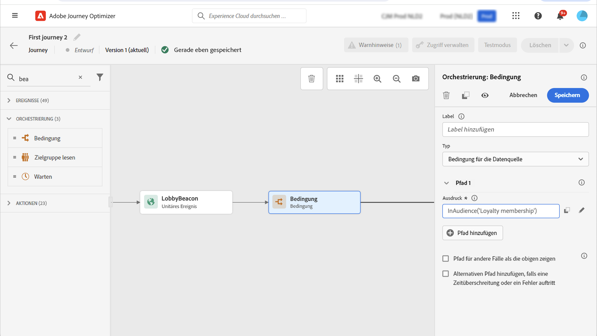
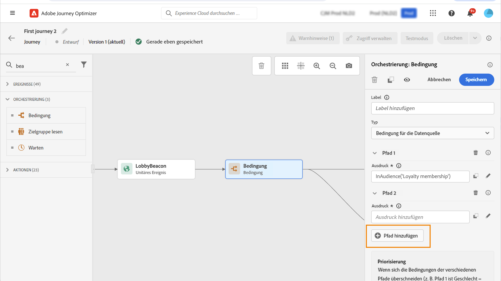
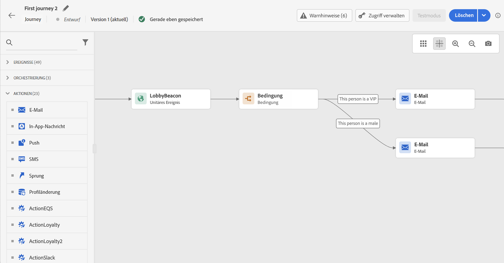

# Bedingungsaktivität{#condition-activity}

>[!CONTEXTUALHELP]
>id="ajo_journey_condition"
>title="Bedingungsaktivität"
>abstract="Mit dieser Aktivität können Sie festlegen, wie sich ein Kontakt in der Journey weiterbewegen soll. Basierend auf verschiedenen Kriterien werden mehrere Pfade erstellt. Für den Fall einer Zeitüberschreitung oder eines Fehlers können Sie auch einen alternativen Pfad erstellen."

Die folgenden Bedingungstypen stehen zur Verfügung:

* [Bedingung der Datenquelle](#data_source_condition)
* [Bedingung für die Uhrzeit](#time_condition)
* [Prozentuale Aufspaltung](#percentage_split)
* [Bedingung für das Datum](#date_condition)
* [Profilbegrenzung](#profile_cap)

## Informationen zu Bedingungsaktivitäten {#about_condition}

>[!CONTEXTUALHELP]
>id="ajo_journey_expression_simple"
>title="Informationen zum einfachen Ausdruckseditor"
>abstract="Im einfachen Ausdruckseditor können Sie einfache Abfragen anhand einer Kombination von Feldern durchführen. Alle verfügbaren Felder werden auf der linken Seite des Bildschirms angezeigt. Ziehen Sie Felder per Drag-and-Drop in den Hauptbereich. Um die verschiedenen Elemente zu kombinieren, verschachteln Sie diese, um Gruppen und/oder Gruppenebenen zu erstellen. Definieren Sie dann einen logischen Operator zwischen Elementen desselben Niveaus."

Wenn Sie mehrere Bedingungen in einer Journey verwenden, können Sie für jede dieser Bedingungen Titel definieren, um sie leichter zu identifizieren.

Klicken Sie auf **[!UICONTROL Pfad hinzufügen]**, wenn Sie mehrere Bedingungen definieren möchten. Für jede Bedingung wird der Arbeitsfläche nach der Aktivität ein neuer Pfad hinzugefügt.

Beachten Sie, dass die Gestaltung der Journeys funktionelle Auswirkungen hat. Wenn mehrere Pfade nach einer Bedingung definiert werden, wird nur der erste infrage kommende Pfad ausgeführt. Das bedeutet, dass Sie die Priorisierung von Pfaden ändern können, indem Sie sie über- oder untereinander platzieren.

Nehmen wir beispielsweise die Bedingung eines ersten Pfads „Die Person ist eine VIP“ und die Bedingung eines zweiten Pfads „Die Person ist ein Mann“. Wenn eine Person, die beide Bedingungen erfüllt (ein männlicher VIP) diesen Schritt durchläuft, wird der erste Pfad ausgewählt, auch wenn die Person ebenfalls für den zweiten Pfad infrage kommt, da der erste Pfad „über“ dem zweiten steht. Um diese Priorität zu ändern, verschieben Sie Ihre Aktivitäten in eine andere vertikale Reihenfolge.

Sie können einen anderen Pfad für Audiences erstellen, für die die definierten Bedingungen nicht gelten, indem Sie die Option **[!UICONTROL Pfad für andere Fälle als die obigen zeigen]** aktivieren. Beachten Sie, dass diese Option in Bedingungen für die Aufspaltung nicht verfügbar ist. Siehe [Prozentuale Aufspaltung](#percentage_split).

Im einfachen Modus können Sie einfache Abfragen anhand einer Kombination von Feldern durchführen. Alle verfügbaren Felder werden auf der linken Seite des Bildschirms angezeigt. Ziehen Sie Felder per Drag-and-Drop in den Hauptbereich. Um die verschiedenen Elemente zu kombinieren, verschachteln Sie diese, um Gruppen und/oder Gruppenebenen zu erstellen. Definieren Sie dann einen logischen Operator zwischen Elementen desselben Niveaus:

* UND bildet die Schnittmenge aus zwei Kriterien. Nur Elemente, die allen Kriterien entsprechen, werden berücksichtigt.
* ODER bildet die Vereinigungsmenge aus zwei Kriterien. Elemente, die wenigstens einem der Kriterien entsprechen, werden berücksichtigt.

Wenn Sie zur Erstellung Ihrer Segmente den [Segmentierungsdienst von Adobe Experience Platform](https://experienceleague.adobe.com/docs/experience-platform/segmentation/home.html?lang=de) verwenden, können Sie die Segmente in Ihren Journey-Bedingungen nutzen.{target="_blank"} Siehe [Verwenden von Segmenten in Bedingungen](../building-journeys/condition-activity.md#using-a-segment).

>[!NOTE]
>
>Mit dem einfachen Editor können Sie keine Abfragen zu Zeitreihen (z. B. zu einer Liste der Käufe oder vergangenen Klicks auf Nachrichten) durchführen. Dazu müssen Sie den erweiterten Editor verwenden. Weitere Informationen finden Sie auf [dieser Seite](expression/expressionadvanced.md).

Wenn in einer Aktion oder einer Bedingung ein Fehler auftritt, wird die Journey der Person gestoppt. Die einzige Möglichkeit zum Fortsetzen des Vorgangs besteht darin, das Kontrollkästchen **[!UICONTROL Alternativen Pfad hinzufügen, falls eine Zeitüberschreitung oder ein Fehler auftritt]** zu aktivieren. Weitere Informationen finden Sie in [diesem Abschnitt](../building-journeys/using-the-journey-designer.md#paths).

Im einfachen Editor finden Sie auch die Kategorie „Journey-Eigenschaften“ unter den Kategorien „Ereignis“ und „Datenquelle“. Diese Kategorie enthält technische Felder, die sich auf die Journey eines bestimmten Profils beziehen. Dabei handelt es sich um die Informationen, die das System von Live-Journeys abruft, wie z. B. die Journey-ID oder die aufgetretenen Fehler. [Weitere Informationen](expression/journey-properties.md)

## Bedingung der Datenquelle {#data_source_condition}

Auf diese Weise können Sie eine Bedingung basierend auf Feldern aus den Datenquellen oder den zuvor in der Journey positionierten Ereignissen definieren. In [diesem Abschnitt](expression/expressionadvanced.md) erfahren Sie, wie Sie den Ausdruckseditor verwenden.

Mit dem erweiterten Ausdruckseditor können Sie erweiterte Bedingungen zur Bearbeitung von Sammlungen oder zur Verwendung von Datenquellen einrichten, für die Parameter übergeben werden müssen. [Weitere Informationen](../datasource/external-data-sources.md).

## Bedingung für die Uhrzeit{#time_condition}

Auf diese Weise können Sie je nach Tageszeit und/oder Wochentag unterschiedliche Aktionen durchführen. So können Sie beispielsweise entscheiden, an Werktagen tagsüber Push-Benachrichtigung und nachts E-Mails zu versenden.

>[!NOTE]
>
>Die Zeitzone hängt nicht von einer Bedingung ab und wird auf Journey-Ebene in den Eigenschaften der Journey festgelegt. Mehr dazu erfahren Sie auf [dieser Seite](../building-journeys/timezone-management.md).

Es stehen drei Zeitfilteroptionen zur Verfügung:

* Stunde: ermöglicht die Einrichtung einer Bedingung basierend auf der Tageszeit. Sie legen dann die Start- und Endzeit fest. Einzelpersonen geben den Pfad nur innerhalb des definierten Stundenbereichs ein.
* Wochentag: ermöglicht die Einrichtung einer Bedingung basierend auf dem Wochentag. Wählen Sie dann aus, an welchen Tagen die Einzelanwender den Pfad eingeben sollen.
* Wochentag und Stunde: Diese Option kombiniert die ersten beiden Optionen.

## Prozentuale Aufspaltung {#percentage_split}

Mit dieser Option können Sie die Audience nach dem Zufallsprinzip aufspalten, um für jede Gruppe eine andere Aktion zu definieren. Definieren Sie die Anzahl der Aufspaltungen und die Neuaufteilung für jeden Pfad. Die Berechnung der Aufspaltung ist statistisch, da das System nicht vorhersehen kann, wie viele Personen an dieser Aktivität der Journey teilnehmen werden. Infolgedessen weist die Aufspaltung eine sehr geringe Fehlermarge auf. Diese Funktion basiert auf einem Java-Zufallsmechanismus (siehe diese [Seite](https://docs.oracle.com/javase/7/docs/api/java/util/Random.html)).

Im Testmodus wird beim Erreichen einer Aufspaltung immer die obere Verzweigung ausgewählt. Wenn der Test einen anderen Pfad wählen soll, können Sie die Position der aufgespaltenen Verzweigungen neu anordnen. Mehr dazu erfahren Sie auf [dieser Seite](../building-journeys/testing-the-journey.md)

>[!NOTE]
>
>Beachten Sie, dass es in der Bedingung für die prozentuale Aufspaltung keine Schaltfläche zum Hinzufügen eines Pfades gibt. Die Anzahl der Pfade hängt von der Anzahl der Aufspaltungen ab. In Bedingungen für die Aufspaltung können Sie keinen Pfad für andere Fälle hinzufügen, da diese nicht möglich sind. Die Personen wählen immer einen der Pfade der Aufspaltung aus.

## Bedingung für das Datum {#date_condition}

Auf diese Weise können Sie basierend auf dem Datum einen jeweils anderen Fluss definieren. Wenn der Eintritt der Person beispielsweise während der Zeit des Ausverkaufs verfolgt, senden Sie ihr eine entsprechende Nachricht. Den Rest des Jahres senden Sie eine andere Nachricht.

>[!NOTE]
>
>Die Zeitzone hängt nicht mehr von einer Bedingung ab und wird jetzt auf Journey-Ebene in den Eigenschaften der Journey festgelegt. Weitere Informationen finden Sie auf [dieser Seite](../building-journeys/timezone-management.md).

## Profilbegrenzung {#profile_cap}

Verwenden Sie diesen Bedingungstyp, um eine Höchstzahl von Profilen für einen Journey-Pfad festzulegen. Wenn diese Grenze erreicht ist, folgen die eintretenden Profile einem alternativen Pfad. Dadurch wird sichergestellt, dass Ihre Journey nie den definierten Grenzwert überschreitet.

>[!NOTE]
>
>Es wird empfohlen, für die Profilbegrenzung einen hohen Wert zu definieren. Je höher diese Obergrenze angesetzt ist, desto höher ist auch die Genauigkeit und Wahrscheinlichkeit, dass eine Population die exakte Obergrenze erreicht. Ist diese Anzahl niedrig (z. B. eine Obergrenze von 50), stimmen die Zahlen nicht immer überein, da die Obergrenze möglicherweise nicht erreicht wird, bevor die Profile einem anderen Pfad folgen.

Mit diesem Bedingungstyp kann das Volumen Ihrer Sendungen erhöht werden. Siehe diesen [Anwendungsfall](ramp-up-deliveries-uc.md).

Die Standardbegrenzung ist 1.000.

Der Zähler gilt nur für die ausgewählte Journey-Version. Der Zähler wird auf null zurückgesetzt, wenn die Journey dupliziert oder eine neue Version erstellt wird. Nach dem Zurücksetzen folgen die eintretenden Profile erneut dem nominalen Pfad, bis die Zählergrenze erreicht ist.

Wenn eine Profilbegrenzung für eine wiederkehrende Journey definiert ist, wird der Zähler nicht nach jeder Wiederholung zurückgesetzt.

Der nominale Pfad hat immer Vorrang vor dem alternativen Pfad, auch wenn der alternativen Pfad über den nominalen Pfad auf der Journey-Arbeitsfläche verschoben wird.

Für Live-Journeys sollten die folgenden Schwellenwerte berücksichtigt werden, um sicherzustellen, dass der Grenzwert erreicht wird:

* Bei einer Obergrenze von mehr als 10.000 muss die Anzahl unterschiedlicher Profile, die eingespeist werden sollen, mindestens dem 1,3-Fachen der Obergrenze entsprechen.
* Bei einer Obergrenze unter 10.000 muss die Anzahl der eindeutigen Profile, die eingespeist werden sollen, den Wert der Obergrenze plus 1.000 haben.

Die Profilbegrenzung wird im Testmodus nicht berücksichtigt.

## Verwenden von Segmenten in Bedingungen {#using-a-segment}

In diesem Abschnitt wird erläutert, wie sich ein Segment in einer Journey-Bedingung verwenden lässt. Weitere Informationen zu Segmenten und deren Aufbau finden Sie in [diesem Abschnitt](../segment/about-segments.md).

Gehen Sie wie folgt vor, um in einer Journey-Bedingung ein Segment zu verwenden:

1. Öffnen Sie eine Journey, legen Sie eine Aktivität vom Typ **[!UICONTROL Bedingung]** ab und wählen Sie die **Bedingung der Datenquelle**.
   

1. Klicken Sie für jeden zusätzlichen Pfad auf **[!UICONTROL Pfad hinzufügen]**. Klicken Sie für jeden Pfad auf das Feld **[!UICONTROL Ausdruck]**.

   

1. Erweitern Sie auf der linken Seite den Knoten **[!UICONTROL Segmente]**. Legen Sie das Segment, das Sie für Ihre Bedingung verwenden möchten, im Arbeitsbereich ab. Standardmäßig lautet die Bedingung für das Segment „true“.

   

   >[!NOTE]
   >
   >Hinweis: Nur Personen mit den Segmentzugehörigkeitsstatus **Realisiert** und **Vorhanden** werden als Mitglieder des Segments betrachtet. Weitere Informationen zum Auswerten eines Segments finden Sie in der [Dokumentation zum Segmentierungs-Service](https://experienceleague.adobe.com/docs/experience-platform/segmentation/tutorials/evaluate-a-segment.html?lang=de){target="_blank"}.
