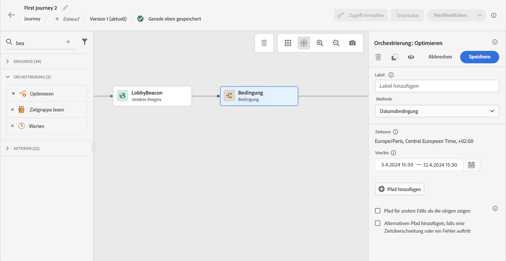
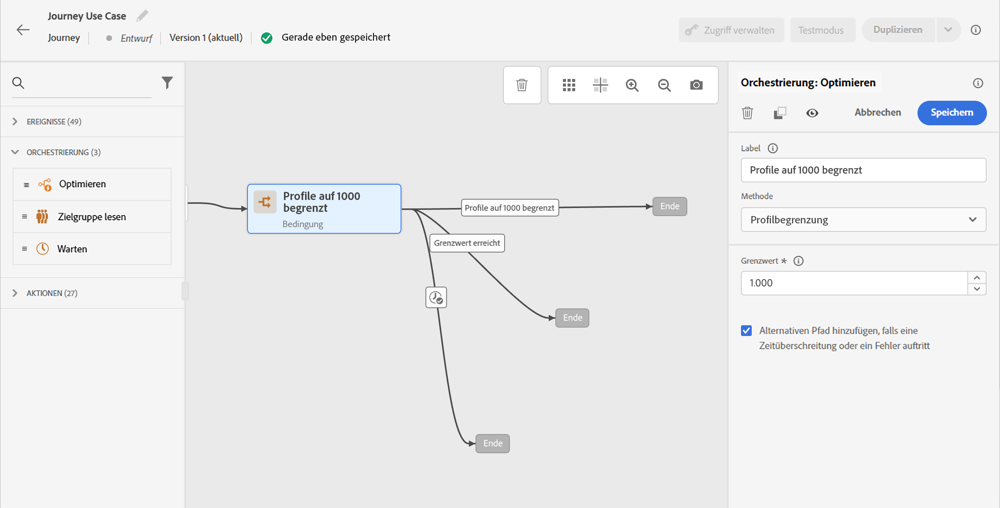

# Aktivität des Typs „Bedingung“ {#condition-activity}

Verwenden Sie die Aktivität Bedingung , um Profile basierend auf Regeln und Daten an verschiedene Pfade zu leiten.

## Hinzufügen einer Aktivität „Bedingung“ {#add-condition-activity}

>[!CONTEXTUALHELP]
>id="ajo_journey_condition"
>title="Aktivität des Typs „Bedingung“"
>abstract="Mit der Aktivität **Bedingung** können Sie festlegen, wie Kontakte Ihre Journey durchlaufen, indem Sie mehrere Pfade auf Grundlage bestimmter Kriterien erstellen. Sie können auch einen alternativen Pfad konfigurieren, um mit Timeouts oder Fehlern umzugehen und so ein nahtloses Erlebnis sicherzustellen."

Mit der Aktivität **Bedingung** können Sie festlegen, wie Kontakte Ihre Journey durchlaufen, indem Sie mehrere Pfade auf Grundlage bestimmter Kriterien erstellen. Sie können auch einen alternativen Pfad konfigurieren, um mit Timeouts oder Fehlern umzugehen und so ein nahtloses Erlebnis sicherzustellen.

Folgende Bedingungstypen sind verfügbar:

* [Datenquellenbedingung](#data_source_condition)
* [Bedingung für die Uhrzeit](#time_condition)
* [Prozentuale Aufspaltung](#percentage_split)
* [Bedingung für das Datum](#date_condition)
* [Profilbegrenzung](#profile_cap)

Sie können auch eine Zielgruppe in einer Journey-Bedingung verwenden. [Weitere Informationen](#using-a-segment). Weitere Information zum Generieren und Ansprechen von Zielgruppen finden Sie [in diesem Abschnitt](../audience/about-audiences.md).

>[!NOTE]
>
>Die Bedingungsauswertung schlägt für Profile fehl, die mehr als zwei geräteübergreifende Identitäten im [Profilspeicher](https://experienceleague.adobe.com/docs/experience-platform/profile/home.html?lang=de#profile-data-store){target="_blank"} enthalten.

## Hinzufügen und Verwalten von Bedingungspfaden {#about_condition}

>[!CONTEXTUALHELP]
>id="ajo_journey_expression_simple"
>title="Informationen zum einfachen Ausdruckseditor"
>abstract="Im einfachen Ausdruckseditor können einfache Abfragen anhand einer Kombination von Feldern durchgeführt werden. Alle verfügbaren Felder werden auf der linken Seite des Bildschirms angezeigt. Felder per Drag-and-Drop in den Hauptbereich ziehen. Um die verschiedenen Elemente zu kombinieren, diese verschachteln, um Gruppen und/oder Gruppenebenen zu erstellen. Dann einen logischen Operator zwischen Elementen desselben Niveaus definieren."

Wenn Sie mehrere Bedingungen in einer Journey verwenden, können Sie für jede dieser Bedingungen Labels definieren, um sie leichter zu identifizieren.

Klicken Sie auf **[!UICONTROL Pfad hinzufügen]**, wenn Sie mehrere Bedingungen definieren möchten. Für jede Bedingung wird der Arbeitsfläche nach der Aktivität ein neuer Pfad hinzugefügt.

Beachten Sie, dass die Gestaltung der Journeys funktionelle Auswirkungen hat. Wenn mehrere Pfade nach einer Bedingung definiert werden, wird nur der erste infrage kommende Pfad ausgeführt. Das bedeutet, dass Sie die Priorisierung von Pfaden ändern können, indem Sie sie über- oder untereinander platzieren.

Nehmen wir zwei Pfadbedingungen: „Die Person ist ein VIP&quot; und „Die Person ist ein Mann“. Wenn eine Person beide Bedingungen erfüllt, wird der erste Pfad ausgewählt, da er über dem zweiten liegt. Um diese Priorität zu ändern, verschieben Sie Ihre Aktivitäten in eine andere vertikale Reihenfolge.

Sie können einen anderen Pfad für Zielgruppen erstellen, für die die definierten Bedingungen nicht gelten, indem Sie die Option **[!UICONTROL Pfad für andere Fälle als die obigen zeigen]** aktivieren. Beachten Sie, dass diese Option in Bedingungen für die Aufspaltung nicht verfügbar ist. Siehe [Prozentuale Aufspaltung](#percentage_split).

Im einfachen Modus können Sie einfache Abfragen anhand einer Kombination von Feldern durchführen. Alle verfügbaren Felder werden auf der linken Seite des Bildschirms angezeigt. Felder per Drag-and-Drop in den Hauptbereich ziehen. Um die verschiedenen Elemente zu kombinieren, diese verschachteln, um Gruppen und/oder Gruppenebenen zu erstellen. Definieren Sie dann einen logischen Operator zwischen Elementen desselben Niveaus:

* UND bildet die Schnittmenge aus zwei Kriterien. Nur Elemente, die allen Kriterien entsprechen, werden berücksichtigt.
* ODER bildet die Vereinigungsmenge aus zwei Kriterien. Elemente, die mindestens einem der Kriterien entsprechen, werden berücksichtigt.

Wenn Sie zur Erstellung Ihrer Zielgruppen den [[!DNL Adobe Experience Platform] Segmentierungs](https://experienceleague.adobe.com/docs/experience-platform/segmentation/home.html?lang=de){target="_blank"}Service) verwenden, können Sie diese in Ihren Journey-Bedingungen nutzen. Weitere Informationen finden Sie unter [Verwenden von Zielgruppen in Bedingungen](../building-journeys/condition-activity.md#using-a-segment). Weitere Informationen zum Generieren und Ansprechen von Zielgruppen in Journey Optimizer finden Sie [in diesem Abschnitt](../audience/about-audiences.md).

>[!NOTE]
>
>Mit dem einfachen Editor können Sie keine Abfragen zu Zeitreihen (z. B. zu einer Liste der Käufe oder vergangenen Klicks auf Nachrichten) durchführen. Dazu müssen Sie den erweiterten Editor verwenden.  Weitere Informationen finden Sie auf [dieser Seite](expression/expressionadvanced.md).

Wenn in einer Aktion oder einer Bedingung ein Fehler auftritt, wird die Journey des Kontakts gestoppt. Die einzige Möglichkeit zum Fortsetzen des Vorgangs besteht darin, das Kontrollkästchen **[!UICONTROL Alternativen Pfad hinzufügen, falls eine Zeitüberschreitung oder ein Fehler auftritt]** zu aktivieren. Weitere Informationen finden Sie in [diesem Abschnitt](../building-journeys/using-the-journey-designer.md#paths).

Im einfachen Editor finden Sie auch die Kategorie „Journey-Eigenschaften“ unter den Kategorien „Ereignis“ und „Datenquelle“. Diese Kategorie enthält technische Felder, die sich auf die Journey eines bestimmten Profils beziehen.  Dabei handelt es sich um die Informationen, die das System von Live-Journeys abruft, wie z. B. die Journey-ID oder die aufgetretenen Fehler. [Weitere Informationen](expression/journey-properties.md)

## Datenquellenbedingung {#data_source_condition}

Verwenden Sie eine **[!UICONTROL Datenquellenbedingung]**, um eine Definition basierend auf Feldern aus den Datenquellen oder den zuvor in der Journey positionierten Ereignissen zu definieren. Dieser Bedingungstyp wird mit dem Ausdruckseditor definiert. In [diesem Abschnitt](expression/expressionadvanced.md) erfahren Sie, wie Sie den Ausdruckseditor verwenden.

Beim Targeting einer Zielgruppe mit Anreicherungsattributen, die mithilfe eines Kompositions-Workflows oder eines benutzerdefinierten Uploads (CSV-Datei) generiert wurden, können Sie beispielsweise diese Anreicherungsattribute nutzen, um Ihre Bedingung zu erstellen.

>[!IMPORTANT]
>
>**Verarbeiten fehlender oder nicht aufgenommener Attribute**
>
>Wenn in Ihrem Profilschema ein Schemafeld definiert ist, aber keine Daten für dieses Feld aufgenommen wurden, interpretieren Journey Optimizer und das zugrunde liegende Echtzeit-Kundenprofil das Feld als `null`. Daher werden Bedingungen, die auf `isEmpty()`, `isNull()` oder ähnliche Funktionen prüfen, als `true` ausgewertet, selbst wenn das Attribut nie aufgenommen wurde. Dies kann zu unerwartetem Journey-Verhalten führen, wenn Sie nicht wissen, dass das Feld keine Daten enthält.
>
>Um Missverständnisse zu vermeiden, stellen Sie sicher, dass die Attribute, die Sie in Bedingungsausdrücken verwenden, mit tatsächlichen Daten aufgenommen wurden, bevor das Profil in die Journey eintritt. Sie können Attributwerte im [Echtzeit-Kundenprofil](https://experienceleague.adobe.com/docs/experience-platform/profile/home.html?lang=de){target="_blank"} überprüfen, um zu bestätigen, ob für die in Ihren Bedingungen verwendeten Felder Daten vorhanden sind.

Mit dem erweiterten Ausdruckseditor können Sie erweiterte Bedingungen zur Bearbeitung von Sammlungen oder zur Verwendung von Datenquellen einrichten, für die Parameter übergeben werden müssen. [Weitere Informationen](../datasource/external-data-sources.md).

## Zeitbedingung {#time_condition}

Verwenden Sie eine **[!UICONTROL Zeitbedingung]**, um je nach Tageszeit und/oder Wochentag unterschiedliche Aktionen durchführen. So können Sie beispielsweise entscheiden, an Werktagen tagsüber Push-Benachrichtigung und nachts E-Mails zu versenden.

>[!NOTE]
>
>* Die Zeitzone hängt nicht von einer Bedingung ab und wird auf Journey-Ebene in den Eigenschaften der Journey festgelegt. Weitere Informationen finden Sie auf [dieser Seite](../building-journeys/timezone-management.md).
>
>* Standardmäßig wird die **[!UICONTROL Zeitbedingung]** in Stunden von 00:00 bis 12:00 eingestellt.

Es stehen drei Zeitfilteroptionen zur Verfügung:

* Stunde: ermöglicht die Einrichtung einer Bedingung basierend auf der Tageszeit. Sie legen dann die Start- und Endzeit fest. Einzelpersonen geben den Pfad nur innerhalb des definierten Stundenbereichs ein.
* Wochentag: ermöglicht die Einrichtung einer Bedingung basierend auf dem Wochentag. Wählen Sie dann aus, an welchen Tagen die Einzelpersonen in den Pfad eintreten sollen.
* Wochentag und Stunde: Diese Option kombiniert die ersten beiden Optionen.

## Prozentuale Aufspaltung {#percentage_split}

Mit dieser Option können Sie die Zielgruppe nach dem Zufallsprinzip aufspalten, um für jede Gruppe eine andere Aktion zu definieren. Definieren Sie die Anzahl der Aufspaltungen und die Neuaufteilung für jeden Pfad. Die Berechnung der Aufspaltung ist statistisch, da das System nicht vorhersehen kann, wie viele Personen an dieser Aktivität der Journey teilnehmen werden. Infolgedessen weist die Aufspaltung eine sehr geringe Fehlermarge auf. Diese Funktion basiert auf einem Java-Zufallsmechanismus (siehe diese [Seite](https://docs.oracle.com/javase/7/docs/api/java/util/Random.html){target="_blank"}).

Im Testmodus wird beim Erreichen einer Aufspaltung immer die obere Verzweigung ausgewählt. Wenn der Test einen anderen Pfad wählen soll, können Sie die Position der aufgespaltenen Verzweigungen neu anordnen. Mehr dazu erfahren Sie auf [dieser Seite](../building-journeys/testing-the-journey.md)

>[!NOTE]
>
>Beachten Sie, dass es in der Bedingung für die prozentuale Aufspaltung keine Schaltfläche zum Hinzufügen eines Pfades gibt. Die Anzahl der Pfade hängt von der Anzahl der Aufspaltungen ab. In Bedingungen für die Aufspaltung können Sie keinen Pfad für andere Fälle hinzufügen, da diese nicht möglich sind. Die Personen wählen immer einen der Pfade der Aufspaltung aus.

## Bedingung für das Datum {#date_condition}

Auf diese Weise können Sie basierend auf dem Datum einen jeweils anderen Fluss definieren. Wenn der Eintritt der Person beispielsweise während der Zeit des Ausverkaufs verfolgt, senden Sie ihr eine entsprechende Nachricht. Den Rest des Jahres senden Sie eine andere Nachricht.

>[!NOTE]
>
>Die Zeitzone hängt nicht mehr von einer Bedingung ab und wird jetzt auf Journey-Ebene in den Eigenschaften der Journey festgelegt. Weitere Informationen finden Sie auf [dieser Seite](../building-journeys/timezone-management.md).

## Profilbegrenzung {#profile_cap}

Verwenden Sie diesen Bedingungstyp, um eine Höchstzahl von Profilen für einen Journey-Pfad festzulegen. Wenn dieses Limit erreicht ist, schlagen die eintretenden Profile einen alternativen Pfad ein. Dadurch wird sichergestellt, dass Ihre Journey nie den definierten Grenzwert überschreitet.

>[!NOTE]
>
>Es wird empfohlen, für die Profilbegrenzung einen hohen Wert zu definieren. Je höher diese Begrenzung angesetzt ist, desto höher ist auch die Genauigkeit und Wahrscheinlichkeit, dass eine Population die exakte Begrenzung erreicht. Ist diese Anzahl niedrig (z. B. eine Begrenzung von 50), stimmen die Zahlen nicht immer überein, da die Begrenzung möglicherweise nicht erreicht wird, bevor die Profile einem anderen Pfad folgen.

<!--You can use this condition type to ramp up the volume of your deliveries. See this [use case](ramp-up-deliveries-uc.md).-->

Die Standardbegrenzung ist 1.000.

Der Zähler gilt nur für die ausgewählte Journey-Version. Der Zähler wird auf null zurückgesetzt, wenn die Journey dupliziert oder eine neue Version erstellt wird. Nach dem Zurücksetzen folgen die eintretenden Profile erneut dem nominalen Pfad, bis die Zählergrenze erreicht ist.

Wenn eine Profilbegrenzung für eine wiederkehrende Journey definiert ist, wird der Zähler nicht nach jedem Intervall zurückgesetzt.

Der nominale Pfad hat immer Vorrang vor dem alternativen Pfad, auch wenn der alternativen Pfad über den nominalen Pfad auf der Journey-Arbeitsfläche verschoben wird.

Für Live-Journeys sollten die folgenden Schwellenwerte berücksichtigt werden, um sicherzustellen, dass der Grenzwert erreicht wird:

* Bei einer Begrenzung von mehr als 10.000 muss die Anzahl unterschiedlicher Profile, die eingespeist werden sollen, mindestens dem 1,3-Fachen der Begrenzung entsprechen.
* Bei einer Begrenzung unter 10.000 muss die Anzahl der eindeutigen Profile, die eingespeist werden sollen, den Wert der Begrenzung plus 1.000 haben.

Die Profilbegrenzung wird im Testmodus nicht berücksichtigt.

## Verwenden von Zielgruppen in Bedingungen {#using-a-segment}

In diesem Abschnitt wird erläutert, wie eine Zielgruppe in einer Journey-Bedingung verwendet wird. Weitere Informationen zu Zielgruppen und deren Erstellung finden Sie in [diesem Abschnitt](../audience/about-audiences.md).

Gehen Sie wie folgt vor, um in einer Journey-Bedingung eine Zielgruppe zu verwenden:

1. Öffnen Sie eine Journey, legen Sie eine Aktivität vom Typ **[!UICONTROL Bedingung]** ab und wählen Sie die **Datenquellenbedingung**.

   

1. Klicken Sie für jeden zusätzlichen Pfad auf **[!UICONTROL Pfad hinzufügen]**. Klicken Sie für jeden Pfad auf das Feld **[!UICONTROL Ausdruck]**.

1. Erweitern Sie auf der linken Seite den Knoten **[!UICONTROL Zielgruppen]**. Legen Sie die Zielgruppe, die Sie für Ihre Bedingung verwenden möchten, per Drag-and-Drop ab. Standardmäßig lautet die Bedingung für die Zielgruppe „true“.

   

   >[!NOTE]
   >
   >Hinweis: Nur Personen mit dem Zielgruppenzugehörigkeitsstatus **Realisiert** werden als Mitglieder der Zielgruppe angesehen. Weitere Informationen zum Auswerten einer Zielgruppe finden Sie in der [Dokumentation zum Segmentierungs-Service](https://experienceleague.adobe.com/docs/experience-platform/segmentation/tutorials/evaluate-a-segment.html?lang=de#interpret-segment-results){target="_blank"}.
