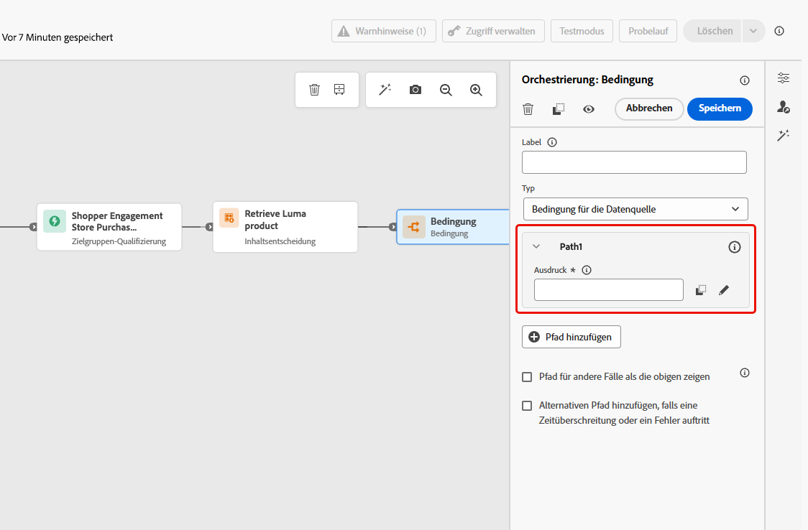

# Aktivität „Inhaltsentscheidung“  {#content-decision}

>[!AVAILABILITY]
>
>Diese Funktion ist nur für ausgewählte Organisationen verfügbar (eingeschränkte Verfügbarkeit) und wird in einer zukünftigen Version global eingeführt.

Sie können in [!DNL Journey Optimizer] über die dedizierte Aktivität **Inhaltsentscheidung** auf der Journey-Arbeitsfläche Angebote in Ihre Journey einbeziehen. Anschließend können Sie Ihren Journeys weitere Aktivitäten (wie [benutzerdefinierte Aktionen](../action/about-custom-action-configuration.md)) hinzufügen, um Ihre Zielgruppen mit diesen personalisierten Angeboten anzusprechen.

>[!NOTE]
>
>Die Ausgabe einer Aktivität vom Typ „Inhaltsentscheidung“ kann nicht in nativen Kanalaktivitäten verwendet werden.

Um diese Funktion zu nutzen, erstellen Sie eine Journey, in der Sie eine [Aktivität vom Typ „Inhaltsentscheidung“](#add-content-decision-activity) hinzufügen, zum Definieren der Angebote, die Sie den geeigneten Profilen unterbreiten möchten.

Sie können dann die Ausgabe der Aktivität „Inhaltsentscheidung“ in folgenden Bereichen verwenden:

* in einer [Aktivität vom Typ „Bedingung“](#add-condition-activity), um Profile basierend auf den abgerufenen Angeboten in bestimmte Pfade zu verschieben;

* in einer [benutzerdefinierte Aktion](#add-custom-action), mit der Sie diese Angebote an externe Systeme senden können.

## Konfigurieren einer Aktivität vom Typ „Inhaltsentscheidung“ {#add-content-decision-activity}

Mit der Aktivität „Inhaltsentscheidung“ können Sie eine Entscheidungsrichtlinie definieren, mit der Sie die besten Elemente aus der [!DNL Journey Optimizer]-Entscheidungsfindung auswählen und sie für die richtige Zielgruppe bereitstellen können.

<!--Their goal is to select the best offers for each profile, while the campaign/journey authoring allows you to indicate how the selected decision items should be presented, including which item attributes to be included in the message.-->

Gehen Sie wie folgt vor, um eine Aktivität vom Typ **[!UICONTROL Inhaltsentscheidung]** zu konfigurieren.

1. Erweitern Sie die Kategorie **[!UICONTROL Orchestrierung]** und legen Sie eine Aktivität vom Typ **[!UICONTROL Inhaltsentscheidung]** auf Ihrer Arbeitsfläche ab.

   {width=100%}

1. Optional können Sie der Aktivität ein Label und eine Beschreibung hinzufügen.

1. Klicken Sie auf **[!UICONTROL Entscheidungsrichtlinie hinzufügen]**. [Weitere Informationen zu Entscheidungsrichtlinien](../experience-decisioning/create-decision.md)

   >[!NOTE]
   >
   >Berichtigungen für die Entscheidungsfindung sind erforderlich, um eine Entscheidungsrichtlinie zu erstellen. [Weitere Informationen](../experience-decisioning/gs-experience-decisioning.md#steps)

1. Wählen Sie die Anzahl der Elemente, die zurückgegeben werden sollen. Wenn Sie beispielsweise „2“ auswählen, werden die zwei am besten geeigneten Angebote angezeigt. Klicken Sie auf **[!UICONTROL Weiter]**.

1. Im Bereich **[!UICONTROL Strategiesequenz]** können Sie die Entscheidungselemente und/oder Auswahlstrategien auswählen, die mit der Entscheidungsrichtlinie angezeigt werden sollen. [Weitere Informationen](../experience-decisioning/create-decision.md#create-decision)

1. Ordnen Sie die Auswertungsreihenfolge nach Bedarf an.

   Beim Hinzufügen mehrerer Entscheidungselemente und/oder Strategien werden diese in sequenzieller Reihenfolge ausgewertet, wobei die Reihenfolge mit Zahlen links von jedem Objekt oder jeder Objektgruppe angezeigt wird. Die Objekte und/oder Gruppen können nach Bedarf per Drag-and-Drop verschoben werden, um die Standardsequenz zu ändern.  [Weitere Informationen](../experience-decisioning/create-decision.md#create-decision)

1. (Optional) Fügen Sie ein Fallback-Angebot hinzu. [Weitere Informationen](../experience-decisioning/create-decision.md#create-decision)

1. Überprüfen und speichern Sie Ihre Entscheidungsrichtlinie.

   {width=70%}<!--reshoot or change screen-->

Sie können jetzt die Ausgabe dieser Aktivität vom Typ „Inhaltsentscheidung“ in Ihrer Journey nutzen.

## Leitlinien und Einschränkungen {#guardrails}

**Einverständnisrichtlinien**

Es kann bis zu 48 Stunden dauern, bis aktualisierte Einverständnisrichtlinien wirksam werden. Wenn eine Entscheidungsrichtlinie auf ein Attribut verweist, das mit einer kürzlich aktualisierten Einverständnisrichtlinie verknüpft ist, werden die Änderungen nicht sofort angewendet.

Wenn neue Profilattribute, die einer Einverständnisrichtlinie unterliegen, zu einer Entscheidungsrichtlinie hinzugefügt werden, sind sie ebenfalls verwendbar, aber die mit ihnen verknüpfte Einverständnisrichtlinie wird erst erzwungen, wenn die Verzögerungszeit vorüber ist.

Einverständnisrichtlinien sind nur für Organisationen verfügbar, die über das Zusatzangebot „Adobe Healthcare Shield“ oder „Privacy and Security Shield“ verfügen.

## Verwenden der Ausgabe der Aktivität „Inhaltsentscheidung“ {#use-content-decision-output}

Die Ausgabe einer Inhaltsentscheidung kann in mehreren Journey-Aktivitäten verwendet werden. Sie können beispielsweise eine [Aktivität des Typs „Bedingung“](#add-condition-activity) verwenden, um Profile basierend auf der Anzahl der für sie abgerufenen Angebote in bestimmte Verzweigungen Ihrer Journey zu verschieben.

Sie können Ihrer Journey auch eine [benutzerdefinierte Aktion](#add-custom-action) hinzufügen, um die Angebote aus der Aktivität „Inhaltsentscheidung“ für ein externes System freizugeben.

### In einer Aktivität des Typs „Bedingung“ {#add-condition-activity}

Um die Ausgabe einer Aktivität vom Typ „Inhaltsentscheidung“ zu nutzen, können Sie eine Bedingung zu Ihrer Journey hinzufügen, in der Sie Ausdrücke definieren, um Profile mithilfe von Daten aus diesen Angeboten in bestimmte Pfade zu verschieben. Gehen Sie wie folgt vor.

1. Ziehen Sie aus der Kategorie **[!UICONTROL Orchestrierung]** eine Aktivität vom Typ **[!UICONTROL Bedingung]** auf Ihre Arbeitsfläche. [Weitere Informationen](condition-activity.md#add-condition-activity)

1. (Optional) Benennen Sie **[!UICONTROL Pfad1]**, der dem ersten von Ihnen definierten Ausdruck entspricht, in ein relevanteres Label um.

1. Klicken Sie für diesen ersten Pfad in das Feld **[!UICONTROL Ausdruck]** oder verwenden Sie das Symbol „Bearbeiten“, um einen Ausdruck hinzuzufügen.

   {width=80%}

1. Wechseln Sie im sich öffnenden Popup-Fenster in den **[!UICONTROL erweiterten Modus]**, um den [erweiterten Ausdruckseditor](expression/expressionadvanced.md) zu verwenden.

   >[!CAUTION]
   >
   >Die Ausgabe eines Knotens vom Typ „Inhaltsentscheidung“ ist nur im **[!UICONTROL erweiterten Modus]** verfügbar.

1. Erweitern Sie den Knoten **[!UICONTROL Kontext]** und navigieren Sie zu Ihrer Entscheidungsrichtlinie, um alle im [Angebotskatalogschema](../experience-decisioning/catalogs.md#access-catalog-schema) verfügbaren Attribute anzuzeigen.

   

   >[!NOTE]
   >
   >Ein für ein Attribut definiertes eingeschränktes Label, ob in einem Journey-Erlebnisereignis, das in einer Entscheidungsregel (als Kontextdaten) verwendet wird, oder im [Angebotsschema](../experience-decisioning/catalogs.md#access-catalog-schema), führt nicht zu einem Richtlinienverstoß gemäß DULE oder Einverständnis. Weitere Informationen zu Data-Governance-Richtlinien finden Sie in [diesem Abschnitt](../action/action-privacy.md)

1. Um zu überprüfen, ob für die Profile, die in die Journey eintreten, ein Angebot zurückgegeben wurde, verwenden Sie die Funktion [listSize](functions/list-functions.md#listSize) mit der folgenden Syntax: `listSize(@decision{ContentdecisionName.items})>0`

   >[!NOTE]
   >
   >In diesem Beispiel ist `Name` das Label der Inhaltsentscheidung, die Sie Ihrer Journey hinzugefügt haben.

   

1. Klicken Sie auf **[!UICONTROL OK]**.

1. Fügen Sie weitere Pfade hinzu, um gegebenenfalls weitere Bedingungen zu definieren.

   Sie können auch einen anderen Pfad für Profile erstellen, die die erste Bedingung nicht erfüllen, indem Sie die Option **[!UICONTROL Pfad für andere Fälle als die obigen zeigen]** aktivieren. <!--These profiles will then exit the journey if no other activity is added in that path.-->

1. Speichern Sie die Aktivität „Bedingung“.

### In einer benutzerdefinierten Aktion {#add-custom-action}

Um die Ausgabe einer Aktivität vom Typ „Inhaltsentscheidung“ zu nutzen, können Sie eine benutzerdefinierte Aktion zu Ihrer Journey hinzufügen, in der Sie die von Ihnen definierten Angebote für ein externes System freigeben. Gehen Sie wie folgt vor.

1. Fügen Sie Ihrer Journey eine benutzerdefinierte Aktion hinzu. [Weitere Informationen](../action/about-custom-action-configuration.md)

1. Geben Sie ein Label für die Aktion ein.

1. Wählen Sie im Abschnitt **[!UICONTROL Anfrageparameter]** den Parameter aus, den Sie Attributen aus den abgerufenen Angeboten zuordnen möchten.

   Klicken Sie in das bearbeitbare Textfeld und wählen Sie aus den abgerufenen Angeboten einen beliebigen Parameter aus, den Sie Attributen zuordnen möchten.

   

1. Wechseln Sie im sich öffnenden Popup-Fenster in den **[!UICONTROL erweiterten Modus]**. Erweitern Sie im [erweiterten Ausdruckseditor](expression/expressionadvanced.md) den Knoten **[!UICONTROL Kontext]**, um alle Elemente der Entscheidungsrichtlinie anzuzeigen.

   >[!CAUTION]
   >
   >Die Ausgabe eines Knotens vom Typ „Inhaltsentscheidung“ ist nur im **[!UICONTROL erweiterten Modus]** verfügbar.

1. Durchsuchen Sie das [Angebotskatalogschema](../experience-decisioning/catalogs.md#access-catalog-schema) mithilfe des `items`-Arrays. Verwenden Sie beispielsweise `itemName` vom ersten abgerufenen Angebot und `itemName` vom zweiten abgerufenen Angebot.

   

1. Klicken Sie auf **[!UICONTROL OK]**, um Ihren Ausdruck zu speichern.

1. **[!UICONTROL Speichern]** Sie die Konfiguration Ihrer benutzerdefinierten Aktion.

### End-to-End-Beispiel {#use-case}

Nachfolgend finden Sie ein vollständiges Beispiel für eine Journey mit einer Aktivität vom Typ „Inhaltsentscheidung“ in Kombination mit einer Aktivität vom Typ „Bedingung“ und einer benutzerdefinierten Aktion, wie oben beschrieben.

<!--When all activities are properly configured and saved, [publish](publish-journey.md) your journey.-->

Folgendes gilt, sobald die Journey [aktiviert](publish-journey.md) ist:

<!--* Profiles who enter the journey and are eligible for at least one offer are targeted by the custom action.

* If no offer is returned for a profile, they are excluded from the custom action.-->

1. Jedes Mal, wenn sich ein Profil für diese Zielgruppe qualifiziert, tritt es in die Journey ein.

1. [!DNL Journey Optimizer] ruft über die Aktivität „Inhaltsentscheidung“ die für jedes Profil relevanten Angebote ab.

1. Nur Profile, für die mindestens ein Angebot abgerufen wurde, setzen die Journey fort (über den Pfad „Geeignete Profile“).

1. Wenn die Bedingung erfüllt ist, werden die entsprechenden Angebote über die benutzerdefinierte Aktion an ein externes System gesendet.
