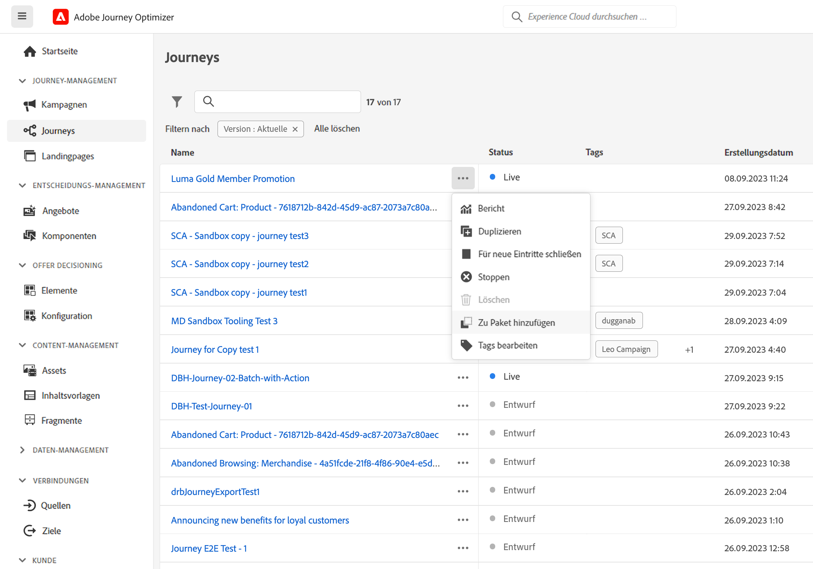
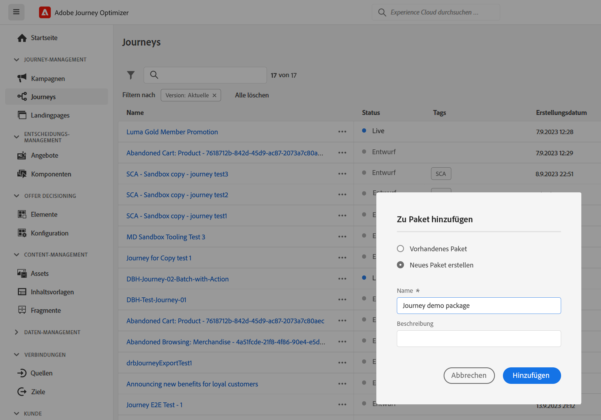
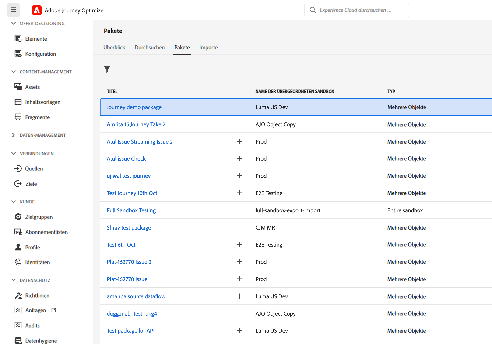
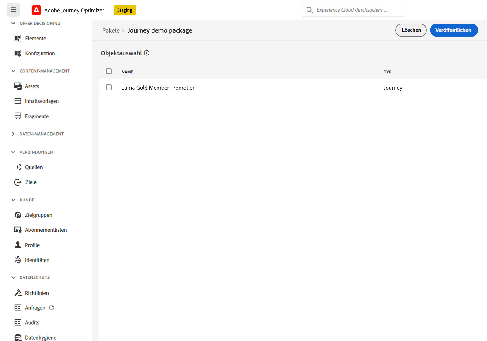
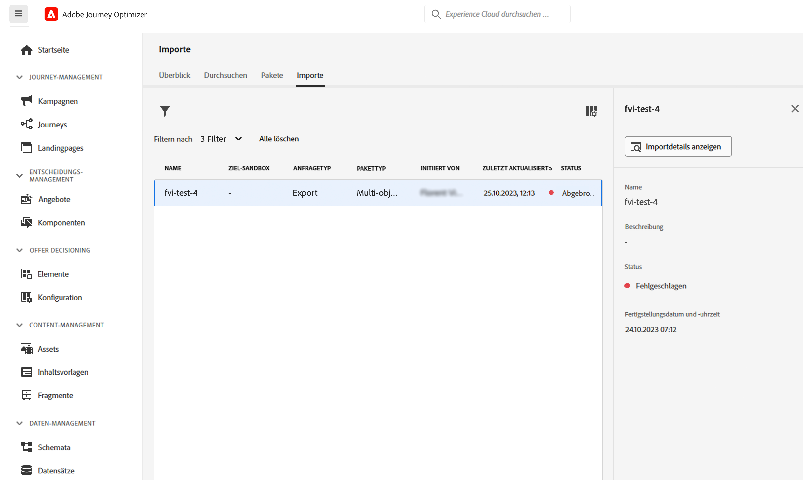
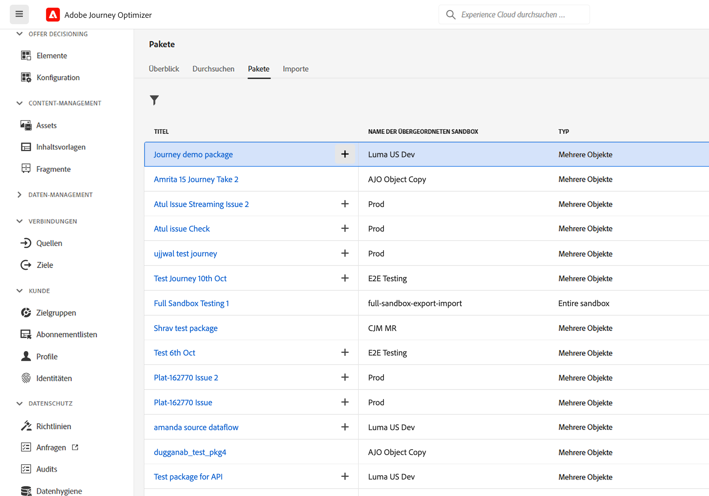
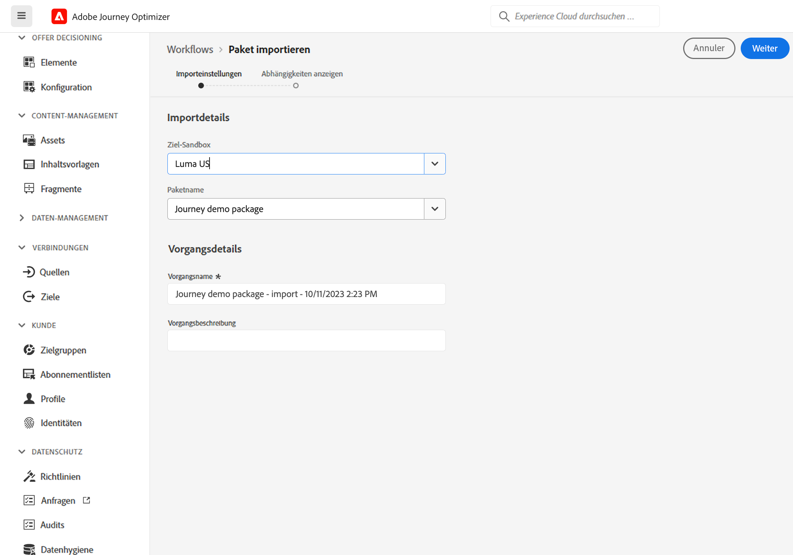
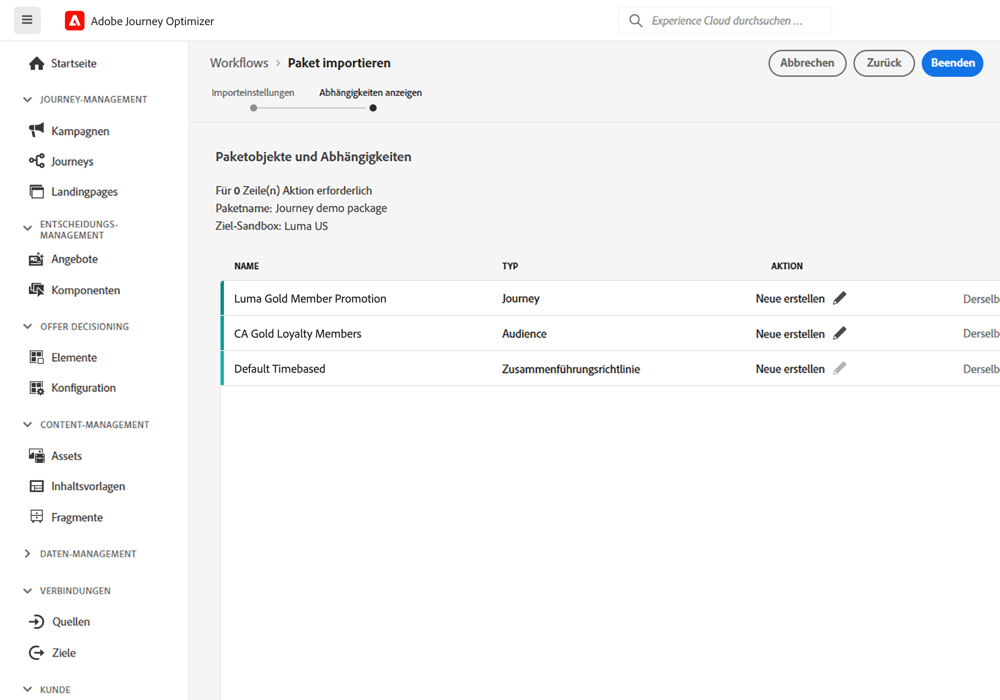

# Kopieren einer Journey in eine andere Sandbox {#copy-to-sandbox}

<!--
>[!CONTEXTUALHELP]
>id="ajo_journey_copy_main"
>title="Copy a journey to another sandbox"
>abstract="Journey Optimizer allows you to copy an entire journey from one sandbox to another. For example, you can copy a journey from the Stage sandbox environment to your Production sandbox. In addition to the Journey itself, Journey Optimizer also copies most of the objects the journey depends on."

>[!CONTEXTUALHELP]
>id="ajo_journey_copy_sandbox_details"
>title="Sandbox details"
>abstract="Select the destination sandbox you want to copy the journey to. Only sandboxes within your organization are available."

>[!CONTEXTUALHELP]
>id="ajo_journey_copy_object_details"
>title="Object details"
>abstract="This is the journey you are going to copy."

>[!CONTEXTUALHELP]
>id="ajo_journey_copy_dependent_objects"
>title="Dependent objects"
>abstract="This is the list of associated objects used in the journey. This list displays the name, the object type, as well as the internal Journey Optimizer ID."
-->

Sandbox Tooling ermöglicht es Ihnen, Objekte über mehrere Sandboxes hinweg zu kopieren, indem Sie Package-Export und -Import nutzen. Ein Paket kann aus einem oder mehreren Objekten bestehen. Alle Objekte, die in einem Paket enthalten sind, müssen aus derselben Sandbox stammen.

Auf dieser Seite wird der Anwendungsfall der Sandbox-Tools im Kontext von Journey Optimizer beschrieben. Weitere Informationen zur Funktion selbst finden Sie im Abschnitt [Experience Platform-Dokumentation](https://experienceleague.corp.adobe.com/docs/experience-platform/sandbox/ui/sandbox-tooling.html).

>[!NOTE]
>
>Diese Funktion erfordert die folgenden Berechtigungen: manage-sandbox (oder view-sandbox) und manage-package.

## Erste Schritte mit Sandbox Tooling{#sandbox-gs}

Mit Journey Optimizer können Sie eine ganze Journey von einer Sandbox in eine andere kopieren. Sie können beispielsweise eine Journey aus Ihrer Staging-Sandbox-Umgebung in Ihre Produktions-Sandbox kopieren. Zusätzlich zur Journey kopiert Journey Optimizer auch die meisten Objekte, von denen die Journey abhängig ist: Zielgruppen, Schemata, Ereignisse und Aktionen. Weiterführende Informationen zu kopierten Objekten finden Sie in diesem [Abschnitt](https://experienceleague.adobe.com/docs/experience-platform/sandbox/ui/sandbox-tooling.html#abobe-journey-optimizer-objects).

>[!CAUTION]
>
>Wir garantieren nicht, dass alle verknüpften Elemente in die Ziel-Sandbox kopiert werden. Es wird dringend empfohlen, eine gründliche Prüfung durchzuführen, bevor Sie die Journey veröffentlichen. Auf diese Weise können Sie potenziell fehlende Objekte identifizieren.

Die kopierten Objekte in der Ziel-Sandbox sind eindeutig, sodass kein Risiko besteht, vorhandene Elemente zu überschreiben. Sowohl die Journey als auch alle Nachrichten innerhalb der Journey werden im Entwurfsmodus übergeben. Auf diese Weise können Sie vor der Veröffentlichung in der Ziel-Sandbox eine gründliche Validierung durchführen. Der Kopiervorgang kopiert nur die Metadaten über die Journey und die Objekte in dieser Journey. Im Rahmen dieses Prozesses werden keine Profil- oder Datensatzdaten kopiert.

Der Kopiervorgang erfolgt über einen Package-Export und -Import zwischen der Quell- und der Ziel-Sandbox. Im Folgenden finden Sie die allgemeinen Schritte zum Kopieren einer Journey von einer Sandbox in eine andere:

1. Fügen Sie die Journey als Paket in die Quell-Sandbox ein.
1. Exportieren Sie das Paket in die Ziel-Sandbox.

## Journey als Paket hinzufügen{#export}

Um eine Journey in eine andere Sandbox zu kopieren, müssen Sie zunächst die Journey als Paket in die Quell-Sandbox einfügen. Führen Sie folgende Schritte aus:

1. Klicken Sie im Menü JOURNEY-MANAGEMENT auf **[!UICONTROL Journeys]**. Die Liste der Journeys wird angezeigt.

1. Suchen Sie nach der Journey, die Sie kopieren möchten, und klicken Sie auf die **Mehr Aktionen** (die drei Punkte neben dem Journey-Namen) und klicken Sie auf **Zu Paket hinzufügen**.

   

   Die **Zu Paket hinzufügen** angezeigt.

   

1. Wählen Sie aus, ob Sie die Journey zu einem vorhandenen Paket hinzufügen oder ein neues Paket erstellen möchten:

   * **Vorhandenes Paket**: Wählen Sie das Paket aus dem Dropdownmenü aus.
   * **Neues Paket erstellen**: Geben Sie den Paketnamen ein. Sie können auch eine Beschreibung hinzufügen.

1. Klicken Sie im Menü Administration auf **[!UICONTROL Sandboxes]**, wählen Sie die **Pakete** und klicken Sie auf das Package, das Sie exportieren möchten.

   

1. Wählen Sie die Objekte aus, die Sie exportieren möchten, und klicken Sie auf **Veröffentlichen**

   

   Wenn die Veröffentlichung fehlgeschlagen ist, können Sie in den Protokollen den Fehlergrund ermitteln. Öffnen Sie das Paket, klicken Sie auf **Anzeigen fehlgeschlagener Aufträge**, wählen Sie den Importauftrag aus und klicken Sie auf **Importdetails anzeigen**.

   

## Exportieren des Pakets in die Ziel-Sandbox {#import}

Nachdem das Paket veröffentlicht wurde, müssen Sie es in die Ziel-Sandbox exportieren.

1. Klicken Sie in der Quell-Sandbox auf die **[!UICONTROL Sandboxes]** auswählen, wählen Sie die **Pakete** und klicken Sie auf das Symbol + neben dem Package, das Sie exportieren möchten.

   

1. Wählen Sie die **Target-Sandbox** aus dem Dropdown-Feld und klicken Sie auf **Nächste**. Es sind nur Sandboxes innerhalb Ihrer Organisation verfügbar.

   

1. Überprüfen Sie die Paketobjekte und Abhängigkeiten. Dies ist die Liste der zugeordneten Objekte, die in der Journey verwendet werden. Diese Liste zeigt den Namen und den Objekttyp an. Für jedes Objekt können Sie entweder ein neues erstellen oder ein vorhandenes Objekt in der Ziel-Sandbox verwenden.

   

1. Klicken Sie auf **Beenden** in der oberen rechten Ecke, um mit dem Kopieren des Pakets in die Ziel-Sandbox zu beginnen. Der Kopiervorgang hängt von der Komplexität der Journey ab und davon, wie viele Objekte kopiert werden müssen.

1. Klicken Sie auf den Importauftrag, um das Kopierergebnis zu überprüfen:

   * Klicks **Importierte Objekte anzeigen** , um jedes kopierte Objekt anzuzeigen.
   * Klicks **Importdetails anzeigen** , um die Importergebnisse für jedes Objekt zu überprüfen.

   

1. Greifen Sie auf Ihre Ziel-Sandbox zu und führen Sie eine gründliche Prüfung aller kopierten Objekte durch.
