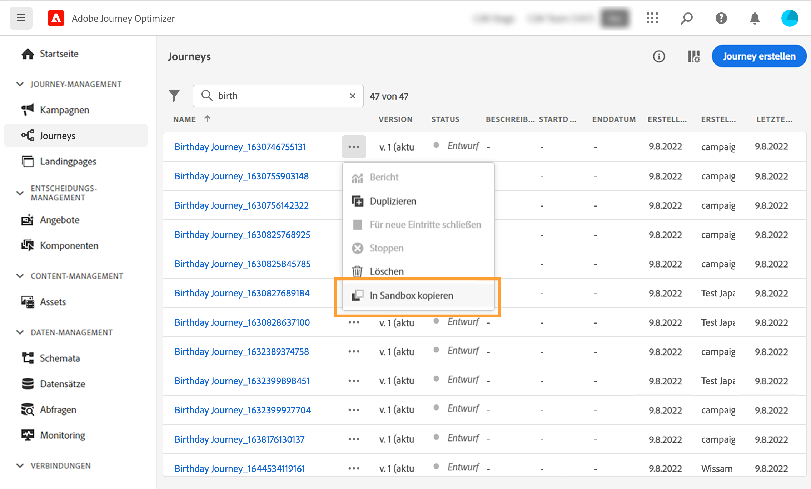
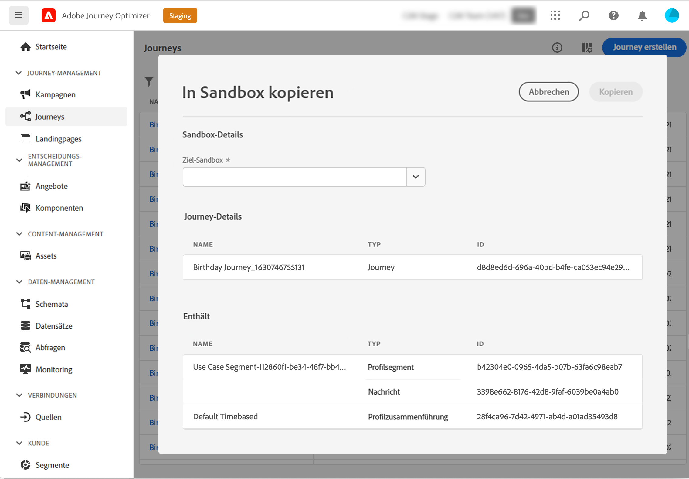
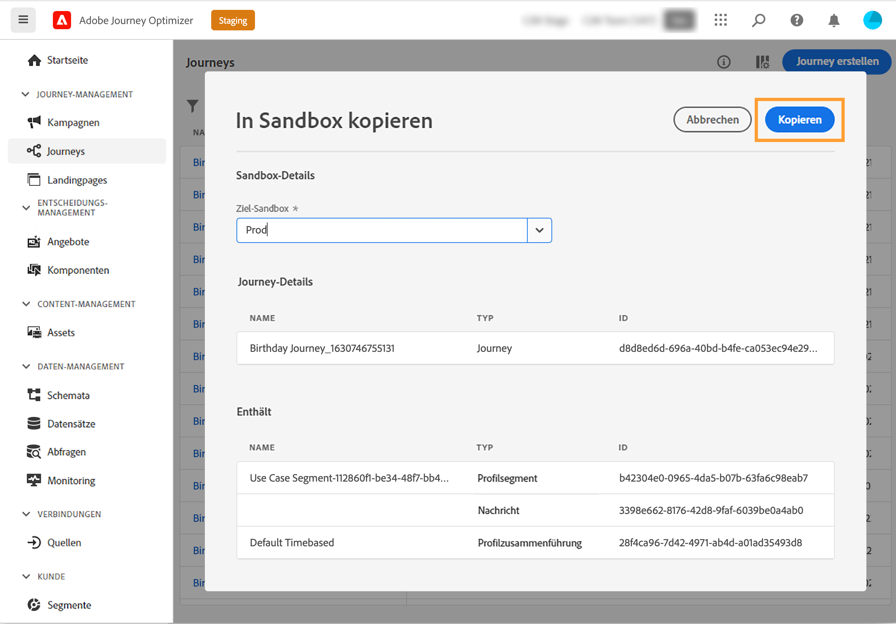
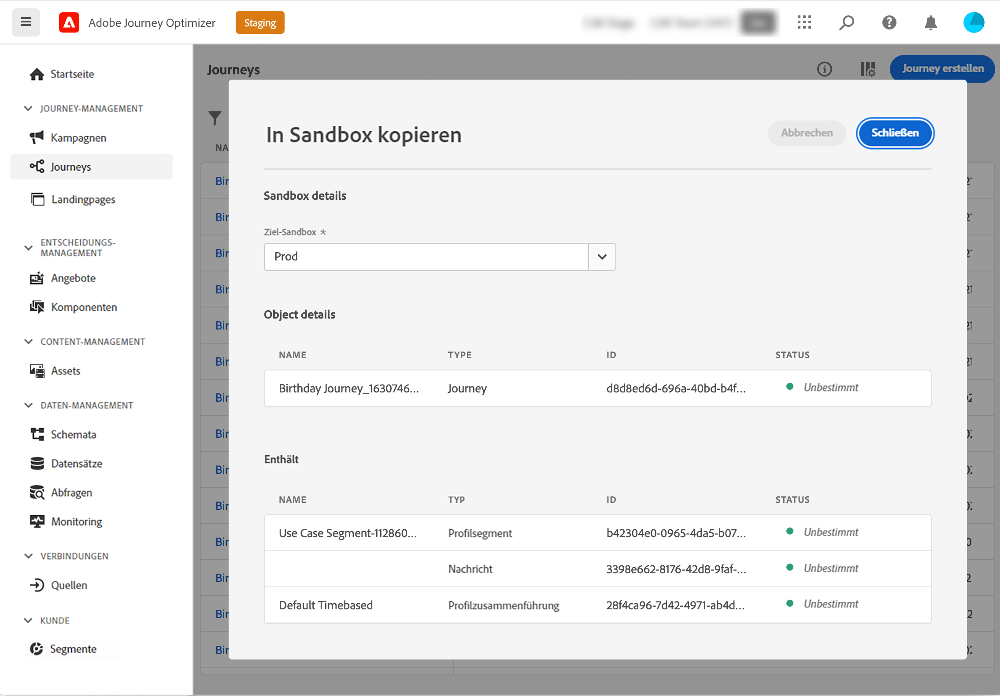

# Kopieren einer Journey in eine andere Sandbox {#copy-to-sandbox}

>[!CONTEXTUALHELP]
>id="ajo_journey_copy_main"
>title="Kopieren einer Journey in eine andere Sandbox"
>abstract="Mit Journey Optimizer können Sie eine ganze Journey von einer Sandbox in eine andere kopieren. Sie können beispielsweise eine Journey aus der Staging-Sandbox-Umgebung in Ihre Produktions-Sandbox kopieren. Zusätzlich zur Journey selbst kopiert Journey Optimizer auch die meisten Objekte, von denen die Journey abhängig ist."

>[!CONTEXTUALHELP]
>id="ajo_journey_copy_sandbox_details"
>title="Sandbox-Details"
>abstract="Wählen Sie die Ziel-Sandbox aus, in die Sie die Journey kopieren möchten. Es sind nur Sandboxes innerhalb Ihrer Organisation verfügbar."

>[!CONTEXTUALHELP]
>id="ajo_journey_copy_object_details"
>title="Objektdetails"
>abstract="Dies ist die Journey, die Sie kopieren werden."

>[!CONTEXTUALHELP]
>id="ajo_journey_copy_dependent_objects"
>title="Abhängige Objekte"
>abstract="Dies ist die Liste der zugeordneten Objekte, die in der Journey verwendet werden. In dieser Liste werden der Name, der Objekttyp und die interne Journey Optimizer-ID angezeigt."

Mit Journey Optimizer können Sie eine ganze Journey von einer Sandbox in eine andere kopieren. Sie können beispielsweise eine Journey aus Ihrer Staging-Sandbox-Umgebung in Ihre Produktions-Sandbox kopieren. Zusätzlich zur Journey selbst kopiert Journey Optimizer auch die meisten Objekte, von denen die Journey abhängig ist: Segmente, Oberflächen (d. h. Voreinstellungen), Schemata, Ereignisse und Aktionen. Weiterführende Informationen zu kopierten Objekten finden Sie in diesem [Abschnitt](#limitations).

>[!CAUTION]
>
>Wir garantieren nicht, dass alle verknüpften Elemente in die Ziel-Sandbox kopiert werden. Es wird dringend empfohlen, eine gründliche Prüfung durchzuführen, bevor Sie die Journey veröffentlichen. Auf diese Weise können Sie potenziell fehlende Objekte identifizieren.

Die kopierten Objekte in der Ziel-Sandbox sind eindeutig, sodass kein Risiko besteht, vorhandene Elemente zu überschreiben. Sowohl die Journey als auch alle Nachrichten innerhalb der Journey werden im Entwurfsmodus übergeben. Auf diese Weise können Sie vor der Veröffentlichung in der Ziel-Sandbox eine gründliche Validierung durchführen. Der Kopiervorgang kopiert nur die Metadaten über die Journey und die Objekte in dieser Journey. Im Rahmen dieses Prozesses werden keine Profil- oder Datensatzdaten kopiert.

Gehen Sie wie folgt vor, um eine Journey in eine andere Sandbox zu kopieren:

1. Klicken Sie im Menü JOURNEY-MANAGEMENT auf **[!UICONTROL Journeys]**. Die Liste der Journeys wird angezeigt.

2. Suchen Sie nach der Journey, die Sie kopieren möchten, und klicken Sie auf das Symbol **Mehr Aktionen** (die drei Punkte neben dem Journey-Namen) und dann auf **In Sandbox kopieren**.

   

   Der Bildschirm **In Sandbox kopieren** wird angezeigt.

   

3. Wählen Sie die **Ziel-Sandbox** aus der Dropdown-Liste aus. Es sind nur Sandboxes innerhalb Ihrer Organisation verfügbar.

4. Beachten Sie den Abschnitt **Abhängige Objekte**. Dies ist die Liste der zugeordneten Objekte, die in der Journey verwendet werden. In dieser Liste werden der Name, der Objekttyp und die interne Journey Optimizer-ID angezeigt.

5. Klicken Sie auf die Schaltfläche **Kopieren** oben rechts, um mit dem Kopieren der Journey in die Ziel-Sandbox zu beginnen.

   

   Der Kopiervorgang beginnt, wobei der Fortschritt der einzelnen Objekte angezeigt wird. Der Kopiervorgang hängt von der Komplexität der Journey ab und davon, wie viele Objekte kopiert werden müssen. Wenn ein Fehler auftritt, wird eine Meldung für das zugehörige Objekt angezeigt.

   

6. Nachdem das Kopieren abgeschlossen ist, klicken Sie auf **Schließen**.

7. Greifen Sie auf Ihre Ziel-Sandbox zu und führen Sie eine gründliche Prüfung aller kopierten Objekte durch.

## Kopieren von Prozessen und Einschränkungen {#limitations}

Möglicherweise werden nicht alle verknüpften Elemente in die Ziel-Sandbox kopiert. Adobe empfiehlt dringend, eine gründliche Überprüfung durchzuführen. Ermitteln Sie alle potenziellen fehlenden Objekte und erstellen Sie sie manuell, bevor Sie die Journey veröffentlichen.

Die folgenden Objekte werden kopiert:

* Segment

   Ein Segment kann nur einmal von einer Sandbox in eine andere kopiert werden. Nachdem ein Segment kopiert wurde, kann es nicht mehr in der Ziel-Sandbox bearbeitet werden.

* Schema

   Die in dieser Journey verwendeten Schemata werden kopiert.

* Nachricht

   Die in der Journey verwendeten Kanalaktionsaktivitäten. Die für die Personalisierung verwendeten Felder in der Nachricht werden nicht auf Vollständigkeit überprüft. Inhaltsbausteine werden nicht kopiert.

* Journey – Details der Arbeitsfläche

   Die Darstellung der Journey auf der Arbeitsfläche, einschließlich der Objekte in der Journey, wie Bedingungen, Aktionen, Ereignisse, Lesesegmente usw. Die Sprungaktivität ist von der Kopie ausgeschlossen.

* Ereignis

   Die Ereignisse und Ereignisdetails, die in der Journey verwendet werden, werden kopiert.

* Aktion

   Die in der Journey verwendeten Aktionen und Aktionsdetails werden kopiert.

Oberflächen (d. h. Voreinstellungen) werden nicht kopiert. Das System wählt basierend auf dem Nachrichtentyp und dem Namen der Oberfläche automatisch die bestmögliche Übereinstimmung für die Ziel-Sandbox aus. Wenn keine Oberflächen in der Ziel-Sandbox gefunden werden, schlägt die Kopie der Oberfläche fehl. Dies bedeutet, dass die Nachrichtenkopie ebenfalls fehlschlägt, da für eine Nachricht eine Oberfläche zur Einrichtung verfügbar sein muss. In diesem Fall muss mindestens eine Oberfläche für den entsprechenden Kanal der Nachricht erstellt werden, damit eine Kopie durchgeführt werden kann.

Für Schemata, Zusammenführungsrichtlinien und Segmente werden diese Objekte beim zweiten Versuch, sie zu kopieren, nur referenziert. Sie werden als bereits vorhandene Objekte behandelt und erneut kopiert. Dies bedeutet, dass diese Objekte nur einmal kopiert werden können.

Es dauert fünf Minuten, bis Adobe Journey Optimizer auf Schemata, Zusammenführungsrichtlinien und Segmente verweisen kann, ohne dass während dieser Zeit auf der Arbeitsfläche ein Fehler angezeigt wird. Wenn Sie fünf Minuten warten, sind diese Referenzen verfügbar.
