# Erstellen von Testprofilen {#create-test-profiles}

Testprofile sind erforderlich, wenn Sie in einer Journey den [Testmodus](../building-journeys/testing-the-journey.md) verwenden und [eine Vorschau anzeigen und Ihre Inhalte testen möchten](../email/preview.md).

Es gibt mehrere Möglichkeiten, Testprofile zu erstellen. Auf dieser Seite finden Sie Details für Folgendes:

* Ein [vorhandenes Profil](#turning-profile-into-test) in ein Testprofil umwandeln

* Testprofile durch Hochladen einer [CSV-Datei](#create-test-profiles-csv) oder mithilfe von [API-Aufrufen](#create-test-profiles-api) erstellen

  Zusätzlich zu diesen beiden Methoden bietet Adobe Journey Optimizer einen speziellen [produktinternen Anwendungsfall](#use-case-1), um die Erstellung von Testprofilen zu erleichtern.

Sie können auch eine JSON-Datei in einen vorhandenen Datensatz hochladen. Weiterführende Informationen dazu finden Sie in der [Dokumentation zur Datenaufnahme](https://experienceleague.adobe.com/docs/experience-platform/ingestion/tutorials/ingest-batch-data.html?lang=de#add-data-to-dataset){target="_blank"}.

Beachten Sie, dass das Erstellen eines Testprofils dem Erstellen regulärer Profile in Adobe Experience Platform ähnelt. Weitere Informationen finden Sie in der [Dokumentation zu Echtzeit-Kundenprofilen](https://experienceleague.adobe.com/docs/experience-platform/profile/home.html?lang=de){target="_blank"}.

➡️ [In diesem Video erfahren Sie, wie Sie Testprofile erstellen](#video)

## Voraussetzungen {#test-profile-prerequisites}

Um Profile erstellen zu können, müssen Sie zunächst ein Schema und einen Datensatz in Adobe [!DNL Journey Optimizer] erstellen.

Gehen Sie wie folgt vor, um **ein Schema zu erstellen**:

1. Klicken Sie im Menüabschnitt DATEN-MANAGEMENT auf **[!UICONTROL Schemas]**.
   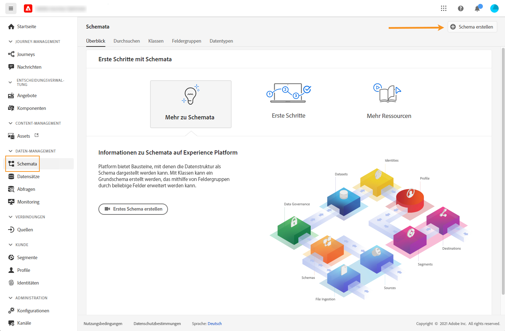
1. Klicks **[!UICONTROL Schema erstellen]** Wählen Sie oben rechts einen Schematyp aus, beispielsweise **Individuelles Profil** und klicken **Nächste**.
   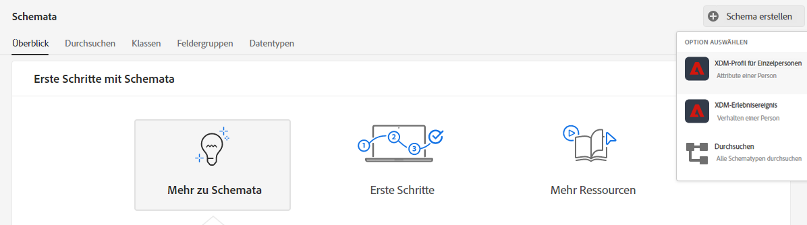
1. Geben Sie einen Namen für Ihr Schema ein und klicken Sie auf **Beenden**.
   
1. Im **Feldergruppen** Klicken Sie links im Bereich auf **Add$$ und wählen Sie die entsprechenden Feldergruppen aus. Stellen Sie sicher, dass Sie die Feldgruppe **Profil-Testdetails** hinzufügen.
   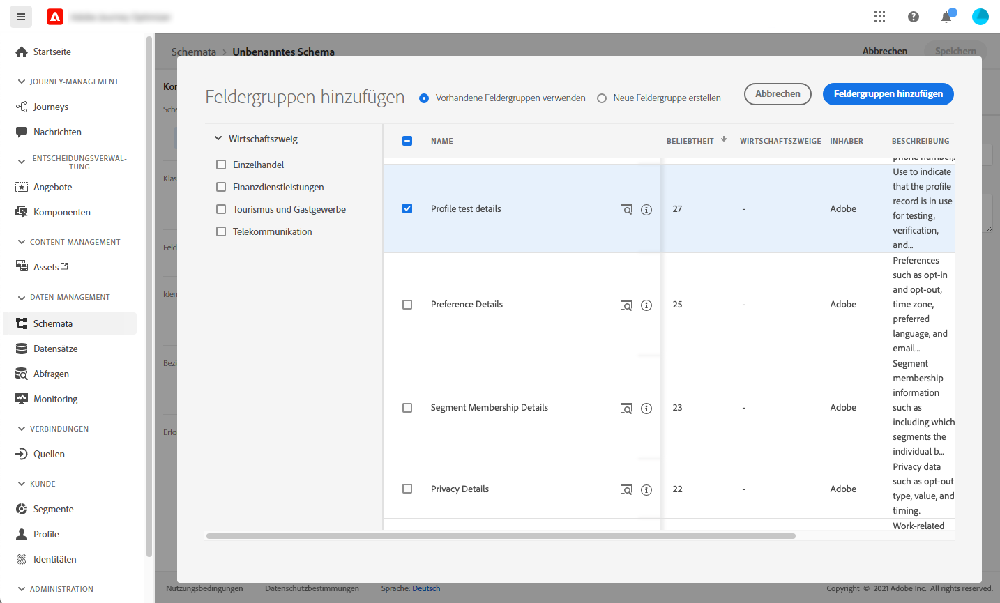
Klicken Sie abschließend auf **[!UICONTROL Feldgruppen hinzufügen]**: Die Liste der Feldgruppen wird im Bildschirm „Schemaübersicht“ angezeigt.
   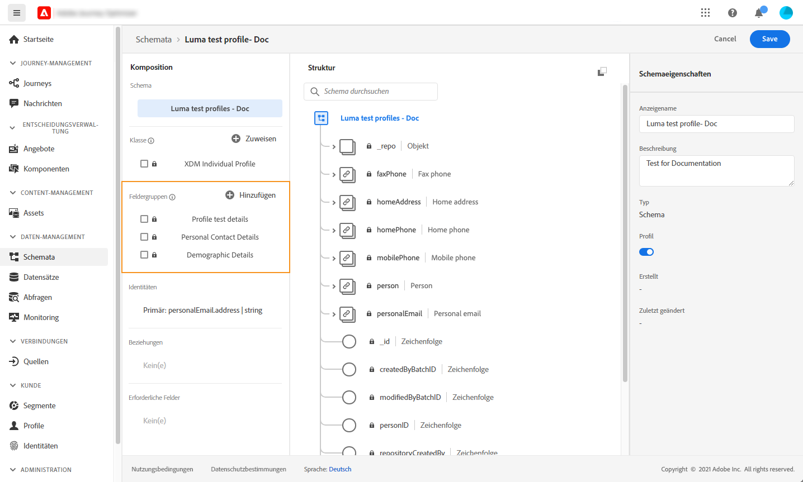

   >[!NOTE]
   >
   >Klicken Sie auf den Namen des Schemas, um seine Eigenschaften zu aktualisieren.

1. Klicken Sie in der Liste der Felder auf das Feld, das Sie als die primäre Identität definieren möchten.
   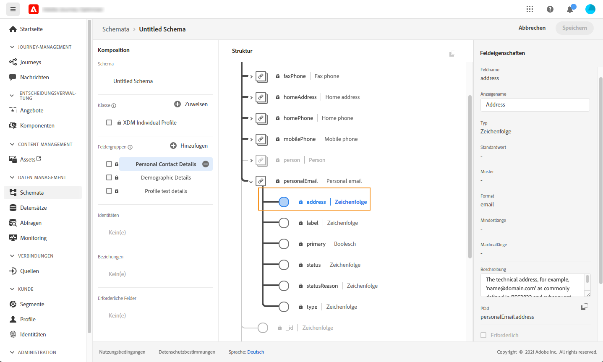
1. Markieren Sie im rechten Bereich **[!UICONTROL Feldeigenschaften]** die Optionen **[!UICONTROL Identität]** und **[!UICONTROL Primäre Identität]** und wählen Sie einen Namespace aus. Wenn die primäre Identität eine E-Mail-Adresse sein soll, wählen Sie den Namespace **[!UICONTROL E-Mail]**. Klicken Sie auf **[!UICONTROL Übernehmen]**.
   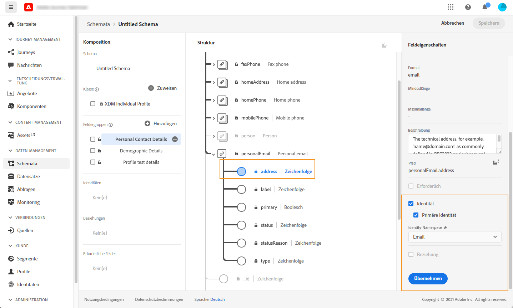
1. Wählen Sie das Schema aus und aktivieren Sie die Option **[!UICONTROL Profil]** im Bereich **[!UICONTROL Schema-Eigenschaften]**.
   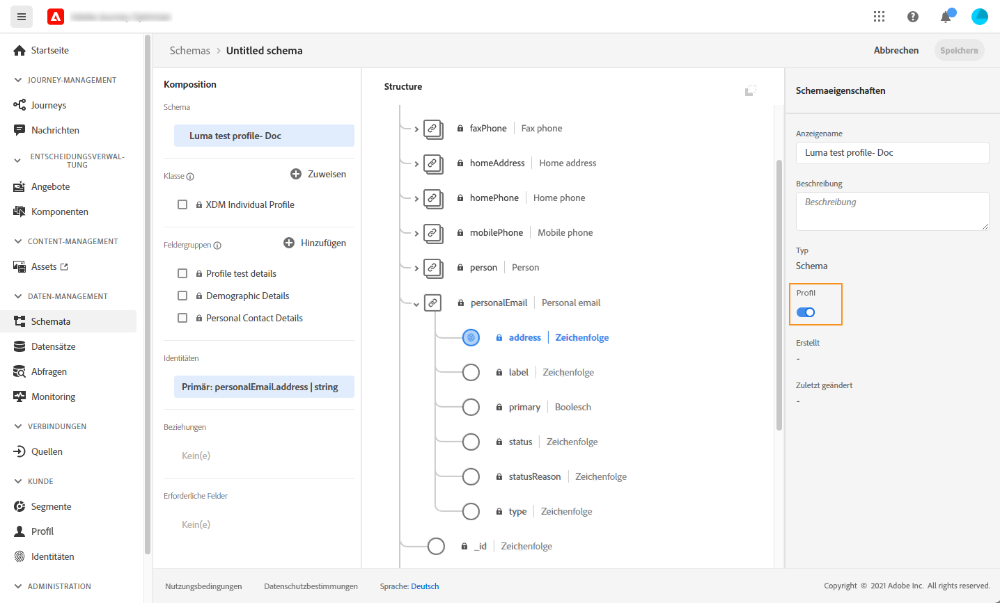
1. Klicken Sie auf **Speichern**.

>[!NOTE]
>
>Weitere Informationen zur Erstellung von Schemata finden Sie in der [XDM-Dokumentation](https://experienceleague.adobe.com/docs/experience-platform/xdm/ui/resources/schemas.html?lang=de#prerequisites){target="_blank"}.

Anschließend müssen Sie **den Datensatz erstellen**, in den die Profile importiert werden. Führen Sie folgende Schritte aus:

1. Gehen Sie zu **[!UICONTROL Datensätze]** und klicken Sie dann auf **[!UICONTROL Datensatz erstellen]**.
   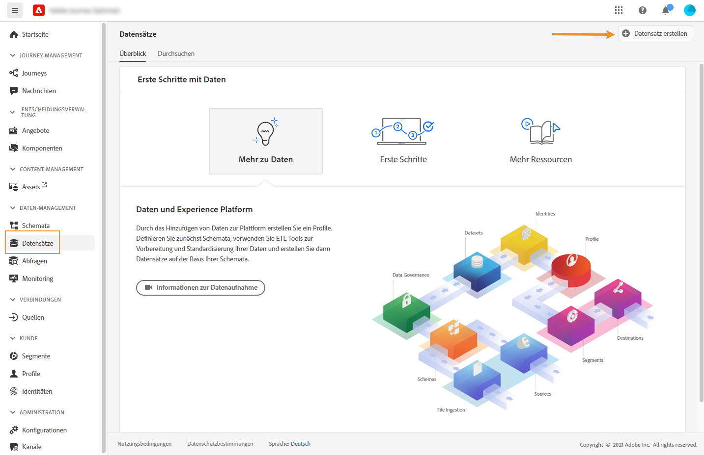
1. Wählen Sie **[!UICONTROL Datensatz aus Schema erstellen]** aus.
   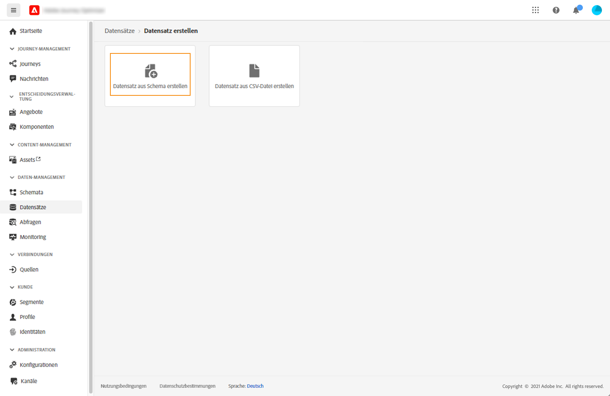
1. Wählen Sie das zuvor erstellte Schema aus und klicken Sie dann auf **[!UICONTROL Weiter]**.
   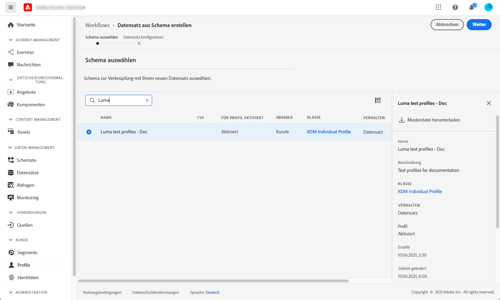
1. Wählen Sie einen Namen und klicken Sie dann auf **[!UICONTROL Beenden]**.
   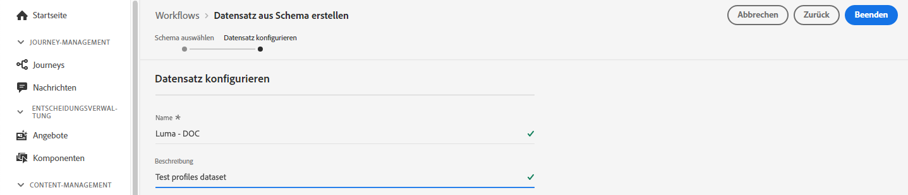
1. Aktivieren Sie die Option **[!UICONTROL Profil]**.
   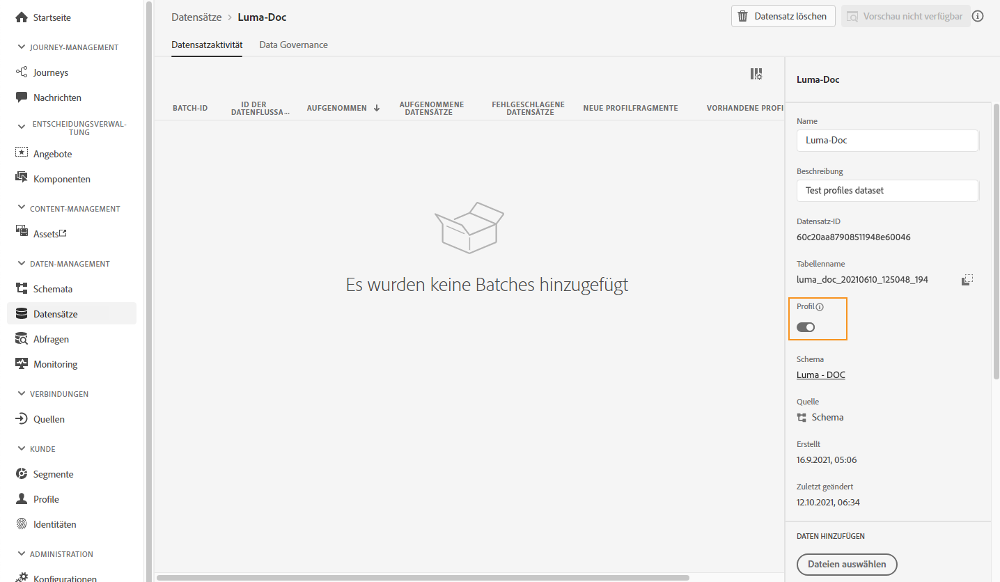

>[!NOTE]
>
> Weitere Informationen zur Erstellung von Datensätzen finden Sie in der [Dokumentation zum Katalog-Service](https://experienceleague.adobe.com/docs/experience-platform/catalog/datasets/user-guide.html?lang=de#getting-started){target="_blank"}.

## Produktinterner Anwendungsfall{#use-case-1}

Auf der Adobe Journey Optimizer-Startseite können Sie den produktinternen Anwendungsfall für Testprofile nutzen. Dieser Anwendungsfall erleichtert die Erstellung von Testprofilen, die vor der Veröffentlichung zum Testen von Journeys verwendet werden.

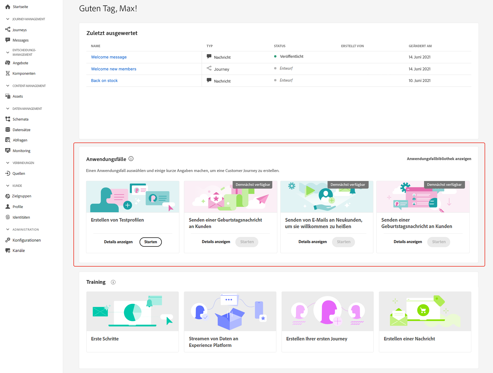

Klicken Sie auf den Button **[!UICONTROL Start]**, um den Anwendungsfall zu starten.

Die folgenden Informationen werden benötigt:

1. **Identity-Namespace**: Der [Identity-Namespace](../audience/get-started-identity.md), mit dem die Testprofile eindeutig identifiziert werden. Wenn beispielsweise die E-Mail-Adresse zur Identifizierung der Testprofile verwendet wird, sollte der Identity-Namespace **E-Mail** ausgewählt werden. Wenn die eindeutige Kennung die Telefonnummer ist, sollte der Identity-Namespace **Telefon** ausgewählt werden.

2. **CSV-Datei**: Eine kommagetrennte Datei, die die Liste der zu erstellenden Testprofile enthält. Der Anwendungsfall erwartet ein vordefiniertes Format für die CSV-Datei, die die Liste der zu erstellenden Testprofile enthält. Jede Zeile in der Datei sollte die folgenden Felder in der richtigen Reihenfolge wie folgt enthalten:

   1. **Personen-ID**: Eindeutige Kennung des Testprofils. Die Werte dieses Felds sollten den ausgewählten Identity-Namespace widerspiegeln. (Wenn beispielsweise **Telefon** für den Identity-Namespace ausgewählt ist, sollten die Werte dieses Felds Telefonnummern sein. Wenn **E-Mail** ausgewählt ist, sollten die Werte dieses Felds E-Mail-Adressen sein.
   1. **E-Mail-Adresse**: E-Mail-Adresse des Testprofils. (Das Feld **Personen-ID** und das Feld **E-Mail-Adresse** können möglicherweise dieselben Werte enthalten, wenn **E-Mail** als Identity-Namespace ausgewählt ist.)
   1. **Vorname**: Vorname des Testprofils.
   1. **Nachname**: Nachname des Testprofils.
   1. **Stadt**: Stadt, in der das Testprofil seinen Wohnsitz hat
   1. **Land**: Land, in dem das Testprofil seinen Wohnsitz hat
   1. **Geschlecht**: Geschlecht des Testprofils. Verfügbare Werte sind **männlich**, **weiblich** und **nicht_spezifiziert**

Nachdem Sie den Identity-Namespace ausgewählt und die CSV-Datei basierend auf dem oben stehenden Format bereitgestellt haben, klicken Sie oben rechts auf den Button **[!UICONTROL Ausführen]**. Es kann ein paar Minuten dauern, bis der Anwendungsfall abgeschlossen ist. Sobald der Anwendungsfall die Verarbeitung und das Erstellen der Testprofile abgeschlossen hat, wird eine Benachrichtigung gesendet, um den Benutzer zu informieren.

>[!NOTE]
>
>Testprofile können vorhandene Profile überschreiben. Bevor Sie den Anwendungsfall ausführen, stellen Sie sicher, dass die CSV-Datei nur Testprofile enthält und dass sie für die richtige Sandbox ausgeführt wird.

## Umwandeln eines Profils in ein Testprofil {#turning-profile-into-test}

So können Sie ein vorhandenes Profil in ein Testprofil umwandeln: Sie können Profilattribute auf dieselbe Weise aktualisieren wie bei der Erstellung eines Profils.

Am einfachsten erreichen Sie das, indem Sie die Aktionsaktivität **[!UICONTROL Profil aktualisieren]** in einer Journey verwenden und das boolesche Feld **testProfile** von „false“ auf „true“ ändern.

Ihre Journey besteht dann aus den Aktivitäten **[!UICONTROL Zielgruppe lesen]** und **[!UICONTROL Profil aktualisieren]**. Zunächst müssen Sie eine Zielgruppe erstellen, die die Profile anspricht, die in Testprofile umgewandelt werden sollen.

>[!NOTE]
>
> Da Sie das Feld **testProfile** aktualisieren werden, müssen die ausgewählten Profile dieses Feld enthalten. Das zugehörige Schema muss die Feldgruppe **Testdetails des Profils** enthalten. Weitere Informationen finden Sie in [diesem Abschnitt](../audience/creating-test-profiles.md#test-profiles-prerequisites).

1. Navigieren Sie zu **Zielgruppen** und dann oben rechts zu **Zielgruppe erstellen**.
   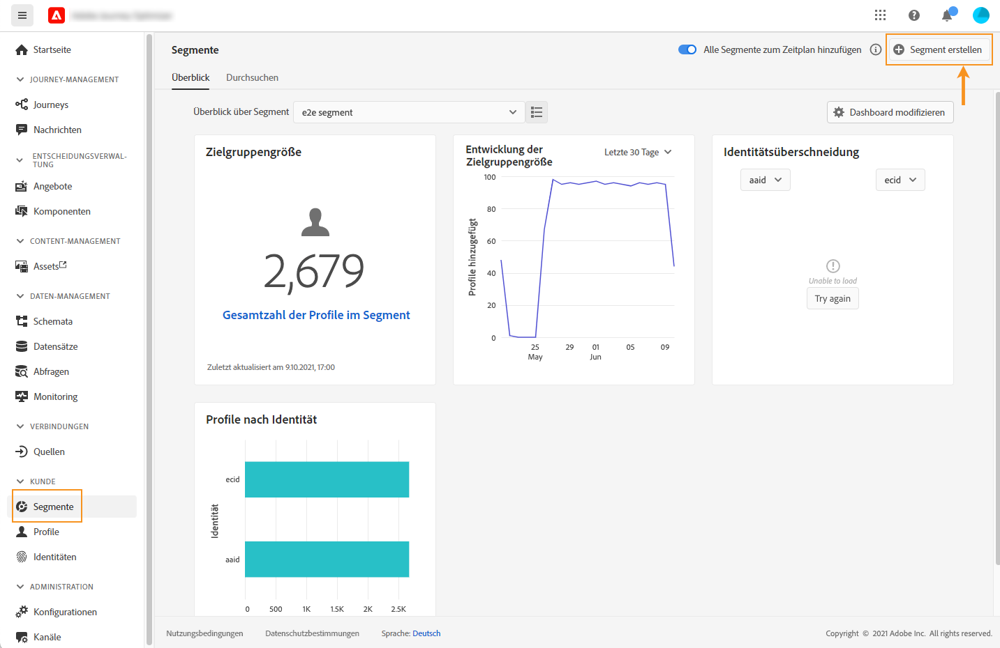
1. Definieren Sie einen Namen für Ihre Zielgruppe und erstellen Sie die Zielgruppe: Wählen Sie die Felder und Werte aus, um die gewünschten Profile anzusprechen.
   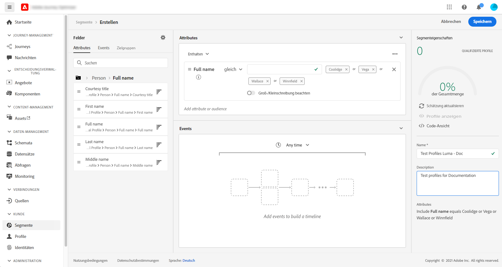
1. Klicken Sie auf **Speichern** und prüfen Sie, ob die Profile korrekt durch die Zielgruppe angesprochen werden.
   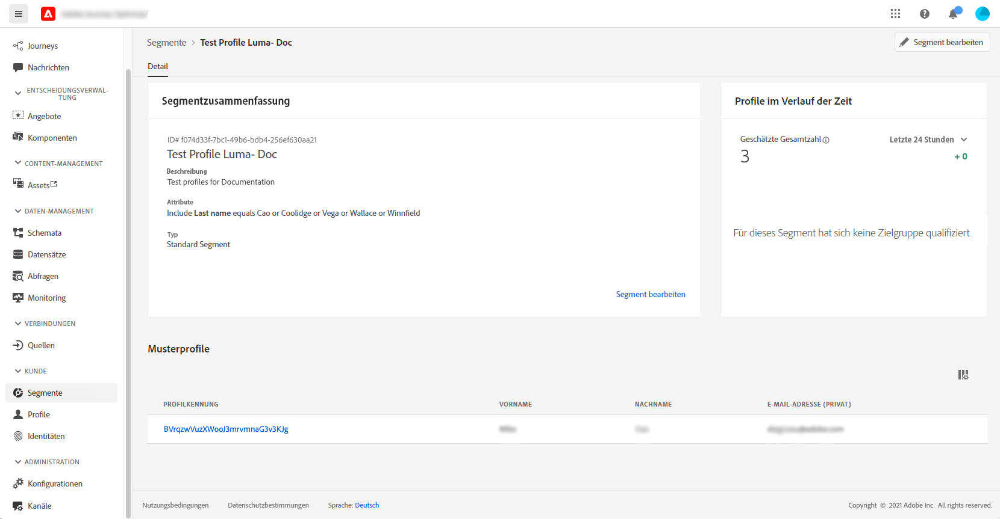

   >[!NOTE]
   >
   > Die Zielgruppenberechnung kann einige Zeit in Anspruch nehmen. Weitere Informationen zu Zielgruppen finden Sie in [diesem Abschnitt](../audience/about-audiences.md).

1. Erstellen Sie jetzt eine neue Journey und beginnen Sie mit der Orchestrierungsaktivität **[!UICONTROL Zielgruppe lesen]**.
1. Wählen Sie die zuvor erstellte Zielgruppe und den Namespace aus, den Ihre Profile verwenden.
   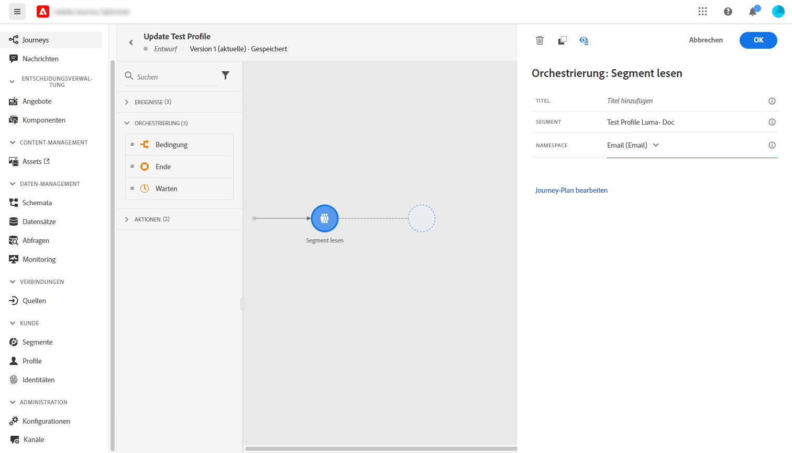
1. Fügen Sie die Aktionsaktivität **[!UICONTROL Profil aktualisieren]** hinzu.
1. Wählen Sie das Schema, das Feld **testProfiles** und den Datensatz aus und legen Sie den Wert auf **true** fest. Klicken Sie dazu im Feld **[!UICONTROL WERT]** auf das **Stift**-Symbol rechts, wählen Sie **[!UICONTROL Erweiterter Modus]** aus und geben Sie **true** ein.
   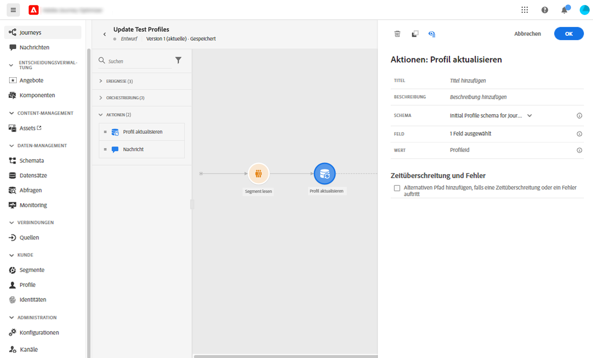
1. Klicken Sie auf **[!UICONTROL Veröffentlichen]**.
1. Überprüfen Sie im Abschnitt **[!UICONTROL Zielgruppen]**, ob die Profile korrekt aktualisiert wurden.
   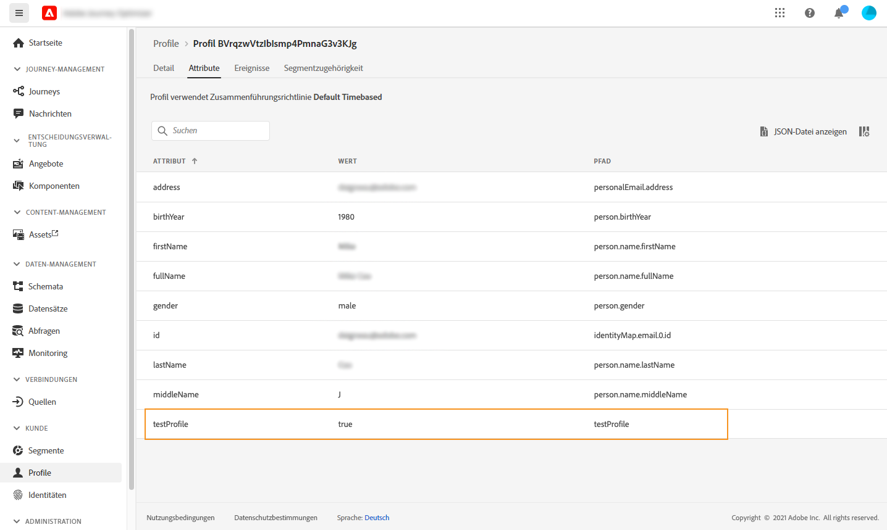

   >[!NOTE]
   >
   > Nähere Informationen zur Aktivität **[!UICONTROL Profil aktualisieren]** erhalten Sie in [diesem Abschnitt](../building-journeys/update-profiles.md).

## Erstellen eines Testprofils mithilfe einer CSV-Datei {#create-test-profiles-csv}

In Adobe Experience Platform können Sie Profile erstellen, indem Sie eine CSV-Datei, die die verschiedenen Profilfelder enthält, in Ihren Datensatz hochladen. Dies ist die einfachste Methode.

1. Erstellen Sie mit einer Tabellenkalkulations-Software eine einfache CSV-Datei.
1. Fügen Sie für jedes erforderliche Feld eine Spalte hinzu. Stellen Sie sicher, dass Sie das primäre Identitätsfeld („personID“ in unserem Beispiel oben) und das Feld „testProfile“ auf „true“ gesetzt hinzufügen.
   
1. Fügen Sie pro Profil eine Zeile hinzu und geben Sie die Werte für die einzelnen Felder ein.
   
1. Speichern Sie die Tabelle als CSV-Datei. Verwenden Sie als Trennzeichen Kommas.
1. Gehen Sie zu Adobe Experience Platform-**Workflows**.
   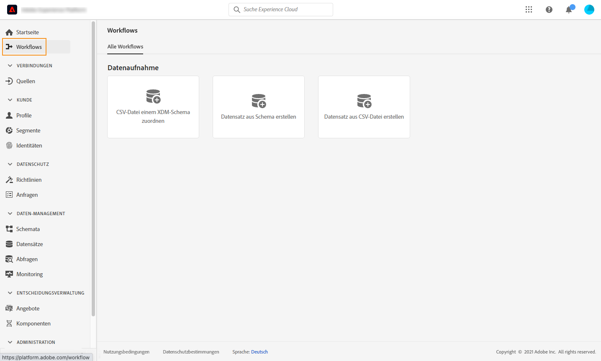
1. Wählen Sie **CSV einem XDM-Schema zuordnen** und klicken Sie dann auf **Starten**.
   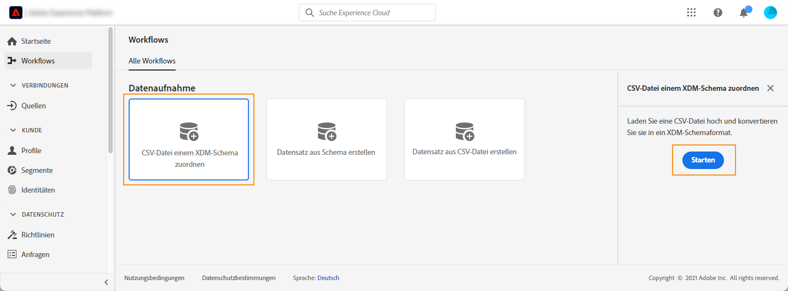
1. Wählen Sie den Datensatz aus, in den Sie die Profile importieren möchten. Klicken Sie auf **Weiter**.
   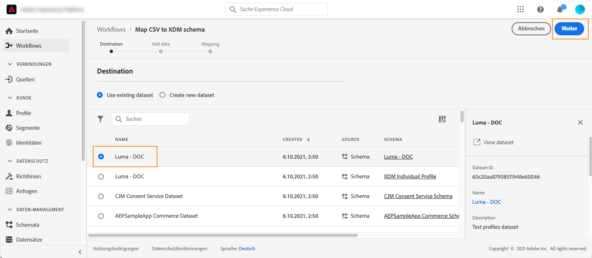
1. Klicken Sie auf **Datei auswählen** und wählen Sie Ihre CSV-Datei aus. Klicken Sie nach dem Hochladen der Datei auf **Weiter**.
   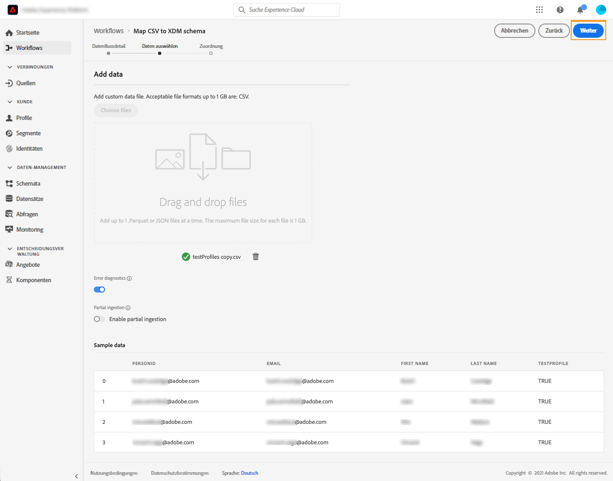
1. Ordnen Sie die CSV-Quellfelder den Feldern des Schemas zu und klicken Sie dann auf **Beenden**.
   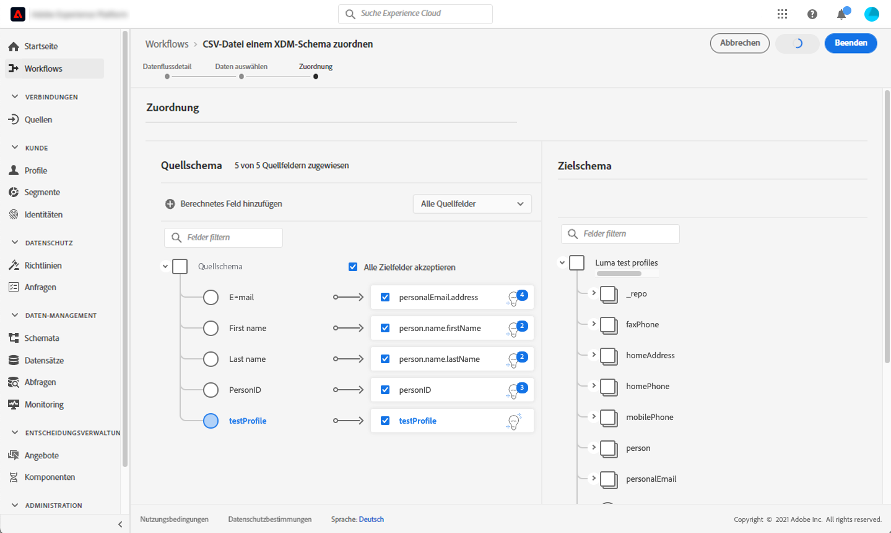
1. Der Datenimport beginnt. Der Status wechselt von **Verarbeitung läuft** zu **Erfolg**. Klicken Sie oben rechts auf **Datensatz in der Vorschau anzeigen**.
   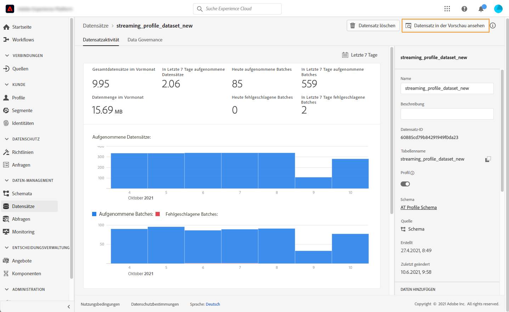
1. Vergewissern Sie sich, dass die Testprofile korrekt hinzugefügt wurden.
   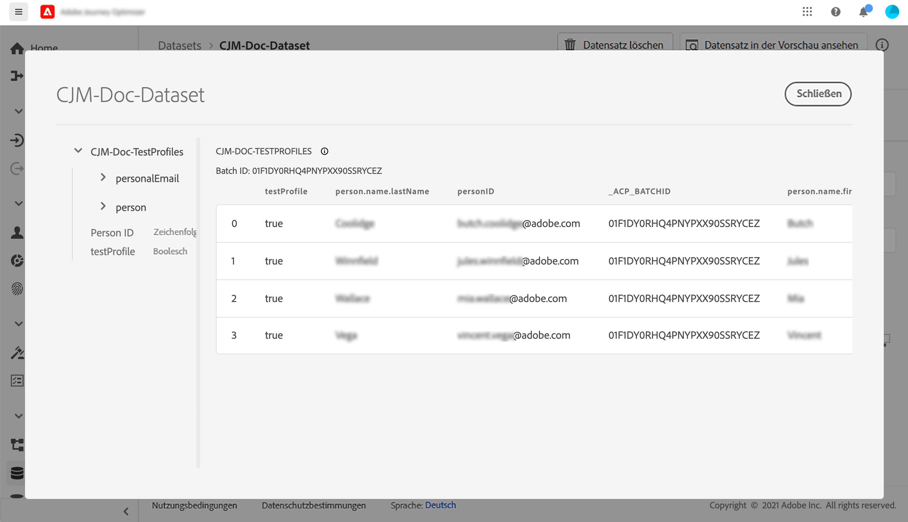

Ihre Testprofile werden hinzugefügt und können jetzt beim Testen einer Journey verwendet werden. Weitere Informationen finden Sie in [diesem Abschnitt](../building-journeys/testing-the-journey.md).
>[!NOTE]
>
> Weitere Informationen zu CSV-Importen finden Sie in der [Dokumentation zur Datenaufnahme](https://experienceleague.adobe.com/docs/experience-platform/ingestion/tutorials/map-a-csv-file.html?lang=de#tutorials){target="_blank"}.

## Erstellen von Testprofilen mithilfe von API-Aufrufen {#create-test-profiles-api}

Sie können Testprofile auch über API-Aufrufe erstellen. Weitere Informationen finden Sie in der [Dokumentation zu Adobe Experience Platform](https://experienceleague.adobe.com/docs/experience-platform/profile/home.html?lang=de){target="_blank"}.

Sie müssen ein Profilschema verwenden, das die Feldgruppe „Testdetails des Profils“ enthält. Die Markierung „testProfile“ ist Teil dieser Feldgruppe.
Achten Sie beim Erstellen eines Profils darauf, diesen Wert zu übergeben: testProfile = true.

Beachten Sie, dass Sie auch ein vorhandenes Profil aktualisieren können, um die Markierung „testProfile“ in „true“ zu ändern.

Hier sehen Sie ein Beispiel für einen API-Aufruf zum Erstellen eines Testprofils:

```
curl -X POST \
'https://dcs.adobedc.net/collection/xxxxxxxxxxxxxx' \
-H 'Cache-Control: no-cache' \
-H 'Content-Type: application/json' \
-H 'Postman-Token: xxxxx' \
-H 'cache-control: no-cache' \
-H 'x-api-key: xxxxx' \
-H 'x-gw-ims-org-id: xxxxx' \
-d '{
"header": {
"msgType": "xdmEntityCreate",
"msgId": "xxxxx",
"msgVersion": "xxxxx",
"xactionid":"xxxxx",
"datasetId": "xxxxx",
"imsOrgId": "xxxxx",
"source": {
"name": "Postman"
},
"schemaRef": {
"id": "https://example.adobe.com/mobile/schemas/xxxxx",
"contentType": "application/vnd.adobe.xed-full+json;version=1"
}
},
"body": {
"xdmMeta": {
"schemaRef": {
"contentType": "application/vnd.adobe.xed-full+json;version=1"
}
},
"xdmEntity": {
"_id": "xxxxx",
"_mobile":{
"ECID": "xxxxx"
},
"testProfile":true
}
}
}'
```

## Anleitungsvideo {#video}

Hier erfahren Sie, wie Sie ein Testprofil erstellen.

>[!VIDEO](https://video.tv.adobe.com/v/334236?quality=12)
