# Erstellen von Testprofilen {#create-test-profiles}


Bei der Verwendung des Testmodus in einer Journey sind Testprofile erforderlich. Sie können entweder ein [vorhandenes Profil](../building-journeys/creating-test-profiles.md#turning-profile-into-test) in ein Testprofil umwandeln oder [ein Testprofil](../building-journeys/creating-test-profiles.md#create-test-profiles-csv) erstellen. Informationen zur Verwendung des Testmodus finden Sie in [diesem Abschnitt](../building-journeys/testing-the-journey.md).

In Adobe Experience Platform gibt es verschiedene Möglichkeiten, ein Testprofil zu erstellen. In dieser Dokumentation konzentrieren wir uns auf zwei Methoden: Hochladen einer [CSV-Datei](../building-journeys/creating-test-profiles.md#create-test-profiles-csv) und Verwenden von [API-Aufrufen](../building-journeys/creating-test-profiles.md#create-test-profiles-api). Sie können auch eine JSON-Datei in einem Datensatz hochladen. Weitere Informationen finden Sie in der [Dokumentation zur Datenaufnahme](https://experienceleague.adobe.com/docs/experience-platform/ingestion/tutorials/ingest-batch-data.html?lang=de#add-data-to-dataset).

Das Erstellen eines Testprofils ähnelt dem Erstellen von Standardprofilen in Adobe Experience Platform. Weitere Informationen finden Sie in der [Dokumentation zu Echtzeit-Kundenprofilen](https://experienceleague.adobe.com/docs/experience-platform/profile/home.html?lang=de).

## Voraussetzungen {#test-profile-prerequisites}

Um Profile erstellen zu können, müssen Sie zunächst ein Schema und einen Datensatz in der Adobe [!DNL Journey Optimizer] erstellen.

Zuerst müssen Sie **ein Schema erstellen**. Führen Sie folgende Schritte aus:

1. Klicken Sie im Abschnitt ADMINISTRATION auf **[!UICONTROL Schemas]**.
   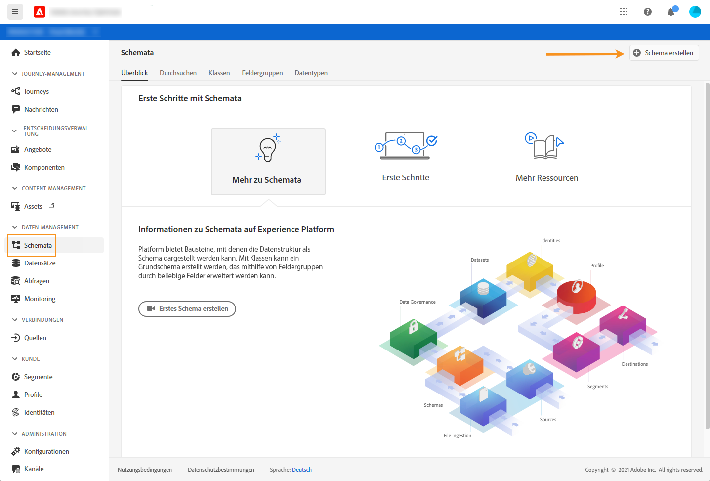
1. Klicken Sie oben rechts auf **[!UICONTROL Schema erstellen]** und wählen Sie dann einen Schematyp aus, z. B. **Einzelnes XDM-Profil**.
   
1. Wählen Sie die entsprechenden Feldergruppen aus. Stellen Sie sicher, dass Sie die Feldergruppe **Profiltestdetails** hinzufügen.
   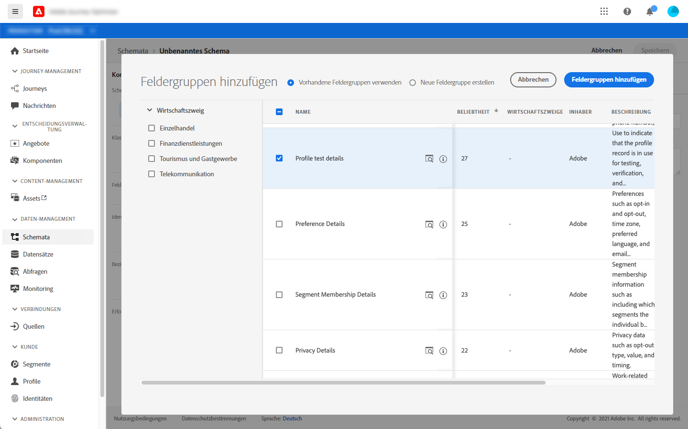
Klicken Sie abschließend auf  **[!UICONTROL Feldergruppen hinzufügen]**: Die Liste der Feldergruppen wird im Bildschirm Schemaübersicht angezeigt.
   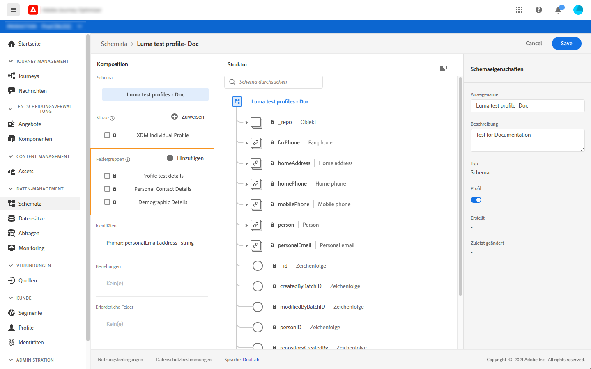

   >[!NOTE]
   >
   >* Klicken Sie auf den Namen des Schemas, um es zu ändern und seine Eigenschaften zu aktualisieren.
      >
      >
   * Klicken Sie im Abschnitt Feldgruppen auf die Schaltfläche **[!UICONTROL Hinzufügen]** , um andere Feldergruppen auszuwählen, die dem Schema hinzugefügt werden sollen.


1. Klicken Sie in der Liste der Felder auf das Feld, das Sie als die primäre Identität definieren möchten.
   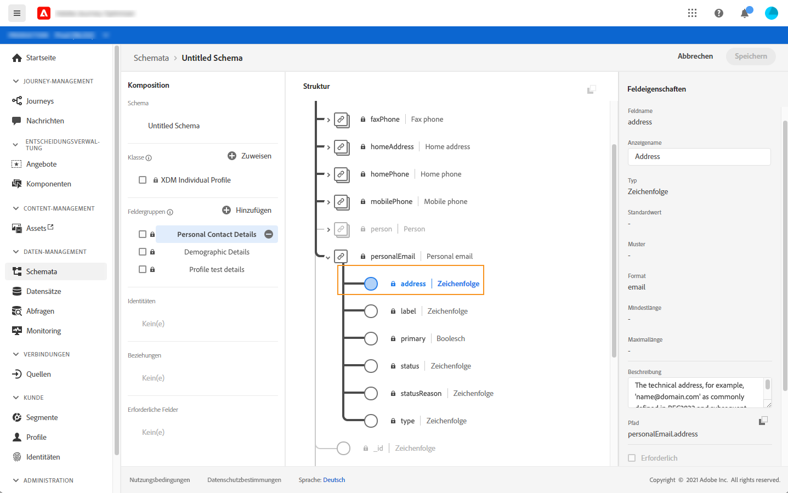
1. Aktivieren Sie im rechten Bereich **[!UICONTROL Feldeigenschaften]** die Optionen ****[!UICONTROL Identität]** und ****[!UICONTROL Primäre Identität]** und wählen Sie einen Namespace aus. Wenn die primäre Identität eine E-Mail-Adresse sein soll, wählen Sie den Namespace **E-Mail**. Klicken Sie auf **Übernehmen**.
   
1. Wählen Sie das Schema aus und aktivieren Sie die Option **[!UICONTROL Profil]** in den **[!UICONTROL Schema-Eigenschaften]**.
   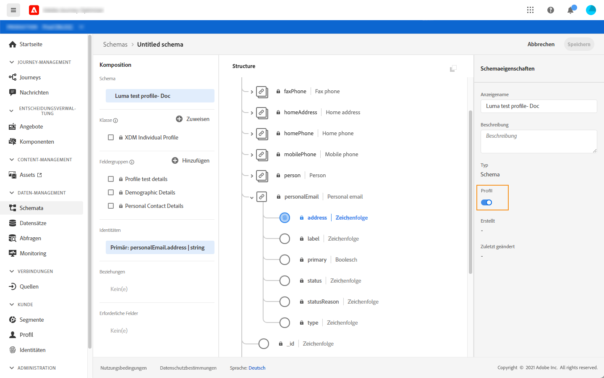
1. Klicken Sie auf **Speichern**.

>[!NOTE]
>
>Weitere Informationen zur Erstellung von Schemata finden Sie in der [XDM-Dokumentation](https://experienceleague.adobe.com/docs/experience-platform/xdm/ui/resources/schemas.html?lang=de#prerequisites).

Anschließend müssen Sie **den Datensatz erstellen**, in den die Profile importiert werden. Führen Sie folgende Schritte aus:

1. Navigieren Sie zu **[!UICONTROL Datensätze]** und klicken Sie dann auf **[!UICONTROL Datensatz erstellen]**.
   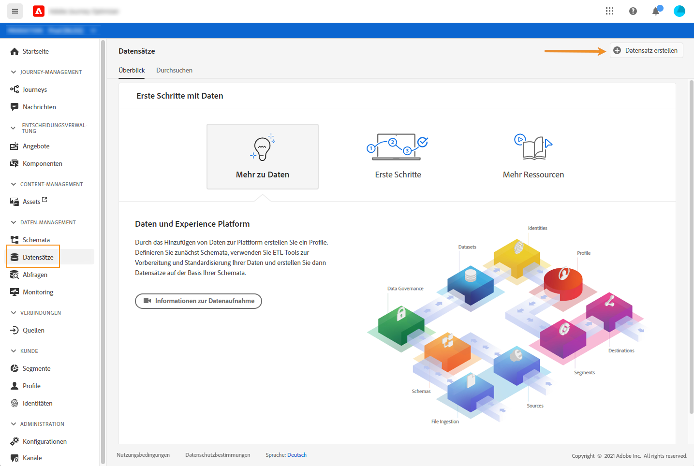
1. Wählen Sie **[!UICONTROL Datensatz aus Schema erstellen]** aus.
   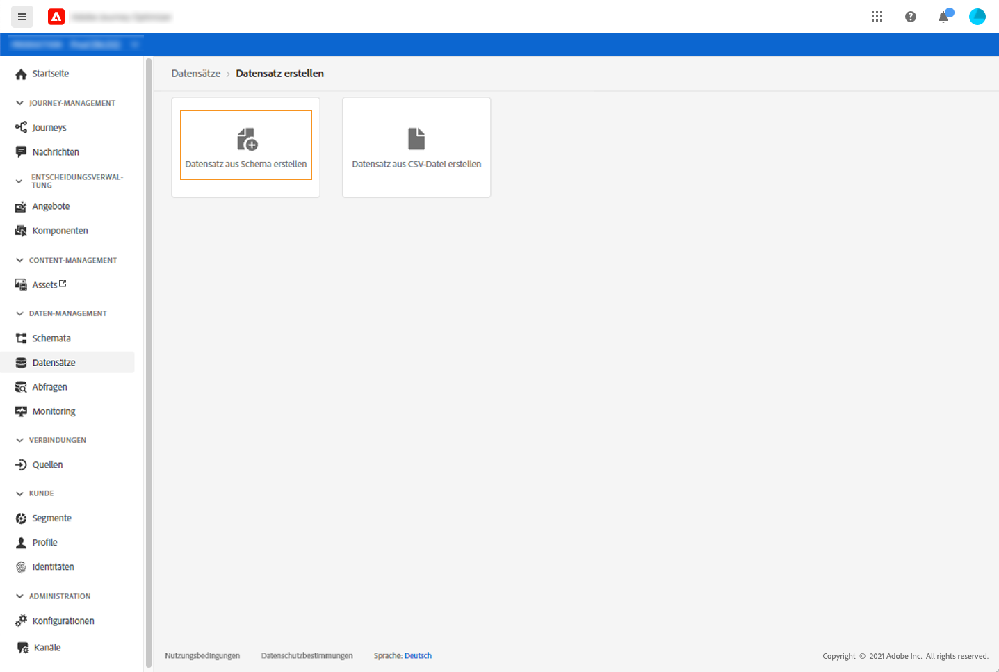
1. Wählen Sie das zuvor erstellte Schema aus und klicken Sie dann auf **[!UICONTROL Weiter]**.
   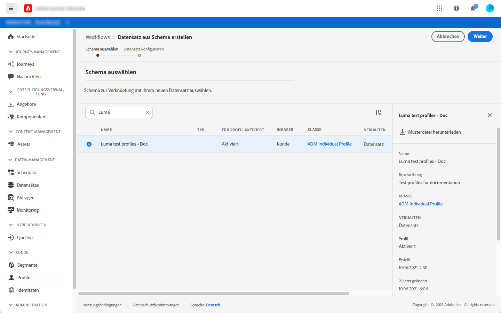
1. Wählen Sie einen Namen und klicken Sie dann auf **[!UICONTROL Beenden]**.
   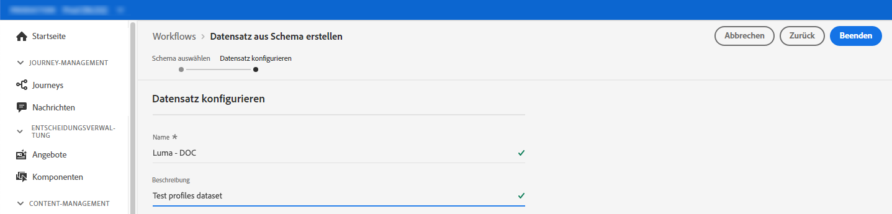
1. Aktivieren Sie die Option **[!UICONTROL Profil]**.
   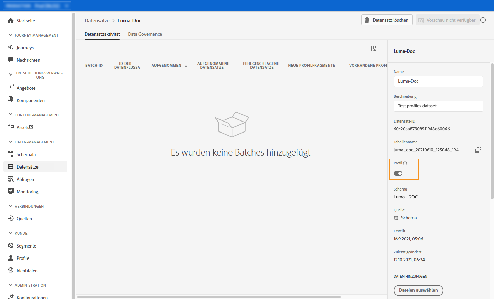

>[!NOTE]
>
> Weitere Informationen zur Erstellung von Datensätzen finden Sie in der [Dokumentation zum Katalogdienst](https://experienceleague.adobe.com/docs/experience-platform/catalog/datasets/user-guide.html?lang=de#getting-started).

## Profil in ein Testprofil umwandeln{#turning-profile-into-test}

Sie können ein vorhandenes Profil in ein Testprofil umwandeln: Sie können Profilattribute auf dieselbe Weise aktualisieren wie bei der Erstellung eines Profils.

Eine einfache Möglichkeit besteht darin, die Aktionsaktivität **[!UICONTROL Profil]** in einer Journey zu aktualisieren und das boolesche Feld testProfile von false in true zu ändern.

Ihre Journey besteht aus den Aktivitäten **[!UICONTROL Segment lesen]** und **[!UICONTROL Profil aktualisieren]**. Zunächst müssen Sie ein Segment erstellen, das auf die Profile zielt, die Sie in Testprofile umwandeln möchten.

>[!NOTE]
>
> Da Sie das Feld **testProfile** aktualisieren werden, müssen die ausgewählten Profile dieses Feld enthalten. Das zugehörige Schema muss das Mixin **Testdetails des Profils** enthalten. Weitere Informationen finden Sie in [diesem Abschnitt](../building-journeys/creating-test-profiles.md#test-profiles-prerequisites).

1. Navigieren Sie oben rechts zu **Segmente** und dann **Segment** erstellen .
   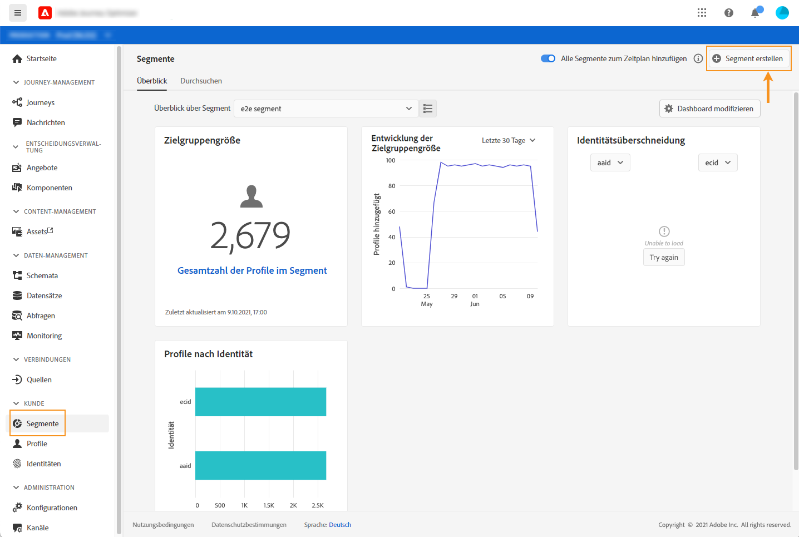
1. Definieren Sie einen Namen für Ihr Segment und erstellen Sie das Segment: Wählen Sie die Felder und Werte aus, um die gewünschten Profile anzusprechen.
   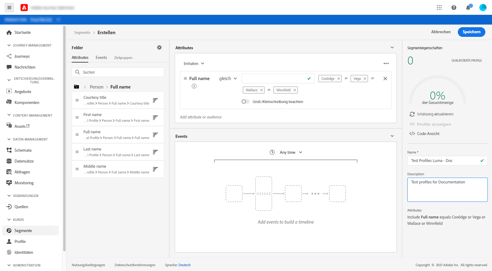
1. Klicken Sie auf **Speichern** und prüfen Sie, ob die Profile korrekt durch das Segment angesprochen werden.
   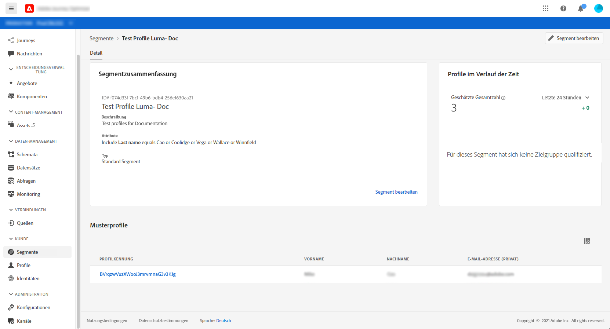

   >[!NOTE]
   >
   > Die Segmentberechnung kann einige Zeit in Anspruch nehmen. Weitere Informationen zu Segmenten finden Sie in [diesem Abschnitt](../segment/about-segments.md).

1. Erstellen Sie jetzt eine neue Journey und beginnen Sie mit einer Orchestrierungsaktivität **[!UICONTROL Segment lesen]**.
1. Wählen Sie das zuvor erstellte Segment und den Namespace aus, den Ihre Profile verwenden.
   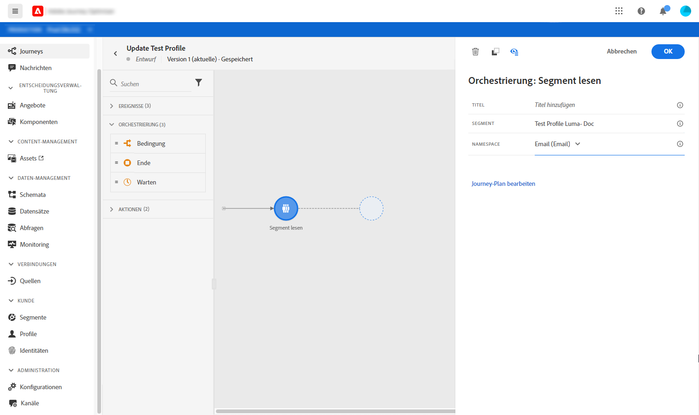
1. Fügen Sie eine Aktionsaktivität **[!UICONTROL Profil aktualisieren]** hinzu.
1. Wählen Sie das Schema, das Feld **testProfiles**, den Datensatz aus und setzen Sie den Wert auf **True**. Klicken Sie dazu im Feld **[!UICONTROL VALUE]** auf das Symbol **Pen** rechts, wählen Sie **[!UICONTROL Erweiterter Modus]** aus und geben Sie **true** ein.
   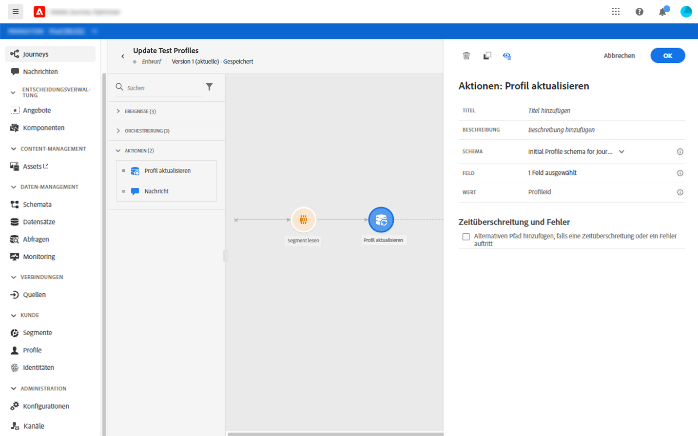
1. Fügen Sie eine Aktivität des Typs **Ende** hinzu und klicken Sie auf **[!UICONTROL Veröffentlichen]**.
1. Überprüfen Sie im Abschnitt **[!UICONTROL Segmente]** , ob die Profile korrekt aktualisiert wurden.
   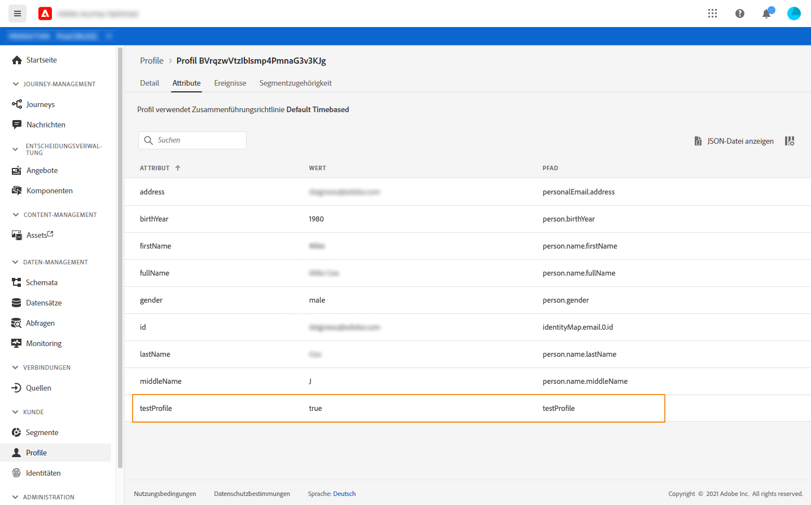

   >[!NOTE]
   >
   > Nähere Informationen zur Aktivität **[!UICONTROL Profil aktualisieren]** erhalten Sie in [diesem Abschnitt](../building-journeys/update-profiles.md).

## Testprofil mit einer CSV-Datei erstellen{#create-test-profiles-csv}

In Adobe Experience Platform können Sie Profile erstellen, indem Sie eine CSV-Datei, die die verschiedenen Profilfelder enthält, in Ihren Datensatz hochladen. Dies ist die einfachste Methode.

1. Erstellen Sie mit einer Tabellenkalkulations-Software eine einfache CSV-Datei.
1. Fügen Sie für jedes erforderliche Feld eine Spalte hinzu. Stellen Sie sicher, dass Sie das primäre Identitätsfeld („personID“ in unserem Beispiel oben) und das Feld „testProfile“ auf „true“ gesetzt hinzufügen.
   
1. Fügen Sie pro Profil eine Zeile hinzu und geben Sie die Werte für die einzelnen Felder ein.
   
1. Speichern Sie die Tabelle als CSV-Datei. Verwenden Sie als Trennzeichen Kommas.
1. Navigieren Sie zu Adobe Experience Platform **Workflows**.
   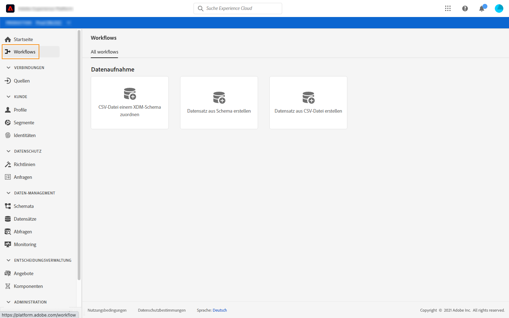
1. Wählen Sie **CSV einem XDM-Schema zuordnen** und klicken Sie dann auf **Starten**.
   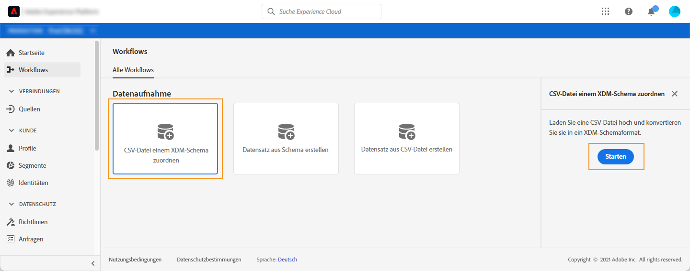
1. Wählen Sie den Datensatz aus, in den Sie die Profile importieren möchten. Klicken Sie auf **Weiter**.
   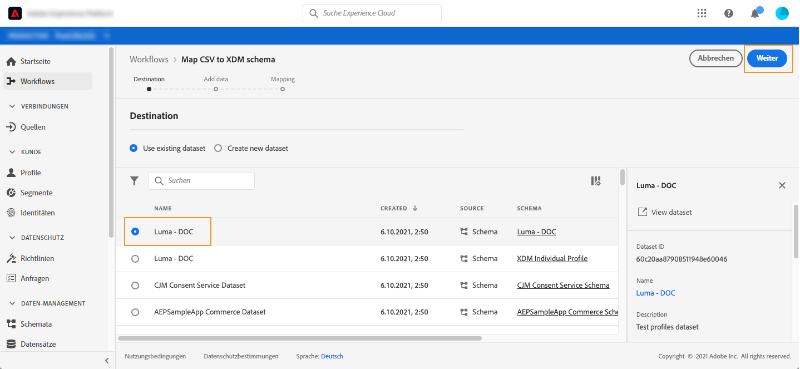
1. Klicken Sie auf **Datei auswählen** und wählen Sie Ihre CSV-Datei aus. Klicken Sie nach dem Hochladen der Datei auf **Weiter**.
   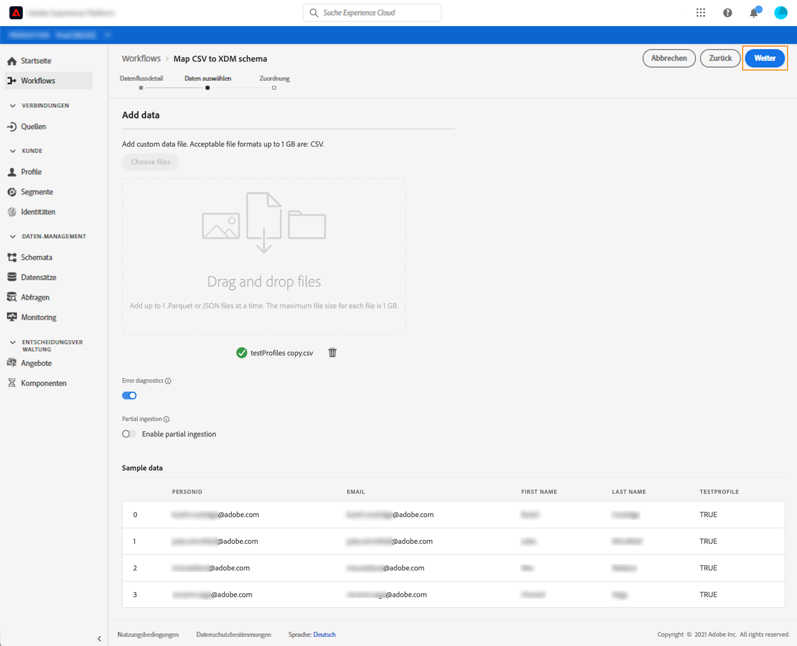
1. Ordnen Sie die CSV-Quellfelder den Feldern des Schemas zu und klicken Sie dann auf **Beenden**.
   
1. Der Datenimport beginnt. Der Status wechselt von **Verarbeitungsvorgang läuft** zu **Erfolg**. Klicken Sie oben rechts auf **Datensatz in der Vorschau ansehen**.
   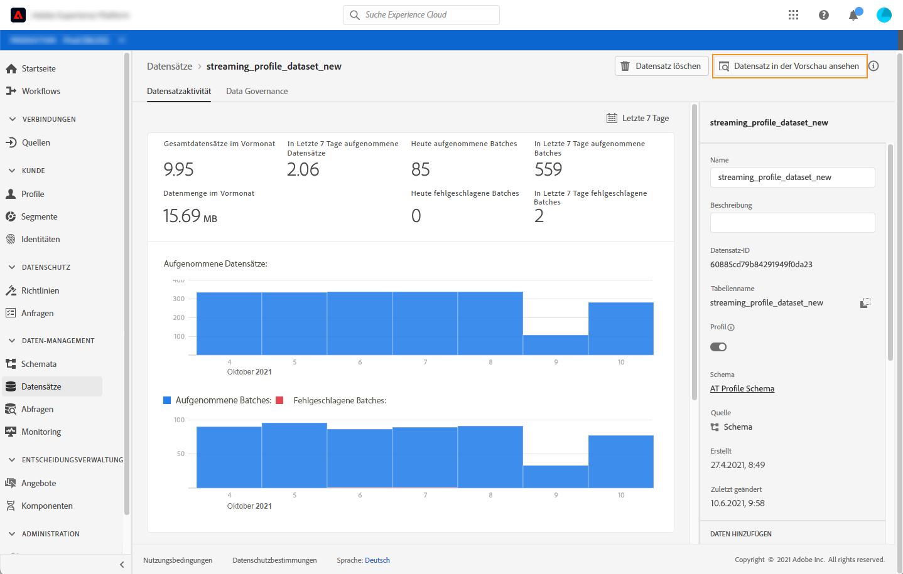
1. Vergewissern Sie sich, dass die Testprofile korrekt hinzugefügt wurden.
   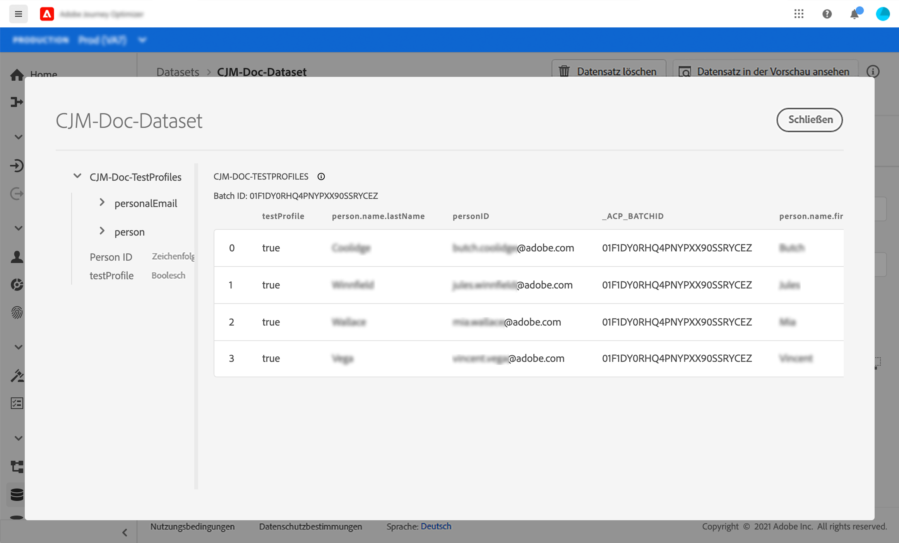

Ihre Testprofile werden hinzugefügt und können jetzt beim Testen einer Journey verwendet werden. Siehe [diesen Abschnitt](../building-journeys/testing-the-journey.md).
>[!NOTE]
>
> Weitere Informationen zu CSV-Importen finden Sie in der [Dokumentation zur Datenaufnahme](https://experienceleague.adobe.com/docs/experience-platform/ingestion/tutorials/map-a-csv-file.html?lang=de#tutorials).

## Erstellen von Testprofilen mit API-Aufrufen{#create-test-profiles-api}

Sie können Testprofile auch über API-Aufrufe erstellen. Weiterführende Informationen finden Sie auf dieser [Seite](https://experienceleague.adobe.com/docs/experience-platform/profile/home.html).

Sie müssen ein Profilschema verwenden, das das Mixin „Profil-Testdetails“ enthält. Die Markierung „testProfile“ ist Teil dieses Mixins.

Achten Sie beim Erstellen eines Profils darauf, diesen Wert zu übergeben: testProfile = true.

Beachten Sie, dass Sie auch ein vorhandenes Profil aktualisieren können, um die Markierung „testProfile“ in „true“ zu ändern.

Hier sehen Sie ein Beispiel für einen API-Aufruf zum Erstellen eines Testprofils:

```
curl -X POST \
'https://dcs.adobedc.net/collection/xxxxxxxxxxxxxx' \
-H 'Cache-Control: no-cache' \
-H 'Content-Type: application/json' \
-H 'Postman-Token: xxxxx' \
-H 'cache-control: no-cache' \
-H 'x-api-key: xxxxx' \
-H 'x-gw-ims-org-id: xxxxx' \
-d '{
"header": {
"msgType": "xdmEntityCreate",
"msgId": "xxxxx",
"msgVersion": "xxxxx",
"xactionid":"xxxxx",
"datasetId": "xxxxx",
"imsOrgId": "xxxxx",
"source": {
"name": "Postman"
},
"schemaRef": {
"id": "https://example.adobe.com/mobile/schemas/xxxxx",
"contentType": "application/vnd.adobe.xed-full+json;version=1"
}
},
"body": {
"xdmMeta": {
"schemaRef": {
"contentType": "application/vnd.adobe.xed-full+json;version=1"
}
},
"xdmEntity": {
"_id": "xxxxx",
"_mobile":{
"ECID": "xxxxx"
},
"testProfile":true
}
}
}'
```
