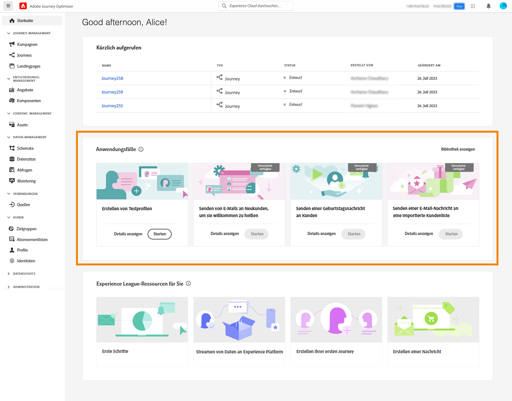

# Testprofile erstellen {#create-test-profiles}

Testprofile sind bei Verwendung der [Testmodus](../building-journeys/testing-the-journey.md) in einer Journey und [Vorschau und Testen des Inhalts](../email/preview.md).

Es gibt mehrere Möglichkeiten, Testprofile zu erstellen. Auf dieser Seite finden Sie Details zu:

* Umschalten eines [vorhandenes Profil](#turning-profile-into-test) in ein Testprofil

* Testprofile durch Hochladen einer [CSV-Datei](#create-test-profiles-csv) oder [API-Aufrufe](#create-test-profiles-api).

   Zusätzlich zu diesen beiden Methoden bietet Adobe Journey Optimizer eine spezifische [Anwendungsfall für das Produkt](#use-case-1) um die Erstellung von Testprofilen zu erleichtern.

Sie können auch eine JSON-Datei in einen vorhandenen Datensatz hochladen. Weitere Informationen hierzu finden Sie im Abschnitt [Dokumentation zur Datenerfassung](https://experienceleague.adobe.com/docs/experience-platform/ingestion/tutorials/ingest-batch-data.html#add-data-to-dataset){target=&quot;_blank&quot;}.

Beachten Sie, dass das Erstellen eines Testprofils mit dem Erstellen regulärer Profile in Adobe Experience Platform vergleichbar ist. Weitere Informationen finden Sie im Abschnitt [Dokumentation zum Echtzeit-Kundenprofil](https://experienceleague.adobe.com/docs/experience-platform/profile/home.html){target=&quot;_blank&quot;}.

➡️ [In diesem Video erfahren Sie, wie Sie Testprofile erstellen.](#video)

## Voraussetzungen {#test-profile-prerequisites}

Um Profile erstellen zu können, müssen Sie zunächst ein Schema und einen Datensatz in Adobe erstellen [!DNL Journey Optimizer].

nach **Erstellen eines Schemas** führen Sie die folgenden Schritte aus:

1. Klicken Sie im Menüabschnitt DATENVERWALTUNG auf **[!UICONTROL Schemas]**.
   
1. Klicken **[!UICONTROL Create schema]** oben rechts und wählen Sie dann einen Schematyp aus, z. B. **XDM Individual Profile**.
   
1. Wählen Sie die entsprechenden Feldergruppen aus. Stellen Sie sicher, dass Sie die **Profiltestdetails** Feldergruppe.
   
Klicken Sie abschließend auf **[!UICONTROL Add field groups]**: Die Liste der Feldergruppen wird im Bildschirm Schemaübersicht angezeigt.
   

   >[!NOTE]
   >
   >* Klicken Sie auf den Namen des Schemas, um es zu ändern und seine Eigenschaften zu aktualisieren.
   >
   >* Klicken Sie auf **[!UICONTROL Add]** Schaltfläche im Abschnitt Feldgruppen zur Auswahl anderer Feldergruppen, die zum Schema hinzugefügt werden sollen


1. Klicken Sie in der Feldliste auf das Feld, das Sie als primäre Identität definieren möchten.
   
1. Im **[!UICONTROL Field properties]** im rechten Bereich überprüfen Sie die **[!UICONTROL Identity]** und **[!UICONTROL Primary Identity]** Optionen und wählen Sie einen Namespace aus. Wenn die primäre Identität eine E-Mail-Adresse sein soll, wählen Sie die **[!UICONTROL Email]** Namespace. Klicken **[!UICONTROL Apply]**.
   
1. Wählen Sie das Schema aus und aktivieren Sie die **[!UICONTROL Profile]** in der **[!UICONTROL Schema properties]** -Bereich.
   
1. Klicken **Speichern**.

>[!NOTE]
>
>Weiterführende Informationen zur Erstellung von Schemas finden Sie im Abschnitt [XDM-Dokumentation](https://experienceleague.adobe.com/docs/experience-platform/xdm/ui/resources/schemas.html#prerequisites){target=&quot;_blank&quot;}.

Dann müssen Sie **Datensatz erstellen** in die die Profile importiert werden. Führen Sie die folgenden Schritte aus:

1. Navigieren Sie zu **[!UICONTROL Datasets]** Klicken Sie auf **[!UICONTROL Create dataset]**.
   
1. Auswählen **[!UICONTROL Create dataset from schema]**.
   
1. Wählen Sie das zuvor erstellte Schema aus und klicken Sie auf **[!UICONTROL Next]**.
   
1. Wählen Sie einen Namen und klicken Sie auf **[!UICONTROL Finish]**.
   
1. Aktivieren Sie die **[!UICONTROL Profile]** -Option.
   

>[!NOTE]
>
> Weiterführende Informationen zur Erstellung von Datensätzen finden Sie im Abschnitt [Dokumentation zu Catalog Service](https://experienceleague.adobe.com/docs/experience-platform/catalog/datasets/user-guide.html#getting-started){target=&quot;_blank&quot;}.

## Anwendungsfall für das Produkt{#use-case-1}

Auf der Startseite von Adobe Journey Optimizer können Sie die Anwendungsfälle für Testprofile im Produkt nutzen. Dieser Anwendungsfall erleichtert die Erstellung von Testprofilen, die zum Testen von Journeys vor der Veröffentlichung verwendet werden.



Klicken Sie auf **[!UICONTROL Begin]** -Schaltfläche, um den Anwendungsfall zu starten.

Die folgenden Informationen sind erforderlich:

1. **Identitäts-Namespace**: Die [Identitäts-Namespace](../segment/get-started-identity.md) verwendet, um die Testprofile eindeutig zu identifizieren. Wenn beispielsweise E-Mail zur Identifizierung der Testprofile verwendet wird, muss der Identitäts-Namespace **Email** ausgewählt werden. Wenn die eindeutige Kennung die Telefonnummer ist, dann wird der Identitäts-Namespace **Telefon** ausgewählt werden.

2. **CSV-Datei**: Eine kommagetrennte Datei, die die Liste der zu erstellenden Testprofile enthält. Der Anwendungsfall erwartet ein vordefiniertes Format für die CSV-Datei, die die Liste der zu erstellenden Testprofile enthält. Jede Zeile in der Datei sollte die folgenden Felder in der richtigen Reihenfolge wie folgt enthalten:

   1. **Personen-ID**: Eindeutige Kennung des Testprofils. Die Werte dieses Felds sollten den ausgewählten Identitäts-Namespace widerspiegeln. (Beispiel: Wenn **Telefon** für den Identitäts-Namespace ausgewählt ist, sollten die Werte dieses Felds Telefonnummern sein. Ähnlich wie bei **Email** ausgewählt ist, sollten die Werte dieses Felds E-Mails sein.
   1. **Email-Adresse**: E-Mail-Adresse des Testprofils. (Die **Personen-ID** und **Email-Adresse** kann möglicherweise dieselben Werte enthalten, wenn **Email** als Identitäts-Namespace ausgewählt ist)
   1. **Vorname**: Vorname des Testprofils.
   1. **Nachname**: Nachname des Testprofils.
   1. **Ort**: Testprofilstadt des Wohnsitzes
   1. **Land**: Testprofil Land des Wohnsitzes
   1. **Geschlecht**: Testprofil-Geschlecht. Verfügbare Werte sind **male**, **female** und **non_specified**

Nachdem Sie den Identitäts-Namespace ausgewählt und die CSV-Datei basierend auf dem oben stehenden Format bereitgestellt haben, klicken Sie auf **[!UICONTROL Run]** Schaltfläche oben rechts. Der Anwendungsfall kann einige Minuten dauern. Sobald der Anwendungsfall die Verarbeitung und Erstellung der Testprofile abgeschlossen hat, wird eine Benachrichtigung gesendet, um den Benutzer zu benachrichtigen.

>[!NOTE]
>
>Testprofile können vorhandene Profile überschreiben. Bevor Sie den Anwendungsfall ausführen, stellen Sie sicher, dass die CSV-Datei nur Testprofile enthält und dass sie für die richtige Sandbox ausgeführt wird.

## Profil in ein Testprofil umwandeln{#turning-profile-into-test}

Sie können ein vorhandenes Profil in ein Testprofil umwandeln: Sie können Profilattribute auf dieselbe Weise aktualisieren wie bei der Erstellung eines Profils.

Eine einfache Möglichkeit ist die Verwendung einer **[!UICONTROL Update Profile]** Aktionsaktivität in einer Journey und ändern Sie **testProfile** boolesches Feld von &quot;false&quot;zu &quot;true&quot;.

Ihre Journey besteht aus einer **[!UICONTROL Read Segment]** und **[!UICONTROL Update Profile]** Aktivität. Zunächst müssen Sie ein Segment erstellen, das die Profile auswählt, die in Testprofile umgewandelt werden sollen.

>[!NOTE]
>
> Da Sie die **testProfile** angegeben ist, müssen die ausgewählten Profile dieses Feld enthalten. Das zugehörige Schema muss die **Profiltestdetails** Feldergruppe. Siehe [diesem Abschnitt](../segment/creating-test-profiles.md#test-profiles-prerequisites).

1. Navigieren Sie zu **Segmente**, dann **Segment erstellen**, oben rechts.
   
1. Definieren Sie einen Namen für Ihr Segment und erstellen Sie das Segment: Wählen Sie die gewünschten Felder und Werte aus.
   
1. Klicken **Speichern** und überprüfen Sie, ob die Profile korrekt im Segment enthalten sind.
   

   >[!NOTE]
   >
   > Die Segmentberechnung kann einige Zeit in Anspruch nehmen. Erfahren Sie mehr über Segmente in [diesem Abschnitt](../segment/about-segments.md).

1. Erstellen Sie jetzt eine neue Journey und beginnen Sie mit einer **[!UICONTROL Read Segment]** Orchestrierungsaktivität.
1. Wählen Sie das zuvor erstellte Segment und den Namespace aus, den Ihre Profile verwenden.
   
1. Hinzufügen einer **[!UICONTROL Update Profile]** Aktionsaktivität.
1. Wählen Sie das Schema, das **testProfiles** -Feld, den Datensatz und legen Sie den Wert auf **True**. Dazu finden Sie im Abschnitt **[!UICONTROL VALUE]** und klicken Sie auf das **Pen** rechts klicken, wählen Sie **[!UICONTROL Advanced mode]** und eingeben **true**.
   
1. Klicken **[!UICONTROL Publish]**.
1. Im **[!UICONTROL Segments]** überprüfen, ob die Profile korrekt aktualisiert wurden.
   

   >[!NOTE]
   >
   > Weitere Informationen über **[!UICONTROL Update Profile]** Aktivität, siehe [diesem Abschnitt](../building-journeys/update-profiles.md).

## Testprofil mit einer CSV-Datei erstellen{#create-test-profiles-csv}

In Adobe Experience Platform können Sie Profile erstellen, indem Sie eine CSV-Datei mit den verschiedenen Profilfeldern in Ihren Datensatz hochladen. Dies ist die einfachste Methode.

1. Erstellen Sie eine einfache CSV-Datei mit einer Tabellenkalkulationssoftware.
1. Fügen Sie für jedes erforderliche Feld eine Spalte hinzu. Stellen Sie sicher, dass Sie das primäre Identitätsfeld (&quot;personID&quot; in unserem Beispiel oben) und das Feld &quot;testProfile&quot;auf &quot;true&quot;setzen.
   
1. Fügen Sie pro Profil eine Zeile hinzu und geben Sie die Werte für jedes Feld ein.
   
1. Speichern Sie die Tabelle als CSV-Datei. Stellen Sie sicher, dass Kommas als Trennzeichen verwendet werden.
1. Adobe Experience Platform aufrufen **Workflows**.
   
1. Auswählen **Zuordnen von CSV zu XDM-Schema** Klicken Sie auf **Launch**.
   
1. Wählen Sie den Datensatz aus, in den Sie die Profile importieren möchten. Klicken **Nächste**.
   
1. Klicken **Dateien auswählen** und wählen Sie Ihre CSV-Datei aus. Klicken Sie beim Hochladen der Datei auf **Nächste**.
   
1. Ordnen Sie die CSV-Quellfelder den Schemafeldern zu und klicken Sie auf **Beenden**.
   
1. Der Datenimport beginnt. Der Status wechselt von **Verarbeitung** nach **Erfolg**. Klicken **Vorschau des Datensatzes anzeigen**, oben rechts.
   
1. Überprüfen Sie, ob die Testprofile korrekt hinzugefügt wurden.
   

Ihre Testprofile werden hinzugefügt und können jetzt beim Testen einer Journey verwendet werden. Siehe [diesem Abschnitt](../building-journeys/testing-the-journey.md).
>[!NOTE]
>
> Weiterführende Informationen zu CSV-Importen finden Sie im Abschnitt [Dokumentation zur Datenerfassung](https://experienceleague.adobe.com/docs/experience-platform/ingestion/tutorials/map-a-csv-file.html#tutorials){target=&quot;_blank&quot;}.

## Erstellen von Testprofilen mithilfe von API-Aufrufen{#create-test-profiles-api}

Sie können auch Testprofile über API-Aufrufe erstellen. Weitere Informationen finden Sie unter [Dokumentation zu Adobe Experience Platform](https://experienceleague.adobe.com/docs/experience-platform/profile/home.html){target=&quot;_blank&quot;}.

Sie müssen ein Profilschema verwenden, das die Feldergruppe &quot;Profiltestdetails&quot;enthält. Das Flag testProfile ist Teil dieser Feldergruppe.
Achten Sie beim Erstellen eines Profils darauf, den Wert zu übergeben: testProfile = true.

Beachten Sie, dass Sie auch ein vorhandenes Profil aktualisieren können, um dessen Markierung testProfile in &quot;true&quot;zu ändern.

Im Folgenden finden Sie ein Beispiel für einen API-Aufruf zum Erstellen eines Testprofils:

```
curl -X POST \
'https://dcs.adobedc.net/collection/xxxxxxxxxxxxxx' \
-H 'Cache-Control: no-cache' \
-H 'Content-Type: application/json' \
-H 'Postman-Token: xxxxx' \
-H 'cache-control: no-cache' \
-H 'x-api-key: xxxxx' \
-H 'x-gw-ims-org-id: xxxxx' \
-d '{
"header": {
"msgType": "xdmEntityCreate",
"msgId": "xxxxx",
"msgVersion": "xxxxx",
"xactionid":"xxxxx",
"datasetId": "xxxxx",
"imsOrgId": "xxxxx",
"source": {
"name": "Postman"
},
"schemaRef": {
"id": "https://example.adobe.com/mobile/schemas/xxxxx",
"contentType": "application/vnd.adobe.xed-full+json;version=1"
}
},
"body": {
"xdmMeta": {
"schemaRef": {
"contentType": "application/vnd.adobe.xed-full+json;version=1"
}
},
"xdmEntity": {
"_id": "xxxxx",
"_mobile":{
"ECID": "xxxxx"
},
"testProfile":true
}
}
}'
```

## Anleitungsvideo {#video}

Erfahren Sie, wie Sie Testprofile erstellen.

>[!VIDEO](https://video.tv.adobe.com/v/334236?quality=12)
