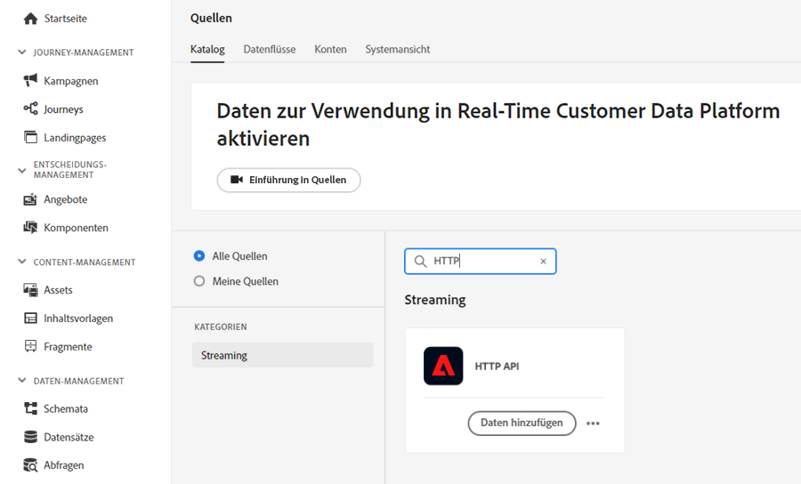
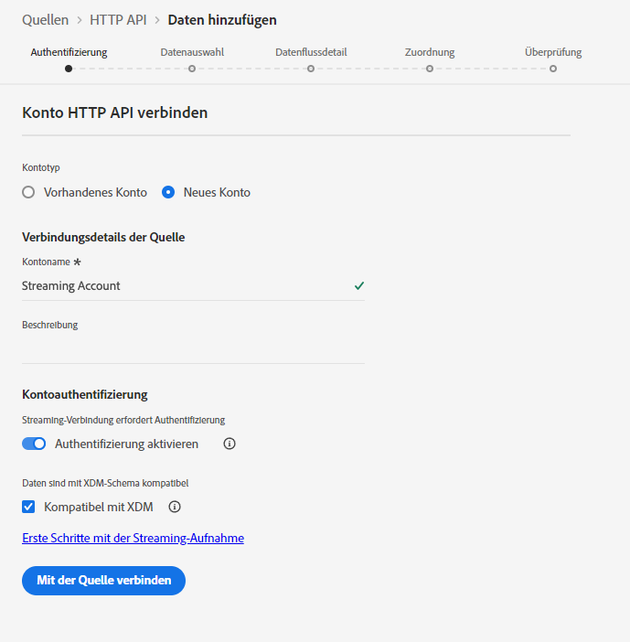
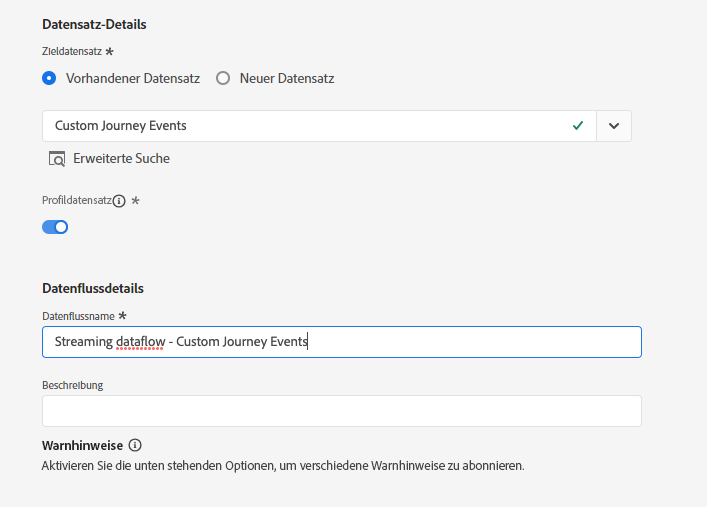
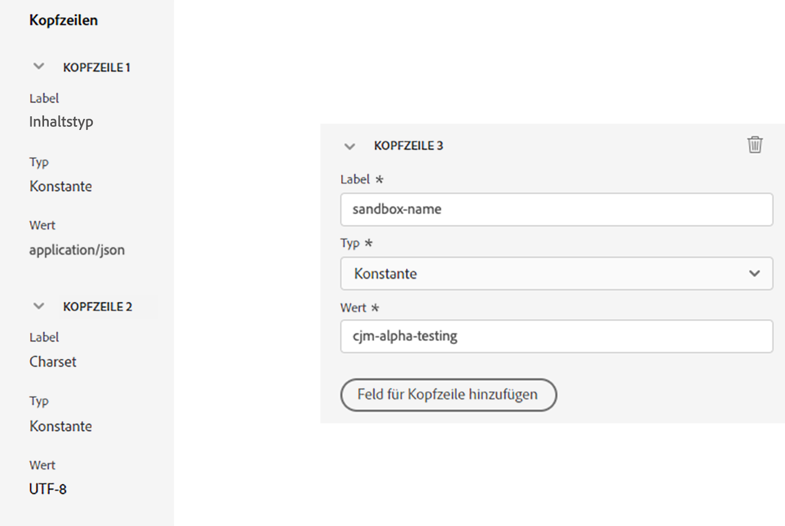
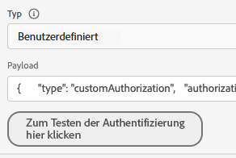
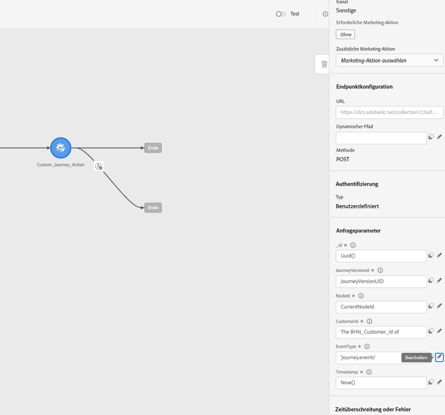

# Verwenden von benutzerdefinierten Aktionen zum Schreiben von Journey-Ereignissen in Experience Platform {#custom-action-aep}

In diesem Anwendungsfall wird erläutert, wie Sie mithilfe von benutzerdefinierten Aktionen und authentifizierten Aufrufen benutzerdefinierte Ereignisse aus Journeys in Adobe Experience Platform schreiben.

## Konfigurieren eines Entwicklerprojekts {#custom-action-aep-IO}

1. Klicken Sie in der Adobe Developer Console auf **Projekt** und öffnen Sie Ihr IO-Projekt.

1. Klicken Sie im Abschnitt **Anmeldedaten** auf **OAuth Server-to-Server**.

   

1. Klicken Sie auf **cURL-Befehl anzeigen**.

   

1. Kopieren Sie den cURL-Befehl und speichern Sie client_id, client_secret, grant_type und scope.

```
curl -X POST 'https://ims-na1.adobelogin.com/ims/token/v3' -H 'Content-Type: application/x-www-form-urlencoded' -d 'grant_type=client_credentials&client_id=1234&client_secret=5678&scope=openid,AdobeID,read_organizations,additional_info.projectedProductContext,session'
```

>[!CAUTION]
>
>Nachdem Sie Ihr Projekt in der Adobe Developer Console erstellt haben, müssen Sie Entwickelnden und der API die richtigen Zugriffsrechte erteilen. Weitere Informationen finden Sie in der [Dokumentation zu Adobe Experience Platform](https://experienceleague.adobe.com/de/docs/experience-platform/landing/platform-apis/api-authentication#grant-developer-and-api-access-control){target="_blank"}.

## Konfigurieren der Quelle mit dem HTTP-API-Inlet

1. Erstellen Sie einen Endpunkt in Adobe Experience Platform, um die Daten aus Journeys zu schreiben.

1. Klicken Sie in Adobe Experience Platform im linken Menü unter **Verbindungen** auf **Quellen**. Klicken Sie unter **HTTP API** auf **Daten hinzufügen**.

   

1. Wählen Sie **Neues Konto** aus und aktivieren Sie die Authentifizierung. Wählen Sie **Mit der Quelle verbinden** aus.

   

1. Wählen Sie **Weiter** und den Datensatz aus, in den Sie die Daten schreiben möchten. Klicken Sie auf **Weiter** und **Beenden**.

   

1. Öffnen Sie den neu erstellten Datenfluss. Kopieren Sie die Schema-Payload und speichern Sie sie in Ihrem Notepad.

```
{
"header": {
"schemaRef": {
"id": "https://ns.adobe.com/<your_org>/schemas/<schema_id>",
"contentType": "application/vnd.adobe.xed-full+json;version=1.0"
},
"imsOrgId": "<org_id>",
"datasetId": "<dataset_id>",
"source": {
"name": "Custom Journey Events"
}
},
"body": {
"xdmMeta": {
"schemaRef": {
"id": "https://ns.adobe.com/<your_org>/schemas/<schema_id>",
"contentType": "application/vnd.adobe.xed-full+json;version=1.0"
}
},
"xdmEntity": {
"_id": "test1",
"<your_org>": {
"journeyVersionId": "",
"nodeId": "", "customer_Id":""
},
"eventMergeId": "",
"eventType": "",
"producedBy": "self",
"timestamp": "2018-11-12T20:20:39+00:00"
}
}
}
```

## Konfigurieren der benutzerdefinierten Aktion {#custom-action-config}

Die Konfiguration der benutzerdefinierten Aktion wird auf [dieser Seite](../action/about-custom-action-configuration.md) beschrieben.

Für dieses Beispiel gehen Sie wie folgt vor:

1. Öffnen Sie Adobe Journey Optimizer und klicken Sie im linken Menü unter **Administration** auf **Konfigurationen**. Klicken Sie unter **Aktionen** auf **Verwalten** und dann auf **Aktion erstellen**.

1. Legen Sie die URL fest und wählen Sie die POST-Methode.

   `https://dcs.adobedc.net/collection/<collection_id>?syncValidation=false`

1. Stellen Sie sicher, dass die Kopfzeilen (Content-Type, Charset, sandbox-name) konfiguriert sind.

   

### Einrichten der Authentifizierung {#custom-action-aep-authentication}

1. Wählen Sie den **Typ** als **Benutzerdefiniert** mit der folgenden Payload.

1. Fügen Sie client_secret, client_id, scope und grant_type (aus der zuvor verwendeten IO-Projekt-Payload) ein.

   ```
   {
   "type": "customAuthorization",
   "authorizationType": "Bearer",
   "endpoint": "https://ims-na1.adobelogin.com/ims/token/v3",
   "method": "POST",
   "headers": {},
   "body": {
   "bodyType": "form",
   "bodyParams": {
   "grant_type": "client_credentials",
   "client_secret": "********",
   "client_id": "<client_id>",
   "scope": "openid,AdobeID,read_organizations,additional_info.projectedProductContext,session"
   }
   },
   "tokenInResponse": "json://access_token",
   "cacheDuration": {
   "duration": 28000,
   "timeUnit": "seconds"
   }
   }
   ```

1. Verwenden Sie die Schaltfläche **Zum Testen der Authentifizierung hier klicken**, um die Verbindung zu testen.

   

### Einrichten der Payload {#custom-action-aep-payload}

1. Fügen Sie die Payload aus der zuvor verwendeten Quellverbindung in die Felder **Anfrage** und **Antwort** ein.

   ```
   {
   "xdmMeta": {
   "schemaRef": {
   "id": "https://ns.adobe.com/<your_org>/schemas/<schema_id>",
   "contentType": "application/vnd.adobe.xed-full+json;version=1.0"
   }
   },
   "xdmEntity": {
   "_id": "/uri-reference",
   "<your_org>": {
   "journeyVersionId": "Sample value",
   "nodeId": "Sample value",
   "customer_Id":""
   },
   "eventMergeId": "Sample value",
   "eventType": "advertising.completes,
   "producedBy": "self",
   "timestamp": "2018-11-12T20:20:39+00:00"
   }
   }
   ```

1. Ändern Sie die Feldkonfiguration von **Konstant** in **Variabel** für Felder, die dynamisch befüllt werden sollen.

1. Speichern Sie die benutzerdefinierte Aktion.

## Journey

1. Verwenden Sie schließlich diese benutzerdefinierte Aktion in einer Journey, um die benutzerdefinierten Journey-Ereignisse zu schreiben.

1. Füllen Sie Attribute wie Journey Version Id, Node Id, Node Name und andere entsprechend Ihrem Anwendungsfall aus.

   
