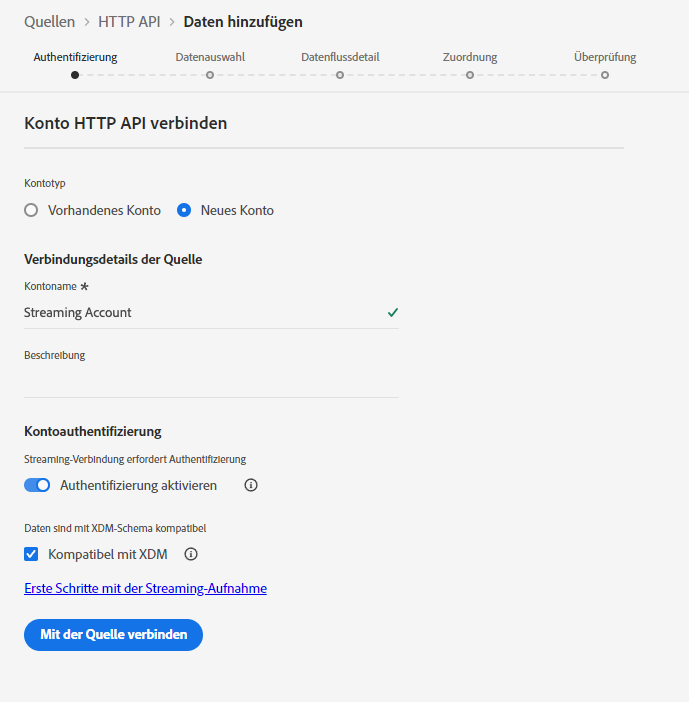
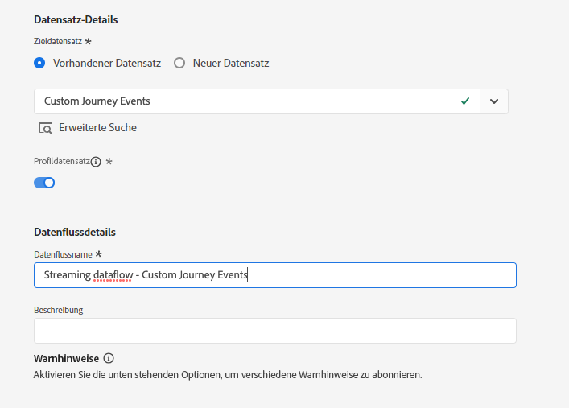
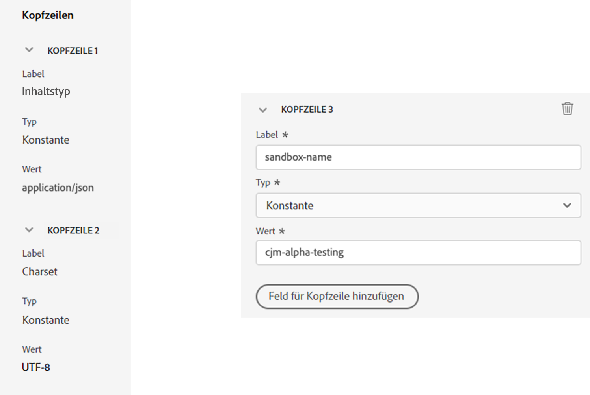
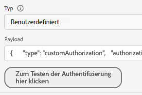
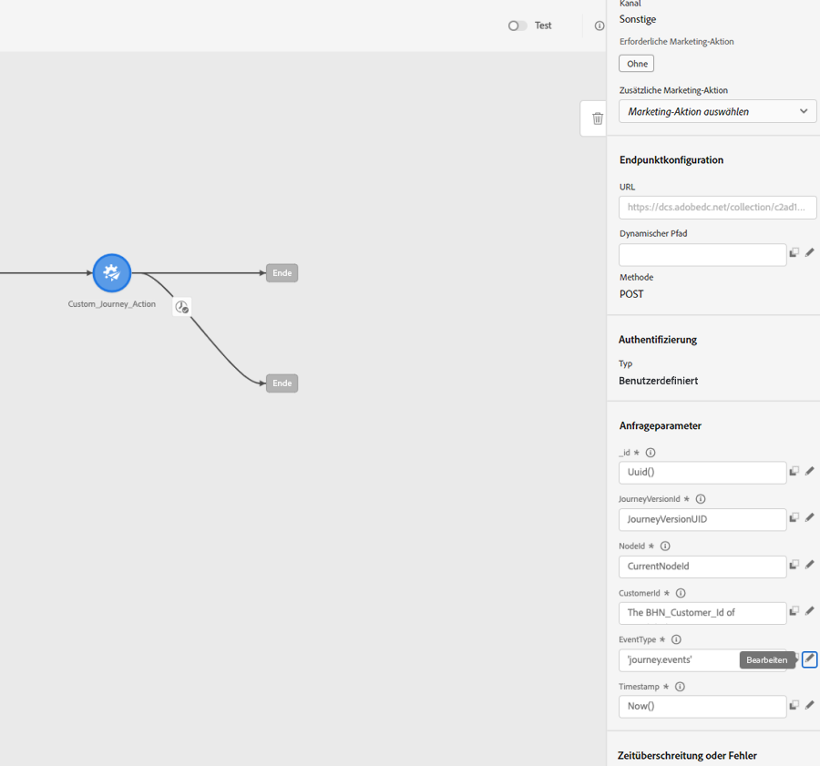

# Verwenden von benutzerdefinierten Aktionen zum Schreiben von Journey-Ereignissen in Experience Platform {#custom-action-aep}

>[!BEGINSHADEBOX]

**Auf dieser Seite** Erfahren Sie, wie Sie mit benutzerdefinierten Aktionen und authentifizierten API-Aufrufen benutzerdefinierte Journey-Ereignisse von Ihren Journey in Adobe Experience Platform schreiben.

>[!ENDSHADEBOX]

In diesem Anwendungsbeispiel wird erläutert, wie benutzerspezifische Ereignisse mithilfe von benutzerdefinierten Aktionen und authentifizierten Aufrufen von Journey in [!DNL Adobe Experience Platform] geschrieben werden.

## Konfigurieren eines Entwicklerprojekts {#custom-action-aep-IO}

1. Klicken Sie in der Adobe Developer Console auf **Projekt** und öffnen Sie Ihr IO-Projekt.

1. Klicken Sie im Abschnitt **Anmeldedaten** auf **OAuth Server-to-Server**.

   

1. Klicken Sie auf **cURL-Befehl anzeigen**.

   ![[!DNL Adobe Experience Platform] Auswahl des Aktionstyps](assets/custom-action-aep-2.png)

1. Kopieren Sie den cURL-Befehl und speichern Sie client_id, client_secret, grant_type und scope.

```
curl -X POST 'https://ims-na1.adobelogin.com/ims/token/v3' -H 'Content-Type: application/x-www-form-urlencoded' -d 'grant_type=client_credentials&client_id=1234&client_secret=5678&scope=openid,AdobeID,read_organizations,additional_info.projectedProductContext,session'
```

>[!CAUTION]
>
>Nachdem Sie Ihr Projekt in der Adobe Developer Console erstellt haben, müssen Sie Entwickelnden und der API die richtigen Zugriffsrechte erteilen. Weitere Informationen finden Sie in der [[!DNL Adobe Experience Platform] Dokumentation](https://experienceleague.adobe.com/de/docs/experience-platform/landing/platform-apis/api-authentication#grant-developer-and-api-access-control){target="_blank"}

## Konfigurieren der Quelle mit dem HTTP-API-Inlet

1. Erstellen Sie einen Endpunkt in [!DNL Adobe Experience Platform], um die Daten aus Journey zu schreiben.

1. Klicken Sie [!DNL Adobe Experience Platform] im linken Menü **Quellen** unter **Verbindungen**. Klicken Sie unter **HTTP API** auf **Daten hinzufügen**.

   ![Sandbox-Auswahl-Dropdown für [!DNL Adobe Experience Platform]](assets/custom-action-aep-3.png)

1. Wählen Sie **Neues Konto** aus und aktivieren Sie die Authentifizierung. Wählen Sie **Mit der Quelle verbinden** aus.

   

1. Wählen Sie **Weiter** und den Datensatz aus, in den Sie die Daten schreiben möchten. Klicken Sie auf **Weiter** und **Beenden**.

   

1. Öffnen Sie den neu erstellten Datenfluss. Kopieren Sie die Schema-Payload und speichern Sie sie in Ihrem Notepad.

```
{
"header": {
"schemaRef": {
"id": "https://ns.adobe.com/<your_org>/schemas/<schema_id>",
"contentType": "application/vnd.adobe.xed-full+json;version=1.0"
},
"imsOrgId": "<org_id>",
"datasetId": "<dataset_id>",
"source": {
"name": "Custom Journey Events"
}
},
"body": {
"xdmMeta": {
"schemaRef": {
"id": "https://ns.adobe.com/<your_org>/schemas/<schema_id>",
"contentType": "application/vnd.adobe.xed-full+json;version=1.0"
}
},
"xdmEntity": {
"_id": "test1",
"<your_org>": {
"journeyVersionId": "",
"nodeId": "", "customer_Id":""
},
"eventMergeId": "",
"eventType": "",
"producedBy": "self",
"timestamp": "2018-11-12T20:20:39+00:00"
}
}
}
```

## Konfigurieren der benutzerdefinierten Aktion {#custom-action-config}

Die Konfiguration der benutzerdefinierten Aktion wird auf [dieser Seite](../action/about-custom-action-configuration.md) beschrieben.

Für dieses Beispiel gehen Sie wie folgt vor:

1. Öffnen Sie [!DNL Adobe Journey Optimizer] und klicken Sie **Konfigurationen** unter **Administration** im linken Menü. Klicken Sie unter **Aktionen** auf **Verwalten** und dann auf **Aktion erstellen**.

1. Legen Sie die URL fest und wählen Sie die POST-Methode.

   `https://dcs.adobedc.net/collection/<collection_id>?syncValidation=false`

1. Stellen Sie sicher, dass die Kopfzeilen (Content-Type, Charset, sandbox-name) konfiguriert sind.

   

### Einrichten der Authentifizierung {#custom-action-aep-authentication}

1. Wählen Sie den **Typ** als **Benutzerdefiniert** mit der folgenden Payload.

1. Fügen Sie client_secret, client_id, scope und grant_type (aus der zuvor verwendeten IO-Projekt-Payload) ein.

   ```
   {
   "type": "customAuthorization",
   "authorizationType": "Bearer",
   "endpoint": "https://ims-na1.adobelogin.com/ims/token/v3",
   "method": "POST",
   "headers": {},
   "body": {
   "bodyType": "form",
   "bodyParams": {
   "grant_type": "client_credentials",
   "client_secret": "********",
   "client_id": "<client_id>",
   "scope": "openid,AdobeID,read_organizations,additional_info.projectedProductContext,session"
   }
   },
   "tokenInResponse": "json://access_token",
   "cacheDuration": {
   "duration": 28000,
   "timeUnit": "seconds"
   }
   }
   ```

1. Verwenden Sie die Schaltfläche **Zum Testen der Authentifizierung hier klicken**, um die Verbindung zu testen.

   

### Einrichten der Payload {#custom-action-aep-payload}

1. Fügen Sie die Payload aus der zuvor verwendeten Quellverbindung in die Felder **Anfrage** und **Antwort** ein.

   ```
   {
   "xdmMeta": {
   "schemaRef": {
   "id": "https://ns.adobe.com/<your_org>/schemas/<schema_id>",
   "contentType": "application/vnd.adobe.xed-full+json;version=1.0"
   }
   },
   "xdmEntity": {
   "_id": "/uri-reference",
   "<your_org>": {
   "journeyVersionId": "Sample value",
   "nodeId": "Sample value",
   "customer_Id":""
   },
   "eventMergeId": "Sample value",
   "eventType": "advertising.completes,
   "producedBy": "self",
   "timestamp": "2018-11-12T20:20:39+00:00"
   }
   }
   ```

1. Ändern Sie die Feldkonfiguration von **Konstant** in **Variabel** für Felder, die dynamisch befüllt werden sollen.

1. Speichern Sie die benutzerdefinierte Aktion.

## Journey

1. Verwenden Sie schließlich diese benutzerdefinierte Aktion in einer Journey, um die benutzerdefinierten Journey-Ereignisse zu schreiben.

1. Füllen Sie Attribute wie Journey Version Id, Node Id, Node Name und andere entsprechend Ihrem Anwendungsfall aus.

   

+++ KI-Wissensreferenz

Dieser Abschnitt enthält strukturiertes Wissen zur Unterstützung von Interpretation, Abrufen und Antworten auf Fragen zu diesem Thema.

Zum vollständigen Verständnis sollten diese Informationen mit der Dokumentation auf dieser Seite kombiniert werden. Keine der beiden Quellen ist für Einzelpersonen gedacht. Die Seite beschreibt die Funktion, während dieser Abschnitt zusätzlichen Kontext bietet, der dabei hilft, Begriffe, Absichten, Anwendbarkeit und Begrenzungen zu unterscheiden.

- **TL;DR:** In diesem Anwendungsfall wird erläutert, wie eine benutzerdefinierte Aktion in Journey Optimizer konfiguriert wird, die Journey-Ereignisdaten mithilfe eines HTTP-API-Inlets und authentifizierter OAuth-Server-zu-Server-Aufrufe in Adobe Experience Platform schreibt.

**intents:**
- Einrichten eines Adobe Developer Console IO-Projekts mit OAuth-Server-zu-Server-Anmeldedaten für die AEP-API-Authentifizierung
- Erstellen einer HTTP-API-Inlet-Quelle in Adobe Experience Platform zum Empfangen von Streaming-Journey-Ereignisdaten
- Konfigurieren einer benutzerdefinierten Aktion in Journey Optimizer mit der richtigen URL, den richtigen Kopfzeilen und der richtigen Authentifizierung mit einem benutzerdefinierten Bearer-Token
- Dynamische Zuordnung von Journey-Feldern (Journey-Versions-ID, Knoten-ID, Kunden-ID) als Variablen in der Payload der benutzerdefinierten Aktion
- Verwenden der benutzerdefinierten Aktion auf einer Journey, um benutzerdefinierte Ereignisse in einen AEP-Datensatz zu schreiben

**Glossar:**
- **HTTP API Inlet**: Ein Adobe Experience Platform-Quell-Connector, der einen Streaming-Endpunkt für die Aufnahme von Daten über HTTP-POST-Anfragen erstellt *(produktspezifisch)*
- **OAuth Server-zu-Server**: Ein Authentifizierungs-Berechtigungstyp in Adobe Developer Console, der Bearer-Token für Server-zu-Server-API-Aufrufe ohne Benutzerinteraktion generiert *(produktspezifisch)*
- **Benutzerdefinierte Autorisierung**: Ein Authentifizierungstyp für benutzerdefinierte Aktionen in Journey Optimizer, der ein Bearer-Token von einem angegebenen Endpunkt abruft und für eine konfigurierte Dauer zwischenspeichert *produktspezifisch)*
- **XDM-Entität**: Die Payload-Struktur der Daten, die dem Schema des Experience-Datenmodells entspricht und als Hauptteil beim Schreiben von Ereignissen in AEP über den HTTP-API-*(produktspezifisch) verwendet wird*
- **cacheDuration**: Die Token-Cache-Einstellung in der benutzerdefinierten Autorisierungskonfiguration, die steuert, wie lange das abgerufene Bearer-Token wiederverwendet wird, bevor ein neues angefordert wird *(produktspezifisch)*

**Leitplanken:**
- Nach dem Erstellen des Adobe Developer Console-Projekts müssen Entwickler- und API-Zugriffssteuerungsberechtigungen explizit erteilt werden, bevor die Anmeldeinformationen verwendet werden können
- Die HTTP-API-Inlet-Quelle muss mit aktivierter Authentifizierung erstellt werden. Die Verbindungsendpunkt-URL und Schema-Payload müssen kopiert und zur Verwendung in der Konfiguration der benutzerdefinierten Aktion gespeichert werden
- Benutzerdefinierte Aktionskopfzeilen müssen Inhaltstyp, Zeichensatz und Sandbox-Name enthalten
- Felder, die zur Laufzeit dynamisch ausgefüllt werden sollen, müssen in der Payload-Konfiguration der benutzerdefinierten Aktion von „Konstante“ in „Variable“ geändert werden

**Terminologie:**
- Kanonischer Name: Benutzerdefinierte Aktion — Akronym: none — Varianten: benutzerdefinierte Aktionskonfiguration, benutzerdefinierte Journey Optimizer-Aktion
- Kanonischer Name: Adobe Experience Platform — Akronym: AEP — Varianten: Experience Platform, Plattform
- Synonyme: „HTTP API Inlet“ = „Streaming-Endpunkt“ = „DCS-Sammlungsendpunkt“
- Verwechseln Sie nicht: „OAuth Server-zu-Server“ ≠ „OAuth-Benutzerauthentifizierung“ (Server-zu-Server erfordert keine Benutzeranmeldung; es werden Client-Anmeldeinformationen verwendet)

**FAQ:**
- **F: Welche Art von Authentifizierung wird verwendet, um den AEP HTTP API Inlet von einer benutzerdefinierten Journey Optimizer-Aktion aus aufzurufen?** — Benutzerdefinierte Bearer-Token-Authentifizierung mit OAuth-Server-zu-Server-Client-Anmeldedaten, die vom Adobe IMS-Token-Endpunkt abgerufen wurden.
- **F: Wo finde ich die Werte für client_id, client_secret, grant_type und scope?** - Klicken Sie im Abschnitt OAuth Server-zu-Server-Anmeldeinformationen Ihres Adobe Developer Console IO-Projekts auf „cURL-Befehl anzeigen“.
- **F: Wie kann ich Journey-spezifische Felder (z. B. journeyVersionId, nodeId) in der Payload dynamisch machen?** — Ändern Sie die Feldkonfiguration im Payload-Setup für die benutzerdefinierte Aktion von „Konstante“ in „Variable“, sodass sie zur Laufzeit aus dem Journey-Kontext gefüllt werden.
- **F: Welche Berechtigungen sind für das Adobe Developer Console-Projekt erforderlich?** — Die Entwickler- und API-Zugriffssteuerung muss nach der Erstellung des Projekts mit den richtigen Berechtigungen gewährt werden, wie in der Dokumentation zur AEP-API-Authentifizierung beschrieben.
- **F: Welchen Zweck hat die Einstellung „cacheDuration“ in der Authentifizierungs-Payload?** — Sie steuert, wie lange das abgerufene Bearer-Token zwischengespeichert und wiederverwendet wird (28.000 Sekunden im Beispiel), bevor die benutzerdefinierte Aktion ein neues Token anfordert.

+++
