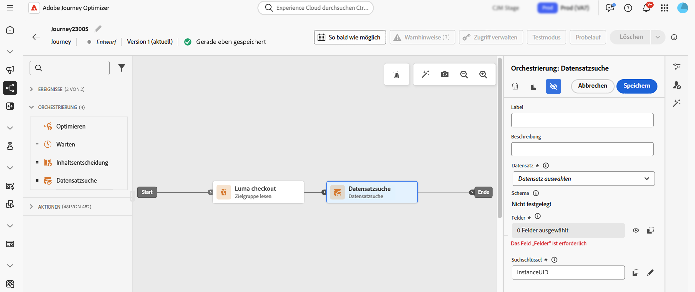
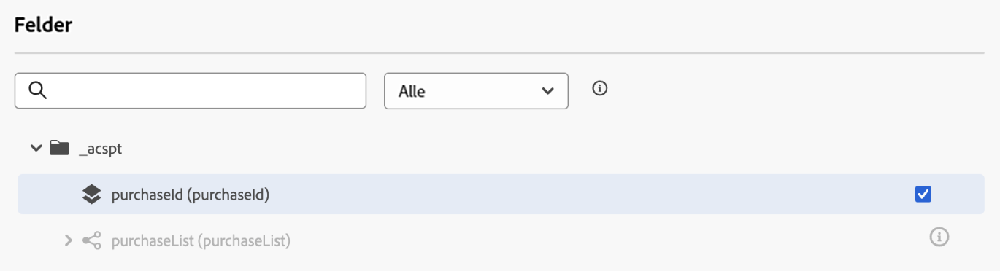
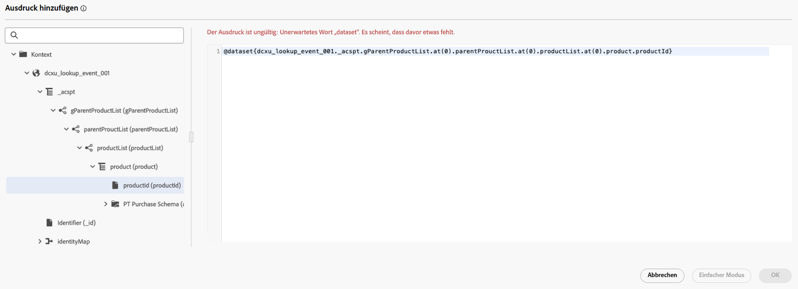

# Verwenden von [!DNL Adobe Experience Platform]-Daten in Journeys {#datalookup}

>[!CONTEXTUALHELP]
>id="ajo_journey_dataset_lookup"
>title="Aktivität „Datensatzsuche“"
>abstract="Die Aktivität **[!UICONTROL Datensatzsuche]** ermöglicht während der Laufzeit das dynamische Abrufen von Daten aus Adobe Experience Platform-Eintragsdatensätzen. Mit dieser Funktion können Sie auf Daten zugreifen, die sich möglicherweise nicht in der Profil- oder Ereignis-Payload befinden. So können Sie sicherstellen, dass Ihre Kundeninteraktionen sowohl relevant als auch zeitlich passend sind."

Die Aktivität **[!UICONTROL Datensatzsuche]** ermöglicht während der Laufzeit das dynamische Abrufen von Daten aus Adobe Experience Platform-Eintragsdatensätzen. Mit dieser Funktion können Sie auf Daten zugreifen, die sich möglicherweise nicht in der Profil- oder Ereignis-Payload befinden. So können Sie sicherstellen, dass Ihre Kundeninteraktionen sowohl relevant als auch zeitlich passend sind.

Wichtigste Vorteile:

* **Echtzeit-Personalisierung**: Passen Sie Kundenerlebnisse mit angereicherten Daten an.
* **Dynamische Entscheidungsfindung**: Nutzen Sie externe Daten, um Logik und Aktionen von Journeys zu steuern.
* **Verbesserter Datenzugriff**: Rufen Sie Produktmetadaten, Preistabellen oder relationale Daten ab, die mit bestimmten Schlüsseln verknüpft sind.

>[!AVAILABILITY]
>
>Diese Aktivität ist nur für eine ausgewählte Gruppe von Organisationen verfügbar (eingeschränkte Verfügbarkeit). Um Zugriff zu erhalten, wenden Sie sich an den Adobe-Support.

## Wichtige Informationen {#must-read}

### Datensatzaktivierung

Der Datensatz muss für die Suche in Adobe Experience Platform aktiviert sein. Detaillierte Informationen finden Sie in diesem Abschnitt: [Verwenden von Adobe Experience Platform-Daten](../data/lookup-aep-data.md).

### Limits und Einschränkungen

* Pro Journey können maximal 10 Aktivitäten des Typs „Datensatzsuche“ verwendet werden.
* Es können maximal 20 Felder ausgewählt werden.
* Es können maximal 50 Schlüssel im Suchschlüssel-Array vorhanden sein.
* Die Größe der angereicherten Daten ist auf 10 KB beschränkt.

### Weitere Überlegungen zur Leistung

Die folgenden Empfehlungen geben Hinweise, wie Sie Verzögerungen bei der Zustellbarkeit vermeiden können:

| Überlegung | Empfohlenes Limit | Beschreibung |
| ------- | ------- | ------- |
| Attribute pro Suche | Bis zu 20 | Anzahl der pro Eintrag in einer einzigen Suchaktivität abgerufenen Datenfelder. |
| Suchaktivitäten | Bis zu 5 pro Journey | Jede Journey kann bis zu 5 verschiedene Suchaktivitäten enthalten. Bei jeder Suche kann ein anderer Datensatz ausgewählt werden. |

## Konfigurieren der Aktivität „Datensatzsuche“ {#configure}

Gehen Sie wie folgt vor, um die Aktivität **[!UICONTROL Datensatzsuche]** zu konfigurieren:

1. Erweitern Sie die Kategorie **[!UICONTROL Orchestrierung]** und legen Sie eine Aktivität vom Typ **[!UICONTROL Datensatzsuche]** auf Ihrer Arbeitsfläche ab.

   

1. Fügen Sie ein Label und eine Beschreibung hinzu.

1. Wählen Sie im Feld **[!UICONTROL Datensatz]** den Datensatz mit den erforderlichen Attributen aus. 

   >[!NOTE]
   >
   >Wenn der Datensatz, nach dem Sie suchen, nicht in der Liste angezeigt wird, vergewissern Sie sich, dass Sie ihn für die Suche aktiviert haben. Weitere Informationen finden Sie im Abschnitt [Wichtige Informationen](#must-read).

1. Wählen Sie die spezifischen Felder aus, die Sie aus dem Datensatz abrufen möchten.

   * Sie können ausschließlich Blattknoten (Felder auf der untersten Ebene des Schemas) auswählen. Das Feld muss ein primitiver Wert sein (String, Zahl, boolescher Wert, Datum usw.).

   * Listen (Arrays) und Zuordnungen (Schlüssel-Wert-Objekte) können nicht ausgewählt werden.

   +++Beispiel

   

   +++

1. Wählen Sie im Feld **[!UICONTROL Suchschlüssel]** einen Verbindungsschlüssel aus, der sowohl in den Attributen des Entscheidungselements als auch im Datensatz vorhanden ist. Dieser Schlüssel wird vom System zur Suche im ausgewählten Datensatz verwendet.

   * Bei Schlüsseln kann es sich um Ausdrücke handeln, die aus dem Journey-Kontext abgeleitet werden (z. B. SKUs, E-Mail-IDs oder andere Kennungen). Beispiel: `@profile.email` oder `list(@event{purchase_event.products.sku})`.

   * Es werden ausschließlich **Strings** oder **Listen mit Strings** unterstützt.

   +++Beispiel

   

   +++

## Verwenden angereicherter Daten in der Journey

Die von der Aktivität **[!UICONTROL Datensatzsuche]** abgerufenen Daten werden im Journey-Kontext als Array von Objekten gespeichert. Sie sind im Journey-Ausdruckseditor und im Personalisierungseditor verfügbar und ermöglichen so bedingte Logik sowie personalisiertes Messaging auf Grundlage angereicherter Daten.

* **Journey-Ausdruckseditor**:

  Rufen Sie den Editor im **[!UICONTROL erweiterten Modus]** auf und nutzen Sie folgende Syntax: `@datasetLookup{MyDatasetLookUpActivity1.entities}`. [Weitere Informationen zur Arbeit mit dem erweiterten Ausdruckseditor](../building-journeys/expression/expressionadvanced.md)

* **Personalisierungseditor**:

  Verwenden Sie folgende Syntax: `{{context.journey.datasetLookup.1482319411.entities}}`.

>[!NOTE]
>
>Angereicherte Daten sind vorübergehend und nur während der Laufzeit der Journey sowie bei der Personalisierung ausgehender Aktivitäten (E-Mail, Push, SMS usw.) verfügbar.

## Beispiele für Anwendungsfälle

+++Filterung anhand von Produktkategorien

**Szenario**:Send: Ein Coupon für Benutzende, die mehr als 40 $ für Haushaltsprodukte ausgeben.

**Journey-Fluss**:

1. **Kaufereignis**: Erfassen Sie SKUs im Warenkorb von Benutzenden.

1. **Aktivität „Datensatzsuche“**:

   * Datensatz: `products-dataset` (SKU als Primärschlüssel).
   * Suchschlüssel: `list(@event{purchase_event.products.sku})`.
   * Zurückzugebende Felder: `["SKU", "category", "price"]`.

1. **Bedingungsaktivität**:

   * Filtern nach SKUs, bei denen die Kategorie „Haushalt“ lautet.

     ```
     @event{purchase_event.products.all( in(currentEventField.sku, @datasetlookup{MyDatasetLookupActivity1.entities.all(currentDatasetLookupField.category == 'household').sku} ) )} 
     ```

   ODER

   * Aggregieren der Gesamtausgaben für Haushaltsprodukte und vergleichen mit dem Schwellenwert von 40 $.

     ```
     sum(@event{purchase_event.products.all( in(currentEventField.sku, @datasetlookup{MyDatasetLookUpActivity1.entities.all(currentDatasetLookupField.category == 'household').sku} ) )}.price}, ',', true ) > 40
     ```

1. **Personalisierungseditor**:

   Verwenden Sie die angereicherten Daten, um den E-Mail-Inhalt zu personalisieren:

   ```
   
   {{#each journey.datasetlookup.3709000.entities as |product|}}
   
   
   {{/each}}
   "Hi, thanks for spending " +  + " on household products. Here is your reward!"
   ```

+++

+++Personalisierung mit externen Treuedaten

**Szenario**: Ermitteln Sie, welches E-Mail-Konto für ein Profil den Treuestatus „Platin“ aufweist. In diesem Szenario ist das Treuekonto mit einer E-Mail-ID verknüpft und im Standardspeicher für die Profilsuche sind keine Treuedaten verfügbar.

**Journey-Fluss**:

1. **Profilereignis-Trigger**: Erfassen Sie E-Mail-IDs aus dem Profil- oder Ereigniskontext.

1. **Aktivität „Datensatzsuche“**:
   * Datensatz: `loyalty-member-dataset` (E-Mail als Primärschlüssel).
   * Suchschlüssel: `@profile.email`.
   * Zurückzugebende Felder: `["email", "loyaltyTier"]`.

1. **Bedingungsaktivität**:

   Verzweigen Sie die Journey anhand der Treuestufe:

   ```
   @datasetLookup{MyDatasetLookUpActivity1.entity.loyaltyMember.loyaltyTier} == 'Platinum'
   ```

1. **Personalisierungseditor**:

   Verwenden Sie die angereicherten Treuestufendaten, um ausgehende Kommunikation zu personalisieren:

   ```
   {{context.journey.datasetLookup.1482319411.entity.loyaltyMember.loyaltyTier}}
   ```
