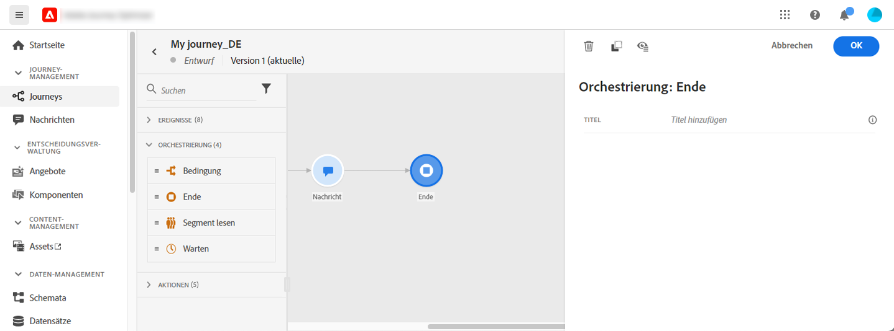

# Endaktivität{#end-activity}

>[!BEGINSHADEBOX]

**Auf dieser Seite** Erfahren Sie, wie Sie mit der Aktivität Ende das Ende jedes Journey-Pfads markieren und Beschriftungen hinzufügen können, die die Lesbarkeit Ihrer Journey-Berichte erleichtern.

>[!ENDSHADEBOX]

>[!CONTEXTUALHELP]
>id="ajo_journey_end"
>title="Endaktivität"
>abstract="Mit der Endaktivität können Sie das Ende jedes Pfads der Journey markieren. Sie ist nicht obligatorisch, wird aber aus Gründen der besseren optischen Übersichtlichkeit empfohlen. Wenn die Journey mehrere Endaktivitäten hat, empfehlen wir, jedem Ende ein Label hinzuzufügen, damit Berichte leichter verständlich sind."

Mit der **[!UICONTROL Endaktivität]** können Sie das Ende jedes Pfades der Journey markieren. Sie ist nicht obligatorisch, wird aber aus Gründen der besseren optischen Übersichtlichkeit empfohlen. Wenn die Journey mehrere Endaktivitäten hat, empfehlen wir, jedem Ende ein Label hinzuzufügen, damit Berichte leichter verständlich sind. Weitere Informationen finden Sie auf [dieser Seite](../reports/live-report.md).

<!--

-->
