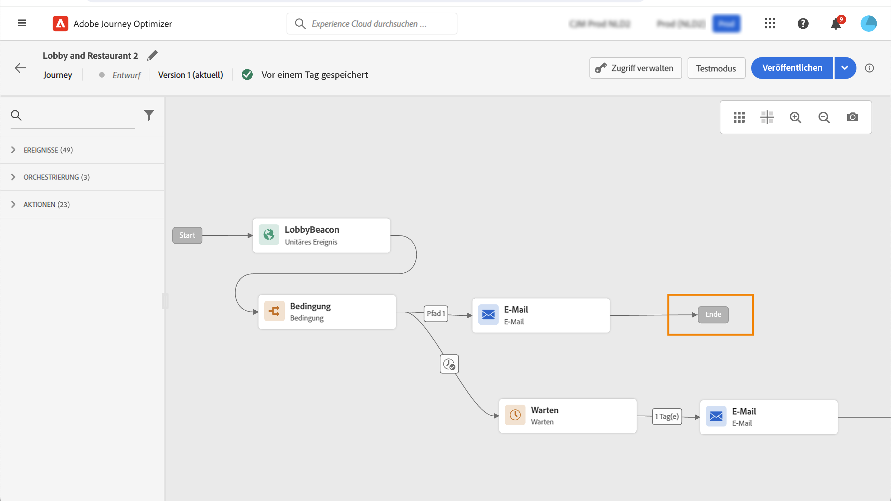
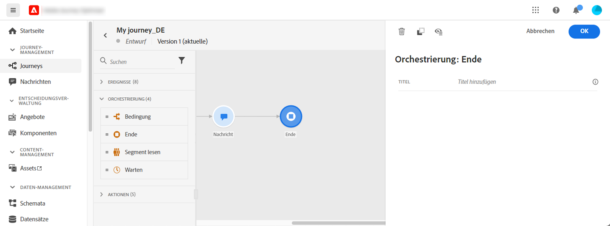
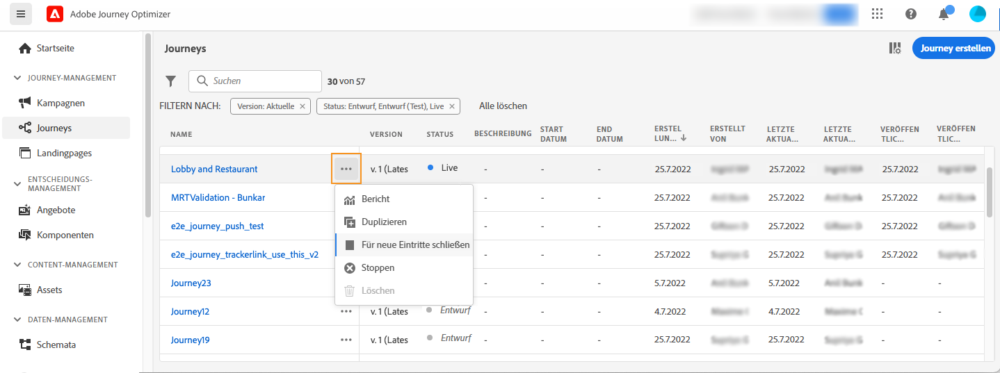
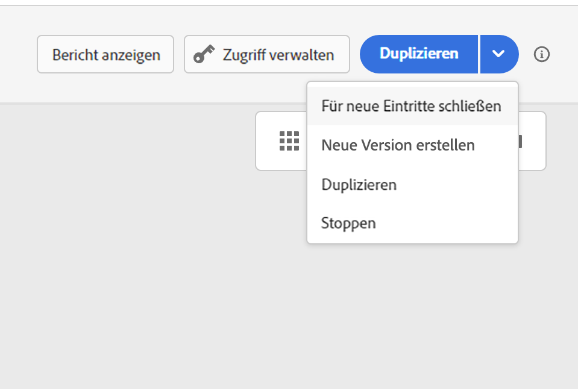

# Beenden einer Journey{#journey-ending}

Eine Journey kann für eine Person auf zwei Weisen enden:

* Die Person kommt bei der letzten Aktivität eines Pfades an.
* Die Person kommt bei einer **Bedingungs**-Aktivität (oder einer **Warte**-Aktivität mit einer Bedingung) an und erfüllt keine der Bedingungen.

Die Person kann dann wieder in die Journey eintreten, wenn der erneute Zutritt erlaubt ist. Weitere Informationen finden Sie auf [dieser Seite](../building-journeys/journey-gs.md#change-properties)

Um eine Live-Journey zu beenden, empfehlen wir, sie zu schließen. Der Eintritt neuer Kunden und Kundinnen in die Journey wird dann blockiert. Kunden und Kundinnen, die bereits in die Journey eingetreten sind, bleiben bis zu deren Ende darin. Weiterführende Informationen finden Sie in diesem [Abschnitt](../building-journeys/journey.md#close-journey)

Sie können eine Journey nur stoppen, wenn ein unerwartetes Ereignis eintritt und die gesamte Verarbeitung der Journey unverzüglich abgebrochen werden muss. Personen, die bereits in eine Journey eingetreten sind, sind alle in ihrem Fortschritt angehalten. Weiterführende Informationen finden Sie in diesem [Abschnitt](../building-journeys/journey.md#stop-journey).

>[!NOTE]
>
>Beachten Sie, dass Sie eine geschlossene oder gestoppte Journey nicht fortsetzen können.

## Journey-End-Tag{#end-tag}

Beim Erstellen einer Journey wird am Ende jedes Pfads ein „End-Tag“ angezeigt. Dieser Knoten kann nicht manuell hinzugefügt oder entfernt werden, und lediglich bei seiner Kennzeichnung sind Änderungen möglich. Er markiert das Ende jedes Pfads der Journey. Wenn die Journey mehrere Pfade hat, empfehlen wir, für jedes Ende eine Kennzeichnung hinzuzufügen, damit Berichte leichter verständlich sind. Weitere Informationen finden Sie auf [dieser Seite](../reports/live-report.md).

<!--

### End activity{#journey-end-activity}

The **[!UICONTROL End]** activity allows you to mark the end of each path of the journey. It is not mandatory but recommended for visual clarity. See [this page](../building-journeys/end-activity.md)

-->

## Schließen einer Journey{#close-journey}

Eine Journey kann aus den folgenden Gründen geschlossen werden:

* Die Journey wird manuell über die Schaltfläche **[!UICONTROL Für neue Eintritte schließen]** geschlossen.
* Eine segmentbasierte Journey zur einmaligen Ausführung wurde abgeschlossen.
* Nach dem letzten Vorkommen einer wiederkehrenden zielgruppenbasierten Journey.

Sie können eine Journey manuell schließen. In diesem Fall können Kunden, die sich bereits in der Journey befinden, ihren Pfad bis zum Ende verfolgen, neue Benutzende können jedoch nicht in die Journey eintreten. Wenn eine Journey geschlossen wird (aus einem der oben genannten Gründe), weist sie den Status **[!UICONTROL Geschlossen]** auf. Die Journey stoppt den Eintritt neuer Personen. Personen, die sich bereits in der Journey befinden, können die Journey wie gewohnt beenden. Nach der standardmäßigen globalen maximalen Wartezeit von 30 Tagen wechselt die Journey zum Status **Beendet**. Weitere Informationen finden Sie in diesem [Abschnitt](../building-journeys/journey-gs.md#global_timeout).

Eine geschlossene Journey-Version kann weder neu gestartet noch gelöscht werden. Stattdessen können Sie eine neue Version davon erstellen oder sie duplizieren. Nur abgeschlossene Journeys können gelöscht werden.

Um eine Journey in der Liste der Journeys zu schließen, klicken Sie auf den Button mit den **[!UICONTROL Auslassungszeichen]** rechts neben dem Journey-Namen und wählen Sie **[!UICONTROL Für neue Eintritte schließen]** aus.

Alternativ können Sie auch folgendermaßen vorgehen:

1. Wählen Sie in der Liste **[!UICONTROL Journeys]** die Journey aus, die Sie schließen möchten.
1. Klicken Sie oben rechts auf den Abwärtspfeil.

   

1. Klicken Sie auf **[!UICONTROL Für neue Eintritte schließen]** und bestätigen Sie diese Auswahl im Dialogfeld.

## Stoppen einer Journey{#stop-journey}

Sie können nötigenfalls den Fortschritt aller Personen in einer Journey stoppen. In diesem Fall entsteht für alle Personen in der Journey eine Zeitüberschreitung. Wenn Sie eine Journey stoppen, wird der Fortschritt der bereits in der Journey befindlichen Personen angehalten. Die Journey wird praktisch deaktiviert. Wenn Sie ein Journey beenden möchten, empfehlen wir Ihnen, sie zu schließen.

Eine gestoppte Journey-Version kann nicht nochmals gestartet werden.

Beim Stoppen wird der Journey-Status auf **[!UICONTROL Gestoppt]** gesetzt.

Sie können beispielsweise eine Journey stoppen, wenn ein Marketer erkennt, dass die Journey die falsche Zielgruppe anspricht, oder wenn eine benutzerdefinierte Aktion, mit der Nachrichten gesendet werden sollen, nicht ordnungsgemäß funktioniert. Um eine Journey aus der Liste der Journeys zu entfernen, klicken Sie auf den Button mit den **[!UICONTROL Auslassungszeichen]** rechts neben dem Journey-Namen und wählen Sie **[!UICONTROL Stoppen]** aus.

Alternativ können Sie auch folgendermaßen vorgehen:

1. Wählen Sie in der Liste **[!UICONTROL Journeys]** die Journey aus, die Sie stoppen möchten.
1. Klicken Sie oben rechts auf den Abwärtspfeil.
   
1. Klicken Sie auf **[!UICONTROL Stoppen]** und bestätigen Sie diese Auswahl im Dialogfeld.
