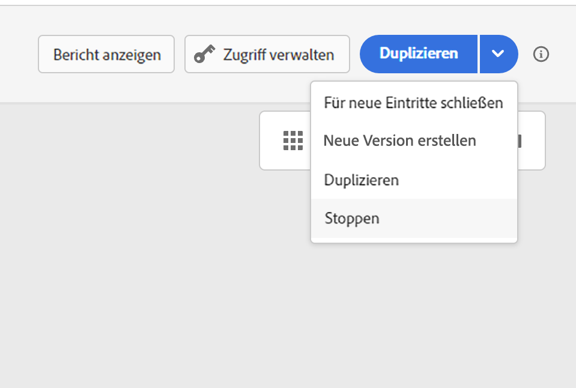

# Beenden einer Journey {#journey-ending}

>[!TIP]
>
>Suchen Sie nach praktischen Anleitungen dazu, wann und wie Profile aus Journeys aussteigen sollten? Lesen Sie unseren [umfassenden Leitfaden zu Journey-Eintritts- und Ausstiegskriterien](entry-exit-criteria-guide.md), der Ausstiegsszenarien aus der Praxis, Best Practices und Konfigurationsanleitungen umfasst.

## Ende einer Live-Journey

Journeys werden geschlossen, wenn das globale Journey-Timeout erreicht wird, oder nach dem letzten Vorkommen einer wiederkehrenden zielgruppenbasierten Journey. [Erfahren Sie, wie Journeys geschlossen werden](#close-journey).

Um eine Live-Journey zu beenden, empfehlen wir, sie manuell zu [schließen](#close-to-new-entrances). Der Eintritt neuer Kundinnen und Kunden in die Journey wird dann blockiert. Profile, die bereits in die Journey eingetreten sind, bleiben bis zu deren Ende darin.

Sie können nur im Notfall und wenn die gesamte Journey-Verarbeitung sofort beendet werden muss [eine Journey auch stoppen](#stop-journey). Personen, die bereits in eine Journey eingetreten sind, kommen dann nicht weiter.

>[!IMPORTANT]
>
>* Sie können eine [geschlossene](#close-journey) oder [gestoppte](#stop-journey) Journey weder neu starten noch löschen. Sie können [eine neue Version](publish-journey.md#journey-versions) von ihr erstellen oder [sie duplizieren](journey-ui.md#duplicate-a-journey).
>
>* Nur abgeschlossene Journeys können gelöscht werden.

## Journey-Ende für Profile

Eine Journey endet für einen Kontakt bei diesen beiden spezifischen Kontexten:

* Der Kontakt erreicht die letzte Aktivität eines Pfads und wechselt dann zum [End-Tag](#end-tag).
* Der Kontakt erreicht eine Aktivität **Bedingung** (oder einer Aktivität **Warten** mit einer Bedingung) und erfüllt keine der Bedingungen.

Der Kontakt kann dann wieder in die Journey eintreten, sofern ein Wiedereintritt zulässig ist. [Weitere Informationen zum Management des Eintritts/Wiedereintritts](../building-journeys/journey-properties.md#entrance)

## Journey-End-Tag {#end-tag}

Beim Erstellen einer Journey wird am Ende jedes Pfads ein End-Tag angezeigt. Dieser Knoten kann nicht manuell hinzugefügt oder entfernt werden, und nur sein Label kann geändert werden. Er kennzeichnet das Ende jedes Pfads der Journey. 

Wenn die Journey mehrere Pfade hat, empfehlen wir, für jedes Ende ein Label hinzuzufügen, damit Berichte leichter verständlich sind. Erfahren Sie mehr über [Journey-Berichte](../reports/live-report.md).

## Schließen einer Journey {#close-journey}

Eine Journey kann aus den folgenden Gründen geschlossen werden:

* Eine einmalige segmentbasierte Journey, deren Ausführung beendet ist und die das globale Timeout von 91 Tagen erreicht hat.
* Nach dem letzten Vorkommen einer wiederkehrenden zielgruppenbasierten Journey.
* Die Journey wird manuell über die Schaltfläche [**[!UICONTROL Für neue Eintritte schließen]**](#close-to-new-entrances) geschlossen.

Nach dem **globalen Journey-Timeout von 91 Tagen** wird der Status der Journey „Zielgruppe lesen“ in **Beendet** geändert. Dieses Verhalten wird nur für 91 Tage festgelegt, da alle Informationen zu Profilen, die in die Journey eingetreten sind, 91 Tage nach ihrem Eintritt entfernt werden. Personen, die sich noch in der Journey befinden, sind automatisch betroffen. Sie beenden die Journey nach dem 91-tägigen Timeout.  Erfahren Sie mehr über das [globale Journey-Timeout](../building-journeys/journey-properties.md#global_timeout).

>[!TIP]
>
>Eine einmalige segmentbasierte Journey behält den **Live**-Status auch nach einmaliger Ausführung bei. Profile können nach Abschluss nicht erneut eintreten, aber die Journey verbleibt so lange im **Live**-Status, bis das standardmäßige globale Timeout abläuft. Sie können sie mit der Option **Für neue Eintritte schließen** früher manuell schließen.

### Wann gilt eine Journey als „fertig“? {#journey-finished-definition}

Die Definition von „abgeschlossen“ hängt vom Journey-Typ ab:

| Journey-Typ | Wiederkehrend? | Hat ein Enddatum? | Definition von „abgeschlossen“ |
|--------------|------------|---------------|--------------------------|
| Zielgruppe lesen | Nein | k. A. | 91 Tage nach Beginn der Ausführung |
| Zielgruppe lesen | Ja | Nein | 91 Tage nach Beginn der Ausführung |
| Zielgruppe lesen | Ja | Ja | Wenn das Enddatum erreicht ist |
| Durch Ereignis ausgelöste Journey | k. A. | Ja | Wenn das Enddatum erreicht ist |
| Durch Ereignis ausgelöste Journey | k. A. | Nein | Beim Schließen in der Benutzeroberfläche oder über die API |

### Schließen für neue Eintritte {#close-to-new-entrances}

Sie können eine Journey manuell schließen. In diesem Fall können Kunden, die sich bereits in der Journey befinden, ihren Pfad bis zum Ende verfolgen, neue Benutzende können jedoch nicht in die Journey eintreten. Wenn eine Journey geschlossen wird (aus einem der oben genannten Gründe), weist sie den Status **[!UICONTROL Geschlossen]** auf. Die Journey stoppt den Eintritt neuer Personen in die Journey.  Profile, die sich bereits in der Journey befinden, können die Journey wie gewohnt beenden. Nach dem standardmäßigen globalen Timeout von 91 Tagen wechselt die Journey in den Status **Beendet**.

Um eine Journey in der Liste der Journeys zu schließen, klicken Sie auf die Schaltfläche mit den **[!UICONTROL Auslassungszeichen]** rechts neben dem Journey-Namen und wählen Sie **[!UICONTROL Für neue Eintritte schließen]** aus.

Alternativ können Sie auch folgendermaßen vorgehen:

1. Klicken Sie in der Liste **[!UICONTROL Journeys]** auf die Journey, die Sie schließen möchten.
1. Klicken Sie rechts oben auf den Abwärtspfeil.

   {width="50%" align="left" zoomable="yes"}

1. Klicken Sie auf **[!UICONTROL Für neue Eintritte schließen]** und bestätigen Sie diese Auswahl im Dialogfeld.

## Stoppen einer Journey {#stop-journey}

Sie können nötigenfalls den Fortschritt aller Personen in einer Journey stoppen. Beim Stoppen der Journey entsteht für alle Kontakte in der Journey ein Timeout. Wenn Sie eine Journey stoppen, wird der Fortschritt der bereits in der Journey befindlichen Personen angehalten. Die Journey wird praktisch deaktiviert. Wenn Sie eine Journey beenden möchten, sollten Sie sie gemäß Best Practice [schließen](#close-journey).

Sie können beispielsweise eine Journey stoppen, wenn ein Marketer erkennt, dass die Journey die falsche Zielgruppe anspricht, oder wenn eine benutzerdefinierte Aktion, mit der Nachrichten gesendet werden sollen, nicht ordnungsgemäß funktioniert. Um eine Journey aus der Liste der Journeys zu entfernen, klicken Sie auf den Button mit den **[!UICONTROL Auslassungszeichen]** rechts neben dem Journey-Namen und wählen Sie **[!UICONTROL Stoppen]** aus.

Alternativ können Sie auch folgendermaßen vorgehen:

1. Klicken Sie in der Liste **[!UICONTROL Journeys]** auf die Journey, die Sie stoppen möchten.
1. Klicken Sie rechts oben auf den Abwärtspfeil.

   {width="50%" align="left" zoomable="yes"}

1. Klicken Sie auf **[!UICONTROL Stoppen]** und bestätigen Sie diese Auswahl im Dialogfeld.

Beim Stoppen wird der Journey-Status auf **[!UICONTROL Gestoppt]** gesetzt.

>[!CAUTION]
>
>Zum Anhalten eines Journey ist die Berechtigung **[!DNL Manage journeys]** erforderlich. Wenn der Journey Inline-Kampagnen oder Messaging-Knoten enthält, benötigen Benutzende auch **Kampagnen > Kampagnen veröffentlichen** Berechtigungen. Wenn die Journey Assets verwendet (z. B. in E-Mails), müssen Benutzende Zugriff auf diese Asset-Ordner haben. Weitere Informationen zur Verwaltung der Zugriffsrechte für [!DNL Journey Optimizer]-Benutzende finden Sie in [diesem Abschnitt](../administration/permissions-overview.md).

## Verwandte Themen

* [Leitfaden zu Eintritts- und Ausstiegskriterien für Journeys](entry-exit-criteria-guide.md) – Vollständiger Leitfaden mit Beispielen und Best Practices aus der Praxis
* [Verwaltung des Profileintritts](entry-management.md) – Konfigurieren Sie, wie Profile in Journeys eintreten
* [Konfigurieren von Ausstiegskriterien](journey-properties.md#exit-criteria) – Richten Sie die automatische Entfernung von Profilen aus Journeys ein
* [Pausieren von Journeys](journey-pause.md) – Halten Sie die Journey-Ausführung vorübergehend an