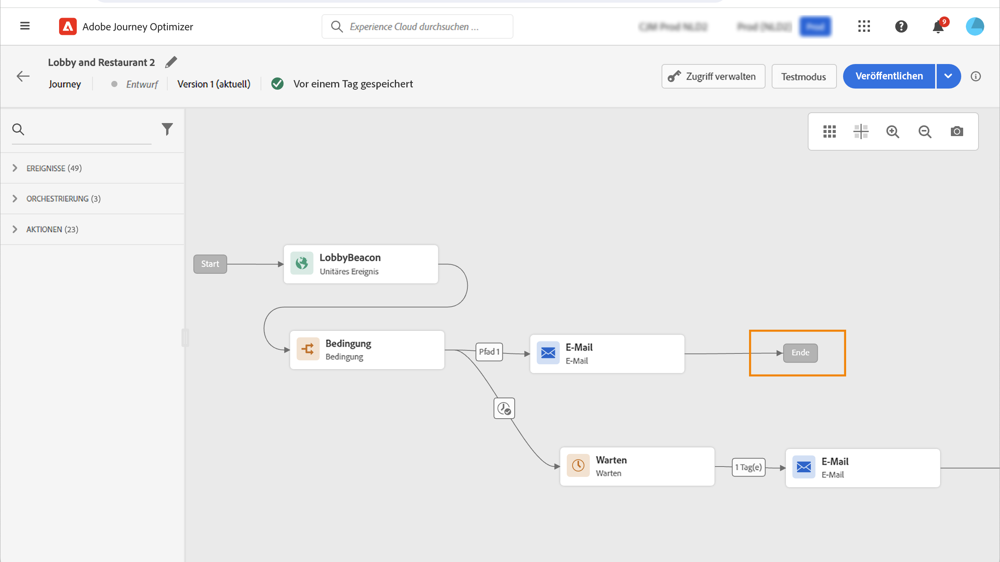
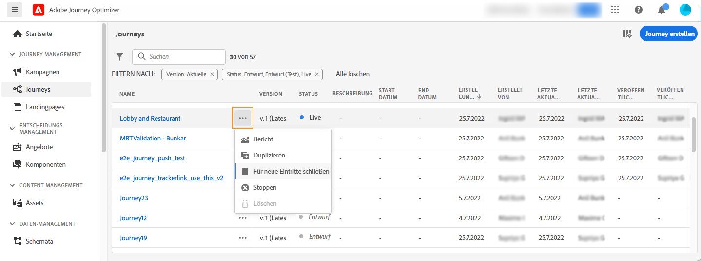
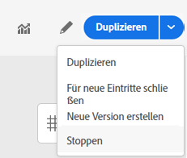
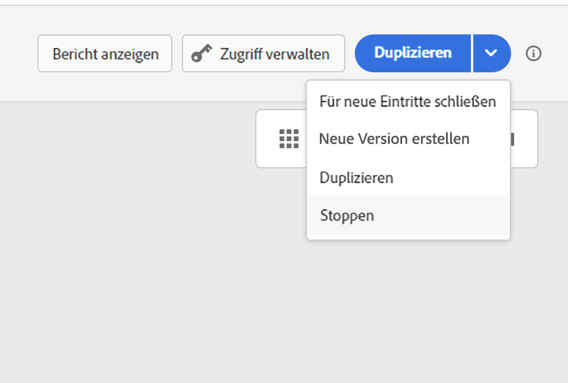

# Beenden einer Journey {#journey-ending}

>[!BEGINSHADEBOX]

**Auf dieser Seite** Erfahren Sie, wie Journey sowohl für Einzelprofile als auch für das Gesamtprofil enden und wie Sie eine Live-Journey schließen oder stoppen, wenn Sie neue Eintritte oder die gesamte Verarbeitung anhalten müssen.

>[!ENDSHADEBOX]

>[!TIP]
>
>Suchen Sie nach praktischen Anleitungen dazu, wann und wie Profile aus Journeys aussteigen sollten? Lesen Sie unseren [umfassenden Leitfaden zu Journey-Eintritts- und Ausstiegskriterien](entry-exit-criteria-guide.md), der Ausstiegsszenarien aus der Praxis, Best Practices und Konfigurationsanleitungen umfasst.

## Ende einer Live-Journey

Journeys werden geschlossen, wenn das globale Journey-Timeout erreicht wird, oder nach dem letzten Vorkommen einer wiederkehrenden zielgruppenbasierten Journey. [Erfahren Sie, wie Journeys geschlossen werden](#close-journey).

Um eine Live-Journey zu beenden, empfehlen wir, sie manuell zu [schließen](#close-to-new-entrances). Der Eintritt neuer Kundinnen und Kunden in die Journey wird dann blockiert. Profile, die bereits in die Journey eingetreten sind, bleiben bis zu deren Ende darin.

Sie können nur im Notfall und wenn die gesamte Journey-Verarbeitung sofort beendet werden muss [eine Journey auch stoppen](#stop-journey). Personen, die bereits in eine Journey eingetreten sind, kommen dann nicht weiter.

>[!IMPORTANT]
>
>* Sie können eine [geschlossene](#close-journey) oder [gestoppte](#stop-journey) Journey weder neu starten noch löschen. Sie können [eine neue Version](publish-journey.md#journey-versions) von ihr erstellen oder [sie duplizieren](journey-ui.md#duplicate-a-journey).
>
>* Nur abgeschlossene Journeys können gelöscht werden.

## Journey-Ende für Profile

Eine Journey endet für einen Kontakt bei diesen beiden spezifischen Kontexten:

* Der Kontakt erreicht die letzte Aktivität eines Pfads und wechselt dann zum [End-Tag](#end-tag).
* Der Kontakt erreicht eine Aktivität **Bedingung** (oder einer Aktivität **Warten** mit einer Bedingung) und erfüllt keine der Bedingungen.

Der Kontakt kann dann wieder in die Journey eintreten, sofern ein Wiedereintritt zulässig ist. [Weitere Informationen zum Management des Eintritts/Wiedereintritts](../building-journeys/journey-properties.md#entrance)

## Journey-End-Tag {#end-tag}

Beim Erstellen einer Journey wird am Ende jedes Pfads ein End-Tag angezeigt. Dieser Knoten kann nicht manuell hinzugefügt oder entfernt werden, und nur sein Label kann geändert werden. Er kennzeichnet das Ende jedes Pfads der Journey.

Wenn die Journey mehrere Pfade hat, empfehlen wir, für jedes Ende ein Label hinzuzufügen, damit Berichte leichter verständlich sind. Erfahren Sie mehr über [Journey-Berichte](../reports/live-report.md).

## Schließen einer Journey {#close-journey}

Eine Journey kann aus den folgenden Gründen geschlossen werden:

* Eine nicht wiederkehrende Journey Zielgruppe lesen **stoppt automatisch** sobald das letzte Profil die Journey beendet. [Weitere Informationen](#auto-stop-non-recurring)
* Nach dem letzten Vorkommen einer wiederkehrenden zielgruppenbasierten Journey.
* Die Journey wird manuell über die Schaltfläche [**[!UICONTROL Für neue Eintritte schließen]**](#close-to-new-entrances) geschlossen.
* Das globale Journey-Timeout von 91 Tagen wurde erreicht.

Nach dem **globalen Journey-Timeout von 91 Tagen** wird der Status der Journey „Zielgruppe lesen“ in **Beendet** geändert. Dieses Verhalten wird nur für 91 Tage festgelegt, da alle Informationen zu Profilen, die in die Journey eingetreten sind, 91 Tage nach ihrem Eintritt entfernt werden. Personen, die sich noch in der Journey befinden, sind automatisch betroffen. Sie beenden die Journey nach dem 91-tägigen Timeout.  Erfahren Sie mehr über das [globale Journey-Timeout](../building-journeys/journey-properties.md#global_timeout).

### Automatischer Journey-Stopp für nicht wiederkehrende Zielgruppen {#auto-stop-non-recurring}

Eine **nicht wiederkehrende Journey mit dem Schritt „Zielgruppe lesen** wechselt automatisch in den Status **[!UICONTROL Angehalten]**, sobald das letzte Profil die Journey verlässt. Dadurch wird das vorherige Verhalten eliminiert, bei dem nicht wiederkehrende Journey von „Zielgruppe lesen **bis zum Ablauf der 91-tägigen globalen maximalen Wartezeit im Status „Live** blieben, obwohl keine Profile aktiv durch sie hindurch strömten.

**Funktionsweise:**

1. Die Journey wird ausgeführt und alle Profile aus der Zielgruppe werden verarbeitet.
1. Wenn jedes Profil das Ende der Journey erreicht, wird es normal beendet.
1. Wenn das **letzte aktive Profil beendet wird** wechselt die Journey automatisch in den Status **[!UICONTROL Angehalten]**.

Dieses Verhalten gilt nur für **nicht wiederkehrende Journey des Typs „Zielgruppe lesen**. Wiederkehrende Journey sind davon nicht betroffen.

>[!NOTE]
>
>* Dieses automatische Stopp-Verhalten gilt **nicht** für nicht wiederkehrende Journey, die Knoten enthalten, die Wartezeiten verursachen, wie **Warten**-Knoten (zeitgeberbasiert), **Reaktion**-Knoten (Warten auf Ereignisse wie E-Mail-Öffnungen oder -Klicks) oder ereignisausgelöste Transitionen. Diese Journey unterliegen weiterhin der standardmäßigen [91-tägigen globalen Zeitüberschreitung](../building-journeys/journey-properties.md#global_timeout).
>
>* Sie können eine nicht wiederkehrende Journey mit dem Schritt Zielgruppe lesen jederzeit manuell schließen, indem Sie die Option [**[!UICONTROL Für neue Eintritte schließen]**](#close-to-new-entrances) verwenden. Das automatische Stopp-Verhalten stellt lediglich sicher, dass die Journey automatisch stoppt, wenn sie nicht mehr benötigt wird, ohne dass ein manuelles Eingreifen erforderlich ist.

### Wann gilt eine Journey als „fertig“? {#journey-finished-definition}

Die Definition von „abgeschlossen“ hängt vom Journey-Typ ab:

| Journey-Typ | Wiederkehrend? | Hat ein Enddatum? | Definition von „abgeschlossen“ |
|--------------|------------|---------------|--------------------------|
| Zielgruppe lesen | Nein | k. A. | Wenn das letzte Profil beendet wird (automatisches Anhalten) |
| Zielgruppe lesen | Ja | Nein | 91 Tage nach Beginn des letzten Vorkommens |
| Zielgruppe lesen | Ja | Ja | Wenn das Enddatum erreicht ist |
| Durch Ereignis ausgelöste Journey | k. A. | Ja | Wenn das Enddatum erreicht ist |
| Durch Ereignis ausgelöste Journey | k. A. | Nein | Beim Schließen in der Benutzeroberfläche oder über die API |

### Schließen für neue Eintritte {#close-to-new-entrances}

Sie können eine Journey manuell schließen. In diesem Fall können Kunden, die sich bereits in der Journey befinden, ihren Pfad bis zum Ende verfolgen, neue Benutzende können jedoch nicht in die Journey eintreten. Wenn eine Journey geschlossen wird (aus einem der oben genannten Gründe), weist sie den Status **[!UICONTROL Geschlossen]** auf. Die Journey stoppt den Eintritt neuer Personen in die Journey. Profile, die sich bereits in der Journey befinden, können die Journey wie gewohnt beenden. Nach dem standardmäßigen globalen Timeout von 91 Tagen wechselt die Journey in den Status **Beendet**.

Sie können eine Journey mit dem Status **Live** oder **Paused** stoppen. Wenn die Journey **angehalten** ist, müssen Sie sie nicht zuerst **Live** fortsetzen. [Weitere Informationen zum Anhalten einer pausierten Journey](journey-pause.md#stop-close-paused).

Um eine Journey in der Liste der Journeys zu schließen, klicken Sie auf die Schaltfläche mit den **[!UICONTROL Auslassungszeichen]** rechts neben dem Journey-Namen und wählen Sie **[!UICONTROL Für neue Eintritte schließen]** aus.

Alternativ können Sie auch folgendermaßen vorgehen:

1. Klicken Sie in der Liste **[!UICONTROL Journeys]** auf die Journey, die Sie schließen möchten.
1. Klicken Sie rechts oben auf den Abwärtspfeil.

   {width="50%" zoomable="yes"}

1. Klicken Sie auf **[!UICONTROL Für neue Eintritte schließen]** und bestätigen Sie diese Auswahl im Dialogfeld.

## Stoppen einer Journey {#stop-journey}

Sie können nötigenfalls den Fortschritt aller Personen in einer Journey stoppen. Beim Stoppen der Journey entsteht für alle Kontakte in der Journey ein Timeout. Wenn Sie eine Journey stoppen, wird der Fortschritt der bereits in der Journey befindlichen Personen angehalten. Die Journey wird praktisch deaktiviert. Wenn Sie eine Journey beenden möchten, sollten Sie sie gemäß Best Practice [schließen](#close-journey).

Sie können eine **Paused**-Journey auch direkt stoppen, ohne sie zuerst **Live** fortzusetzen. [Weitere Informationen](journey-pause.md#stop-close-paused).

Sie können beispielsweise eine Journey stoppen, wenn ein Marketer erkennt, dass die Journey die falsche Zielgruppe anspricht, oder wenn eine benutzerdefinierte Aktion, mit der Nachrichten gesendet werden sollen, nicht ordnungsgemäß funktioniert. Um eine Journey aus der Liste der Journeys zu entfernen, klicken Sie auf den Button mit den **[!UICONTROL Auslassungszeichen]** rechts neben dem Journey-Namen und wählen Sie **[!UICONTROL Stoppen]** aus.

Alternativ können Sie auch folgendermaßen vorgehen:

1. Klicken Sie in der Liste **[!UICONTROL Journeys]** auf die Journey, die Sie stoppen möchten.
1. Klicken Sie rechts oben auf den Abwärtspfeil.

   {width="50%" zoomable="yes"}

1. Klicken Sie auf **[!UICONTROL Stoppen]** und bestätigen Sie diese Auswahl im Dialogfeld.

Beim Stoppen wird der Journey-Status auf **[!UICONTROL Gestoppt]** gesetzt.

>[!CAUTION]
>
>Zum Anhalten eines Journey ist die Berechtigung **[!DNL Manage journeys]** erforderlich. Wenn der Journey Inline-Kampagnen oder Messaging-Knoten enthält, benötigen Benutzende auch **Kampagnen > Kampagnen veröffentlichen** Berechtigungen. Wenn die Journey Assets verwendet (z. B. in E-Mails), müssen Benutzende Zugriff auf diese Asset-Ordner haben. Weitere Informationen zur Verwaltung der Zugriffsrechte für [!DNL Journey Optimizer]-Benutzende finden Sie in [diesem Abschnitt](../administration/permissions-overview.md).

## Verwandte Themen

* [Leitfaden zu Eintritts- und Ausstiegskriterien für Journeys](entry-exit-criteria-guide.md) – Vollständiger Leitfaden mit Beispielen und Best Practices aus der Praxis
* [Verwaltung des Profileintritts](entry-management.md) – Konfigurieren Sie, wie Profile in Journeys eintreten
* [Konfigurieren von Ausstiegskriterien](journey-properties.md#exit-criteria) – Richten Sie die automatische Entfernung von Profilen aus Journeys ein
* [Pausieren von Journeys](journey-pause.md) – Halten Sie die Journey-Ausführung vorübergehend an

+++ KI-Wissensreferenz

Dieser Abschnitt enthält strukturiertes Wissen zur Unterstützung von Interpretation, Abrufen und Antworten auf Fragen zu diesem Thema.

Zum vollständigen Verständnis sollten diese Informationen mit der Dokumentation auf dieser Seite kombiniert werden. Keine der beiden Quellen ist für Einzelpersonen gedacht. Die Seite beschreibt die Funktion, während dieser Abschnitt zusätzlichen Kontext bietet, der dabei hilft, Begriffe, Absichten, Anwendbarkeit und Begrenzungen zu unterscheiden.

* **TL;DR:** Auf dieser Seite werden die verschiedenen Arten des Endens einer Live-Journey erläutert - einschließlich der globalen 91-Tage-Zeitüberschreitung, des manuellen Schließens neuer Eintritte und des Not-Aus - sowie deren Auswirkungen auf laufende Profile.

**intents:**

* Schließen einer Live-Journey für neue Eintritte, während die aktuellen Profile sie abschließen können
* Beenden Sie eine Journey sofort, um alle laufenden Profile anzuhalten
* Verstehen Sie den Unterschied zwischen den Journey-Status „Geschlossen“, „Angehalten“ und „Abgeschlossen“
* Bestimmen Sie anhand von Typ und Konfiguration, wann eine Journey als „abgeschlossen“ betrachtet wird.
* Löschen einer Journey, sobald sie den Status Beendet erreicht hat

**Glossar:**

* **End-Tag**: Ein automatisch generierter, nicht entfernbarer Knoten, der während des Authorings am Ende jedes Journey-Pfads angezeigt wird. Seine Bezeichnung kann *(produktspezifisch) geändert werden*
* **Für neue Eintritte schließen**: Eine manuelle Aktion, die verhindert, dass neue Profile auf eine Journey zugreifen, während bestehende Profile ihren Pfad abschließen können *(produktspezifisch)*
* **Globales Journey-Timeout**: Die maximale Dauer von 91 Tagen, nach der eine Journey automatisch in den Status Beendet wechselt und alle Profildaten entfernt werden *(produktspezifisch)*
* **Stoppstatus**: Ein Journey-Status, bei dem alle laufenden Profile sofort angehalten werden. Wird nur für Notfälle verwendet *produktspezifisch)*

**Leitplanken:**

* Geschlossene und gestoppte Journey können nicht neu gestartet oder gelöscht werden. Es kann nur eine neue Version oder ein Duplikat erstellt werden.
* Nur Journey mit dem Status Beendet können gelöscht werden.
* Zum Anhalten eines Journey ist die Berechtigung Journey verwalten erforderlich. Journey mit Inline-Kampagnen oder Messaging-Knoten benötigen außerdem die Berechtigung Kampagnen > Kampagnen veröffentlichen .
* Nach der 91-tägigen globalen maximalen Wartezeit werden alle Profil-Journey-Daten entfernt und die verbleibenden Profile werden automatisch beendet.
* Ein nicht wiederkehrender Journey mit dem Schritt „Zielgruppe lesen“ ohne langwierige Warte-, Reaktions- oder ereignisausgelöste Knoten wechselt automatisch zu „Angehalten“, wenn das letzte Profil beendet wird. Journey mit diesen Knoten unterliegen weiterhin der globalen maximalen Wartezeit von 91 Tagen, es sei denn, sie werden manuell geschlossen.

**Terminologie:**

* Kanonischer Name: Für neue Eintritte schließen — Akronym: n/a — Varianten: Journey schließen, manuell schließen
* Synonyme: „Angehalten“ Journey ≠ „Geschlossen“ Journey — stoppt alle Profile sofort; geschlossen blockiert nur neue Eintritte
* Verwechseln Sie nicht: „End Tag“ ≠ „End Aktivität“ — das End Tag wird automatisch generiert und kann nicht entfernt werden; die End Aktivität ist ein platzierbarer Canvas Knoten

**FAQ:**

* **F: Was ist der Unterschied zwischen dem Schließen und Anhalten einer Journey?** — Durch Schließen werden neue Eintritte blockiert, vorhandene Profile können jedoch beendet werden. Durch Anhalten werden sofort alle Profile in ihrer Spur angehalten.
* **F: Wann erreicht eine Journey mit dem Schritt „Zielgruppe lesen“ den Status „Beendet“?** — Für einen nicht wiederkehrenden Journey mit dem Schritt „Zielgruppe lesen“: Er wird automatisch angehalten, wenn das letzte Profil beendet wird (oder nach 91 Tagen, wenn Warten, Reaktion oder Ereignisknoten Profile aktiv halten). Beendet wird erreicht, wenn eine geschlossene Journey die 91-tägige globale Zeitüberschreitung erreicht, oder gemäß den Regeln für wiederkehrendes Journey in der Tabelle für die fertige Definition.
* **F: Kann ich eine geschlossene Journey löschen?** — Nein, nur fertige Journey können gelöscht werden.
* **F: Was passiert mit Profilen, die sich noch auf einer Journey befinden, wenn die 91-Tage-Zeitüberschreitung eintritt?** — Sie werden zu diesem Zeitpunkt automatisch aus der Journey gelöscht.
* **F: Benötige ich spezielle Berechtigungen, um eine Journey zu stoppen?** — Ja, die Berechtigung Journey verwalten ist erforderlich. Außerdem ist Kampagnen > Kampagnen veröffentlichen erforderlich, wenn die Journey Inline-Kampagnen oder Messaging-Knoten enthält.

+++
