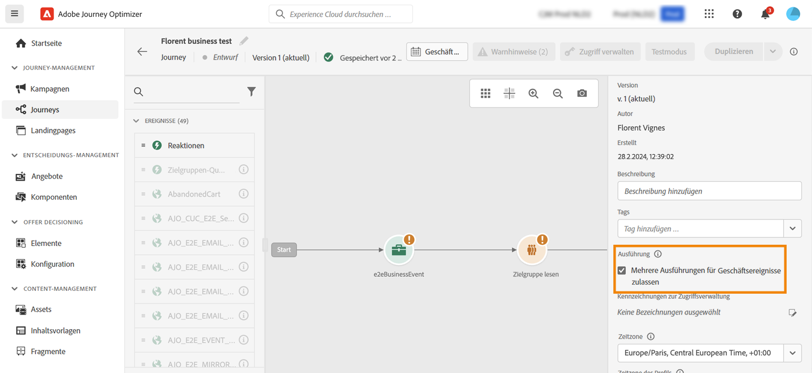

# Profileintrittsverwaltung {#entry-management}

Die Profileintrittsverwaltung hängt vom Typ der Journey ab. 

>[!TIP]
>
>Auf der Suche nach praktischer Anleitung mit realen Beispielen? Lesen Sie unser [Handbuch zum Journey der Ein- und Ausstiegskriterien](entry-exit-criteria-guide.md), das Anwendungsfälle wie Willkommenskampagnen, die Wiederherstellung bei Transaktionsabbruch und Treueprogramme mit vollständigen Beispielen für die Ein- und Ausstiegskonfiguration umfasst.

## Journey-Typen {#types-of-journeys}

Mit Adobe Journey Optimizer können Sie die folgenden Journey-Typen erstellen:

* Journeys vom Typ **Unitäres Ereignis**: Diese Journeys beginnen mit einem unitären Ereignis. Wenn das Ereignis empfangen wird, tritt das verknüpfte Profil in die Journey ein. [Weitere Informationen](#entry-unitary)

* Journeys vom Typ **Geschäftsereignis**: Diese Journeys beginnen mit einem Geschäftsereignis, unmittelbar gefolgt von einer Aktivität **Zielgruppe lesen**. Nach Empfang des Ereignisses treten die der angegebenen Zielgruppe angehörenden Profile in die Journey ein.  Für jedes Profil wird eine Instanz dieser Journey erstellt. [Weitere Informationen](#entry-business)

* Journeys vom Typ **Zielgruppe lesen**: Diese Journeys beginnen mit einer Aktivität **Zielgruppe lesen**. Wenn die Journey ausgeführt wird, treten die der angegebenen Zielgruppe angehörenden Profile in die Journey ein. Für jedes Profil wird eine Instanz dieser Journey erstellt. Diese Journeys können wiederkehrend oder einmalig sein. [Weitere Informationen](#entry-read-audience)

* **Zielgruppen-Qualifizierungs**-Journeys: Diese Journeys beginnen mit einem Zielgruppen-Qualifizierungsereignis. Diese Journeys überwachen die Ein- und Austritte von Profilen in Zielgruppen. In diesem Fall tritt das verknüpfte Profil die Journey ein. [Weitere Informationen](#entry-unitary)

[Vergleichen aller Journey-Typen mit Anwendungsfällen →](journey.md#journey-types)

Für alle Journey-Typen gilt, dass ein Profil nicht mehrmals zur gleichen Zeit in derselben Journey für alle aktiven [Journey-Versionen](publish-journey.md#journey-versions) vorhanden sein kann. Um zu überprüfen, ob sich eine Person in einer Journey befindet, wird die Profilidentität als Schlüssel verwendet. Das System lässt nicht zu, dass sich derselbe Schlüssel, z. B. der Schlüssel `CRMID=3224`, an verschiedenen Stellen in derselben Journey befindet.

## Journey-Verarbeitungsrate {#journey-processing-rate}

Die Journey-Verarbeitungsrate wird durch mehrere Faktoren beeinflusst, die bestimmen, wie Profile eine Journey durchlaufen:

### Profileintrittsrate {#profile-entrance-rate}

Wie Profile in Journeys eintreten und wie hoch ihre erwartete Rate ausfällt, hängt von der ersten verwendeten Aktivität ab:

* Journeys vom Typ **Zielgruppe lesen** (Batch-Szenario, in dem Sie eine Zielgruppe von Profilen ansprechen und eine Journey für die gesamte Zielgruppe auslösen): Der Maximalwert beträgt 20.000 TPS (Transaktionen pro Sekunde). Dies ist das auf einer **Sandbox-Ebene** verfügbare Kontingent. Wenn mehrere Journeys auf dieser Sandbox gleichzeitig ausgeführt werden, sind 20.000 TPS möglicherweise nicht erreichbar. Betrachten Sie dieses Maximum als das beste Szenario.

* Journeys vom Typ **Zielgruppenqualifizierung** (Einzelszenario, in dem Sie eine Journey auslösen möchten, wenn ein Profil für eine Streaming-Zielgruppe qualifiziert oder nicht qualifiziert ist): Der Maximalwert beträgt 5.000 TPS. Beachten Sie, dass es sich hierbei um ein gemeinsam verwendetes Limit für Journeys handelt, die mit Ereignissen beginnen. Außerdem wird es für alle Journeys auf **Organisationsebene** verwendet.

* Journeys vom Typ **Unitäres Ereignis** (unitäres Szenario, in dem Sie eine Journey auslösen möchten, wenn ein Ereignis von einem Profil ausgegeben wird): Wie oben, beide verwenden dasselbe 5.000-TPS-Limit. Weitere Informationen zum Journey-Ereignisdurchsatz finden Sie [in diesem Abschnitt](../event/about-events.md#event-thoughput).

* Journeys vom Typ **Geschäftsereignis** (das im Wesentlichen ein unitäres Batch-Szenario ist, da auf ein Geschäftsereignis immer der Schritt „Zielgruppe lesen“ folgt): Geschäftsereignisse zählen auch für das 5.000-TPS-Kontingent, aber die Aktivität „Zielgruppe lesen“ direkt danach hat dasselbe Limit wie Journeys, die mit „Zielgruppe lesen“ beginnen (20.000 TPS).

### Ereignisse und Zielgruppenqualifizierungen in Journeys {#events-inside-journeys}

Nach dem Eintritt können Sie die Aktivitäten **Unitäres Ereignis** oder **Zielgruppenqualifizierung** in der Journey verwenden. Ein Profil kann in einen der vier oben beschriebenen Journeys eintreten und auf die Ausgabe eines Ereignisses warten oder darauf warten, dass dieses Profil für eine Zielgruppe qualifiziert wird. Diese unitären Ereignisse und Zielgruppenqualifizierungen werden für das oben beschriebene Kontingent gezählt. Beispiel: Wenn Sie eine Journey mit „Zielgruppe lesen“ (mit maximal 20.000 TPS) starten und direkt danach ein Ereignis folgt, gilt für dieses Ereignis ein Maximum von 5.000 TPS.

### Auswirkungen von Warteaktivitäten {#wait-activities-impact}

Aktivitäten vom Typ **Warten** in Journeys können sich auch darauf auswirken, wie viele Profile zu einem bestimmten Zeitpunkt eine Journey durchlaufen. Normalerweise basiert eine Warteaktivität auf einer relativen Zeit (z. B.: Austritt 2 Stunden nach Eintritt in die Wartezeit, sodass nicht alle Profile gleichzeitig austreten). Wenn für diese Warteaktivität jedoch eine feste Zeit definiert ist, können mehrere Profile diese Journey exakt gleichzeitig verlassen. Dies ist keine empfohlene Vorgehensweise. Es könnte zu massiven Volumina führen und ab diesem Zeitpunkt können 20.000 TPS überschritten werden.

### Aktionsaktivitäten {#action-activities-impact}

Schließlich können **Aktionsaktivitäten** (native Kanäle wie E-Mail, SMS, Push usw., ausgehend oder eingehend, benutzerdefinierte Aktionen, Sprünge, die Profile an andere Journeys senden, Aktualisierungsprofile, die Daten an den Unified Profile Service senden usw.) durch die Profillast von Journeys beeinflusst werden, sich aber auch auf die Verarbeitungsrate auswirken. Beispielsweise verlangsamt eine benutzerdefinierte Aktion, die auf einen externen Endpunkt mit einer hohen Antwortzeit abzielt, die Journey-Verarbeitungsrate.

Für benutzerdefinierte Aktionen beträgt die standardmäßige Begrenzung 300.000 Aufrufe pro Minute. Dies kann mithilfe einer benutzerdefinierten Begrenzungsrichtlinie geändert werden. Weitere Informationen zur Begrenzung benutzerdefinierter Aktionen finden Sie in [diesem Abschnitt](../configuration/external-systems.md#capping).

## Journeys für unitäre Ereignisse und Zielgruppen-Qualifizierungen{#entry-unitary}

In den Journeys **Unitäre Ereignisse** und **Zielgruppenqualifizierung** können Sie den erneuten Eintritt aktivieren oder deaktivieren:

* Wenn der erneute Eintritt aktiviert ist, kann ein Profil mehrmals in eine Journey eintreten, aber erst dann, wenn es aus der vorherigen Instanz der Journey vollständig ausgetreten ist.

* Wenn der erneute Eintritt deaktiviert ist, kann ein Profil nicht mehrmals innerhalb des globalen Journey-Timeout-Zeitraums in dieselbe Journey eintreten.  Weitere Informationen finden Sie in [diesem Abschnitt](../building-journeys/journey-properties.md#global_timeout).

Standardmäßig ist bei Journeys der erneute Eintritt erlaubt. Wenn die Option **Erneuten Eintritt erlauben** aktiviert ist, wird das Feld **Wartezeit bis zum erneuten Eintritt** angezeigt. Damit können Sie die Wartezeit definieren, bevor ein Profil erneut in die Journey eintreten kann.  Dadurch wird verhindert, dass Journeys fälschlicherweise mehrmals für dasselbe Ereignis ausgelöst werden. Standardmäßig ist das Feld auf 5 Minuten eingestellt. Der Timeout beträgt 91 Tage ([globaler Timeout](journey-properties.md#global_timeout)).

<!--
When a journey ends, its status is **[!UICONTROL Closed]**. New individuals can no longer enter the journey. Persons already in the journey automatically exit the journey. 
-->

Nach dem Zeitraum für den erneuten Eintritt können Profile erneut in die Journey eintreten. Um dies zu vermeiden und den erneuten Eintritt für diese Profile vollständig zu deaktivieren, können Sie eine Bedingung hinzufügen, um anhand von Profil- oder Zielgruppendaten zu testen, ob das Profil bereits eingetreten ist oder nicht.

<!--
Due to the 30-day journey timeout, when journey reentrance is not allowed, we cannot make sure the reentrance blocking will work more than 91 days. Indeed, as we remove all information about persons who entered the journey 91 days after they enter, we cannot know the person entered previously, more than 91 days ago. -->

## Geschäfts-Journeys {#entry-business}

<!--
Business events follow reentrance rules in the same way as for unitary events. If a journey allows reentrance, the next business event will be processed.
-->

Um in **Geschäfts-Journeys** mehrere Ausführungen für Geschäftsereignisse zuzulassen, aktivieren Sie die entsprechende Option im Abschnitt **[!UICONTROL Ausführung]** der Journey-Eigenschaften.

Im Falle von Geschäftsereignissen werden für eine bestimmte Journey die bei der ersten Ausführung abgerufenen Zielgruppendaten innerhalb eines Zeitfensters von einer Stunde wiederverwendet.

Ein Profil kann mehrmals gleichzeitig in derselben Journey vorhanden sein, aber im Kontext verschiedener Geschäftsereignisse.

Weitere Informationen hierzu finden Sie in diesem [Abschnitt](../event/about-creating-business.md).

## „Zielgruppe lesen“-Journeys {#entry-read-audience}

**Zielgruppe-lesen**-Journeys können wiederkehrend oder einmalig sein:

* Für nicht wiederkehrende/einmalige Journeys: Das Profil tritt nur einmal in die Journey ein.

* Für wiederkehrende Journeys: Standardmäßig treten bei jedem Intervall alle Profile der Zielgruppe in die Journey ein. Sie müssen die Journey beenden, bevor sie in einer anderen Instanz wieder eintreten können.

Für wiederkehrende Journeys vom Typ „Zielgruppe lesen“ stehen verschiedene Optionen zur Verfügung. Weitere Informationen finden Sie im Abschnitt [Verwenden einer Zielgruppe in einer Journey](../building-journeys/read-audience.md).

<!--
After 91 days, a Read audience journey switches to the **Finished** status. This behavior is set for 91 days only (i.e. journey timeout default value) as all information about profiles who entered the journey is removed 91 days after they entered. Persons still in the journey automatically are impacted. They exit the journey after the 30 day timeout. 
-->

## Verwandte Themen

* [Handbuch mit den Ein- und Ausstiegskriterien für Journey](entry-exit-criteria-guide.md) - Vollständiges Handbuch mit Beispielen und Best Practices aus der Praxis
* [Beendigungskriterien konfigurieren](journey-properties.md#exit-criteria) - Festlegen, wann Profile Ihren Journey verlassen sollen
* [Journey beenden](end-journey.md) - Verstehen, wie Journey schließen und beenden
* [Journey-Anwendungsfälle](jo-use-cases.md) - Vollständige Beispiele mit Ein- und Ausstiegskonfigurationen anzeigen
