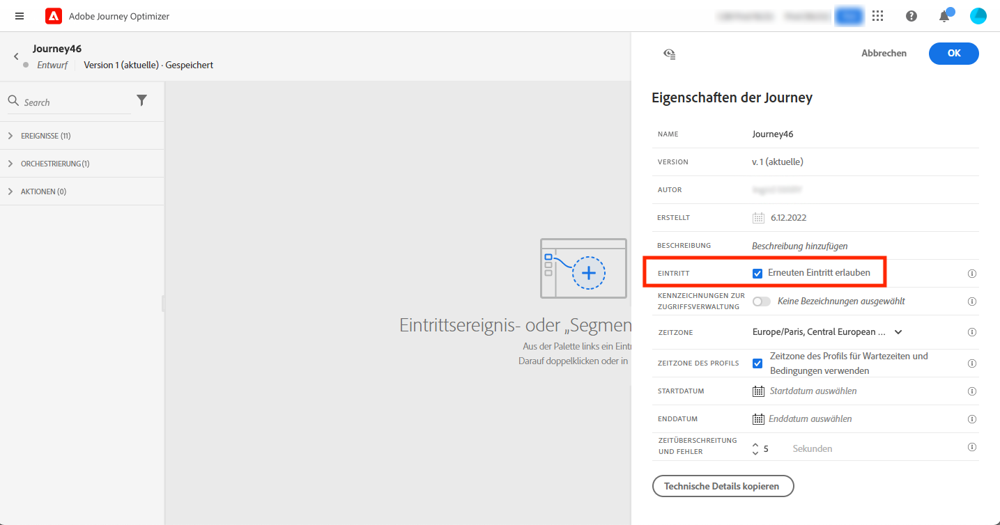

# Profileintritt-Verwaltung {#entry-management}

Es gibt zwei Hauptarten von Journeys:

* ereignisbasierte Journeys: Diese Journeys, die mit einem Ereignis beginnen, sind einheitlich und mit einem Kontakt verknüpft. Wenn das Ereignis empfangen wird, tritt der Kontakt in die Journey ein. [Weitere Informationen](#entry-unitary)
* Zielgruppe-lesen-Journeys: Diese Journeys, die mit dem Lesen einer Zielgruppe beginnen, sind Batch-Journeys. Kontakte, die zur Zielgruppe gehören, treten alle in dieselbe Journey ein. Diese Journeys können wiederkehrend oder einmalig sein. [Weitere Informationen](#entry-read-segment)

In den meisten Fällen kann ein Profil nicht mehrmals zur gleichen Zeit in derselben Journey vorhanden sein.

## Einheitliche Journeys{#entry-unitary}

In einheitlichen Journey können Sie den Wiedereintritt aktivieren oder deaktivieren:

* Wenn der erneute Eintritt aktiviert ist, kann ein Profil mehrmals in eine Journey eintreten, aber erst dann, wenn es aus der vorherigen Instanz der Journey vollständig ausgetreten ist.

* Wenn der erneute Eintritt deaktiviert ist, kann ein Profil nicht mehrmals in dieselbe Journey eintreten..

Standardmäßig ist bei neuen Journeys der erneute Eintritt erlaubt. Sie können die Option für „einmalige“ Journeys deaktivieren, z. B. wenn Sie ein einmaliges Geschenk anbieten möchten, sobald eine Person einen Shop betritt. In diesem Fall müssen Sie vermeiden, dass die Kundin bzw. der Kunde erneut in die Journey eintritt und das Angebot erneut erhält. Wenn eine Journey beendet wird, lautet ihr Status **[!UICONTROL Geschlossen]**. Neue Kontakte können nicht mehr in die Journey eintreten. Personen, die sich bereits in der Journey befinden, beenden die Journey wie gewohnt. [Weitere Informationen](journey-gs.md#entrance)

Nach der standardmäßigen [maximalen globalen Wartezeit](journey-gs.md#global_timeout) von 30 Tagen wird der Status der Journey in **Beendet** geändert. Profile, die sich bereits in der Journey befinden, beenden die Journey wie gewohnt. Neue Profile können nicht mehr in die Journey eintreten. Dieses Verhalten wird nur für 30 Tage festgelegt (d. h. für den Standardwert des Journey-Timeouts), da alle Informationen zu Profilen, die an der Journey teilgenommen haben, 30 Tage nach ihrer Eingabe entfernt werden. Nach diesem Zeitraum können Profile erneut in die Journey eintreten. Um dies zu vermeiden und den erneuten Eintritt für diese Profile vollständig zu deaktivieren, können Sie eine Bedingung hinzufügen, um anhand von Profil- oder Zielgruppendaten zu testen, ob das Profil bereits eingetreten ist oder nicht.

<!--
Due to the 30-day journey timeout, when journey re-entrance is not allowed, we cannot make sure the re-entrance blocking will work more than 30 days. Indeed, as we remove all information about persons who entered the journey 30 days after they enter, we cannot know the person entered previously, more than 30 days ago. -->

Unitäre Journeys (beginnend mit einem Ereignis oder einer Zielgruppen-Qualifizierung) enthalten einen Schutzmechanismus, der verhindert, dass Journeys fälschlicherweise mehrmals für dasselbe Ereignis ausgelöst werden. Der erneute Profil-Eintritt wird standardmäßig fünf Minuten lang vorübergehend blockiert. Wenn beispielsweise ein Ereignis um 12:01 Uhr eine Journey für ein bestimmtes Profil auslöst und um 12:03 Uhr ein weiteres eintrifft (unabhängig davon, ob es sich um dasselbe Ereignis oder ein anderes handelt, das dieselbe Journey auslöst), wird diese Journey für dieses Profil nicht erneut gestartet.

Der Schlüssel wird auch verwendet, um zu überprüfen, ob sich eine Person in einer Journey befindet. Eine Person kann nicht an zwei verschiedenen Stellen in derselben Journey sein. Das System lässt daher nicht zu, dass sich derselbe Schlüssel, z. B. der Schlüssel CRMID=3224, an verschiedenen Stellen in derselben Journey befindet.

## „Zielgruppe lesen“-Journeys{#entry-read-segment}

Bei einer „Zielgruppe lesen“-Journey gilt Folgendes:

* Für nicht wiederkehrende Journeys: Das Profil tritt nur einmal in die Journey ein.

* Für wiederkehrende Journeys: Standardmäßig treten bei jeder Wiederholung alle Profile der Zielgruppe in die Journey ein. Sie müssen die Journey beenden, bevor sie in einer anderen Instanz wieder eintreten können.

>[!NOTE]
>
>Für wiederkehrende Zielgruppe-lesen-Journeys stehen zwei Optionen zur Verfügung. Die Option **Erneuten Eintritt bei Wiederholung erzwingen** bewirkt, dass alle noch in der Journey vorhandenen Profile die Journey bei der nächsten Ausführung automatisch verlassen. Die Option **Inkrementelles Lesen** zielt nur auf die Kontakte ab, die seit der letzten Ausführung der Journey der Zielgruppe beigetreten sind. Siehe diesen [Abschnitt](../building-journeys/read-audience.md#configuring-segment-trigger-activity)

Bei Geschäftsereignis-Journeys, die mit der Aktivität **Zielgruppe lesen** beginnen: Da diese Journey auf dem Empfang eines Geschäftsereignisses basiert, tritt das Profil, wenn es für die erwartete Zielgruppe qualifiziert ist, bei jedem empfangenen Geschäftsereignis in die Journey ein. Dies bedeutet, dass dieses Profil gleichzeitig mehrfach in derselben Journey sein kann, jedoch dann im Kontext verschiedener Geschäftsereignisse.